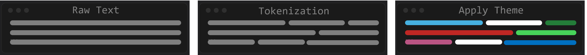
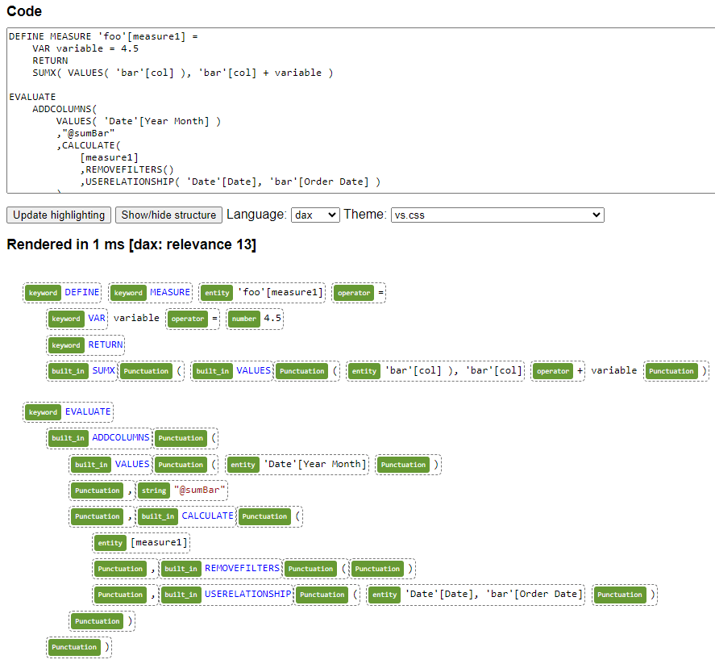

This blog is hosted on Github Pages. Github pages uses [Jekyll](https://jekyllrb.com/) to create static webpages from [Markdown](https://www.markdownguide.org/). I want to able to blog on Power BI context, and it would be nice to have Syntax Highlighting for DAX code, but this is not natively supported. This article describes the development and implementation to make this possible.

## Syntax Highlighting
In markdown, Fenced Code Blocks are created by placing triple backticks ` ``` `  before and after a code snippets, causing text to render inside a box.

```plaintext
SELECT *
FROM tbl
WHERE foo = 'bar'
```

If you add a language identifier after the opening backticks ` ```sql``` ` you can apply Syntax Highlighting.

```sql
SELECT *
FROM tbl
WHERE foo = 'bar'
```
 
## Tokenization
 When we think of a programming language we have various different tokens (keywords, operators, data types, comments etc). In order to apply the correct styling, we need to parse the raw text to list of tokens. The patterns of the various tokens is described by a Lexer. For example a single line comment in SQL starts with two dashes ```` -- ```` followed by any length of text.

```sql
-- a single-line SQL comment
```

This pattern can be described via a regex expression ```%r/--.*/```. A theme can then be applied to colour and style tokens according to their token type.



## DAX Lexer

Jekyll's default Syntax Highlighter is [Rouge](https://rouge.jneen.net/). Rouge doesn't have a DAX lexer, so we'll have to develop one. Rouge provides a [Lexer Development Guide](https://rouge-ruby.github.io/docs/file.LexerDevelopment.html) that we can follow. 

### Rouge Development Environment

Rouge is a Ruby application, and therefore development and testing of the lexer requires a Linux [Development Environment](https://rouge-ruby.github.io/docs/file.DevEnvironment.html) running Ruby with the required gems. To keep the development environment self-contained, Rouge suggests using a [Docker Development Environment](https://rouge-ruby.github.io/docs/file.Docker.html). Rouge offers a automated tested suite (rake) and a visual testing website (rackup), to test and validate your lexer.

!!! warning
    You can run Ruby locally on [WSL](https://learn.microsoft.com/en-us/windows/wsl/about) but I would advise against it. I ran into issues with the mapping of folder/file permission between Windows and Linux when installing gems.
  
```bash
#Install gemfile dependencies to /tmp/vendor with bundler
docker run -t -v $PWD:/app -v /tmp/vendor:/vendor -w /app -e BUNDLE_PATH=/vendor ruby bundle
```

```bash
#Run test suite
docker run -t -v $PWD:/app -v /tmp/vendor:/vendor -w /app -e BUNDLE_PATH=/vendor ruby bundle exec rake
```

```bash
#Run a web app on localhost with highlighted code snippets http://localhost:9292
docker run -t -v $PWD:/app -v /tmp/vendor:/vendor -w /app -e BUNDLE_PATH=/vendor -p 9292:9292 ruby bundle exec rackup --host 0.0.0.0
```

### Rouge DAX Lexer Development

Once we have the development environment setup we can start developing our DAX lexer. There are few existing DAX lexer in other frameworks that I used for inspiration ([Tabular Editor](https://github.com/TabularEditor/TabularEditor/blob/master/AntlrGrammars/DAXLexer.g4), SQLBI, and Microsoft learn), resulting in this [Rouge DAX Lexer](https://github.com/EvaluationContext/rouge/blob/feature.dax/lib/rouge/lexers/dax.rb). With the addition some code snippets ([Demo](https://github.com/EvaluationContext/rouge/blob/feature.dax/lib/rouge/demos/dax) & [Sample](https://github.com/EvaluationContext/rouge/blob/feature.dax/spec/visual/samples/dax)) we are ready to perform a visual check of the lexer.

!!! tip
    If you have the local website running on rackup. Any changes saved to your files are reflected on the web page, without having to restart the server; just refresh your browser.

Following validation via visual inspection we can perform automated testing with rake. Once this passes we are ready to push to our fork and submit a Pull Request (PR) to get our files added to the main Rouge repo. 

At the time of publishing, this PR is still under review. So in the meantime I turned to [highlight.js](https://highlightjs.org/) which allows you selfhost a lexer, but you need to jump through a few extra hoops. 

### Highlight.js Development Environment

Highlight.js provides some guides on [contributing](https://github.com/highlightjs/highlight.js/blob/main/CONTRIBUTING.md) and how to setup a [Docker Development Environment](https://highlightjs.readthedocs.io/en/latest/building-testing.html#building-and-testing-with-docker). Unlike Rouge, where you mount a directory and save files to your local machine, highlight.js creates a self contained build.

!!! Info
    An update of the base docker image from node:12-slim to node:21-bullseye-slim was required to get container to build successfully

```bash
#### Create Docker build
docker build -t highlight-js .
```

```bash
# Run a web app on localhost with highlighted code snippets http://127.0.0.1/tools/developer.html
docker run -d --name highlight-js --volume $PWD/src:/var/www/html/src --rm -p 80:80 highlight-js
```

```bash
# Rebuilds based on local changes
docker exec highlight-js node tools/build.js -n dax
```

### Highlight.js DAX Lexer Development

To translate our lexer we can reference the [Language Definition Guide](https://highlightjs.readthedocs.io/en/latest/language-guide.html). 
Highlight.js gives us a great development environment. We provide sample code, and the webpage show how our text is being tokenized and styled.



Once we have finished developing our [Lexer](https://github.com/EvaluationContext/highlight.js-dax/blob/Feature.dax/src/languages/dax.js), there are some extra steps required to [Contribute a Language](https://github.com/highlightjs/highlight.js/blob/main/extra/3RD_PARTY_QUICK_START.md). I decided to skip this process at this time, as ideally I want to use Rouge in the longer term, but I might come back to this.

In order to self host highlight.js:

- Update _config.yml to turn off Rouge

```yaml
kramdown:
  syntax_highlighter: None
  syntax_highlighter_opts:
    disable : true
```

- [Downloaded highlight.js](https://highlightjs.org/download) with languages of interest

- Save the files in assets/js/highlight

- Update _includes/head.html to point to highlight.js and theme

```html
<link rel="stylesheet" href="/assets/js/highlight/styles/base16/material.css">
<script src="/assets/js/highlight/highlight.js"></script>
<script>hljs.highlightAll();</script>
```

- To host a custom language, copy the lexer code into the highlight.js file

And NOW we are finally able to apply DAX highlighting with `dax`

```dax
DEFINE MEASURE 'foo'[measure1] = 
    VAR variable = 4.5
    RETURN
    SUMX( VALUES( 'bar'[col] ), 'bar'[col] + variable ) 

EVALUATE
    ADDCOLUMNS(
        VALUES( 'Date'[Year Month] )
        ,"@sumBar"
        ,CALCULATE(
            [measure1]
            ,REMOVEFILTERS()
            ,USERELATIONSHIP( 'Date'[Date], 'bar'[Order Date] )
        )
    )
```

As an end note, in addition to the more statically defined token, DAX also has the concept of variables. To highlight these would require Semantic Highlighting, which is beyond the scope of this project.