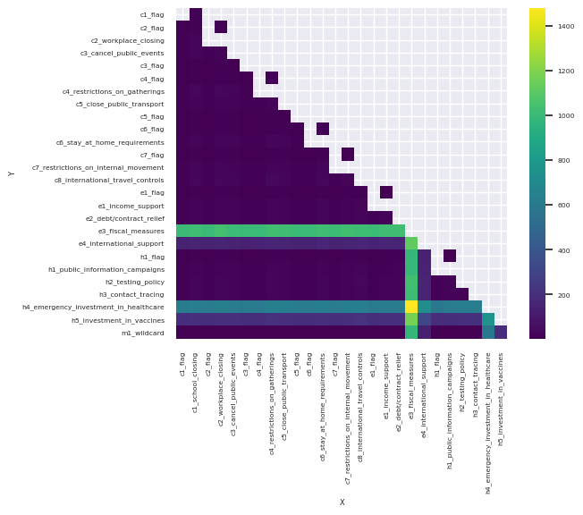

I have been musing on the process of designing of Junk Dimensions for Power BI Semantic Models that employ [User Defined Aggregations](https://learn.microsoft.com/en-us/power-bi/transform-model/aggregations-advanced).

## Junk Dimensions

!!! quote "Kimball - Junk Dimensions"

    Transactional business processes typically produce a number of miscellaneous, low-cardinality flags and indicators. Rather than making separate dimensions for each flag and attribute, you can create a single junk dimension combining them together.
    -- <cite>[Kimball][1] </cite>

    [1]: https://www.kimballgroup.com/data-warehouse-business-intelligence-resources/kimball-techniques/dimensional-modeling-techniques/junk-dimension

### Why would we want a Junk Dimension?

-  **Simpler DAX**: Easier to remove filters. Avoids hard to "incorrect" results due to Auto-exist; well covered by [SQLBI](https://www.sqlbi.com/articles/understanding-dax-auto-exist/).

-  **Simplify User Defined Aggregations**: With a Junk Dimension, a single field can be used to define the criteria for a cache hit. Otherwise you would potentially need a large number of single field dimension, defined by relationship. You can keep the fields in the fact table and use GROUP BY, but cross-filtering between other fact tables is not possible.

### Qualities of a Good Junk Dimension?

Kimball's definition makes a Junk Dimension a dumping ground, consisting of a jumble of fields. If we were to improve a Junk Dimension, what qualities would we desire?

1. Minimal number of fields
2. Low cardinality fields
3. Fields are all well related as to avoid the full cartesian product

These point all relate to minimize the size of the relationship, and avoiding sub-optimal sort order, to maximize run-length encoding and ensuring good query performance.

## Methodology For Evaluating Junk Dimension

To address the above we can compare each field to each other field and calculate the distinct count of results. These are then plotted on a heatmap. Those combinations with high cardinality will be highlighted and we can make informed architectural decision on whether fields are included in the dimension. This is performed by the script below. 

!!! Warning

    This can potentially be a rather expensive operation. The cost grows the more fields considered. Number of rows has less effect.

=== "Visual"

    

=== "Code"

    ```python
    import itertools as it
    from pyspark.sql import functions as F
    import pandas as pd
    import seaborn as sns

    # filter to potential junk dimension, excluding primary key
    df = spark.sql("SELECT * FROM foo")

    # Iterate all combinations of columns, calculate cardinality combinations
    combo_dict={}
    for combo in list(it.combinations(df.columns, 2)): 
        combo_dict['__'.join(perm)] = df.select(list(combo)).distinct().count()

    # Pivot data
    pd_df = pd.DataFrame.from_dict(combo_dict.items())
    pd_df.rename(columns={0: 'column_combo', 1: 'cardinality'}, inplace=True)
    pd_df[['X', 'Y']] = pd_df['column_combo'].str.split('__', expand=True)

    # Generate Heatmap
    data = pd_df.pivot(index = "Y", columns='X',values='cardinality')
    sns.set(font_scale=0.5)
    sns.heatmap(data, cmap="viridis", square=True)
    ```

Combination of fields that result in high cardinality , are coloured Yellow. You should think very carefully whether a field or fields that result in a large cardinality should exist in a candidate Junk Dimension. If the junk dimension is small in relation to the fact table, probably not. But if the junk dimension is large, and there one or more highlighted fields, you should carefully consider whether these should remain in the fact table or group well together in a secondary junk table. 

Every Semantic Model is different, and careful thought and testing are required when making design decisions. This approach can be another tool in you arsenal during this process.