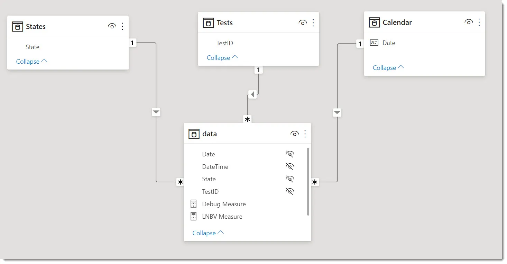
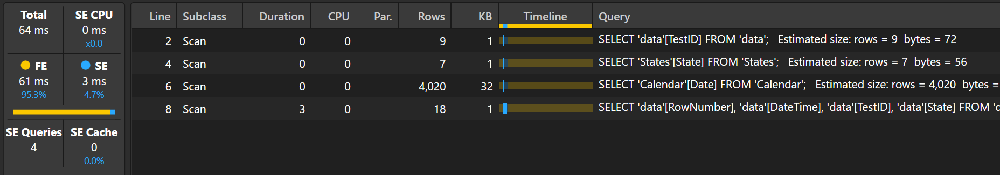
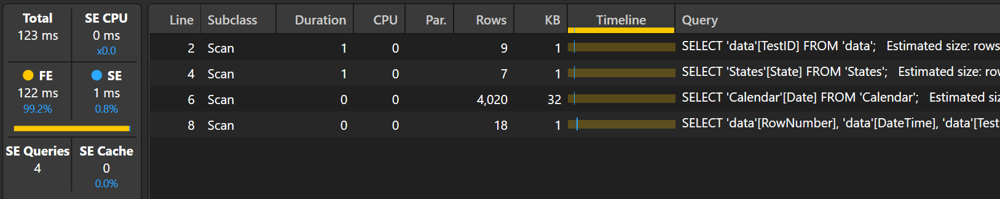
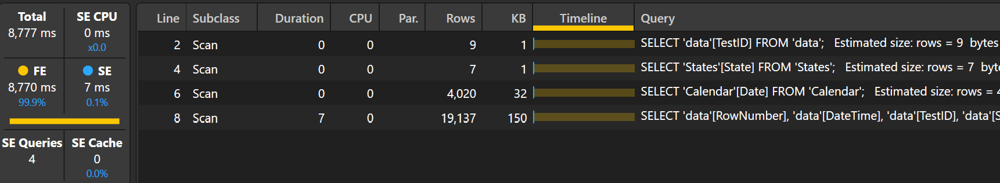
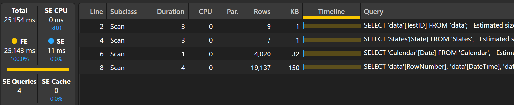

Now I have [DAX Syntax Highlighting](https://evaluationcontext.github.io/posts/Syntax-Highlight-DAX/) working on my blog I wanted to revisit some exploration I did with window function when they first came out. This was based on some DAX written by [Phil Seamark](https://www.linkedin.com/in/seamark/) that [Counts numbers of last known state](https://dax.tips/2021/05/17/dax-count-number-of-last-known-state/). The measure counts, for each day, the most recent State for each TestID.

## Semantic Model



## Measure

Phil's blog pre-dated window functions so I thought it would be interesting to refactor this measure, swapping [TOPN](https://learn.microsoft.com/en-us/dax/topn-function-dax) with [INDEX](https://learn.microsoft.com/en-us/dax/index-function-dax) and observe the differences.

=== "TOPN"

    ```dax
    // Using TOPN
    VAR currentState = SELECTEDVALUE(States[State])
    VAR currentDate = SELECTEDVALUE('Calendar'[Date])+1
    RETURN
        COUNTROWS(
            FILTER(
                ALL( data[TestID] ),
                SELECTCOLUMNS(
                    TOPN(
                        1,
                        CALCULATETABLE( 
                            FILTER( 
                                'data', 
                                [DateTime] < currentDate
                            )
                            ,REMOVEFILTERS('Calendar'[Date])
                            ,REMOVEFILTERS('States'[State])
                            ),
                        'data'[DateTime], 
                        DESC
                    ),
                    "Last Value", [State]
                    )
                = currentState
                )
            )       
    ```

=== "INDEX"

    ```dax
    // Using INDEX
    VAR currentState = SELECTEDVALUE(States[State])
    VAR currentDate = SELECTEDVALUE('Calendar'[Date])+1
    RETURN
        COUNTROWS(
            FILTER(
                ALL( data[TestID] ),
                SELECTCOLUMNS(
                    INDEX( 
                        1, 
                        CALCULATETABLE(
                            FILTER(
                                data, 
                                data[DateTime] < currentDate
                            )
                            ,REMOVEFILTERS( 'Calendar'[Date] )
                            ,REMOVEFILTERS( 'States'[State] )
                        )
                        ,ORDERBY( data[DateTime], DESC)
                        , 
                        ,MATCHBY( data[DateTime] )
                    ),
                    "Last Value", [State]
                    )
                = currentState
                )
            )
    ```

## Measure Comparison

I ran both measures in DAX studio, with a cleared cache and Server Timing turned on.

```dax
EVALUATE
SUMMARIZECOLUMNS(
    'Calendar'[Date],
    'States'[State],
    "Using_TOPN", [Using TopN]
    "Using_INDEX", [Using INDEX]
)
```

=== "TOPN Performance"

    

=== "INDEX Performance"

    

### Comparison

Both of these measures create the same Storage Engine (SE) queries.

```sql
-- 1
SELECT 'data'[TestID] FROM 'data';

-- 2
SELECT 'States'[State] FROM 'States';

-- 3
SELECT 'Calendar'[Date] FROM 'Calendar'

-- 4 
SELECT
    'data'[RowNumber],
    'data'[DateTime],
    'data'[TestID],
    'data'[State]
FROM 'data';
```

The dataset is very small so we can ignore the actual performance timings. To test the difference in performance I extended the data to 20,000 rows.

=== "TOPN 20,000 Rows Performance"

    

=== "INDEX 20,000 Rows Performance"

    

TOPN quickly performs it's SE queries, followed by a substantial period of Formula Engine (FE). Interestingly INDEX takes twice the time to execute. 

If we look at the Query Plans, the Logical Query Plans are almost identical. But on the Physical Query Plans we see some differences. Both queries end up at the same point, at a CrossApply EqualTo `#!dax '(Calendar'[Date])`, `#!dax ('States'[State])`, `#!dax ('data'[TestID])` on `#!dax ('Calendar'[Date], 'States'[State], 'data'[TestID])`, where the latter is the most recent State of the given TestID on a given Date. The main difference is INDEX joins `#!dax ('Calendar'[Date], 'data'[TestID], 'data'[State])` with the ordered list of `#!dax ('Calendar'[Date], 'data'[TestID], 'data'[RowNumber-2662979B-1795-4F74-8F37-6A1BA8059B61], 'data'[DateTime], 'data'[State])` to determine n<sup>th</sup> row. 

## Conclusion

While the semantics of TOPN and INDEX measures are similar, the underlying algorithm and therefore query plans differ, resulting in differences in query performance. If you want to return the n<sup>th</sup> item, INDEX can be a good solution. TOPN only works out for the first or last item. Another option would be to use [RANK](https://learn.microsoft.com/en-us/dax/rank-function-dax)/[RANX](https://learn.microsoft.com/en-us/dax/rankx-function-dax), but the measure might be less readable, and the performance would need to be quantified. When trying to develop or optimize a measure you should try to experiment with a few variations to check the characteristics of each before landing on a final design.