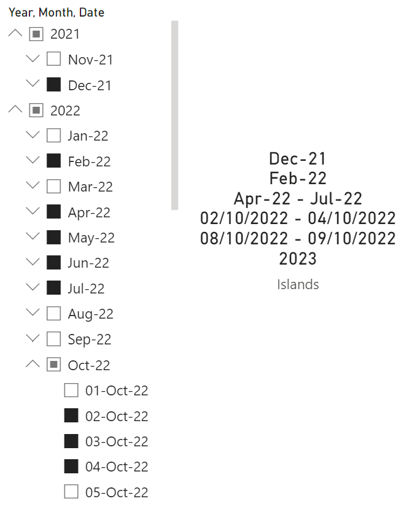

A while ago the [SQLBI](https://www.sqlbi.com/) guys release a blog providing a solution for [Displaying a list of selected months](https://www.sqlbi.com/blog/alberto/2018/12/20/displaying-a-list-of-selected-months/). The input is a selection of filter month, and the output list these months, with contiguous sequences grouped together. This was done by looking at leading and lagging values to detect edges of continuous sequences. This problem falls into the classic Island Problem, and there is another nice way to solve this.

## Simple Solution

The Island problem states that we want to group ranges of continuous sequences. There is also a similar but opposite Gaps problem, which detects missing values in a sequence. To solve the Island problem we can add a extra column with sequential integers, which increases at the same cadence. 

!!! info "Sequence considerations"
		
	If we have daily the sequential sequence would need to increase by 1 for each row. If we have weekly data the sequence would need to increase by 7. 

We can calculate the difference between the two sequences. If there is no gap then the difference will be constant. If there is a gap the difference will change, and denoting a new island. This is demonstrated with this example.

=== "Code"

	```dax
	DEFINE 
	VAR DateFilter = 
		TREATAS(
			{
				DATE(2021, 11, 01),
				DATE(2022, 11, 02),
				DATE(2022, 11, 03),
				DATE(2022, 11, 06),
				DATE(2022, 11, 07),
				DATE(2022, 11, 08),
				DATE(2022, 11, 11),
				DATE(2022, 11, 12)	
			},
			'Dates'[Date]
		)

	EVALUATE
	CALCULATETABLE(
		ADDCOLUMNS(
			VALUES( Dates[Date] )
			,"@RowNumber"
				, RANK( DENSE, VALUES( Dates[Date] ), ORDERBY( Dates[Date], ASC ) )
			,"@Islands"
				,DATEDIFF(
					RANK( DENSE, VALUES( Dates[Date] ), ORDERBY( Dates[Date], ASC ) )
					,Dates[Date]
					,DAY 
				)
		)
		,DateFilter
	)
	```
=== "Result"

	| Date                | `@RowNumber` | `@Islands` |
	| ------------------- | ---------- | -------- |
	| 02/11/2022 00:00:00 | 1          | 44866    |
	| 03/11/2022 00:00:00 | 2          | 44866    |
	| 06/11/2022 00:00:00 | 3          | 44868    |
	| 07/11/2022 00:00:00 | 4          | 44868    |
	| 08/11/2022 00:00:00 | 5          | 44868    |
	| 11/11/2022 00:00:00 | 6          | 44870    |
	| 12/11/2022 00:00:00 | 7          | 44870    |

As you can see there are 3 separate continuous sequences, and each group gets a distinct `[@Island]` value. 

We can use this as a base for the final solution. 

=== "Visual"

	

=== "Code"

	```dax
	// Islands
	VAR DataSequence = 
		ADDCOLUMNS(
			VALUES( Dates[Date] )
			, "@Islands"
			,DATEDIFF(
				RANK( DENSE, VALUES( Dates[Date] ), ORDERBY( Dates[Date], ASC ) )
				,Dates[Date]
				,DAY 
			)
		)
	VAR Islands =	
		SUMMARIZE(
			DataSequence
			,[@Islands]
			,"IslandString"
				,VAR MinDate = FORMAT( MIN( Dates[Date] ), "mmm-yy" )
				VAR MaxDate = FORMAT( MAX( Dates[Date] ), "mmm-yy" )
				RETURN
				IF( MinDate <> MaxDate, MinDate & " - " & MaxDate, MaxDate )
		)
	VAR result = CONCATENATEX ( islands, [IslandString], " | " )
	RETURN
	result
	```

## Extended Solution

This works well for a given granularity, but what about if we want to show a mixture of selected days, months and years. We can extend our solution as follows.

=== "Visual"

	

=== "Code"

	```dax
	// Island Extended
	Islands = 
	VAR DataSequence = 
		ADDCOLUMNS(
			SUMMARIZE(
				Dates
				,Dates[Year]
				,Dates[Month]
				,Dates[Date]
			)
			, "@Islands"
			,DATEDIFF(
				RANK( DENSE, VALUES( Dates[Date] ), ORDERBY( Dates[Date], ASC ) )
				,Dates[Date]
				,DAY 
			)
		)
	VAR Islands =	
		SUMMARIZE(
			DataSequence
			,[@Islands]
			,"IslandString"
				,VAR MinDate =  MIN ( Dates[Date] )
				VAR MaxDate =   MAX ( Dates[Date] )
				VAR MinYear = 	CALCULATE( MIN( Dates[Date] ), ALLEXCEPT( Dates, Dates[Year] ))
				VAR MaxYear = 	CALCULATE( MAX( Dates[Date] ), ALLEXCEPT( Dates, Dates[Year] ))
				VAR MinMonth =  CALCULATE( MIN( Dates[Date] ), ALLEXCEPT( Dates, Dates[Month] ))
				VAR MaxMonth =  CALCULATE( MAX( Dates[Date] ), ALLEXCEPT( Dates, Dates[Month] ))
				VAR GranularityCheckStart = 
				SWITCH(
					true
					,MinDate = MinYear && MaxDate = MaxYear
						, CALCULATE( MAX( Dates[Year] ), Dates[Date] = MinDate )
					,MinDate = MinMonth && MaxDate = MaxMonth
						, FORMAT( CALCULATE( MAX( Dates[Month] ), Dates[Date] = MinDate ), "mmm-yy" )
					,MinDate
				)
				VAR GranularityCheckEnd = 
					SWITCH(
						true
						,MinDate = MinYear && MaxDate = MaxYear
							, CALCULATE( MAX( Dates[Year] ), Dates[Date] = MaxDate )
						,MinDate = MinMonth && MaxDate = MaxMonth
							, FORMAT( CALCULATE( MAX( Dates[Month] ), Dates[Date] = MaxDate ), "mmm-yy" )
						,MaxDate
					)
				return
				IF( GranularityCheckStart = GranularityCheckEnd, GranularityCheckStart, GranularityCheckStart  & " - " & GranularityCheckEnd )
		)
	VAR result = CONCATENATEX ( islands, [IslandString], UNICHAR( 10 ), [@Islands], ASC )
	RETURN
	result
	```