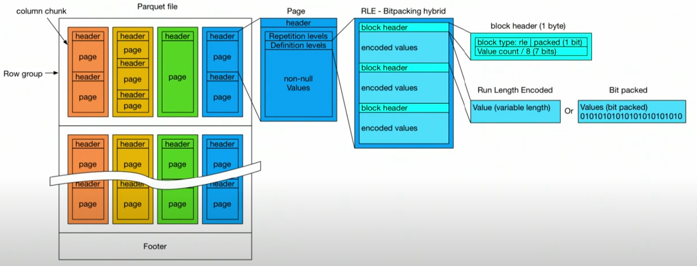

Data Lakes offer flexible low cost file storage, but how do they differ from Data Lakehouse's? Data Lakehouse's leverage existing Data Lake architectures, and add a metadata layer (Table Format) above the data files to confer the additional reliability, resilience and performance associated with Data Warehouses. There are a number of open-source Table Formats: [Delta Lake](https://delta.io/), [Apache Hudi](https://hudi.apache.org/) and [Apache Iceberg](https://iceberg.apache.org/). Microsoft Fabric and Databricks use Delta Lake, so I will focus on that.

## Data Lakehouse Components

A Data Lakehouse uses the following components:

| Component    | Example                      |
| ------------ | ---------------------------- |
| Storage      | Azure Data Lake Storage Gen2 |
| File Format  | Apache Parquet               |
| Table Format | Delta Lake                   |
| Catalog      | Hive Metastore               |
| Query Engine | Apache Spark                 |

The Storage, File Formats, Catalog and Query Engine can all be present in the architecture of a classical Data Lake. The Table Format uplifts this architecture to a Data Lakehouse, adding a range of features including ACID transactions, file skipping, time travel, and schema enforcement and evolution.

## Delta Lake

Delta Lake tables are defined by a directory, which contain the [Delta Transaction Log](https://github.com/delta-io/delta/blob/master/PROTOCOL.md) and [Apache Parquet](https://parquet.apache.org/) files. The Transaction Log is a ordered record of every transaction commit against the table, and the Parquet files stores the data committed to the table.

The best way to understand Delta Tables is see them in action. Lets start with a simple example:

```diff
+📁 delta_table
+┕━━ 📁 _delta_log        # Transaction Log
+│   ┕━━ 📄 00000.json    # Add 1.parquet
+┕━━ 📄 1.parquet         # Data File
```

Data is saved as a parquet file(s) and changes are committed to the transactions log.

!!! info "ACID"
    
    If a operation against a Data Lake table fails, it could left be in a compromised state. With Delta Lake operations against table are Atomic transactions, if there is a failure anywhere in a transaction, then no commit is made to Transaction Log and the Table is still valid.

Lets append some more data. 

```diff
 📁 delta_table
 ┕━━ 📁 _delta_log
 │   ┕━━ 📄 00000.json  # Add 1.parquet
+│   ┕━━ 📄 00001.json  # Add 2.parquet
 ┕━━ 📄 1.parquet
+┕━━ 📄 2.parquet
```

A new file was added with a new commit.

Lets delete some rows from the table.

```diff
 📁 delta_table
 ┕━━ 📁 _delta_log
 │   ┕━━ 📄 00000.json  # Add 1.parquet
 │   ┕━━ 📄 00001.json  # Add 2.parquet
+│   ┕━━ 📄 00002.json  # Remove 2.parquet, Add 3.parquet
 ┕━━ 📄 1.parquet
 ┕━━ 📄 2.parquet
+┕━━ 📄 3.parquet
```

Parquet files can be considered to immutable, therefore For DML commands UPDATE, DELETE, and MERGE, existing parquet files are not altered. Instead new version of files are created, and the old versions "deleted". We see that the Transaction Log notes that `2.parquet` was removed and `3.parquet` was added. `3.parquet` was added to the folder but `2.parquet` still exists. To ensure Isolation of transactions files are not deleted straight away, instead the remove operation is a soft-delete and is files are tombstoned. This gives us the ability to [time travel](https://delta.io/blog/2023-02-01-delta-lake-time-travel) in the table and view previous versions, as we can traverse the Transaction Log up to a specific commit to determine which files formed the Table at that point in time.

!!! info "VACCUM"

    Tombstoned files can be fully deleted with [VACCUM](https://docs.delta.io/latest/delta-utility.html#vacuum) command. "Deleted" file can be removed from the Data Lake via the [VACCUM](https://docs.delta.io/latest/delta-utility.html#vacuum) command, at which point the ability to Time Travel to a commit that relies on that file is lost.

If we continue to perform actions on the table, after every ten commits a checkpoint file is created. This combines all the small JSON commit files into a single parquet file that is more easily parsed.

```diff
 📁 delta_table
 ┕━━ 📁 _delta_log
 │   ┕━━ 📄 00000.json  # Add 1.parquet
 │   ┕━━ 📄 00001.json  # Add 2.parquet
 │   ┕━━ 📄 00002.json  # Remove 2.parquet, Add 3.parquet
+│   ┕━━ ...
+│   ┕━━ 📄 00010.json
+│   ┕━━ 📄 00010.checkpoint.parquet
 ┕━━ 📄 1.parquet
 ┕━━ 📄 2.parquet
 ┕━━ 📄 3.parquet
+┕ ...
```

In the case where there are multiple concurrent transactions, each will try to commit. One will win, the loser will check the new current state of the table and attempt another commit. This provides transaction's Isolation.

It's worth mentioning that the Transaction log also stores the Table's Schema. This is important as this allows for the protection of the Tables via on-write Schema Enforcement. Conversely that is also the idea of Schema Evolution that allows for schema merging. These topics are covered [here](https://www.databricks.com/blog/2019/09/24/diving-into-delta-lake-schema-enforcement-evolution.html).

If you want read about the Transaction Log in more detail, then look to other [blogs](https://dennyglee.com/2024/01/03/a-peek-into-the-delta-lake-transaction-log/) or the [Delta Transaction Log Protocol](https://github.com/delta-io/delta/blob/master/PROTOCOL.md#delta-table-specification).

Delta Lake uses Parquet files to store the Table's data. Parquet is a open-source columnar storage format that employs efficient compression and encoding techniques. It is very cool and worth understanding but beyond the scope of this blog post.


<cite>[Parquet Structure](https://www.youtube.com/watch?v=dPb2ZXnt2_U)</cite>

## Resources

### Delta Lake

- [Delta Lake](https://delta.io/)
- [Databricks: Diving Into Delta Lake: Unpacking The Transaction Log](https://www.databricks.com/blog/2019/08/21/diving-into-delta-lake-unpacking-the-transaction-log.html)
- [Databricks: Diving Into Delta Lake: Schema Enforcement & Evolution](https://www.databricks.com/blog/2019/09/24/diving-into-delta-lake-schema-enforcement-evolution.html)
- [Diving Into Delta Lake: DML Internals](https://www.databricks.com/blog/2020/09/29/diving-into-delta-lake-dml-internals-update-delete-merge.html)
- [DENNY LEE: Understanding the Delta Lake transaction log at the file level](https://dennyglee.com/2023/11/26/understanding-the-delta-lake-transaction-log-at-the-file-level/)
- [DENNY LEE: A peek into the Delta Lake Transaction Log](https://dennyglee.com/2024/01/03/a-peek-into-the-delta-lake-transaction-log/)

### Parquet

- [Parquet Github](https://github.com/apache/parquet-format)
- [Querying Parquet with Millisecond Latency](https://arrow.apache.org/blog/2022/12/26/querying-parquet-with-millisecond-latency/)
- [Spark + Parquet In Depth: Spark Summit East talk by: Emily Curtin and Robbie Strickland](https://www.youtube.com/watch?v=_0Wpwj_gvzg)
- [The columnar roadmap: Apache Parquet and Apache Arrow](https://www.youtube.com/watch?v=dPb2ZXnt2_U)