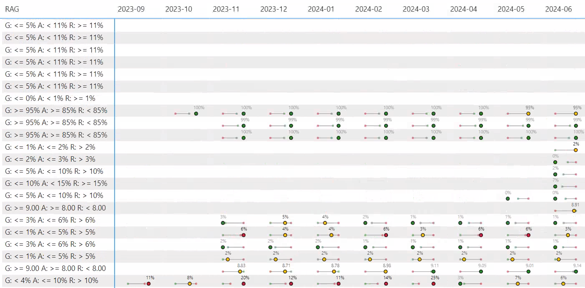

I recently got inspired by post by [Kurt Buhler](https://www.linkedin.com/in/kurtbuhler/): [Creating custom visuals in Power BI with DAX](https://www.sqlbi.com/articles/creating-custom-visuals-in-power-bi-with-dax/). I have seen many of [Kerry Kolosko's SVG examples](https://kerrykolosko.com/category/dataviz/svg/) in the past but have not got round to playing with them. I have a report that visualizes KPIs over time in a matrix. Each of these KPIs have a status of Green, Yellow or Red, depending on whether the value is within a range. The most simple way to visualize this is just to conditional colour the cell to show the status, but that option doesn't provide much visual context to how close to the threshold the value is. I decided to take Kurt's post and adjust it to create a visual to suit my needs.

I was happy to discovery the process of creating SVGs to be quite easy. You define elements and their properties such as their coordinates and colours. You define the SVG definition as string using DAX, set the measures to Image URL Type and throw it in a matrix. This is what I ended up with:

=== "Visual"

    

=== "Code"

    ```dax
    Bar Bell SVG =
    VAR _SvgWidth =                 75
    VAR _SvgHeight =                20

    // Values
    VAR _ActualValue =              [Max Value]
    VAR _ActualColour=              MAX( 'Fact'[Colour] )
    VAR _ActualValueFormatted =     IF( MAX( Metrics[format] ) = "Percent", FORMAT( _ActualValue, "0%"), FORMAT( _ActualValue, "0.00") )
    VAR _RedValue =                 MAX( Metrics[red#] )
    VAR _GreenValue =               MAX( Metrics[green#] )
    VAR _SmallValue =               MIN( _RedValue, _GreenValue)
    VAR _LargeValue =               MAX( _RedValue, _GreenValue) 
    VAR _SmallestValue =            MIN( _SmallValue, _ActualValue )
    VAR _LargestValue =             MAX( _LargeValue, _ActualValue )

    // Mapping from values to svg scale
    VAR _Diff =                     _LargestValue - _SmallestValue
    VAR _InputStart =               _SmallestValue - _Diff / 2          // The lowest number of the range input
    VAR _InputEnd =                 _LargestValue + _Diff / 2           // The largest number of the range input
    VAR _OutputStart =              0                                   // The lowest number of the range output
    VAR _OutputEnd =                _SvgWidth                           // The largest number of the range output

    VAR _ActualPosition =           _OutputStart + ((_OutputEnd - _OutputStart) / (_InputEnd - _InputStart)) * (_ActualValue - _InputStart)
    VAR _SmallPosition =            _OutputStart + ((_OutputEnd - _OutputStart) / (_InputEnd - _InputStart)) * (_SmallValue - _InputStart)
    VAR _LargePosition =            _OutputStart + ((_OutputEnd - _OutputStart) / (_InputEnd - _InputStart)) * (_LargeValue - _InputStart)
    
    // Colours
    VAR _Opacity =                  "80" // 50%
    VAR _ActualHex =                MAX( 'Fact'[Colour Hex] )
    VAR _RedHex =                   "#D2222D"
    VAR _AmberHex =                 "#FFBF00"
    VAR _GreenHex =                 "#238823"
    VAR _GreyHex =                  "#A3A3A3"
    VAR _WhiteHex =                 "#FFFFFF"
    VAR _BlackHex =                 "#000000"
    VAR _SmallHex =                 IF( _GreenValue = _SmallValue, _GreenHex, _RedHex )
    VAR _LargeHex =                 IF( _GreenValue = _LargeValue, _GreenHex, _RedHex )
    VAR _CallOutHex =              
        SWITCH(
            _ActualColour
            ,"Green", _GreyHex
            ,"Red", _BlackHex   
            ,"Amber",
                // https://dax.tips/2019/10/02/dax-base-conversions/
                VAR StartNumber = 163 //_GreyHex
                VAR ConvertMe =
                    MIN(
                        StartNumber +  // distance to red
                        SWITCH(
                            true
                            ,_RedValue = _SmallValue,       INT( ( 1 - ( _ActualPosition - _SmallPosition ) / ( _LargePosition - _SmallPosition ) ) * 100 )
                            ,_RedValue = _LargestValue,     INT( ( 1 - ( _LargePosition - _ActualPosition ) / ( _LargePosition - _SmallPosition ) ) * 100 )
                        )
                        ,255 - StartNumber
                    )
                VAR Base = 16
                VAR BitTable = GENERATESERIES ( 1, 8 )
                VAR DEC2HEX =
                    CONCATENATEX(
                        BitTable,
                        VAR c = MOD ( TRUNC ( ConvertMe / POWER ( base, [value] - 1 ) ),base )
                        RETURN SWITCH(c,10,"A",11,"B",12,"C",13,"D",14,"E",15,"F",c),
                        ,[Value],Desc
                    )
                VAR SubHex = RIGHT( DEC2HEX, 2 )
                RETURN
                    "#" & REPT( SubHex, 3 )
        )

    // Vectors
    VAR _Offset = 5
    VAR _linePosition =             _SvgHeight - (_SvgHeight / 4)
    VAR _MiddleLine =               "<line x1=""" & _SmallPosition & """" & UNICHAR(10) & "y1=""" & _linePosition & """ x2=""" & _LargePosition & """ y2=""" & _linePosition & """ stroke=""" & _GreyHex & """/>"
    VAR _ActualCircle =             "<circle cx=""" & _ActualPosition &""" cy=""" & _linePosition & """ r=""3"" fill=""" & _ActualHex & """ stroke= '" & _BlackHex & "'/>"
    VAR _SmallCircle =              "<circle cx=""" & _SmallPosition &""" cy=""" & _linePosition & """ r=""2"" fill=""" & _SmallHex & _Opacity & """/>"
    VAR _LargeCircle =              "<circle cx=""" & _LargePosition &""" cy=""" & _linePosition & """ r=""2"" fill=""" & _LargeHex & _Opacity & """/>"
    VAR _Callout =                  "<text x='" & _ActualPosition - _Offset & "' y='"& _SvgHeight / 3 & "' fill='" & _CallOutHex  & "' font-size='8' font-family='Segoe UI, sans-serif' >"& _ActualValueFormatted &"</text>"
    
    VAR _Svg =
        "data:image/svg+xml;utf8, <svg width=""" & _SvgWidth & """ height=""" & _SvgHeight &""" xmlns="http://www.w3.org/2000/svg">" &
        _MiddleLine &
        _SmallCircle &
        _LargeCircle &
        _ActualCircle &
        _Callout &
        "</svg>"

    RETURN
    IF( not ISBLANK( _ActualValue ) &&  not ISBLANK( MAX( Metrics[RAG] )), _Svg )
    ```