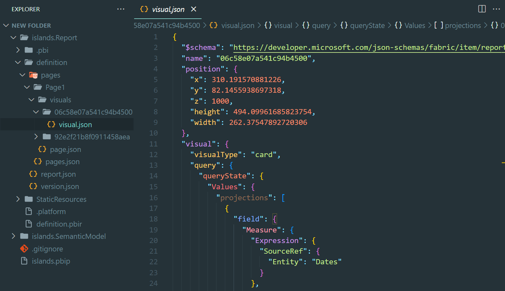
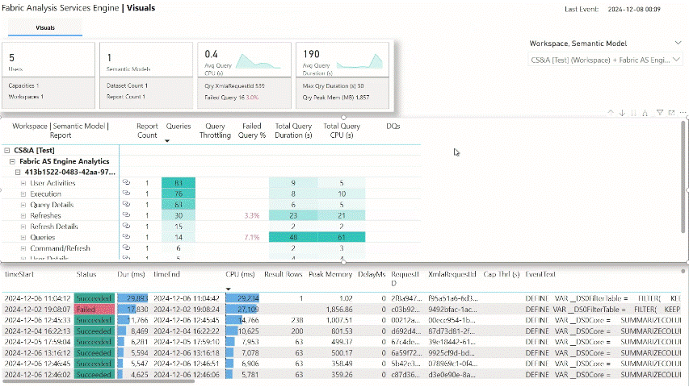

 
While using the [Fabric Log Analytics for Analysis Services Engine report template](https://github.com/microsoft/PowerBI-LogAnalytics-Template-Reports/blob/main/FabricASEngineAnalytics/README.md) I ran into an annoyance. You can see queries created by visuals, and the logs have a visualId and reportId associated with them, but it is a bit of a pain to figure out what visual that Id relates to.

## Obtaining VisualId

Firstly VisualId isn't immediately available in Power BI desktop. It is possible to unzip the binary and get the id from the layout json file. With Power BI Developer mode the underlying metadata is now even easier to access. If we want to obtain all the visualId for a entire tenant these options are not appealing. Thankfully there is now a [Get Report Definition](https://learn.microsoft.com/en-us/rest/api/fabric/report/items/get-report-definition?tabs=HTTP) Fabric API. Additionally [Semantic Link](https://fabric.guru/getting-visualids-of-all-the-visuals-in-a-power-bi-report), acts as a wrapping making calling the same API a bit simpler.

## Visual Properties

If we look at the PBIR format, we can see each visual is listed under each page, with all the metadata. 



In addition to the visualId the report metadata also offers a range of other useful properties. Top of the list is x, y, z, height and width. Therefore with a SVG we can draw each visual on a page as a rectangle and colour to display interesting information. For example we could show # user, # errors, # queries CPU usage, or query duration.

## Proof of Concept

To create a quick proof of concept, I pulled the visual metadata from a local pbip folder and created a composite model to the [Fabric Log Analytics for Analysis Services Engine report](https://github.com/microsoft/PowerBI-LogAnalytics-Template-Reports/blob/main/FabricASEngineAnalytics/README.md). 


I created a report page and SVG measure. I then added the SVG measure to a tooltip to get the following result.

=== "Visual"

    

=== "Code"

    ```dax
    Page SVG =
    VAR __pageHeight = SELECTEDVALUE( 'Visual Properties'[Page height] )
    VAR __pageWidth = SELECTEDVALUE( 'Visual Properties'[Page width] )
    VAR __svgHeight = 200
    VAR __svgWidth = __pageWidth * ( __svgHeight / __pageHeight )
    VAR __selectedVisual = SELECTEDVALUE( 'Visual Properties'[Visual name]  )
    VAR __Range =
        MAXX(
            ALLSELECTED( 'Execution Metrics'[XmlaRequestId] ),
            CALCULATE(
                SUM( 'Execution Metrics'[totalCpuTimeMs] ) / 1000
                ,'Execution Metrics'[LogAnalyticsCategory]= "Query"
                ,REMOVEFILTERS( Artifact )
            )
        )
    VAR __page = "<rect id='Page' width='" & __svgWidth & "' height='" & __svgHeight & "' fill='none' stroke='black' />"
    VAR _visualFill =
        CONCATENATEX(
            ADDCOLUMNS(
                ALLSELECTED( 'Visual Properties'[Visual name], 'Visual Properties'[z] )
                ,"@visual"
                ,var x =            CALCULATE( SELECTEDVALUE( 'Visual Properties'[x] ) * ( __svgWidth / __pageWidth ), ALLSELECTED( 'Visual Properties'[Visual name] ) )
                var y =             CALCULATE( SELECTEDVALUE( 'Visual Properties'[y] ) * ( __svgHeight / __pageHeight ), ALLSELECTED( 'Visual Properties'[Visual name] ) )
                var width =         CALCULATE( SELECTEDVALUE( 'Visual Properties'[width] ) * ( __svgWidth / __pageWidth ), ALLSELECTED( 'Visual Properties'[Visual name] ) )
                var height =        CALCULATE( SELECTEDVALUE( 'Visual Properties'[height] ) * ( __svgHeight / __pageHeight ), ALLSELECTED( 'Visual Properties'[Visual name] ) )
                VAR _inputStart =           0                       // The lowest number of the range input
                VAR _inputEnd =             __Range                 // The largest number of the range input
                VAR _outputStart =          255                     // The lowest number of the range output
                VAR _outputEnd =            0                       // The largest number of the range output        
                VAR _outputVal =            _outputStart + ((_outputEnd - _outputStart) / (_inputEnd - _inputStart)) * ( [Avg Duration (s)] - _inputStart)
                // https://dax.tips/2019/10/02/dax-base-conversions/
                VAR ConvertMe = IFERROR( _outputVal, 255 )
                VAR Base = 16
                VAR BitTable = GENERATESERIES ( 1, 8 )
                VAR DEC2HEX =
                    CONCATENATEX(
                        BitTable,
                        VAR c = MOD( TRUNC ( ConvertMe / POWER ( base, [value] - 1 ) ), base )
                        RETURN SWITCH(c,10,"A",11,"B",12,"C",13,"D",14,"E",15,"F",c),
                        ,[Value],Desc
                    )
                VAR fillHex =
                    IF(
                        'Visual Properties'[Visual name] = __selectedVisual
                        || not ISINSCOPE( 'Visual Properties'[Visual name] )
                        , "#" & REPT( RIGHT( DEC2HEX, 2 ), 3 ) & IF( ConvertMe = 255, "00", "" )
                        , "none"
                    )
                return
                "<rect id='Page' x = '" & x & "' y = '" & y & "' width='" & width & "' height='" & height & "' fill='" & fillHex & "' filter='url(#gradient)' />"
            )
            ,[@visual]
            ," "
            ,'Visual Properties'[z]
            ,ASC
        )
    VAR _visualoutline =
        CONCATENATEX(
            ADDCOLUMNS(
                ALLSELECTED( 'Visual Properties'[Visual name], 'Visual Properties'[z] )
                ,"@visual"
                ,var x =            CALCULATE( SELECTEDVALUE( 'Visual Properties'[x] ) * ( __svgWidth / __pageWidth ), ALLSELECTED( 'Visual Properties'[Visual name] ) )
                var y =             CALCULATE( SELECTEDVALUE( 'Visual Properties'[y] ) * ( __svgHeight / __pageHeight ), ALLSELECTED( 'Visual Properties'[Visual name] ) )
                var width =         CALCULATE( SELECTEDVALUE( 'Visual Properties'[width] ) * ( __svgWidth / __pageWidth ), ALLSELECTED( 'Visual Properties'[Visual name] ) )
                var height =        CALCULATE( SELECTEDVALUE( 'Visual Properties'[height] ) * ( __svgHeight / __pageHeight ), ALLSELECTED( 'Visual Properties'[Visual name] ) )
                var strokeHex =     IF( 'Visual Properties'[Visual name] = __selectedVisual, "green", "gray" )
                var strokeWidth =   IF( 'Visual Properties'[Visual name] = __selectedVisual, "2", "1" )
                return
                "<rect id='Page' x = '" & x & "' y = '" & y & "' width='" & width & "' height='" & height & "' fill='none' stroke='" & strokeHex & "' stroke-width='" & strokeWidth & "'/>"
            )
            ,[@visual]
            ," "
            ,'Visual Properties'[z]
            ,ASC
        )
    RETURN
    "data:image/svg+xml;utf8, <svg width=""" & __svgWidth & """ height=""" & __svgHeight &""" xmlns="http://www.w3.org/2000/svg">" &
    "<defs>
        <filter id=""gradient"" color-interpolation-filters=""sRGB"">
            <feComponentTransfer>
                <feFuncR type=""table"" tableValues=""0.020 0.975"" />
                <feFuncG type=""table"" tableValues="" 0.776 0.975"" />
                <feFuncB type=""table"" tableValues=""0.733 0.975"" />
            </feComponentTransfer>
        </filter>
    </defs>" &
    __Page &
    _visualFill &
    _visualoutline &
    "</svg>
    ```

## Next Steps

To fully deploy this solution you'd likely want field parameters or calculations groups allow the SVG to show different measures. Additionally you'd want to leverage the Fabric API to pull the metadata for the entire tenant. One thing you'd want to think about is what you want to happen if a visual is deleted.