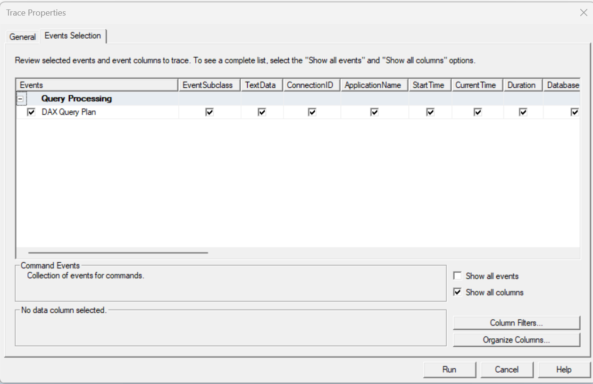
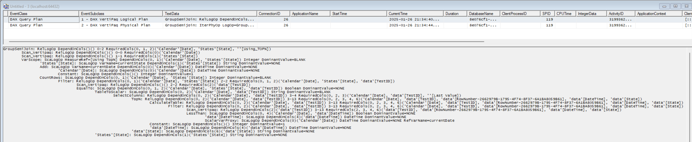
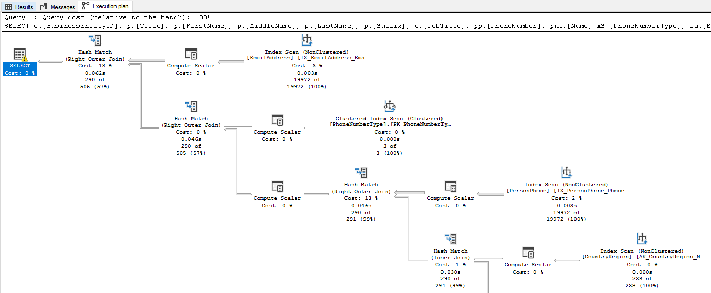

 
Ever since completing [SQLBI's Optimizing DAX course](https://www.sqlbi.com/p/optimizing-dax-video-course/) I started looking at DAX query plans in more depth. I've found the fully textual plans hard to parse, with only indents to denote nested operations. This is fine until you get multiple paths nested below the same node, it hard to keep the full execution plan in your head. I've always liked SQL servers graphical query plans so I want to investigate how to build the same.

## Query

We are going to be looking at the execution of the following query, from a [previous post](https://evaluationcontext.github.io/posts/Window-Function/).

```dax
EVALUATE
SUMMARIZECOLUMNS(
    'Calendar'[Date],
    'States'[State],
    "Using_TOPN", [Using TopN]
)
```

## SQL Server Profiler

The Query Plan can be obtained from running SQL Server Profiler and grabbing the `DAX Query Plan` event.



!!! tip "Clear Cache"

    Clear cache prior to query execution to avoid using the cache
    ```xml
    <Batch xmlns="http://schemas.microsoft.com/analysisservices/2003/engine">
      <ClearCache>
        <Object>
          <DatabaseID>SemanticModel_ABC</DatabaseID>
        </Object>
      </ClearCache>
    </Batch>
    ```

 When we run our query we see two events, the Logical query plan and the Physical query plan. The SQLBI guys go into detail on DAX query plans in their [Optimizing DAX course](https://www.sqlbi.com/p/optimizing-dax-video-course/), plus they also have a [white paper](https://www.sqlbi.com/whitepapers/understanding-dax-query-plans/) on the subject. The Logical Query Plan is created first, and resembles the DAX query. This is then converted the Physical Plan for execution. We can see a number of rows with increasing indent. Each increase in indent represents a nested operation. So we need to read the plan from the leaf to the root to understand how data stored in SSAS Tabular is being processed to return the output of the query.



My main bugbear with this is that if you have several groups of operations that all use the same step, it can be quite hard to keep track of all the interactions. What I'd really like is a graphical view like you get from SQL Server.


<cite>[SQL Server Query Plan](https://learn.microsoft.com/en-us/sql/relational-databases/performance/display-an-actual-execution-plan?view=sql-server-ver16) </cite>

Lets save this trace: File > Save As > Trace XML File... > `trace.xml`

## Processing XML Trace

We now need to process the XML to generate the appropriate data structure to generate a graph.

=== "Code"

    ```python
    import xmltodict
    import json
    import re

    # XML to dict
    EventSubClass ={
        1: 'logical',
        2: 'physical'
    }
    queries = {}

    with open('trace.xml', encoding='utf-16') as fd:
        queryPlan = xmltodict.parse(fd.read(), encoding='utf-16')

    for event in queryPlan['TraceData']['Events']['Event']:
        if event['@name'] == 'DAX Query Plan':
            
            for column in event['Column']:
                
                if column['@name'] == 'TextData':
                    query = column['#text']
        
                if column['@name'] == 'EventSubclass':
                    queryType = EventSubClass[int(column['#text'])]
        
            queries[queryType] = query

    # Generate Graph
    def extract_records(line) -> int:
        match = re.search(r'#Records=(\d+)', line)
        if match:
            return int(match.group(1))
        return None

    def extract_operation_type(line) -> list:
        match = re.search(r'(.*): (\w*)', line)
        if match:
            return [match.group(1).strip(), match.group(2).strip()]
        return None

    def generate_graph(lines: list)->list:
        stack = []
        level_parents = {}
        graph = []

        for index, line in enumerate(lines):
            current_level = len(line) - len(line.lstrip())
            
            while len(stack) > current_level:
                stack.pop()
            
            parent_index = level_parents.get(current_level - 1, None)
            
            stack.append((index, line))
            
            level_parents[current_level] = index

            operationType = extract_operation_type(line)

            graph.append({
                'srcid': parent_index,
                'dstid': index,
                'operation': line.strip(),
                'operationShort': operationType[0],
                'operationType': operationType[1],
                'isCache': operationType[0] == 'Cache',
                'level': current_level,
                'records': extract_records(line)
            })
        
        return graph

    graphs = {}

    for queryType, query in queries.items():
        graphs[queryType] = generate_graph(lines = query.split('\n'))

    with open('queryPlan.json', 'w') as fp:
        json.dump(graphs, fp)
    ```

=== "Output"

    ```json
    {
      "logical": [
        {
          "srcid": null,
          "dstid": 0,
          "operation": "GroupSemiJoin: RelLogOp DependOnCols()() 0-2 RequiredCols(0, 1, 2)('Calendar'[Date], 'States'[State], ''[Using_TOPN])",
          "operationShort": "GroupSemiJoin",
          "operationType": "RelLogOp",
          "isCache": false,
          "level": 0,
          "records": null
        },
        {
          "srcid": 0,
          "dstid": 1,
          "operation": "Scan_Vertipaq: RelLogOp DependOnCols()() 0-0 RequiredCols(0)('Calendar'[Date])",
          "operationShort": "Scan_Vertipaq",
          "operationType": "RelLogOp",
          "isCache": false,
          "level": 1,
          "records": null
        },
        ...
      ],
      "physical": [
        {
          "srcid": null,
          "dstid": 0,
          "operation": "GroupSemijoin: IterPhyOp LogOp=GroupSemiJoin IterCols(0, 1, 2)('Calendar'[Date], 'States'[State], ''[Using_TOPN])",
          "operationShort": "GroupSemijoin",
          "operationType": "IterPhyOp",
          "isCache": false,
          "level": 0,
          "records": null
        },
        {
          "srcid": 0,
          "dstid": 1,
          "operation": "Spool_Iterator<SpoolIterator>: IterPhyOp LogOp=VarScope IterCols(0, 1)('Calendar'[Date], 'States'[State]) #Records=13413 #KeyCols=2 #ValueCols=1",
          "operationShort": "Spool_Iterator<SpoolIterator>",
          "operationType": "IterPhyOp",
          "isCache": false,
          "level": 1,
          "records": 13413
        },
        ...
      ]
    }
    ```

## Graphs

We can now use [Vega](https://vega.github.io/vega/) to draw the graph.


### Logical Query Plan

=== "Visual"

    ```vegalite
    {
      "$schema": "https://vega.github.io/schema/vega/v5.json",
      "description": "A force-directed graph for a DAX Query Plan",
      "width": 700,
      "height": 500,
      "padding": 5,
      "autosize": "none",
      "background": "#263238",
      "signals": [
        {"name": "cx", "update": "width / 2"},
        {"name": "cy", "update": "height / 2"},
        {"name": "nodeRadius", "value": 8},
        {"name": "nodeCharge", "value": -30},
        {"name": "linkDistance", "value": 30},
        {"name": "static", "value": false},
        {"name": "gravityX", "value": 0.2},
        {"name": "gravityY", "value": 0.9},
        {
          "description": "State variable for active node fix status.",
          "name": "fix",
          "value": false,
          "on": [
            {
              "events": "symbol:pointerout[!event.buttons], window:pointerup",
              "update": "false"
            },
            {"events": "symbol:pointerover", "update": "fix || true"},
            {
              "events": "[symbol:pointerdown, window:pointerup] > window:pointermove!",
              "update": "xy()",
              "force": true
            }
          ]
        },
        {
          "description": "Graph node most recently interacted with.",
          "name": "node",
          "value": null,
          "on": [
            {
              "events": "symbol:pointerover",
              "update": "fix === true ? item() : node"
            }
          ]
        },
        {
          "description": "Flag to restart Force simulation upon data changes.",
          "name": "restart",
          "value": false,
          "on": [{"events": {"signal": "fix"}, "update": "fix && fix.length"}]
        }
      ],
      "data": [
        {
          "name": "node-data",
          "url": "https://raw.githubusercontent.com/EvaluationContext/evaluationcontext.github.io/refs/heads/master/Resources/blog/2025-01-28-QueryPlanGraph/queryPlan.json",
          "format": {"type": "json", "property": "logical"},
          "transform": [
            {
              "type": "project",
              "fields": ["dstid", "operation", "level", "records", "operationType", "operationShort"],
              "as": ["index", "Operation", "Level", "Records"]
            },
            {
                  "type": "formula",
                  "expr": "length(datum.operationShort) * (width / 160)",
                  "as": "operationShortLen"
            }
          ]
        },
        {
          "name": "link-data",
          "url": "https://raw.githubusercontent.com/EvaluationContext/evaluationcontext.github.io/refs/heads/master/Resources/blog/2025-01-28-QueryPlanGraph/queryPlan.json",
          "format": {"type": "json", "property": "logical"},
          "transform": [
            {"type": "filter", "expr": "datum.srcid != null"},
            {
              "type": "project",
              "fields": ["srcid", "dstid"],
              "as": ["source", "target"]
            }
          ]
        }
      ],

      "legends": [
        {
          "direction": "vertical",
          "legendX": 1050,
          "legendY": 0,
          "orient": "none",
          "stroke": "color",
          "fill": "color",
          "titleColor": "#b6bcdd",
          "padding": 10,
          "encode": {
            "title": { "update": { "fontSize": { "value": 14 } } },
            "symbols": { "update": { "fillOpacity": { "value": 0.4 } } },
            "labels": {
              "update": {
                "fontSize": { "value": 12 },
                "fill": { "value": "#b6bcdd" }
              }
            }
          }
        }
      ],

      "scales": [
        {
          "name": "xscale",
          "type": "band",
          "domain": {"data": "node-data", "field": "Level", "sort": true},
          "paddingOuter": 1,
          "range": "width"
        },
        {
          "name": "yscale",
          "type": "band",
          "domain": {"data": "node-data", "field": "index", "sort": true},
          "range": "height"
        },
        {
          "name": "color",
          "type": "ordinal",
          "domain": {"data": "node-data", "field": "operationType"},
          "range": {"scheme": "tableau10"}
        },
        {
          "name": "size",
          "domain": {"data": "node-data", "field": "Records"},
          "range": [300, 2000]
        }
      ],

      "marks": [
        {
          "name": "nodes",
          "type": "symbol",
          "zindex": 1,
          "from": {"data": "node-data"},
          "on": [
            {
              "trigger": "fix",
              "modify": "node",
              "values": "fix === true ? {fx: node.x, fy: node.y} : {fx: fix[0], fy: fix[1]}"
            },
            {"trigger": "!fix", "modify": "node", "values": "{fx: null, fy: null}"}
          ],
          "encode": {
            "enter": {
              "size": {"scale": "size", "field": "Records"},
              "stroke": {"scale": "color", "field": "operationType"},
              "fill": {"scale": "color", "field": "operationType"},
              "fillOpacity": {"value": 0.1}, 
              "xfocus": {"scale": "xscale", "field": "Level", "band": 0.5},
              "yfocus": {"scale": "yscale", "field": "index", "band": 0.5},
              "tooltip": {
                "signal": "{OperationType: datum.operationType, Operation: datum.Operation, Records: datum.Records}"
              }
            },
            "update": {
              "cursor": {"value": "pointer"}
            }
          },
          "transform": [
            {
              "type": "force",
              "iterations": 300,
              "restart": {"signal": "restart"},
              "static": {"signal": "static"},
              "signal": "force",
              "forces": [
                {"force": "center", "x": {"signal": "cx"}, "y": {"signal": "cy"}},
                {"force": "collide", "radius": {"signal": "nodeRadius"}},
                {"force": "nbody", "strength": {"signal": "nodeCharge"}},
                {
                  "force": "link",
                  "links": "link-data",
                  "distance": {"signal": "linkDistance"},
                  "id": "index"
                },
                {"force": "x", "x": "xfocus", "strength": {"signal": "gravityX"}},
                {"force": "y", "y": "yfocus", "strength": {"signal": "gravityY"}}
              ]
            }
          ]
        },
        {
          "type": "path",
          "from": {"data": "link-data"},
          "interactive": false,
          "encode": {
            "update": {"stroke": {"value": "#ccc"}, "strokeWidth": {"value": 0.5}}
          },
          "transform": [
            {
              "type": "linkpath",
              "require": {"signal": "force"},
              "shape": "line",
              "sourceX": "datum.source.x",
              "sourceY": "datum.source.y",
              "targetX": "datum.target.x",
              "targetY": "datum.target.y"
            }
          ]
        },
        {
          "type": "text",
          "name": "labels",
          "from": {"data": "nodes"},
          
          "zindex": 2,
          "interactive": false,
          "enter": {},
          "encode": {
            "update": {
              "fill": {"signal": "'white'"},
              "y": {"field": "y"},
              "x": {"field": "x"},
              "text": {"field": "datum.operationShort"},
              "align": {"value": "left"},
              "fontSize": {"value": 10},
              "baseline": {"value": "top"},
              "limit": {
                "signal": "clamp(60, 1, 1000)"
              },
              "ellipsis": {"value": " "}
            }
          }
        }
      ]
    }
    ```

=== "Code"

    ```json
    {
      "$schema": "https://vega.github.io/schema/vega/v5.json",
      "description": "A force-directed graph for a DAX Query Plan",
      "width": 700,
      "height": 500,
      "padding": 5,
      "autosize": "none",
      "background": "#263238",
      "signals": [
        {"name": "cx", "update": "width / 2"},
        {"name": "cy", "update": "height / 2"},
        {"name": "nodeRadius", "value": 8},
        {"name": "nodeCharge", "value": -30},
        {"name": "linkDistance", "value": 30},
        {"name": "static", "value": false},
        {"name": "gravityX", "value": 0.2},
        {"name": "gravityY", "value": 0.9},
        {
          "description": "State variable for active node fix status.",
          "name": "fix",
          "value": false,
          "on": [
            {
              "events": "symbol:pointerout[!event.buttons], window:pointerup",
              "update": "false"
            },
            {"events": "symbol:pointerover", "update": "fix || true"},
            {
              "events": "[symbol:pointerdown, window:pointerup] > window:pointermove!",
              "update": "xy()",
              "force": true
            }
          ]
        },
        {
          "description": "Graph node most recently interacted with.",
          "name": "node",
          "value": null,
          "on": [
            {
              "events": "symbol:pointerover",
              "update": "fix === true ? item() : node"
            }
          ]
        },
        {
          "description": "Flag to restart Force simulation upon data changes.",
          "name": "restart",
          "value": false,
          "on": [{"events": {"signal": "fix"}, "update": "fix && fix.length"}]
        }
      ],
      "data": [
        {
          "name": "node-data",
          "url": "https://raw.githubusercontent.com/EvaluationContext/evaluationcontext.github.io/refs/heads/master/assets/vega/0020-queryPlanGraph/queryPlan.json",
          "format": {"type": "json", "property": "logical"},
          "transform": [
            {
              "type": "project",
              "fields": ["dstid", "operation", "level", "records", "operationType", "operationShort"],
              "as": ["index", "Operation", "Level", "Records"]
            },
            {
                  "type": "formula",
                  "expr": "length(datum.operationShort) * (width / 160)",
                  "as": "operationShortLen"
            }
          ]
        },
        {
          "name": "link-data",
          "url": "https://raw.githubusercontent.com/EvaluationContext/evaluationcontext.github.io/refs/heads/master/assets/vega/0020-queryPlanGraph/queryPlan.json",
          "format": {"type": "json", "property": "logical"},
          "transform": [
            {"type": "filter", "expr": "datum.srcid != null"},
            {
              "type": "project",
              "fields": ["srcid", "dstid"],
              "as": ["source", "target"]
            }
          ]
        }
      ],

      "legends": [
        {
          "direction": "vertical",
          "legendX": 1050,
          "legendY": 0,
          "orient": "none",
          "stroke": "color",
          "fill": "color",
          "titleColor": "#b6bcdd",
          "padding": 10,
          "encode": {
            "title": { "update": { "fontSize": { "value": 14 } } },
            "symbols": { "update": { "fillOpacity": { "value": 0.4 } } },
            "labels": {
              "update": {
                "fontSize": { "value": 12 },
                "fill": { "value": "#b6bcdd" }
              }
            }
          }
        }
      ],

      "scales": [
        {
          "name": "xscale",
          "type": "band",
          "domain": {"data": "node-data", "field": "Level", "sort": true},
          "paddingOuter": 1,
          "range": "width"
        },
        {
          "name": "yscale",
          "type": "band",
          "domain": {"data": "node-data", "field": "index", "sort": true},
          "range": "height"
        },
        {
          "name": "color",
          "type": "ordinal",
          "domain": {"data": "node-data", "field": "operationType"},
          "range": {"scheme": "tableau10"}
        },
        {
          "name": "size",
          "domain": {"data": "node-data", "field": "Records"},
          "range": [300, 2000]
        }
      ],

      "marks": [
        {
          "name": "nodes",
          "type": "symbol",
          "zindex": 1,
          "from": {"data": "node-data"},
          "on": [
            {
              "trigger": "fix",
              "modify": "node",
              "values": "fix === true ? {fx: node.x, fy: node.y} : {fx: fix[0], fy: fix[1]}"
            },
            {"trigger": "!fix", "modify": "node", "values": "{fx: null, fy: null}"}
          ],
          "encode": {
            "enter": {
              "size": {"scale": "size", "field": "Records"},
              "stroke": {"scale": "color", "field": "operationType"},
              "fill": {"scale": "color", "field": "operationType"},
              "fillOpacity": {"value": 0.1}, 
              "xfocus": {"scale": "xscale", "field": "Level", "band": 0.5},
              "yfocus": {"scale": "yscale", "field": "index", "band": 0.5},
              "tooltip": {
                "signal": "{OperationType: datum.operationType, Operation: datum.Operation, Records: datum.Records}"
              }
            },
            "update": {
              "cursor": {"value": "pointer"}
            }
          },
          "transform": [
            {
              "type": "force",
              "iterations": 300,
              "restart": {"signal": "restart"},
              "static": {"signal": "static"},
              "signal": "force",
              "forces": [
                {"force": "center", "x": {"signal": "cx"}, "y": {"signal": "cy"}},
                {"force": "collide", "radius": {"signal": "nodeRadius"}},
                {"force": "nbody", "strength": {"signal": "nodeCharge"}},
                {
                  "force": "link",
                  "links": "link-data",
                  "distance": {"signal": "linkDistance"},
                  "id": "index"
                },
                {"force": "x", "x": "xfocus", "strength": {"signal": "gravityX"}},
                {"force": "y", "y": "yfocus", "strength": {"signal": "gravityY"}}
              ]
            }
          ]
        },
        {
          "type": "path",
          "from": {"data": "link-data"},
          "interactive": false,
          "encode": {
            "update": {"stroke": {"value": "#ccc"}, "strokeWidth": {"value": 0.5}}
          },
          "transform": [
            {
              "type": "linkpath",
              "require": {"signal": "force"},
              "shape": "line",
              "sourceX": "datum.source.x",
              "sourceY": "datum.source.y",
              "targetX": "datum.target.x",
              "targetY": "datum.target.y"
            }
          ]
        },
        {
          "type": "text",
          "name": "labels",
          "from": {"data": "nodes"},
          
          "zindex": 2,
          "interactive": false,
          "enter": {},
          "encode": {
            "update": {
              "fill": {"signal": "'white'"},
              "y": {"field": "y"},
              "x": {"field": "x"},
              "text": {"field": "datum.operationShort"},
              "align": {"value": "left"},
              "fontSize": {"value": 10},
              "baseline": {"value": "top"},
              "limit": {
                "signal": "clamp(60, 1, 1000)"
              },
              "ellipsis": {"value": " "}
            }
          }
        }
      ]
    }
    ```

### Physical Query Plan

=== "Visual"

    ```vegalite
    {
      "$schema": "https://vega.github.io/schema/vega/v5.json",
      "description": "A force-directed graph for a DAX Query Plan",
      "width": 700,
      "height": 500,
      "padding": 5,
      "autosize": "none",
      "background": "#263238",
      "signals": [
        {"name": "cx", "update": "width / 2"},
        {"name": "cy", "update": "height / 2"},
        {"name": "nodeRadius", "value": 8},
        {"name": "nodeCharge", "value": -30},
        {"name": "linkDistance", "value": 30},
        {"name": "static", "value": false},
        {"name": "gravityX", "value": 0.2},
        {"name": "gravityY", "value": 0.9},
        {
          "description": "State variable for active node fix status.",
          "name": "fix",
          "value": false,
          "on": [
            {
              "events": "symbol:pointerout[!event.buttons], window:pointerup",
              "update": "false"
            },
            {"events": "symbol:pointerover", "update": "fix || true"},
            {
              "events": "[symbol:pointerdown, window:pointerup] > window:pointermove!",
              "update": "xy()",
              "force": true
            }
          ]
        },
        {
          "description": "Graph node most recently interacted with.",
          "name": "node",
          "value": null,
          "on": [
            {
              "events": "symbol:pointerover",
              "update": "fix === true ? item() : node"
            }
          ]
        },
        {
          "description": "Flag to restart Force simulation upon data changes.",
          "name": "restart",
          "value": false,
          "on": [{"events": {"signal": "fix"}, "update": "fix && fix.length"}]
        }
      ],
      "data": [
        {
          "name": "node-data",
          "url": "https://raw.githubusercontent.com/EvaluationContext/evaluationcontext.github.io/refs/heads/master/Resources/blog/2025-01-28-QueryPlanGraph/queryPlan.json",
          "format": {"type": "json", "property": "physical"},
          "transform": [
            {
              "type": "project",
              "fields": ["dstid", "operation", "level", "records", "operationType", "operationShort"],
              "as": ["index", "Operation", "Level", "Records"]
            },
            {
                  "type": "formula",
                  "expr": "length(datum.operationShort) * (width / 160)",
                  "as": "operationShortLen"
            }
          ]
        },
        {
          "name": "link-data",
          "url": "https://raw.githubusercontent.com/EvaluationContext/evaluationcontext.github.io/refs/heads/master/Resources/blog/2025-01-28-QueryPlanGraph/queryPlan.json",
          "format": {"type": "json", "property": "physical"},
          "transform": [
            {"type": "filter", "expr": "datum.srcid != null"},
            {
              "type": "project",
              "fields": ["srcid", "dstid"],
              "as": ["source", "target"]
            }
          ]
        }
      ],

      "legends": [
        {
          "direction": "vertical",
          "legendX": 1050,
          "legendY": 0,
          "orient": "none",
          "stroke": "color",
          "fill": "color",
          "titleColor": "#b6bcdd",
          "padding": 10,
          "encode": {
            "title": { "update": { "fontSize": { "value": 14 } } },
            "symbols": { "update": { "fillOpacity": { "value": 0.4 } } },
            "labels": {
              "update": {
                "fontSize": { "value": 12 },
                "fill": { "value": "#b6bcdd" }
              }
            }
          }
        }
      ],

      "scales": [
        {
          "name": "xscale",
          "type": "band",
          "domain": {"data": "node-data", "field": "Level", "sort": true},
          "paddingOuter": 1,
          "range": "width"
        },
        {
          "name": "yscale",
          "type": "band",
          "domain": {"data": "node-data", "field": "index", "sort": true},
          "range": "height"
        },
        {
          "name": "color",
          "type": "ordinal",
          "domain": {"data": "node-data", "field": "operationType"},
          "range": {"scheme": "tableau10"}
        },
        {
          "name": "size",
          "domain": {"data": "node-data", "field": "Records"},
          "range": [300, 2000]
        }
      ],

      "marks": [
        {
          "name": "nodes",
          "type": "symbol",
          "zindex": 1,
          "from": {"data": "node-data"},
          "on": [
            {
              "trigger": "fix",
              "modify": "node",
              "values": "fix === true ? {fx: node.x, fy: node.y} : {fx: fix[0], fy: fix[1]}"
            },
            {"trigger": "!fix", "modify": "node", "values": "{fx: null, fy: null}"}
          ],
          "encode": {
            "enter": {
              "size": {"scale": "size", "field": "Records"},
              "stroke": {"scale": "color", "field": "operationType"},
              "fill": {"scale": "color", "field": "operationType"},
              "fillOpacity": {"value": 0.1}, 
              "xfocus": {"scale": "xscale", "field": "Level", "band": 0.5},
              "yfocus": {"scale": "yscale", "field": "index", "band": 0.5},
              "tooltip": {
                "signal": "{OperationType: datum.operationType, Operation: datum.Operation, Records: datum.Records}"
              }
            },
            "update": {
              "cursor": {"value": "pointer"}
            }
          },
          "transform": [
            {
              "type": "force",
              "iterations": 300,
              "restart": {"signal": "restart"},
              "static": {"signal": "static"},
              "signal": "force",
              "forces": [
                {"force": "center", "x": {"signal": "cx"}, "y": {"signal": "cy"}},
                {"force": "collide", "radius": {"signal": "nodeRadius"}},
                {"force": "nbody", "strength": {"signal": "nodeCharge"}},
                {
                  "force": "link",
                  "links": "link-data",
                  "distance": {"signal": "linkDistance"},
                  "id": "index"
                },
                {"force": "x", "x": "xfocus", "strength": {"signal": "gravityX"}},
                {"force": "y", "y": "yfocus", "strength": {"signal": "gravityY"}}
              ]
            }
          ]
        },
        {
          "type": "path",
          "from": {"data": "link-data"},
          "interactive": false,
          "encode": {
            "update": {"stroke": {"value": "#ccc"}, "strokeWidth": {"value": 0.5}}
          },
          "transform": [
            {
              "type": "linkpath",
              "require": {"signal": "force"},
              "shape": "line",
              "sourceX": "datum.source.x",
              "sourceY": "datum.source.y",
              "targetX": "datum.target.x",
              "targetY": "datum.target.y"
            }
          ]
        },
        {
          "type": "text",
          "name": "labels",
          "from": {"data": "nodes"},
          
          "zindex": 2,
          "interactive": false,
          "enter": {},
          "encode": {
            "update": {
              "fill": {"signal": "'white'"},
              "y": {"field": "y"},
              "x": {"field": "x"},
              "text": {"field": "datum.operationShort"},
              "align": {"value": "left"},
              "fontSize": {"value": 10},
              "baseline": {"value": "top"},
              "limit": {
                "signal": "clamp(60, 1, 1000)"
              },
              "ellipsis": {"value": " "}
            }
          }
        }
      ]
    }
    ```

=== "Code"

    ```json
    {
      "$schema": "https://vega.github.io/schema/vega/v5.json",
      "description": "A force-directed graph for a DAX Query Plan",
      "width": 700,
      "height": 500,
      "padding": 5,
      "autosize": "none",
      "background": "#263238",
      "signals": [
        {"name": "cx", "update": "width / 2"},
        {"name": "cy", "update": "height / 2"},
        {"name": "nodeRadius", "value": 8},
        {"name": "nodeCharge", "value": -30},
        {"name": "linkDistance", "value": 30},
        {"name": "static", "value": false},
        {"name": "gravityX", "value": 0.2},
        {"name": "gravityY", "value": 0.9},
        {
          "description": "State variable for active node fix status.",
          "name": "fix",
          "value": false,
          "on": [
            {
              "events": "symbol:pointerout[!event.buttons], window:pointerup",
              "update": "false"
            },
            {"events": "symbol:pointerover", "update": "fix || true"},
            {
              "events": "[symbol:pointerdown, window:pointerup] > window:pointermove!",
              "update": "xy()",
              "force": true
            }
          ]
        },
        {
          "description": "Graph node most recently interacted with.",
          "name": "node",
          "value": null,
          "on": [
            {
              "events": "symbol:pointerover",
              "update": "fix === true ? item() : node"
            }
          ]
        },
        {
          "description": "Flag to restart Force simulation upon data changes.",
          "name": "restart",
          "value": false,
          "on": [{"events": {"signal": "fix"}, "update": "fix && fix.length"}]
        }
      ],
      "data": [
        {
          "name": "node-data",
          "url": "https://raw.githubusercontent.com/EvaluationContext/evaluationcontext.github.io/refs/heads/master/assets/vega/0020-queryPlanGraph/queryPlan.json",
          "format": {"type": "json", "property": "physical"},
          "transform": [
            {
              "type": "project",
              "fields": ["dstid", "operation", "level", "records", "operationType", "operationShort"],
              "as": ["index", "Operation", "Level", "Records"]
            },
            {
                  "type": "formula",
                  "expr": "length(datum.operationShort) * (width / 160)",
                  "as": "operationShortLen"
            }
          ]
        },
        {
          "name": "link-data",
          "url": "https://raw.githubusercontent.com/EvaluationContext/evaluationcontext.github.io/refs/heads/master/assets/vega/0020-queryPlanGraph/queryPlan.json",
          "format": {"type": "json", "property": "physical"},
          "transform": [
            {"type": "filter", "expr": "datum.srcid != null"},
            {
              "type": "project",
              "fields": ["srcid", "dstid"],
              "as": ["source", "target"]
            }
          ]
        }
      ],

      "legends": [
        {
          "direction": "vertical",
          "legendX": 1050,
          "legendY": 0,
          "orient": "none",
          "stroke": "color",
          "fill": "color",
          "titleColor": "#b6bcdd",
          "padding": 10,
          "encode": {
            "title": { "update": { "fontSize": { "value": 14 } } },
            "symbols": { "update": { "fillOpacity": { "value": 0.4 } } },
            "labels": {
              "update": {
                "fontSize": { "value": 12 },
                "fill": { "value": "#b6bcdd" }
              }
            }
          }
        }
      ],

      "scales": [
        {
          "name": "xscale",
          "type": "band",
          "domain": {"data": "node-data", "field": "Level", "sort": true},
          "paddingOuter": 1,
          "range": "width"
        },
        {
          "name": "yscale",
          "type": "band",
          "domain": {"data": "node-data", "field": "index", "sort": true},
          "range": "height"
        },
        {
          "name": "color",
          "type": "ordinal",
          "domain": {"data": "node-data", "field": "operationType"},
          "range": {"scheme": "tableau10"}
        },
        {
          "name": "size",
          "domain": {"data": "node-data", "field": "Records"},
          "range": [300, 2000]
        }
      ],

      "marks": [
        {
          "name": "nodes",
          "type": "symbol",
          "zindex": 1,
          "from": {"data": "node-data"},
          "on": [
            {
              "trigger": "fix",
              "modify": "node",
              "values": "fix === true ? {fx: node.x, fy: node.y} : {fx: fix[0], fy: fix[1]}"
            },
            {"trigger": "!fix", "modify": "node", "values": "{fx: null, fy: null}"}
          ],
          "encode": {
            "enter": {
              "size": {"scale": "size", "field": "Records"},
              "stroke": {"scale": "color", "field": "operationType"},
              "fill": {"scale": "color", "field": "operationType"},
              "fillOpacity": {"value": 0.1}, 
              "xfocus": {"scale": "xscale", "field": "Level", "band": 0.5},
              "yfocus": {"scale": "yscale", "field": "index", "band": 0.5},
              "tooltip": {
                "signal": "{OperationType: datum.operationType, Operation: datum.Operation, Records: datum.Records}"
              }
            },
            "update": {
              "cursor": {"value": "pointer"}
            }
          },
          "transform": [
            {
              "type": "force",
              "iterations": 300,
              "restart": {"signal": "restart"},
              "static": {"signal": "static"},
              "signal": "force",
              "forces": [
                {"force": "center", "x": {"signal": "cx"}, "y": {"signal": "cy"}},
                {"force": "collide", "radius": {"signal": "nodeRadius"}},
                {"force": "nbody", "strength": {"signal": "nodeCharge"}},
                {
                  "force": "link",
                  "links": "link-data",
                  "distance": {"signal": "linkDistance"},
                  "id": "index"
                },
                {"force": "x", "x": "xfocus", "strength": {"signal": "gravityX"}},
                {"force": "y", "y": "yfocus", "strength": {"signal": "gravityY"}}
              ]
            }
          ]
        },
        {
          "type": "path",
          "from": {"data": "link-data"},
          "interactive": false,
          "encode": {
            "update": {"stroke": {"value": "#ccc"}, "strokeWidth": {"value": 0.5}}
          },
          "transform": [
            {
              "type": "linkpath",
              "require": {"signal": "force"},
              "shape": "line",
              "sourceX": "datum.source.x",
              "sourceY": "datum.source.y",
              "targetX": "datum.target.x",
              "targetY": "datum.target.y"
            }
          ]
        },
        {
          "type": "text",
          "name": "labels",
          "from": {"data": "nodes"},
          
          "zindex": 2,
          "interactive": false,
          "enter": {},
          "encode": {
            "update": {
              "fill": {"signal": "'white'"},
              "y": {"field": "y"},
              "x": {"field": "x"},
              "text": {"field": "datum.operationShort"},
              "align": {"value": "left"},
              "fontSize": {"value": 10},
              "baseline": {"value": "top"},
              "limit": {
                "signal": "clamp(60, 1, 1000)"
              },
              "ellipsis": {"value": " "}
            }
          }
        }
      ]
    }
    ```

## Conclusion

I find this way of looking at the query plan much easier to parse and understand. While I'm not fully happy with the visuals they are a good proof of concept, and hopefully the Power BI or Dax Studio teams could consider creating something like this. Please vote on my [Fabric idea](https://ideas.fabric.microsoft.com/ideas/idea/?ideaid=d1062fa5-385e-ee11-a81c-6045bd84f99b) if you want something like this too.