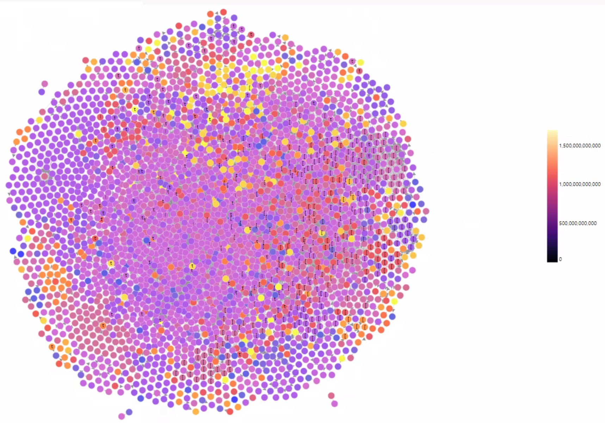
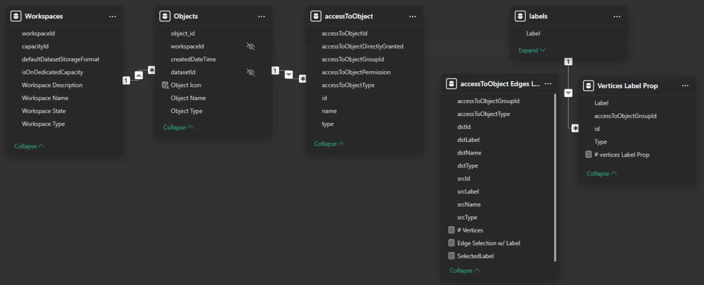
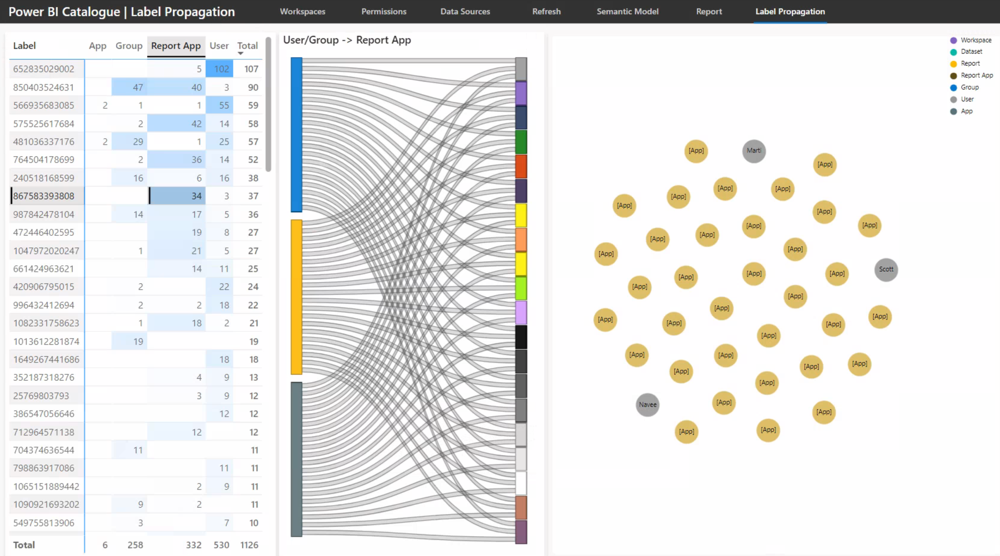
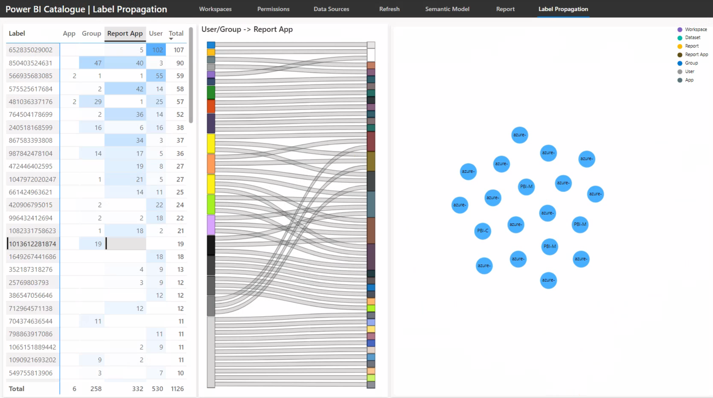
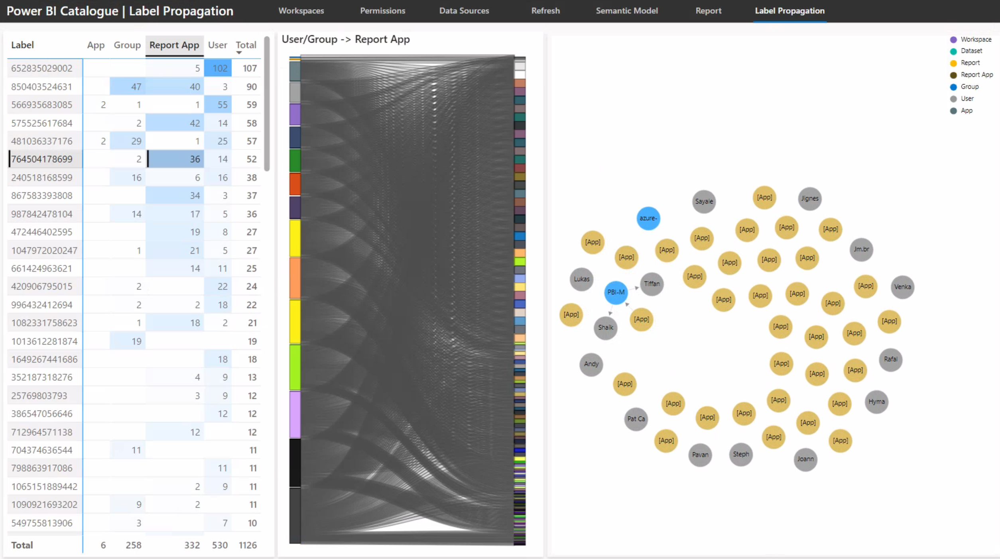
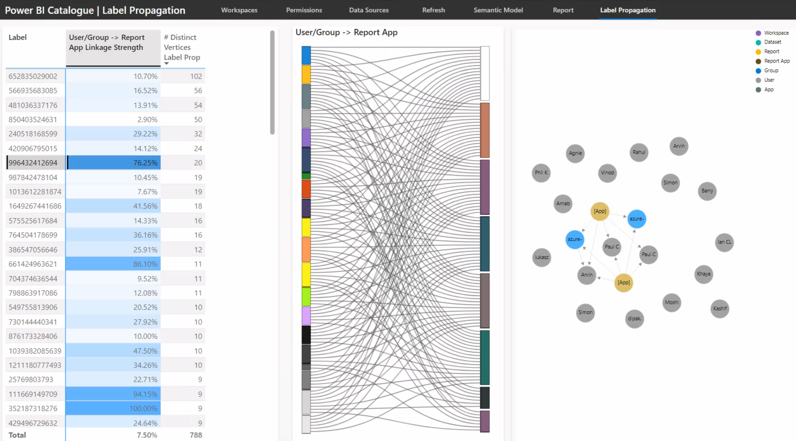

Lets start with a quick recap, from the last few blog post. 

- [Visualizing Power BI Permission Inheritance](https://evaluationcontext.github.io/posts/deneb-force-directed/) 
  - I pulled data from [Power BI Scanner APIs](https://learn.microsoft.com/en-us/fabric/governance/metadata-scanning-overview) and [Graph APIs](https://learn.microsoft.com/en-us/graph/overview?context=graph%2Fapi%2F1.0&view=graph-rest-1.0) and used [GraphFrames](https://graphframes.github.io/graphframes/docs/_site/index.html) and [Pregel](https://graphframes.github.io/graphframes/docs/_site/api/python/graphframes.lib.html) to disseminate Access Roles from Workspaces, Reports and Semantic Models directly granted to AAD groups, to all downstream members.
-  [Visualizing Power BI Permission Inheritance](https://evaluationcontext.github.io/posts/deneb-force-directed/):
   - I used this data and [Deneb](https://deneb-viz.github.io/) to draw a Force Directed Graph. 

At the end of the first post I mentioned [Label Propagation](https://graphframes.github.io/graphframes/docs/_site/user-guide.html#label-propagation-algorithm-lpa) as a potential method to group users into communities that represent personas of report consumers. So lets give that a try.

!!! info "Updates to previous posts"

    I have updated the previous posts based on some pain points. Originally I was using a union of vertices and edges, but this made juggling the filtering of vertices and edges tricky. I am now using the triplet form, where a single row represents a edge, with srcId and dstId, but also feature vertices and edge attributes.

## Label Propagation

[Label Propagation](https://en.wikipedia.org/wiki/Label_propagation_algorithm) works by assigning a distinct label to every vertex in the graph. We perform a number of supersteps. During each superstep each vertex sends it's label to all of it's neighbors (regardless of edge direction). When a destination vertex receives messages, it performs as aggregation, by accepting the highest frequency label, or if there a number of equal frequent labels, pick from those at random. At the end of all supersets all highly connected will likely share a common label and can be considered as a community.

GraphFrames has a built-in [Label Propagation Algorithm (LPA)](https://graphframes.github.io/graphframes/docs/_site/user-guide.html#label-propagation-algorithm-lpa).

```python
from graphframes.examples import Graphs
g = Graphs.friends()  # Get example graph

result = g.labelPropagation(maxIter=5)
result.select("id", "label").show()
```

In this test I want to only consider users that access Power BI Apps, that means we need to filter the vertices and edges prior to running Label Propagation. Then I'll save the triplet form so we can pull into Power BI.

!!! info 

    The code below uses functions and modules defined in [previous post](https://evaluationcontext.github.io/posts/graphframes/)
    I started by working with 10 iterations but ramped up to 100 to allow time for convergence to a static state


```python
## Filter the graph to remove workspace, Report and Dataset to focus on Report Apps
gReportApp = g.filterVertices("type = 'Group' or type = 'User' or type = 'App' or type = 'Report App'")

vlabelProp = gReportApp.labelPropagation(maxIter=100)

## create new graph with the added labels, to get the triplet representation
g2 = GraphFrame(vlabelProp, gReportApp.edges)
g2.triplets.createOrReplaceTempView("tripletsLabelProp")

accessToObjectEdgesLabelProp = spark.sql(f"""
  select
  t.src.nodeId as srcId,
  t.src.name as srcName,
  t.src.type as srcType,
  t.src.label as srcLabel,
  t.dst.nodeId as dstId,
  t.dst.name as dstName,
  t.dst.type as dstType,
  t.dst.label as dstLabel,
  coalesce(r.accessToObjectGroupId, concat(t.src.nodeID, t.src.accessRight)) as accessToObjectGroupId
  ,r.accessToObjectType
  from tripletsLabelProp as t
  left join {savePath}.accessToObject as r
      on t.src.nodeID = r.id
      and r.accessToObjectType = 'Report App' -- Only consider access to Report Apps
  """
)

WriteDfToTable(accessToObjectEdgesLabelProp, savePath, 'accessToObjectEdgesLabelProp')
```

## Power BI

## All Labels

For fun I wanted to look at the entire Graph, with vertices coloured by label. Besides being interesting to look at it brings no insights, so lets look at each label one at a time.



## Per Label

Now we have the data we can move over to Power BI and add a new table `accessToObjects Edges Label Prop` to the existing Semantic Model. Plus a disconnected `Label` dimension to support filtering, and a table `Vertices Label Prop` to help with the analysis.



```dax
Vertices Label Prop =
var src =
  SELECTCOLUMNS(
    SUMMARIZE(
      'accessToObject Edges Label Propogation'
      ,'accessToObject Edges Label Propogation'[srcId]
      ,'accessToObject Edges Label Propogation'[srcLabel]
      ,'accessToObject Edges Label Propogation'[srcType]
      ,'accessToObject Edges Label Propogation'[accessToObjectGroupId]
    )
    ,"id", 'accessToObject Edges Label Propogation'[srcId]
    ,"Label", 'accessToObject Edges Label Propogation'[srcLabel]
    ,"Type", 'accessToObject Edges Label Propogation'[srcType]
    ,"accessToObjectGroupId", 'accessToObject Edges Label Propogation'[accessToObjectGroupId]
  )
var dst =
  SELECTCOLUMNS(
    SUMMARIZE(
      'accessToObject Edges Label Propogation'
      ,'accessToObject Edges Label Propogation'[dstId]
      ,'accessToObject Edges Label Propogation'[dstLabel]
      ,'accessToObject Edges Label Propogation'[dstType]
      ,'accessToObject Edges Label Propogation'[accessToObjectGroupId]
    )
    ,"id", 'accessToObject Edges Label Propogation'[dstId]
    ,"Label", 'accessToObject Edges Label Propogation'[dstLabel]
    ,"Type", 'accessToObject Edges Label Propogation'[dstType]
    ,"accessToObjectGroupId", 'accessToObject Edges Label Propogation'[accessToObjectGroupId]
  )
var vertices =
  DISTINCT(
    FILTER(
      UNION( src, dst )
      ,not ISBLANK( [accessToObjectGroupId] )
      && [Type] <> "Report App"
    )
  )
RETURN

vertices
```

In order to use the new new `srcLabel` and `dstLable` fields we need to update the Vega spec and the measure used to filter the edges table (below). *This measure is added to the filter well of the visual and set to where value = 1*

```json
{
  "$schema": "https://vega.github.io/schema/vega/v5.json",
  "description": "By Jake Duddy: https://evaluationcontext.github.io/post/label-propogation/ based off Force Directed example by David Bacci:https://github.com/PBI-David/Deneb-Showcase/blob/main/Force%20Directed%20Graph/Spec.json",
  "padding": {
    "left": 0,
    "right": 0,
    "top": 0,
    "bottom": 0
  },
 
  "signals": [
    {"name": "xrange", "update": "[0, width]"},
    {"name": "yrange", "update": "[height, 0]"},
    {"name": "xext","update": "[0, width]"},
    {"name": "yext","update": "[height, 0]"},
    {
      "name": "down",
      "value": null,
      "on": [
        {
          "events": "mouseup,touchend",
          "update": "null"
        },
        {
          "events": "mousedown, touchstart",
          "update": "xy()"
        },
        {
          "events": "symbol:mousedown, symbol:touchstart",
          "update": "null"
        }
      ]
    },
    {
      "name": "xcur",
      "value": null,
      "on": [
        {
          "events": "mousedown, touchstart, touchend",
          "update": "xdom"
        }
      ]
    },
    {
      "name": "ycur",
      "value": null,
      "on": [
        {
          "events": "mousedown, touchstart, touchend",
          "update": "ydom"
        }
      ]
    },
    {
      "name": "delta",
      "value": [0, 0],
      "on": [
        {
          "events": [
            {
              "source": "window",
              "type": "mousemove",
              "consume": true,
              "between": [
                {"type": "mousedown"},
                {
                  "source": "window",
                  "type": "mouseup"
                }
              ]
            },
            {
              "type": "touchmove",
              "consume": true,
              "filter": "event.touches.length === 1"
            }
          ],
          "update": "down ? [down[0]-x(), y()-down[1]] : [0,0]"
        }
      ]
    },
    {
      "name": "anchor",
      "value": [0, 0],
      "on": [
        {
          "events": "wheel",
          "update": "[invert('xscale', x()), invert('yscale', y())]"
        },
        {
          "events": {
            "type": "touchstart",
            "filter": "event.touches.length===2"
          },
          "update": "[(xdom[0] + xdom[1]) / 2, (ydom[0] + ydom[1]) / 2]"
        }
      ]
    },
    {
      "name": "zoom",
      "value": 1,
      "on": [
        {
          "events": "wheel!",
          "force": true,
          "update": "pow(1.001, event.deltaY * pow(16, event.deltaMode))"
        },
        {
          "events": {"signal": "dist2"},
          "force": true,
          "update": "dist1 / dist2"
        },
        {
          "events": [
            {
              "source": "view",
              "type": "dblclick"
            }
          ],
          "update": "1"
        }
      ]
    },
    {
      "name": "dist1",
      "value": 0,
      "on": [
        {
          "events": {
            "type": "touchstart",
            "filter": "event.touches.length===2"
          },
          "update": "pinchDistance(event)"
        },
        {
          "events": {"signal": "dist2"},
          "update": "dist2"
        }
      ]
    },
    {
      "name": "dist2",
      "value": 0,
      "on": [
        {
          "events": {
            "type": "touchmove",
            "consume": true,
            "filter": "event.touches.length===2"
          },
          "update": "pinchDistance(event)"
        }
      ]
    },
    {
      "name": "xdom",
      "update": "xext",
      "on": [
        {
          "events": {"signal": "delta"},
          "update": "[xcur[0] + span(xcur) * delta[0] / width, xcur[1] + span(xcur) * delta[0] / width]"
        },
        {
          "events": {"signal": "zoom"},
          "update": "[anchor[0] + (xdom[0] - anchor[0]) * zoom, anchor[0] + (xdom[1] - anchor[0]) * zoom]"
        },
        {
          "events": [
            {
              "source": "view",
              "type": "dblclick"
            }
          ],
          "update": "xrange"
        }
      ]
    },
    {
      "name": "ydom",
      "update": "yext",
      "on": [
        {
          "events": {"signal": "delta"},
          "update": "[ycur[0] + span(ycur) * delta[1] / height, ycur[1] + span(ycur) * delta[1] / height]"
        },
        {
          "events": {"signal": "zoom"},
          "update": "[anchor[1] + (ydom[0] - anchor[1]) * zoom, anchor[1] + (ydom[1] - anchor[1]) * zoom]"
        },
        {
          "events": [
            {
              "source": "view",
              "type": "dblclick"
            }
          ],
          "update": "yrange"
        }
      ]
    },
    {
      "name": "size",
      "update": "clamp(20 / span(xdom), 1, 1000)"
    },
    {
      "name": "cx",
      "update": "width / 2",
      "on": [
        {
          "events": "[symbol:mousedown, window:mouseup] > window:mousemove",
          "update": " cx==width/2?cx+0.001:width/2"
        }
      ]
    },
    {
      "name": "cy",
      "update": "height / 2"
    },
    {
      "name": "nodeRadiusKey",
      "description": "q=increase size, a=decrease size",
      "value": 8,
      "on": [
        {
          "events": "window:keypress",
          "update": "event.key=='a'&&nodeRadiusKey>1?nodeRadiusKey-1:event.key=='q'?nodeRadiusKey+1:nodeRadiusKey"
        }
      ]
    },
    {
      "name": "nodeRadius",
      "value": 15,
      "on": [
        {
          "events": {
            "signal": "nodeRadiusKey"
          },
          "update": "nodeRadiusKey"
        }
      ]
    },
    {"name": "nodeCharge","value": 0},
    {"name": "linkDistance","value": 5
    },
    {
      "description": "State variable for active node fix status.",
      "name": "fix",
      "value": false,
      "on": [
        {
          "events": "symbol:mouseout[!event.buttons], window:mouseup",
          "update": "false"
        },
        {
          "events": "symbol:mouseover",
          "update": "fix || true",
          "force": true
        },
        {
          "events": "[symbol:mousedown, window:mouseup] > window:mousemove!",
          "update": "xy()",
          "force": true
        }
      ]
    },
    {
      "description": "Graph node most recently interacted with.",
      "name": "node",
      "value": null,
      "on": [
        {
          "events": "symbol:mouseover",
          "update": "fix === true ? datum.index : node"
        }
      ]
    },
    {
      "name": "nodeHover",
      "value": {
        "id": null,
        "connections": []
      },
      "on": [
        {
          "events": "symbol:mouseover",
          "update": "{'id':datum.index, 'connections':split(datum.sources+','+datum.targets,',')}"
        },
        {
          "events": "symbol:mouseout",
          "update": "{'id':null, 'connections':[]}"
        }
      ]
    },
    {
      "description": "Flag to restart Force simulation upon data changes.",
      "name": "restart",
      "value": false,
      "on": [
        {
          "events": {"signal": "fix"},
          "update": "fix && fix.length"
        }
      ]
    }
  ],
  "data": [
    {"name": "dataset" },
    {
      "name": "link-data",
      "source": "dataset",
      "transform": [
        {
          "type": "filter",
          "expr": "datum.srcLabel == datum.SelectedLabel && datum.dstLabel == datum.SelectedLabel"
        },
        {
          "type": "project",
          "fields": ["srcId", "srcName", "srcType", "dstId", "dstName", "dstType"],
          "as": ["source", "srcName", "srcType", "target", "dstName", "dstType"]
        }
      ]
    },
    {
      "name": "source-connections",
      "source": "link-data",
      "transform": [
        {
          "type": "aggregate",
          "groupby": ["source"],
          "ops": ["values"],
          "fields": ["source"],
          "as": ["connections"]
        },
        {
          "type": "formula",
          "as": "targets",
          "expr": "pluck(datum.connections, 'target')"
        }
      ]
    },
    {
      "name": "target-connections",
      "source": "link-data",
      "transform": [
        {
          "type": "aggregate",
          "groupby": ["target"],
          "ops": ["values"],
          "fields": ["source"],
          "as": ["connections"]
        },
        {
          "type": "formula",
          "as": "sources",
          "expr": "pluck(datum.connections, 'source')"
        }
      ]
    },
    {
      "name": "src",
      "source": "dataset",
      "transform": [
        {
          "type": "filter",
          "expr": "datum.srcLabel == datum.SelectedLabel"
        },
        {
          "type": "project",
          "fields": ["srcId", "srcName", "srcType"],
          "as": ["id", "Name", "Type"]
        }
      ]
    },
    {
      "name": "dst",
      "source": "dataset",
      "transform": [
        {
          "type": "filter",
          "expr": "datum.dstLabel == datum.SelectedLabel"
        },
        {
          "type": "project",
          "fields": ["dstId", "dstName", "dstType"],
          "as": ["id", "Name", "Type"]
        }
      ]
    },
    {
      "name": "vertices",
      "source": ["src", "dst"],
      "transform": [
        {
          "type": "aggregate",
          "groupby": ["id", "Name", "Type"]
        },
        {
          "type": "project",
          "fields": ["id", "Name", "Type"]
        }
      ]
    },
    {
      "name": "node-data",
      "source": "vertices",
      "transform": [
        {
          "type": "lookup",
          "from": "source-connections",
          "key": "source",
          "fields": ["id"],
          "values": ["targets"],
          "as": ["targets"],
          "default": [""]
        },
        {
          "type": "lookup",
          "from": "target-connections",
          "key": "target",
          "fields": ["id"],
          "values": ["sources"],
          "as": ["sources"],
          "default": [""]
        },
        {
          "type": "force",
          "iterations": 300,
          "restart": {
            "signal": "restart"
          },
          "signal": "force",
          "forces": [
            {
              "force": "center",
              "x": {"signal": "cx"},
              "y": {"signal": "cy"}
            },
            {
              "force": "collide",
              "radius": {
                "signal": "sqrt(4 * nodeRadius * nodeRadius)"
              },
              "iterations": 1,
              "strength": 0.7
            },
            {
              "force": "nbody",
              "strength": {
                "signal": "nodeCharge"
              }
            },
            {
              "force": "link",
              "links": "link-data",
              "distance": {
                "signal": "linkDistance"
              },
              "id": "id"
            }
          ]
        },
        {
          "type": "formula",
          "as": "fx",
          "expr": "fix[0]!=null && node==datum.index ?invert('xscale',fix[0]):null"
        },
        {
          "type": "formula",
          "as": "fy",
          "expr": "fix[1]!=null && node==datum.index ?invert('yscale',fix[1]):null"
        }
      ]
    }
  ],
  "scales": [
    {
      "name": "color",
      "type": "ordinal",
      "domain": ["Workspace", "Dataset", "Report", "Report App", "Group", "User", "App"],
      "range": ["#8661c5", "#01b8aa", "#FFB900", "#634e15", "#0078d4", "#999999", "#5A7378"]
    },
    {
      "name": "xscale",
      "zero": false,
      "domain": {"signal": "xdom"},
      "range": {"signal": "xrange"}
    },
    {
      "name": "yscale",
      "zero": false,
      "domain": {"signal": "ydom"},
      "range": {"signal": "yrange"}
    }
  ],
  "legends": [
    {
      "fill": "color",
      "encode": {
        "title": {
          "update": {
            "fontSize": {"value": 8}
          }
        },
        "labels": {
          "interactive": true,
          "update": {
            "fontSize": {"value": 8},
            "fill": {"value": "black"}
          }
        },
        "symbols": {
          "update": {
            "stroke": {"value": "transparent"}
          }
        },
        "legend": {
          "update": {
            "stroke": {"value": "#ccc"},
            "strokeWidth": {"value": 0}
          }
        }
      }
    }
  ],

  "marks": [
    {
      "type": "path",
      "name": "links",
      "from": {"data": "link-data"},
      "interactive": false,
      "encode": {
        "update": {
          "stroke": {
            "signal": "datum.source.index!=nodeHover.id && datum.target.index!=nodeHover.id ? '#929399':merge(hsl(scale('color', datum.source.Type)), {l:0.64})"
          },
          "strokeWidth": {
            "signal": "datum.source.index!=nodeHover.id && datum.target.index!=nodeHover.id ? 0.2:1"
          }
        }
      },
      "transform": [
        {
          "type": "linkpath",
          "require": {
            "signal": "force"
          },
          "shape": "line",
          "sourceX": {
            "expr": "scale('xscale', datum.datum.source.x)"
          },
          "sourceY": {
            "expr": "scale('yscale', datum.datum.source.y)"
          },
          "targetX": {
            "expr": "scale('xscale', datum.datum.target.x)"
          },
          "targetY": {
            "expr": "scale('yscale', datum.datum.target.y)"
          }
        },
        {
          "type": "formula",
          "expr": "atan2(datum.datum.target.y - datum.datum.source.y,datum.datum.source.x - datum.datum.target.x)",
          "as": "angle1"
        },
        {
          "type": "formula",
          "expr": "(datum.angle1>=0?datum.angle1:(2*PI + datum.angle1)) * (360 / (2*PI))",
          "as": "angle2"
        },
        {
          "type": "formula",
          "expr": "(360-datum.angle2)*(PI/180)",
          "as": "angle3"
        },
        {
          "type": "formula",
          "expr": "(cos(datum.angle3)*(nodeRadius+5))+(scale('xscale',datum.datum.target.x))",
          "as": "arrowX"
        },
        {
          "type": "formula",
          "expr": "(sin(datum.angle3)*(nodeRadius+5))+(scale('yscale',datum.datum.target.y))",
          "as": "arrowY"
        }
      ]
    },
    {
      "type": "symbol",
      "name": "arrows",
      "zindex": 1,
      "from": {"data": "links"},
      "encode": {
        "update": {
          "shape": {
            "value": "triangle"
          },
          "angle": {
            "signal": "-datum.angle2-90"
          },
          "x": {
            "signal": "datum.arrowX"
          },
          "y": {
            "signal": "datum.arrowY"
          },
          "text": {"signal": "'▲'"},
          "fill": {
            "signal": "datum.datum.source.index!=nodeHover.id && datum.datum.target.index!=nodeHover.id ? '#929399':merge(hsl(scale('color', datum.datum.source.Type)), {l:0.64})"
          },
          "size": {
            "signal": "nodeRadius==1?0:30"
          }
        }
      }
    },
    {
      "name": "nodes",
      "type": "symbol",
      "zindex": 1,
      "from": {"data": "node-data"},
      "encode": {
        "update": {
          "opacity": {"value": 1},
          "fill": {
            "signal": "nodeHover.id===datum.index || indexof(nodeHover.connections, datum.id)>-1 ?scale('color', datum.Type):merge(hsl(scale('color', datum.Type)), {l:0.64})"
          },
          "stroke": {
            "signal": "nodeHover.id===datum.index || indexof(nodeHover.connections, datum.id)>-1 ?scale('color', datum.Type):merge(hsl(scale('color', datum.Type)), {l:0.84})"
          },
          "strokeWidth": {"value": 0.5},
          "size": {"signal": "4 * nodeRadius * nodeRadius"},
          "cursor": {"value": "pointer"},
          "x": {"signal": "fix[0]!=null && node===datum.index ?fix[0]:scale('xscale', datum.x)"},
          "y": {"signal": "fix[1]!=null && node===datum.index ?fix[1]:scale('yscale', datum.y)"}
        },
        "hover": {
          "tooltip": {
            "signal": "datum.Name"
          }
        }
      }
    },
    {
      "type": "text",
      "name": "labels",
      "from": {"data": "nodes"},
      "zindex": 2,
      "interactive": false,
      "enter": {},
      "encode": {
        "update": {
          "fill": {"signal": "'black'"},
          "y": {"field": "y"},
          "x": {"field": "x"},
          "text": {
            "field": "datum.Name"
          },
          "align": {"value": "center"},
          "fontSize": {"value": 8},
          "baseline": {
            "value": "middle"
          },
          "limit": {
            "signal": "clamp(sqrt(4 * nodeRadius * nodeRadius)-5,1,1000)"
          },
          "ellipsis": {"value": " "}
        }
      }
    }
  ]
}
```

```dax
Edge Selection w/ Label =
var FilteredEdges =
  FILTER(
    'accessToObject Edges Label Propogation'
    ,'accessToObject Edges Label Propogation'[srcLabel] in VALUES( labels[Label] )
    || 'accessToObject Edges Label Propogation'[dstLabel] in VALUES( labels[Label] )
  )
RETURN

IF( COUNTROWS( FilteredEdges ) > 0, 1 )
```

The question I'm looking to answer is do the labels partition users/group into segments that have access to similar Report Apps?

I'll use `Vertices Label Prop` table to create a Sankey chart as a quick and dirty way to check this.

In this example, the user/groups have access to the same Report Apps.



But not in this cases.



When you get to a large number of Report Apps it becomes hard to interpret.



We really want to quantify how many users/groups in the partition have access to the same Report App. We can create a measure to do this. If we calculate the number of edges vs the number of users/group, per Report App, and then take an average, we can get a linkage strength.

```dax
User/Group -> Report App Linkage Strength =
var PossibleInDegree = COUNTROWS( DISTINCT( 'Vertices Label Prop'[id] ) )
var tbl =
  ADDCOLUMNS(
    VALUES( 'Vertices Label Prop'[accessToObjectGroupId] )
    ,"@Strength",
        var InDegree = CALCULATE( COUNTROWS( 'Vertices Label Prop' ) )
        return
        DIVIDE( InDegree, PossibleInDegree)
  )
return

AVERAGEX( tbl, [@Strength] )
```

```dax
# Distinct Vertices Label Prop = 
CALCULATE( 
  COUNTROWS( DISTINCT( 'Vertices Label Prop'[id] ) )
  , 'Vertices Label Prop'[Type] in {"User", "Group"} 
)
```

The largest group has low correlation. This is not to say that users can't access all of the same subset of Report App, but there are large number of Report Apps that some User/Groups within the partition can access that the other can't.


But there are some with high correlation.



In partitions with strong correlation It would be sensible to check the users in these partitions to see if they are in the same department or share some other characteristic that could be used to further define and validate the persona. These could then be represented by a single AAD group to simplify the assignment of future permissions.

## Conclusion

Realistically I’m not completely sold by this approach but with the graph already setup, Label Propagation was a quick one liner that was worth investigating.

Perhaps some kind dimensional reduction approach might work better.