I was recently inspired by the real-time data capabilities showcased in a Guy In a Cube video ([Harvesting Insights, Block by Block (Minecraft + Microsoft Fabric](https://www.youtube.com/watch?v=ZjZlmrykpc0)). In it, [Simon Nuss](https://www.linkedin.com/in/simon-nuss/) demonstrated how to stream telemetry, in real-time, from Minecraft directly into Microsoft Fabric. Looking around at my desk I saw my Garmin watch. I decided I wanted to try streaming my heart rate into Microsoft Fabric, and visualize it dynamically within Power BI.

## Architecture

Here’s the flow I designed:

- **Connecting the Source:** My Garmin watch initiates the data flow by connecting to my laptop via Bluetooth Low Energy (BLE).
- **Streaming to Azure:** A custom Python script acts as an Event Producer, capturing the heart rate data from the watch and streaming it to an [Azure Event Hub](https://learn.microsoft.com/en-us/azure/event-hubs/event-hubs-about).
- **Ingesting with Fabric:** A [Fabric Eventstream](https://learn.microsoft.com/en-us/fabric/real-time-intelligence/event-streams/overview?tabs=enhancedcapabilities) is configured to pull the continuous data stream directly from the Azure Event Hub.
- **Storing for Analysis:** The ingested data lands in a KQL database within a [Fabric Eventhouse](https://learn.microsoft.com/en-us/fabric/real-time-intelligence/eventhouse).
- **Real-Time Visualization:** A Power BI report connects to the KQL database using Direct Query mode and is set up for automatic page refresh to display the heart rate data with minimal latency.

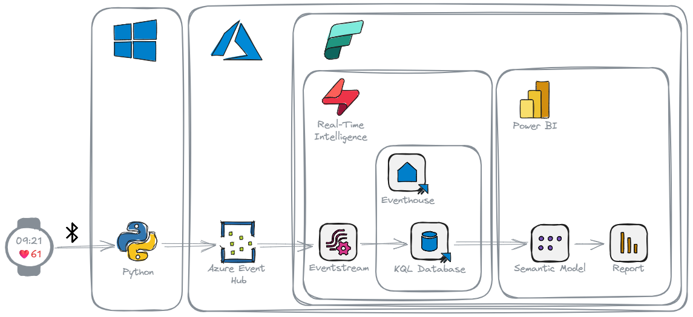

## Event Producer: From Wrist to Stream

My Garmin Forerunner watch is capable of broadcasting heart rate data using the standard Bluetooth Low Energy (BLE) Heart Rate Service. I used the `bleak` library to connect to the Garmin watch via BLE and subscribe to heart rate measurement notifications. To send this captured data to Azure, I leveraged the [Azure Event Hub Python SDK](https://learn.microsoft.com/en-us/python/api/overview/azure/event-hubs?view=azure-python). This effectively turns my laptop into an Event Hub Producer, sending heart rate readings as discrete events.

The destination for this data stream is an [Azure Event Hub](http://learn.microsoft.com/en-us/azure/event-hubs/), a highly scalable, real-time data ingestion service designed to handle millions of events per second.

```python
import asyncio
import json
import datetime
from functools import partial # For passing extra arguments to handlers

from bleak import BleakClient, BleakScanner
from bleak.backends.device import BLEDevice
from bleak.exc import BleakError # Import BleakError for more specific exception handling

# Azure Event Hubs
from azure.eventhub.aio import EventHubProducerClient
from azure.eventhub import EventData
from azure.identity.aio import AzureCliCredential

import traceback

# --- Azure Event Hub Configuration ---
EVENT_HUB_FQDN = "Garmin.servicebus.windows.net"
EVENT_HUB_NAME = "garmin"

# --- BLE Configuration ---
HR_SERVICE_UUID = "0000180d-0000-1000-8000-00805f9b34fb"
HR_MEASUREMENT_CHAR_UUID = "00002a37-0000-1000-8000-00805f9b34fb"

# --- Global Queue and Producer for Event Hubs ---
event_data_queue = asyncio.Queue(maxsize=1000) # Optional: Set a maxsize to prevent runaway memory usage
producer_client = None # Will be initialized in discover_and_connect

async def send_events_to_hub(producer: EventHubProducerClient, queue: asyncio.Queue, batch_interval_seconds=5):
    """
    Asynchronously collects events from a queue and sends them as batches to Event Hubs.
    """

    print(f"[{datetime.datetime.now()}] Starting Event Hubs sender task (batching every {batch_interval_seconds} seconds)...")
    while True:
        await asyncio.sleep(batch_interval_seconds) # Wait first, then collect. Or collect then wait.
        events_to_send = []
        try:
            # Collect all available events from the queue without blocking for new ones
            while not queue.empty():
                try:
                    event_data = queue.get_nowait()
                    events_to_send.append(event_data)
                    queue.task_done() # Notify queue that item processing is done
                except asyncio.QueueEmpty:
                    break # Should not happen if we check queue.empty() first but good practice

            if events_to_send:
                print(f"[{datetime.datetime.now()}] Attempting to send {len(events_to_send)} events to Event Hubs.")
                event_data_batch = await producer.create_batch()
                for event_idx, event in enumerate(events_to_send):
                    try:
                        event_data_batch.add(event)
                    except ValueError:
                        # Batch is full, send current batch and start a new one
                        if len(event_data_batch) > 0: # Ensure there's something to send
                            print(f"[{datetime.datetime.now()}] Batch full. Sending {len(event_data_batch)} events (chunk {event_idx // len(event_data_batch) +1}).")
                            await producer.send_batch(event_data_batch)
                        event_data_batch = await producer.create_batch()
                        event_data_batch.add(event) # Add the event that didn't fit

                if len(event_data_batch) > 0: # Send any remaining events in the last batch
                    print(f"[{datetime.datetime.now()}] Sending final batch of {len(event_data_batch)} events.")
                    await producer.send_batch(event_data_batch)
                print(f"[{datetime.datetime.now()}] Successfully sent a total of {len(events_to_send)} events to Event Hubs.")
            else:
                print(f"[{datetime.datetime.now()}] No events in queue to send.")

        except Exception as e:
            print(f"[{datetime.datetime.now()}] Error sending events to Event Hub: {e}")
            traceback.print_exc()

# Modified notification_handler to accept device_address
def notification_handler(ble_device_address: str, sender_characteristic_handle: int, data: bytearray):
    """
    Handles BLE Heart Rate Measurement notifications and puts data into a queue.
    'sender_characteristic_handle' is the handle of the characteristic sending the notification.
    'data' is the bytearray of the notification.
    'ble_device_address' is the MAC address of the BLE device.
    """
    print(f"[{datetime.datetime.now()}] NOTIFICATION HANDLER: Received data from handle {sender_characteristic_handle} on device {ble_device_address}. Data: {data.hex()}")
    flags = data[0]
    hr_format_is_uint16 = (flags & 0x01)

    hr_value_offset = 1
    heart_rate = 0

    if hr_format_is_uint16:
        if len(data) >= 3: # Ensure data is long enough
            heart_rate = int.from_bytes(data[hr_value_offset:hr_value_offset+2], byteorder='little')
            hr_value_offset += 2
        else:
            print(f"[{datetime.datetime.now()}] NOTIFICATION HANDLER: Data too short for UINT16 HR. Data: {data.hex()}")
            return # Invalid data
    else:
        if len(data) >= 2: # Ensure data is long enough
            heart_rate = data[hr_value_offset]
            hr_value_offset += 1
        else:
            print(f"[{datetime.datetime.now()}] NOTIFICATION HANDLER: Data too short for UINT8 HR. Data: {data.hex()}")
            return # Invalid data

    timestamp = datetime.datetime.now(datetime.timezone.utc).isoformat()

    hr_event_data = {
        "timestamp": timestamp,
        "heart_rate_bpm": heart_rate,
        "source": "Garmin Forerunner BLE",
        "device_address": ble_device_address
    }
    event_body_str = json.dumps(hr_event_data)
    event_data = EventData(body=event_body_str) # Pass as string to EventData

    try:
        event_data_queue.put_nowait(event_data)
        print(f"[{datetime.datetime.now()}] Queued HR: {heart_rate} bpm from {ble_device_address} at {timestamp}. Queue size: ~{event_data_queue.qsize()}")
    except asyncio.QueueFull:
        print(f"[{datetime.datetime.now()}] Event queue is full ({event_data_queue.qsize()}), dropping HR event from {ble_device_address}.")
    except Exception as e:
        print(f"[{datetime.datetime.now()}] Error queuing HR event from {ble_device_address}: {e}")

async def discover_and_connect_garmin_hr():
    print(f"[{datetime.datetime.now()}] Scanning for Garmin Heart Rate Broadcast...")
    garmin_device: BLEDevice = None

    try:
        # Increased timeout for discovery, ensure device is actively broadcasting
        devices = await BleakScanner.discover(service_uuids=[HR_SERVICE_UUID], timeout=20.0)
    except BleakError as e:
        print(f"[{datetime.datetime.now()}] BleakScanner error during discovery: {e}")
        return # Cannot proceed

    if not devices:
        print(f"[{datetime.datetime.now()}] No BLE devices found advertising the HR service UUID: {HR_SERVICE_UUID}.")
    else:
        for device in devices:
            print(f"[{datetime.datetime.now()}] Found device: {device.name} ({device.address}), RSSI: {device.rssi}, Services: {device.metadata.get('uuids', [])}")
            # Prioritize devices explicitly named "Garmin" but also consider any device broadcasting the HR service
            if "Garmin" in (device.name or ""):
                print(f"[{datetime.datetime.now()}] Found potential Garmin device by name: {device.name} ({device.address})")
                garmin_device = device
                break
            # Fallback: if no "Garmin" named device, take the first one advertising the HR service (already filtered by discover)
            if not garmin_device and HR_SERVICE_UUID in device.metadata.get('uuids', []):
                print(f"[{datetime.datetime.now()}] Found device broadcasting HR service (fallback): {device.name} ({device.address})")
                garmin_device = device

    if not garmin_device:
        print(f"[{datetime.datetime.now()}] No Garmin device or device broadcasting Heart Rate service ({HR_SERVICE_UUID}) found. Make sure your watch is actively broadcasting HR and is discoverable.")
        return

    print(f"[{datetime.datetime.now()}] Selected device: {garmin_device.name} ({garmin_device.address})")

    client = BleakClient(garmin_device.address)
    sender_task = None # Initialize sender_task
    global producer_client # Declare that we are using the global producer_client

    try:
        print(f"[{datetime.datetime.now()}] Initializing Event Hub Producer Client...")
        credential = AzureCliCredential()
        producer_client = EventHubProducerClient(
            fully_qualified_namespace=EVENT_HUB_FQDN,
            eventhub_name=EVENT_HUB_NAME,
            credential=credential
        )
        print(f"[{datetime.datetime.now()}] Event Hub Producer Client initialized for {EVENT_HUB_FQDN}/{EVENT_HUB_NAME}.")

        # Start the Event Hub sender task in the background
        sender_task = asyncio.create_task(send_events_to_hub(producer_client, event_data_queue))
        print(f"[{datetime.datetime.now()}] Event Hub sender task created.")

        print(f"[{datetime.datetime.now()}] Connecting to {garmin_device.name} ({garmin_device.address})...")
        await client.connect(timeout=20.0) # Increased connection timeout

        if not client.is_connected:
            print(f"[{datetime.datetime.now()}] Failed to connect to {garmin_device.name}.")
            return

        print(f"[{datetime.datetime.now()}] Connected to {garmin_device.name} ({garmin_device.address}). Discovering services...")

        hr_char_found = False
        for service in client.services:
            if service.uuid.lower() == HR_SERVICE_UUID.lower():
                for char in service.characteristics:
                    if char.uuid.lower() == HR_MEASUREMENT_CHAR_UUID.lower():
                        if "notify" in char.properties:
                            hr_char_found = True
                            print(f"[{datetime.datetime.now()}] Found HR Measurement characteristic ({char.uuid}) with notify property.")
                        else:
                            print(f"[{datetime.datetime.now()}] HR Measurement characteristic ({char.uuid}) found, but does NOT support notifications. Properties: {char.properties}")
                        break
                if hr_char_found:
                    break
        
        if not hr_char_found:
            print(f"[{datetime.datetime.now()}] Heart Rate Measurement characteristic ({HR_MEASUREMENT_CHAR_UUID}) not found or does not support notifications.")
            # Attempt to list all characteristics for debugging
            print(f"[{datetime.datetime.now()}] Listing all services and characteristics found on {garmin_device.name}:")
            for s in client.services:
                print(f"  Service UUID: {s.uuid}")
                for c in s.characteristics:
                    print(f"    Characteristic UUID: {c.uuid}, Properties: {c.properties}")
            return

        print(f"[{datetime.datetime.now()}] Subscribing to Heart Rate notifications ({HR_MEASUREMENT_CHAR_UUID})...")
        
        # Use functools.partial to pass the device address to the handler
        # The handler signature for start_notify is callback(sender_handle_or_char_obj, data_bytearray)
        # So, our `notification_handler` should be `def notification_handler(ble_device_address, sender_handle, data)`
        # And partial should be `partial(notification_handler, garmin_device.address)`
        # This means `garmin_device.address` will be the *first* argument to `notification_handler`.
        
        # Bleak's start_notify calls the callback with (BleakGATTCharacteristic, bytearray) or (int, bytearray)
        # So, our `notification_handler` will receive `ble_device_address` as its first arg from partial,
        # then `sender_handle` and `data` from bleak.
        handler_with_address = partial(notification_handler, garmin_device.address)
        
        await client.start_notify(HR_MEASUREMENT_CHAR_UUID, handler_with_address)

        print(f"[{datetime.datetime.now()}] Successfully subscribed to HR notifications. Receiving data and queuing for Event Hubs. Press Ctrl+C to stop.")
        while client.is_connected:
            await asyncio.sleep(1) # Keep the connection alive and allow other tasks to run
        print(f"[{datetime.datetime.now()}] Client disconnected.")

    except BleakError as e: # Catch specific Bleak errors
        print(f"[{datetime.datetime.now()}] A BLEAK error occurred: {e}")
    except asyncio.TimeoutError:
        print(f"[{datetime.datetime.now()}] Operation timed out (e.g., connection or discovery).")
    except Exception as e:
        print(f"[{datetime.datetime.now()}] An unexpected error occurred in discover_and_connect: {e}")
        import traceback
        traceback.print_exc()
    finally:
        print(f"[{datetime.datetime.now()}] Cleaning up...")
        if client and client.is_connected:
            try:
                print(f"[{datetime.datetime.now()}] Attempting to stop notifications...")
                await client.stop_notify(HR_MEASUREMENT_CHAR_UUID)
                print(f"[{datetime.datetime.now()}] Stopped notifications.")
            except Exception as e_notify:
                print(f"[{datetime.datetime.now()}] Error stopping notifications (may not have been started or char not found): {e_notify}")
            
            print(f"[{datetime.datetime.now()}] Attempting to disconnect client...")
            await client.disconnect()
            print(f"[{datetime.datetime.now()}] Disconnected from Heart Rate monitor.")
        
        if sender_task and not sender_task.done():
            print(f"[{datetime.datetime.now()}] Cancelling Event Hub sender task...")
            sender_task.cancel()
            try:
                await sender_task # Await its cancellation
            except asyncio.CancelledError:
                print(f"[{datetime.datetime.now()}] Event Hub sender task successfully cancelled.")
            except Exception as e_task_cancel: # Catch any other error during task cleanup
                print(f"[{datetime.datetime.now()}] Error during sender task cancellation: {e_task_cancel}")

        if producer_client: # Ensure producer_client was initialized
            print(f"[{datetime.datetime.now()}] Closing Event Hub Producer Client...")
            await producer_client.close()
            print(f"[{datetime.datetime.now()}] Event Hub Producer Client closed.")
        
        print(f"[{datetime.datetime.now()}] Cleanup finished.")

async def main(): # Wrap the main execution in an async function
    print(f"[{datetime.datetime.now()}] Starting Garmin HR to Azure Event Hub Streamer...")
    try:
        await discover_and_connect_garmin_hr()
    except KeyboardInterrupt:
        print(f"\n[{datetime.datetime.now()}] Exiting due to user interrupt (Ctrl+C).")
    except Exception as e: # Catch-all for fatal errors in main startup
        print(f"[{datetime.datetime.now()}] Fatal application error in main: {e}")
        traceback.print_exc()

if __name__ == "__main__":
    await main()
```

- The `bleak` library handles the Bluetooth connection and receiving notifications.
- `notification_handler` is the callback function that receives raw heart rate data bytes from the watch. It parses the data according to the BLE Heart Rate Measurement Characteristic specification.
- The parsed heart rate value, along with a timestamp and device info, is formatted into a JSON string.
- An `asyncio.Queue` (`event_data_queue`) is used to buffer the incoming heart rate events. This decouples the BLE notification handler from the Event Hub sending logic.
- The `send_events_to_hub` task runs concurrently, pulling messages from the queue and sending them to Azure Event Hub in batches, every 5 seconds.
- The `azure.identity.aio.AzureCliCredential` allows the script to authenticate using the logged-in Azure account via the [Azure CLI](https://learn.microsoft.com/en-us/cli/azure/install-azure-cli-windows?view=azure-cli-latest&pivots=winget), simplifying setup.

## Setting up Azure Event Hub

Before running the Python producer, you need an Azure Event Hub instance to receive the data. First, create an Event Hub Namespace in the Azure portal, which serves as a container for your Event Hub(s).

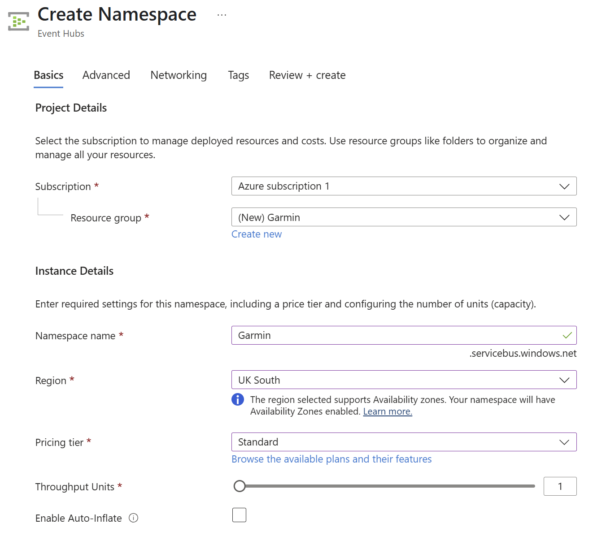

Within the namespace, create a new Event Hub.

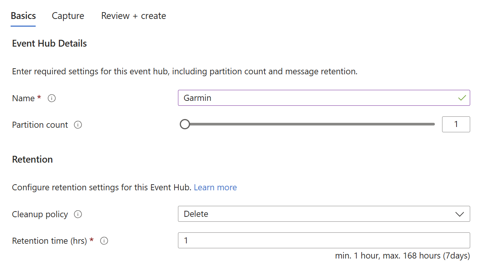

For your Python application to send data to this Event Hub, you need to grant your Azure identity (the one you logged into with Azure CLI) the necessary permissions. Assign the `Azure Event Hubs Data Sender` role to your account on the Event Hub Namespace.

## Ingesting with Fabric Real-Time Intelligence

Now we have setup the pipeline for data to flow into the Azure Event Hub, the next step is to bring it into Microsoft Fabric. The data will be stored in a KQL Database (within an [Eventhouse](https://learn.microsoft.com/en-us/fabric/real-time-intelligence/eventhouse)), passing through a [Eventstream](https://learn.microsoft.com/en-us/fabric/real-time-intelligence/event-streams/overview?tabs=enhancedcapabilities).

I started by putting my watch into heart rate broadcast mode and running the Python Event Producer script. This ensures there's a live data stream flowing into the Event Hub, which helps Fabric Eventstream to infer a schema.

The process within Fabric involves:

- **Creating a Fabric workspace:** A container space for Fabric items.
- **Creating an Eventhouse:** This is where the container for the KQL database.
- **Creating an Eventstream:** This is Fabric's feature for ingesting, transforming, and routing real-time data streams.
  - **Add Azure Event Hub as a Source:** Configure the Eventstream to connect to your Azure Event Hub.
    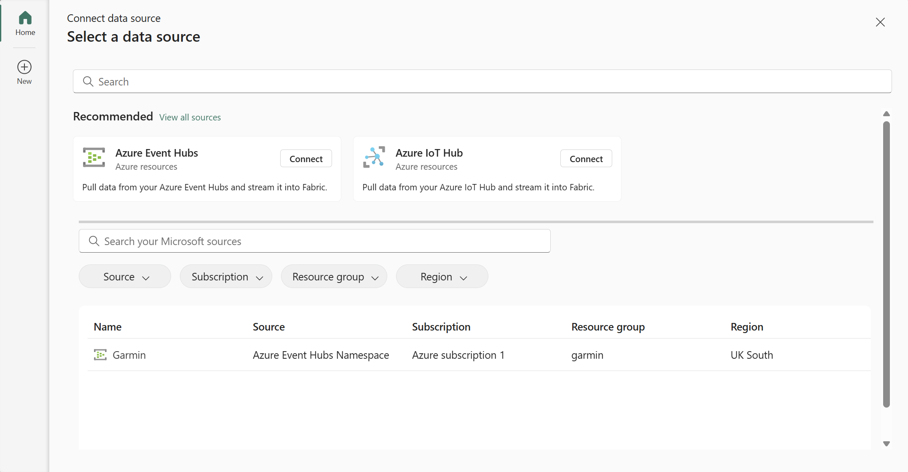
    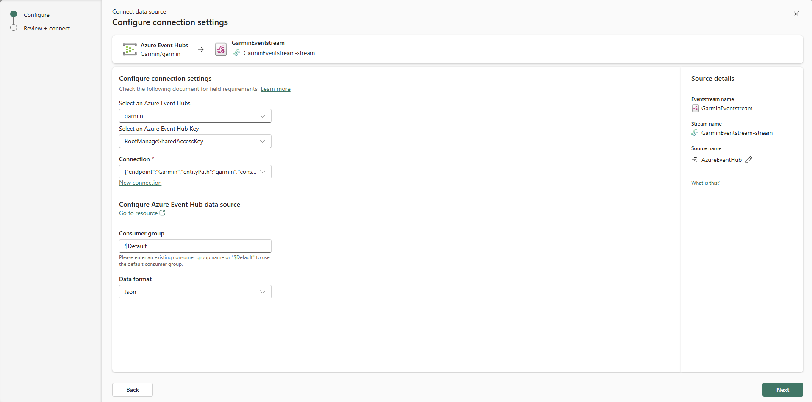
  - **Add Eventhouse KQL Database as a Destination:** Configure the Eventstream to route the ingested data to the KQL database.
    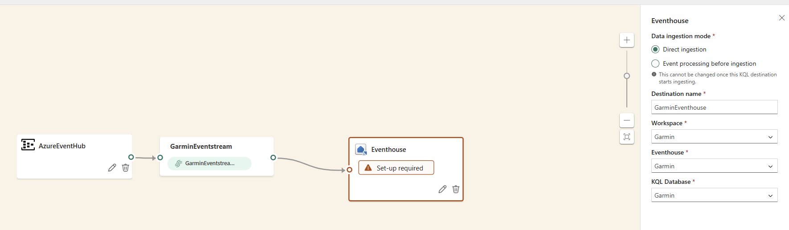
  - **Publish the Eventstream:** Activate the Eventstream to start the data ingestion process.
- **Create Eventhouse table** 
    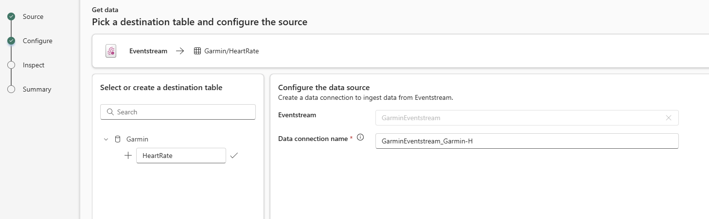
    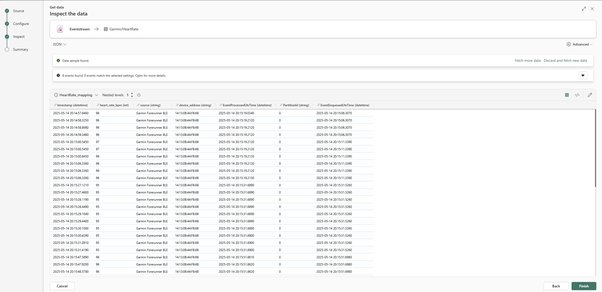
- **Verify Data Ingestion:** Check the KQL database to ensure data is flowing in as expected with a simple KQL query.
  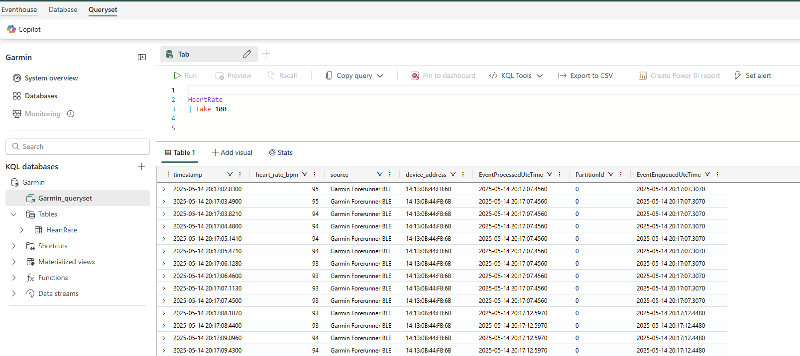

## Visualizing Real-Time Data in Power BI

With the heart rate data now stored and queryable in the KQL database within Fabric, the final step is visualization. To achieve a "real-time" dashboard experience in Power BI, we can connect to the KQL database using a DirectQuery connection. To make the report feel live, we can configure the Power BI page to refresh automatically at a set interval, such as every second.

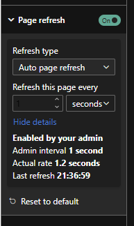

We can then create simple Linechart and watch the dataflow in.

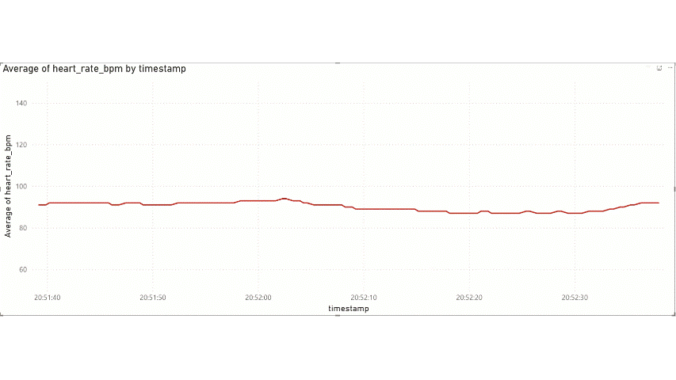

*Note: As mentioned in the Python script section, the data is batched and sent to Event Hubs every 5 seconds. This means the updates in Power BI won't be instantaneous per individual beat but will refresh with the latest batch of data every 5 seconds, resulting in slightly jumpy updates on the graph.*

## Real-Time Dashboard

Fabric also offers native Real-Time Dashboards, which provide another way to visualize data directly from a KQL database. Creating visuals here was straightforward, by defining a KQL query for each visual element.

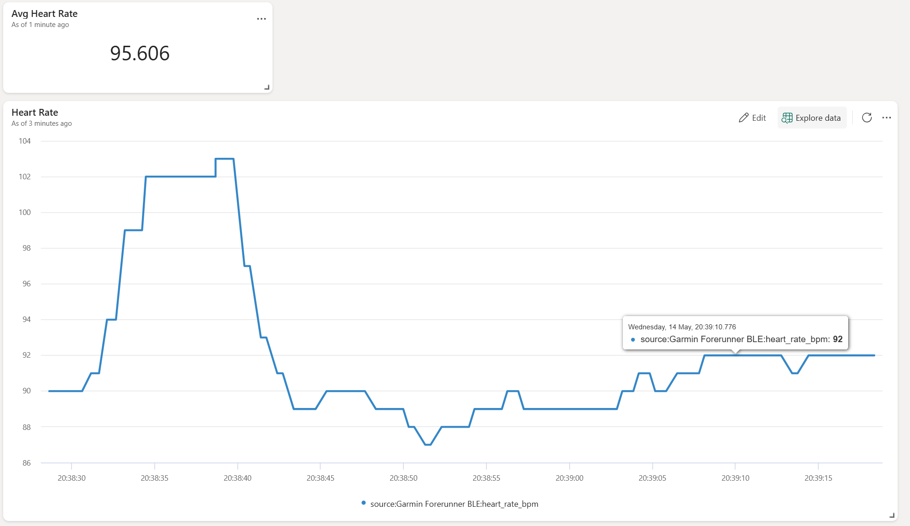

This provides an alternative, often lower-latency, visualization experience compared to Power BI for scenarios requiring highly dynamic updates.

## Conclusion

Setting up this end-to-end pipeline to stream real-time heart rate data from a Garmin watch to Power BI via Microsoft Fabric was a surprisingly straightforward process. While bringing a project like this to production would involve considerations around scalability, monitoring, and more sophisticated data transformation within Fabric, this exercise provided a fantastic hands-on introduction to Fabric's real-time intelligence capabilities. 

PS. After finishing this project I found a another Guy in a Cube Video ([Creating your first EVENTSTREAM in Microsoft Fabric](https://www.youtube.com/watch?v=SyRDll6OvX0)) which does a good job of visually going through this process.