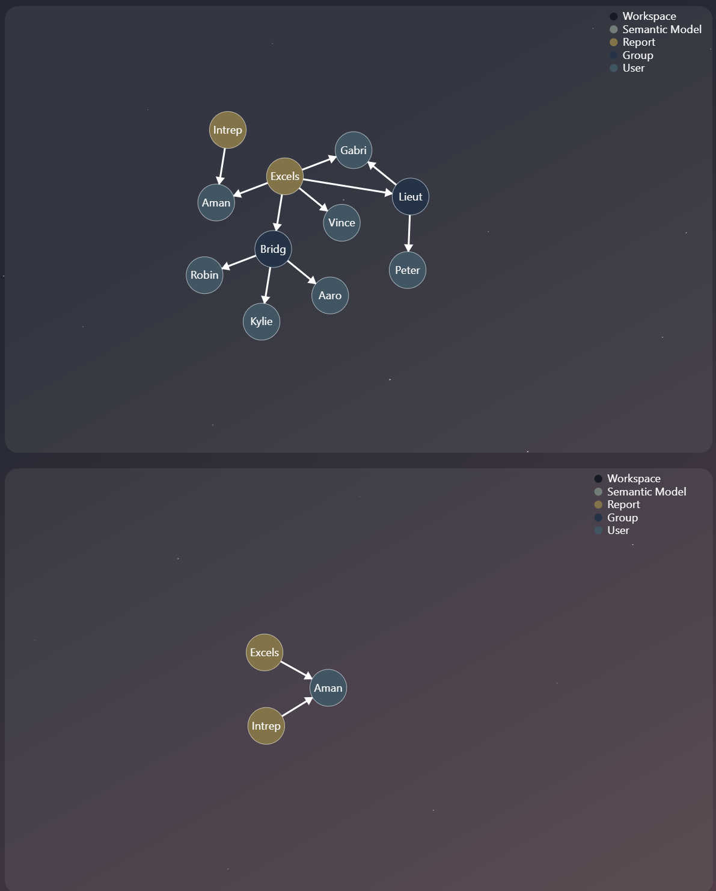
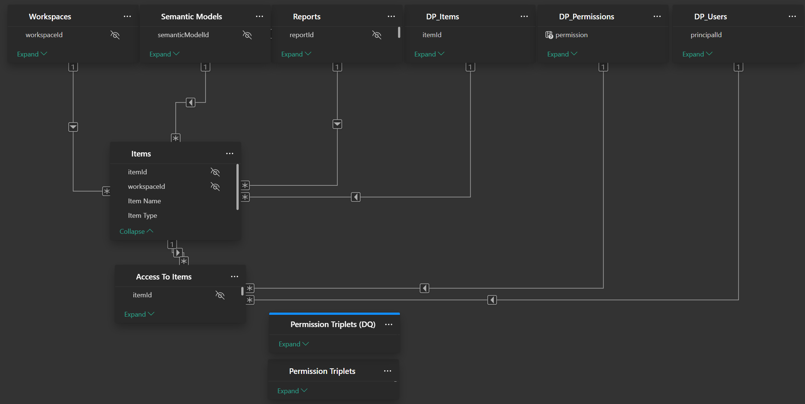
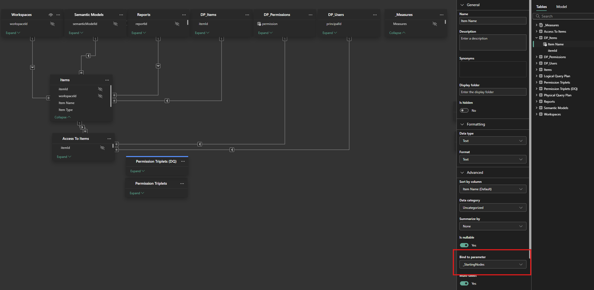
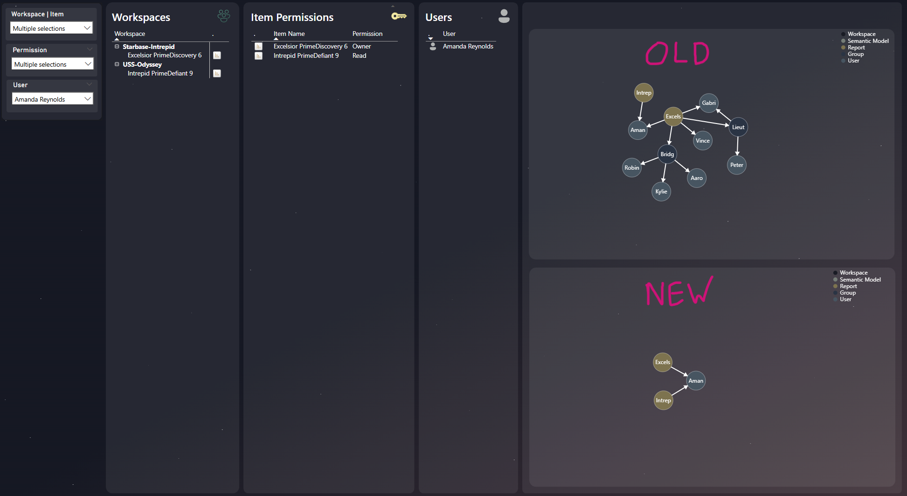

In a couple of previous posts, I detailed how to get permission data into a graph structure with [Graphframes](https://evaluationcontext.github.io/posts/graphframes/) and visualize it in Power BI using a [force-directed Deneb visual](https://evaluationcontext.github.io/posts/deneb-force-directed/). This approach is great for understanding permission inheritance from the perspective of Fabric Items, but it has a significant drawback when you try to view the graph in reverse, from the User's perspective.

This post introduces a better way. By swapping the VertiPaq engine for a [Fabric Kusto database](https://learn.microsoft.com/en-us/kusto/query/schema-entities/databases?view=microsoft-fabric), we can leverage its native graph processing capabilities to solve the subgraph filtering problem.

## The Problem: Why VertiPaq Falls Short

My original approach has a limitation! Filtering to sub-graph relies on pre-baked grouping of paths, represented by a field with item-permission grouping. This works perfectly when you filter by a permission or item.

But what if you want to filter by a user and see all the items they can access? Because the VertiPaq engine lacks native recursion, it can't traverse the graph "backwards" or discover multi-step paths on the fly. The result is a cluttered visual, polluted with irrelevant user groups that don't directly answer the user's question. You can see below, if I filter to a specific user, in the old solution (top), it is littered with irrelevant groups and users, what we want in the bottom visual, providing a clean and clear answer.



You could try to solve this by calculating even more pre-baked paths, but that just adds complexity and bloats the model. 

But there has to be a better way... maybe another engine... in Fabric... with built in graph processing... with motif-matching.... Kusto Database?!

## The Solution: The Right Engine for the Job

Instead of importing data into VertiPaq, we can use a Kusto Database in Direct Query mode. This approach lets us leverage a engine designed for graph processing.

By connecting Power BI to Kusto, we can use [dynamic M parameters](https://learn.microsoft.com/en-us/power-bi/connect-data/desktop-dynamic-m-query-parameters) to pass user selections from our report directly into a KQL query. This query filters the graph on the server side and sends only the small, relevant subgraph back to Power BI for visualization.

### Kusto's Graph Semantics in Action

Kusto is the blazing-fast analytics engine behind [Azure Data Explore](https://learn.microsoft.com/en-us/azure/data-explorer/data-explorer-overview) and [Fabric's Real-Time Intelligence](https://learn.microsoft.com/en-us/fabric/real-time-intelligence/eventhouse). Crucially for us, it offers built-in [graph semantics](https://learn.microsoft.com/en-us/kusto/query/graph-semantics-overview?view=microsoft-fabric), including operators for creating and matching patterns within a graph.

First, I loaded the same triplet-form permission data from my previous post into a Kusto database (see below). 

| accessToItemGroupId          | srcId        | srcType   | srcName           | dstId     | dstType | dstName             |
|------------------------------|--------------|-----------|-------------------|-----------|---------|---------------------|
| ATG-WKS-5b6962ef-Contributor | WKS-5b6962ef | Workspace | USS-Odyssey       | UG-D5CE28 | Group   | Medical Officer     |
| ATG-WKS-5b6962ef-Contributor | WKS-5b6962ef | Workspace | USS-Odyssey       | UG-2C73C1 | Group   | Commander           |
| ATG-WKS-5b6962ef-Admin       | WKS-5b6962ef | Workspace | USS-Odyssey       | UG-5A5753 | Group   | Security Officer    |
| ATG-WKS-5b6962ef-Viewer      | WKS-5b6962ef | Workspace | USS-Odyssey       | SF-4E1026 | User    | Aaron Gonzalez      |
| ATG-WKS-5b6962ef-Viewer      | WKS-5b6962ef | Workspace | USS-Odyssey       | SF-6FD6FF | User    | Kylie Coleman       |
| ATG-WKS-5b6962ef-Member      | WKS-5b6962ef | Workspace | USS-Odyssey       | SF-6D835A | User    | Tyler Miles         |
| ATG-WKS-d6a39ae5-Viewer      | WKS-d6a39ae5 | Workspace | Starbase-Intrepid | UG-756300 | Group   | Engineering Officer |
| ATG-WKS-d6a39ae5-Admin       | WKS-d6a39ae5 | Workspace | Starbase-Intrepid | SF-500B65 | User    | Robin Jones         |
| ATG-WKS-a8083ba1-Contributor | WKS-a8083ba1 | Workspace | USS-Odyssey       | UG-5A5753 | Group   | Security Officer    |
| ATG-WKS-a8083ba1-Viewer      | WKS-a8083ba1 | Workspace | USS-Odyssey       | SF-FEE711 | User    | Amanda Reynolds     |
| ... | ... | ... | ... | ... | ... | ... |

Then, I crafted a single KQL query to do all the work.

The core of this query is the `make-graph` operator, which builds a graph in memory, and the `graph-match` operator, which performs motif matching. Motif matching is a powerful technique for finding specific structural patterns. For example, finding all paths that start at a specific item, pass through a user group, and end at a particular user.

My KQL query is designed to find all paths that satisfy these criteria:

- Starts with a node from a user-selected list (`_StartingNodes`)
- Ends with a node from another user-selected list (`_EndingNodes`)
- Follows a path between 1 and 5 steps long
- Obeys the direction of the relationship (e.g., Item -> Group -> User)

This query takes the user's input and returns a perfectly trimmed table containing only the relevant edges for the visualization, in the triplet form the Deneb visual expects.

=== "Code"

    ```kql
    // Parameters passed via dynamic M parameter
    let _StartingNodes = dynamic(['Excelsior ZetaExcelsior 1']);
    let _EndingNodes = dynamic(['Vincent Bates"']);
    let _Permissions = dynamic(['Read', 'ReadWrite']);
    // Triplet to Vertices and Edges
    let data = permissions | extend permission = tostring(split(accessToItemGroupId, '-')[-1]);
    let nodes = 
        union
            (data | distinct srcId, srcType, srcName | project Id = srcId, Type = srcType, Name = srcName),
            (data | distinct dstId, dstType, dstName | project Id = dstId, Type = dstType, Name = dstName)
        | distinct Id, Type, Name;
    // Filter edges by Permission    
    let edges = data | distinct source = srcId, destination = dstId, permission
    | where isempty(_Permissions) or permission in (_Permissions);
    // Generate Graph
    edges
    | make-graph source --> destination with nodes on Id
    // Motif-matching and filtering by Starting and Ending Node
    | graph-match (start_node)-[path_edge*1..5]->(end_node)
    where
        (isempty(_StartingNodes) or start_node.Name in (_StartingNodes))
        and (isempty(_EndingNodes) or end_node.Name in (_EndingNodes))
    project
        srcId = start_node.Id,
        srcName = start_node.Name,
        srcType = start_node.Type,
        dstId = end_node.Id,
        dstName = end_node.Name,
        dstType = end_node.Type,
        Path = path_edge
    // Unpack nested structure to individual rows
    | mv-expand Path
    // Edges to triplet
    | project
        srcId = tostring(Path.source),
        dstId = tostring(Path.destination),
        permission = tostring(Path.permission)
    | distinct 
        srcId,
        dstId,
        permission
    | join kind=inner nodes on
        $left.srcId == $right.Id
    | project 
        srcId, 
        srcType = Type, 
        srcName = Name, 
        dstId,
        permission
    | join kind=inner nodes on
        $left.dstId == $right.Id
    | project 
        srcId,
        srcName,
        srcType, 
        dstId, 
        dstType = Type, 
        dstName = Name,
        permission
    ```

=== "Output"

    | srcId        | srcName                   | srcType | dstId     | dstType | dstName       | permission |
    |--------------|---------------------------|---------|-----------|---------|---------------|------------|
    | REP-d3dbd2d3 | Excelsior ZetaExcelsior 1 | Report  | UG-2C73C1 | Group   | Commander     | ReadWrite  |
    | REP-d3dbd2d3 | Excelsior ZetaExcelsior 1 | Report  | SF-D1D5EF | User    | Vincent Bates | Read       |
    | UG-2C73C1    | Commander                 | Group   | SF-D1D5EF | User    | Vincent Bates | Read       |
    | UG-2C73C1    | Commander                 | Group   | SF-D1D5EF | User    | Vincent Bates | ReadWrite  |

### Wiring It Up in Power BI

With the KQL query ready, the setup in Power BI is straightforward. I only required minimal changes to the Semantic Model to make this all work.



Here's the process:

- **Create M Parameters:** In Power Query, create three text parameters: `_StartingNodes`, `_EndingNodes`, and `_Permissions`
- **Create Parameter Tables:** Create three separate tables (`DP_items`, `DP_Permissions`, `DP_Users`). These will populate our slicers. *I found that I needed to create separate table for the dynamic M parameter, otherwise I got some errors.*
- **Set Up the Direct Query Source:** Create a new query using the AzureDataExplorer.Contents connector, using the KQL script from above.
- **Bind Parameters:** In the Power BI data model view, select each disconnected table and bind its data column to the corresponding M parameter you created in step 1

To setup the power query code for dynamic M parameter I followed the helpful guide from [Chris Webb](https://www.linkedin.com/in/chriswebb6/) on [arbitrary dynamic M parameters ](https://blog.crossjoin.co.uk/2023/01/29/passing-any-arbitrary-value-from-a-power-bi-report-to-a-dynamic-m-parameter/) and the [MS Docs](https://learn.microsoft.com/en-us/power-bi/connect-data/desktop-dynamic-m-query-parameters) on the feature. Of note, some processing is required to convert lists from Power BI to strings that can be incorporated into the query.

```fsharp
let
    StartingNodes = 
        if Type.Is(Value.Type(_StartingNodes), List.Type)
        then Text.Combine({"'", Text.Combine(_StartingNodes, "','"), "'"})
        else Text.Combine({"'", _StartingNodes, "'"}),
    endingNodes = 
        if Type.Is(Value.Type(_EndingNodes), List.Type)
        then Text.Combine({"'", Text.Combine(_EndingNodes, "','"), "'"})
        else Text.Combine({"'", _EndingNodes, "'"}),
    permissions =
        if Type.Is(Value.Type(_Permissions), List.Type)
        then Text.Combine({"'", Text.Combine(_Permissions, "','"), "'"})
        else Text.Combine({"'", _Permissions, "'"}),
    Source = AzureDataExplorer.Contents(
        "https://trd-y4vwg29chydm6jmuga.z0.kusto.fabric.microsoft.com", 
        "Graph", 
        "let _StartingNodes = dynamic([" & StartingNodes & "]); //dynamic(['Excelsior ZetaExcelsior 1']);
        let _EndingNodes = dynamic([" & endingNodes & "]); //dynamic(['Vincent Bates']);
        let _Permissions = dynamic([" & permissions & "]); //dynamic(['Read', 'ReadWrite']);
        let data = permissions | extend permission = tostring(split(accessToItemGroupId, '-')[-1]);
        let nodes = 
            union
                (data | distinct srcId, srcType, srcName | project Id = srcId, Type = srcType, Name = srcName),
                (data | distinct dstId, dstType, dstName | project Id = dstId, Type = dstType, Name = dstName)
            | distinct Id, Type, Name;
        let edges = data | distinct source = srcId, destination = dstId, permission
        | where isempty(_Permissions) or permission in (_Permissions);
        edges
        | make-graph source --> destination with nodes on Id
        | graph-match (start_node)-[path_edge*1..5]->(end_node)
        where
            (isempty(_StartingNodes) or start_node.Name in (_StartingNodes))
            and (isempty(_EndingNodes) or end_node.Name in (_EndingNodes))
        project
            srcId = start_node.Id,
            srcName = start_node.Name,
            srcType = start_node.Type,
            dstId = end_node.Id,
            dstName = end_node.Name,
            dstType = end_node.Type,
            Path = path_edge
        | mv-expand Path
        | project
            srcId = tostring(Path.source),
            dstId = tostring(Path.destination),
            permission = tostring(Path.permission)
        | distinct 
            srcId,
            dstId,
            permission
        | join kind=inner nodes on
            $left.srcId == $right.Id
        | project 
            srcId, 
            srcType = Type, 
            srcName = Name, 
            dstId,
            permission
        | join kind=inner nodes on
            $left.dstId == $right.Id
        | project 
            srcId,
            srcName,
            srcType, 
            dstId, 
            dstType = Type, 
            dstName = Name,
            permission 
        ", 
        [MaxRows=null, MaxSize=null, NoTruncate=null, AdditionalSetStatements=null]
    )
in
    Source
```

The parameters can easily to bound to fields in model view.



That's it! No changes are needed to the Deneb visual specification. We just swap the fields from the old import-mode table with the fields from our new `Permission Triplets (DQ)` table. The result is a clean, focused graph showing only the nodes and edges that matter.



## Conclusion

By offloading the graph traversal logic to Kusto, we achieve three key benefits:

- **Performance**: Kusto is purpose-built for this kind of query and returns results incredibly quickly
- **Scalability**: The Power BI model remains lightweight and responsive, as the full graph dataset is never imported
- **Clarity**: Users get immediate, uncluttered answers to their questions, free from the visual noise of the old approach

While this solution is powerful, the graph is transient, and is rebuilt in memory for each query. In the future, it would be interesting to explore a persistent graph solution using a dedicated graph database, like [Cosmos DB](https://azure.microsoft.com/en-gb/products/cosmos-db), which was recently announced to be coming to Fabric. But for now, using Kusto as a graph engine is a massive leap forward for interactive graph analysis in Power BI.