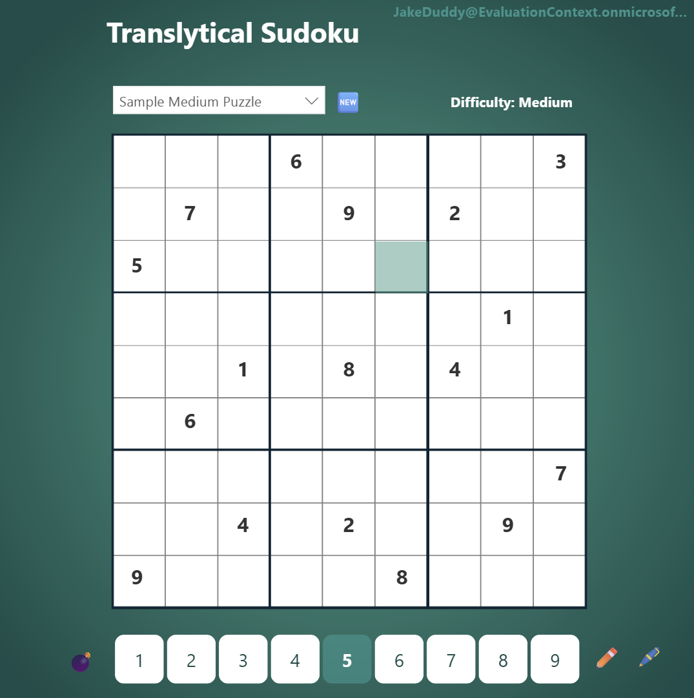
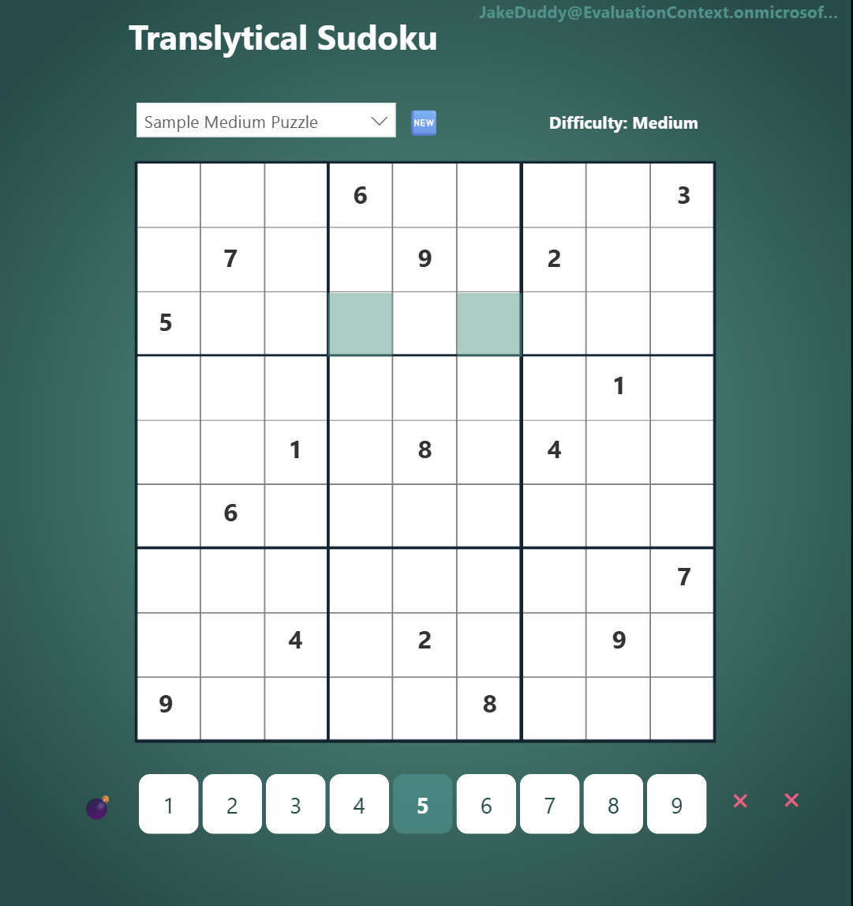
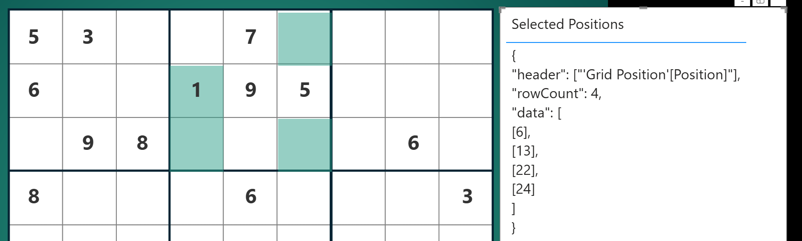
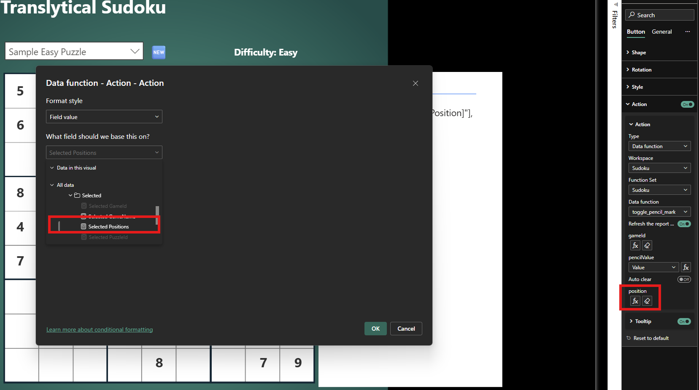

In a previous post I explored using [Translytical Task Flows](https://learn.microsoft.com/en-us/power-bi/create-reports/translytical-task-flow-overview) to create [Sudoku in Power BI](https://evaluationcontext.github.io/posts/sudoku/). One potential improvement I mentioned was the ability for players to enter "pencil marks" into multiple cells simultaneously. This seemingly simple enhancement presents a technical challenge: how do we pass multiple row selections into a User-Defined Function (UDF) at the same time?

This post dives into the solution, demonstrating how to leverage the seldomly used DAX function, `#!dax TOJSON()`, to achieve this multi-row input capability.

## Translytical Task Flows in Power BI

Before we delve into the solution, let's briefly revisit the basics of Translytical Task Flows in Power BI, as highlighted previously:

!!! quote "Translytical Sudoku"

    Translytical Task Flows, while still in preview, are a game-changer for Power BI users. To enable them, you'll need to go to **Options > Preview features > Translytical Task Flows** in Power BI Desktop.

    At their core, they allow buttons within your Power BI reports to trigger [Fabric User Data Functions (UDF)](https://learn.microsoft.com/en-us/fabric/data-engineering/user-data-functions/user-data-functions-overview). UDFs are python function that can perform an action such as initiate changes in a Fabric SQL database. Within the button definition you [map](https://learn.microsoft.com/en-us/power-bi/create-reports/translytical-task-flow-button#configure-inputs-for-function-parameters) a button, list, or text slicer; a data field; or measures from the report to the input parameters of the UDF.
    
    -- <cite>[Evaluation Context - Translytical Sudoku](https://evaluationcontext.github.io/posts/sudoku/)</cite>

## The Challenge: Handling Multiple Selections

The existing `#!py toggle_pencil_mark()` function, which handles player input, currently maps the GameId from a measure `#!dax Selected GameId = SELECTEDVALUE( GameState[GameId] )`, and the selected grid position and input value from two separate button slicers. This setup works perfectly for entering a single value into a single cell.


When a player selects just one cell in the Sudoku grid via a button slicer, all of our action buttons remain active, as expected:



However, the problem arises when a player attempts to select two or more cells simultaneously. The "pencil" button, designed for single-cell input, becomes inactive:



The cause of this limitation is that Power BI can only pass a single value to the UDF. To enable multi-cell input, we need a method to generate a single string that encapsulates information about multiple selected positions. For those familiar with REST APIs, calling the UDF in this context is analogous to a `POST` request, where the JSON format is the preferred payload.

## The Solution: TOJSON()

Fortunately, DAX provides a perfect solution: the built-in `#!dax TOJSON()` function. This function is generates a JSON string from a given table.

A crucial consideration is to incorporate error handling for scenarios where the grid might not be filtered, potentially leading to all cells being selected. Let's create the DAX measure with this in mind:

```dax
Selected Positions = 
IF(
    ISFILTERED( 'Grid Position'[Position] ),
    TOJSON( VALUES( 'Grid Position'[Position] ) )
)
```

This provides the following output:



With our DAX measure ready, the next step is to adapt our Python UDF to correctly parse and process this new JSON input.

## Updating the UDF

Previously, our UDF expected an integer for the `position` variable. Now that we're sending a JSON string, we need to make the following adjustments:

- **Variable Type Change:** Modify the `position` variable from `int` to `str`
- **JSON String to Python Dictionary:** Convert the JSON string to a python dictionary with `#!py json.loads()`
- **Iterate and Process:** Loop through each position extracted from the JSON and call the stored procedure for each individual position to write the selected value

```python
import fabric.functions as fn
import json
from datetime import datetime

udf = fn.UserDataFunctions()
    
@udf.connection(argName="sqlDB", alias="Game")
@udf.function()
def toggle_pencil_mark(sqlDB: fn.FabricSqlConnection, gameId: int, position: str, pencilValue: int) -> str:
    """
    Toggle a pencil mark in a Sudoku cell
    
    Args:
        gameId: The game ID
        position: JSON string with cell positions
        pencilValue: Pencil mark value (1-9)
        
    Returns:
        JSON string with operation result
    """
    try:
        # Parse the JSON string to get positions
        positions_data = json.loads(position)
        positions = [pos[0] for pos in positions_data["data"]]
        
        # Validate pencil value
        if not (1 <= pencilValue <= 9):
            return json.dumps({
                "status": "ERROR",
                "message": "Invalid pencil value. Value must be 1-9.",
                "action_time": datetime.now().isoformat()
            })
        
        conn = sqlDB.connect()
        cursor = conn.cursor()
        
        processed_positions = []
        filled_cells = []
        last_action_type = None
        last_is_active = False
        
        for pos in positions:
            # Validate position
            if not (1 <= pos <= 81):
                continue  # Skip invalid positions
            
            # Check if cell has a value (cannot add pencil marks)
            cursor.execute("""
                SELECT CurrentValue FROM GameState 
                WHERE GameId = ? AND Position = ?
            """, (gameId, pos))
            
            result = cursor.fetchone()
            if result and result[0] is not None:
                filled_cells.append(pos)
                continue  # Skip filled cells but continue with others
            
            # Execute the stored procedure
            cursor.execute("EXEC sp_TogglePencilMark ?, ?, ?", 
                          (gameId, pos, pencilValue))
            
            conn.commit()
            
            # Check if pencil mark was added or removed
            cursor.execute("""
                SELECT IsActive FROM PencilMarks 
                WHERE GameId = ? AND Position = ? AND PencilValue = ?
            """, (gameId, pos, pencilValue))
            
            pencil_result = cursor.fetchone()
            is_active = pencil_result[0] if pencil_result else False
            last_action_type = "added" if is_active else "removed"
            last_is_active = is_active
            
            processed_positions.append(pos)
        
        # Prepare response message
        if not processed_positions and filled_cells:
            return json.dumps({
                "status": "ERROR",
                "message": f"Cannot add pencil marks to filled cells at positions: {filled_cells}",
                "action_time": datetime.now().isoformat()
            })
        elif not processed_positions:
            return json.dumps({
                "status": "ERROR",
                "message": "No valid positions to process",
                "action_time": datetime.now().isoformat()
            })
        
        # Build success message
        message = f"Pencil mark {pencilValue} {last_action_type} at position(s) {processed_positions}"
        if filled_cells:
            message += f". Skipped filled cells at positions: {filled_cells}"
        
        return json.dumps({
            "status": "SUCCESS",
            "message": message,
            "game_id": gameId,
            "positions_processed": processed_positions,
            "positions_skipped": filled_cells,
            "pencil_value": pencilValue,
            "is_active": last_is_active,
            "action_type": last_action_type,
            "action_time": datetime.now().isoformat()
        })
        
    except json.JSONDecodeError:
        return json.dumps({
            "status": "ERROR",
            "message": "Invalid JSON format for position parameter",
            "action_time": datetime.now().isoformat()
        })
    except Exception as e:
        return json.dumps({
            "status": "ERROR",
            "message": f"Database error: {str(e)}",
            "action_time": datetime.now().isoformat()
        })
    finally:
        if 'cursor' in locals():
            cursor.close()
        if 'conn' in locals():
            conn.close()
```

Once these changes are published to your Fabric workspace, we can update the mapping in the Power BI report. Instead of mapping the single position, we now map our new `Selected Positions` measure to the UDF's `position` parameter.



And with that, we can now see it in action, allowing players to enter pencil marks into multiple cells simultaneously.


## Conclusion

By combining DAX's `#!dax TOJSON()` function with a refined UDF, we can successfully pass multiple row selections using Translytical Task Flows. This capability significantly enhances the interactivity and user experience of our Sudoku game, allowing for more intuitive and efficient gameplay, and of course for more meaningful reporting solutions.