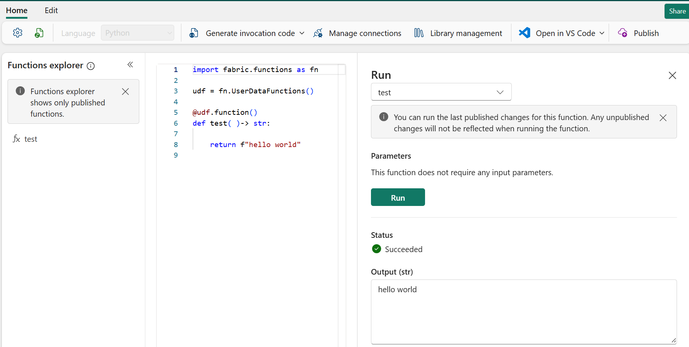
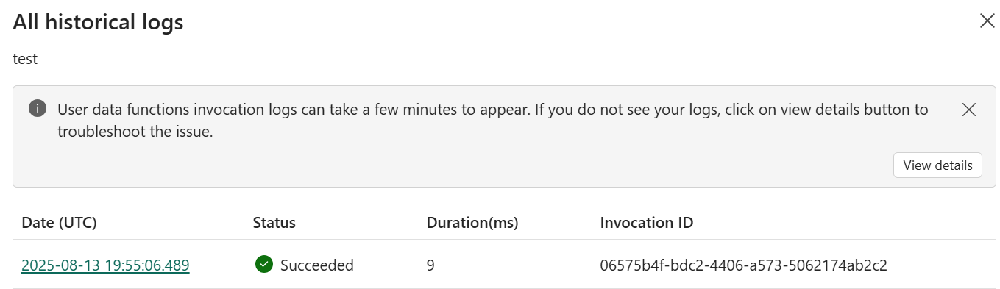
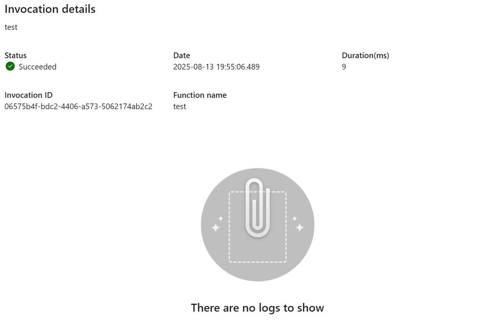
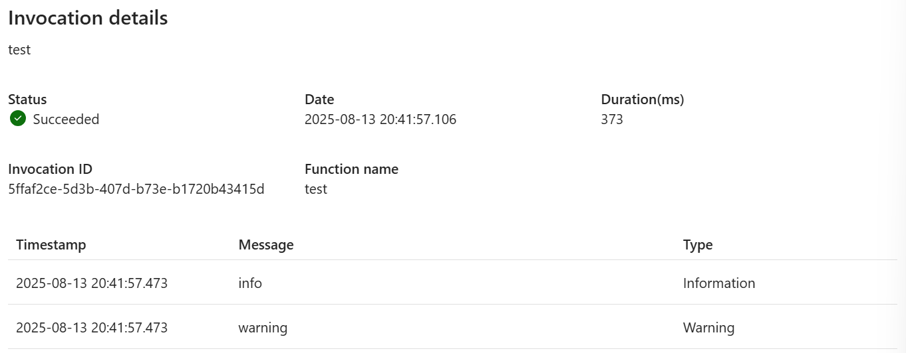
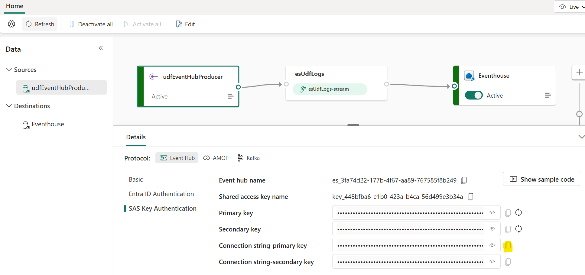
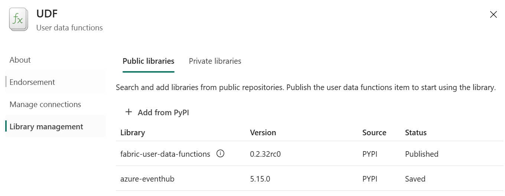
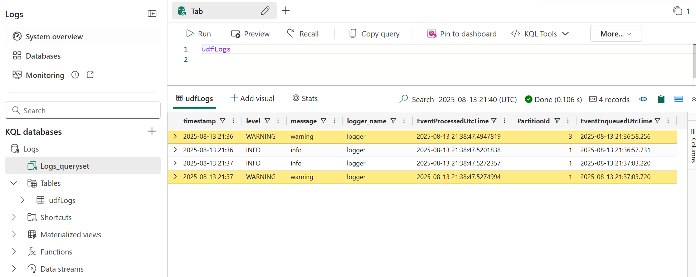

[Fabric User Data Functions (UDFs)](https://learn.microsoft.com/en-us/fabric/data-engineering/user-data-functions/user-data-functions-overview) are a great way to create reusable and encapsulated logic. While Fabric provides basic invocation logs, they often lack the detail needed for proper debugging and monitoring. This post will show you how to enhance your UDFs with detailed logging by sending them to a Fabric Eventstream and a KQL database which can support advanced analysis and alerting.

## Basic UDF Logging

Before we dive into advanced logging, let's understand the built-in capabilities.

!!! tip "Preview Feature"
    
    You will need to enable `User Data functions (preview)` in the Fabric Admin portal

First lets create a simple UDF. Publish and refresh it to make it available.

```py
import fabric.functions as fn

udf = fn.UserDataFunctions()

@udf.function()
def test( )-> str:

    return f"hello world"
```

You can test the UDF by hovering over its name in the Function explorer pane and clicking the `▷` button. This will open a `Run` pane where we can select `run` to test the function. The function will run and return "hello world".



To see the invocation log, click `...` from the **Function explorer** pane and select `View historical log`.

!!! tip

    UDF invocation logs can take a few minutes to appear

We are able to see the successful run:



If we click on the date we can see the message "There are no logs to show".



This highlights the limitation of basic UDF logging, which only records success or failure without capturing internal details.

## Enhancing UDFs with Detailed Python Logging

To get more insight into what our UDF is doing, we can use Python's built-in `logging` library.

Python's `logging` library provides five standard levels of severity, from least to most severe: `DEBUG`, `INFO`, `WARNING`, `ERROR`, and `CRITICAL`. You can configure the logging level to filter which messages get displayed.

```py
import logging

logging.basicConfig(level=logging.INFO) # DEBUG, INFO, WARNING, ERROR, CRITICAL

logging.debug('This message will NOT be shown.')
logging.info('This message will be shown.')
logging.warning('This message will be shown.')
```

Let's modify our UDF to include some log messages at different levels. We'll set the logging level to `INFO`, so only messages of `INFO` or higher severity will be outputted.

```py
import fabric.functions as fn
import logging

logging.basicConfig(level=logging.INFO) 

udf = fn.UserDataFunctions()

@udf.function()
def test( )-> str:

    logging.debug(f"debug")
    logging.info(f"info")
    logging.warning(f"warning")

    return f"hello world"
```

As expected we see our `INFO` and `WARNING` logs, but not our `DEBUG`.



## Storing Logs for Analysis with Eventstream

While seeing logs in the invocation pane is useful, it's not ideal for long-term storage, analysis, or alerting. A more robust solution is to send these logs to a Fabric Eventstream, which can then feed them into a KQL database for querying.

At the time of writing UDFs logs are not captured in [Workspace Monitoring](https://learn.microsoft.com/en-us/fabric/fundamentals/workspace-monitoring-overview). Hopefully this will come in the future.

In the meantime a good option would be to write the logs to a eventhouse, since it is designed for this workload.

### Setting up the Eventstream

- **Create an Eventstream:** In your Fabric workspace, create a new Eventstream
- **Add a Custom App Source:** Add a New source and select Custom App. This source acts as an endpoint for external applications (like our UDF) to send data
- **Add a KQL Database Destination:** Add a New destination and select your KQL database. This will ingest the data from the eventstream into a new table
- **Publish the Eventstream**

If we look at the published Eventstream we can grab the `Connection string-primary key`, which will we need for our producer in the UDF.



### Adding the Custom Logging Handler

To send logs to the Eventstream, we'll create a custom Python logging handler. This handler will use the `azure-eventhub` library to connect to the Eventstream and send each log message as a JSON object.

First, ensure the `azure-eventhub` library is installed in your Fabric environment. You can do this by managing your library dependencies.



Now we can update the UDF:

```py
import logging
import json
from azure.eventhub import EventHubProducerClient, EventData
import fabric.functions as fn

EVENTHUB_CONNECTION_STR = "Endpoint=sb://xxx.servicebus.windows.net/;SharedAccessKeyName=key_xxx;SharedAccessKey=xxx;EntityPath=xxx9"
EVENTHUB_NAME = "xxx"

class FabricEventStreamHandler(logging.Handler):
    """
    A custom logging handler to send log records to a Fabric Eventstream.
    """
    def __init__(self, connection_str, eventhub_name):
        super().__init__()
        # Initialize the Event Hubs producer client
        self.producer = EventHubProducerClient.from_connection_string(
            conn_str=connection_str,
            eventhub_name=eventhub_name
        )
        self.formatter = logging.Formatter("{asctime} - {levelname} - {message}", style="{", datefmt="%Y-%m-%d %H:%M")

    def emit(self, record):
        """
        Formats the log record and sends it as an event to the Eventstream.
        """
        try:
            # Create a log entry with the formatted message and other details
            log_entry = {
                "timestamp": self.formatter.format(record).split(' - ')[0],
                "level": record.levelname,
                "message": record.message,
                "logger_name": record.name
            }
            event_data = EventData(json.dumps(log_entry))
            # Send the log entry as a batch of one event
            with self.producer:
                self.producer.send_batch([event_data])
        except Exception as e:
            # Print to standard error if the log sending fails
            self.handleError(record)
            print(f"Failed to send log to Eventstream: {e}")

# Logger and UDF Setup
logger = logging.getLogger("logger")
logger.setLevel(logging.INFO)

# Create and add the custom Eventstream handler
eventstream_handler = FabricEventStreamHandler(EVENTHUB_CONNECTION_STR, EVENTHUB_NAME)
logger.addHandler(eventstream_handler)

udf = fn.UserDataFunctions()

@udf.function()
def test() -> str:
    # These logs will now be sent to the Fabric Eventstream
    logger.debug(f"debug")
    logger.info(f"info")
    logger.warning(f"warning")

    return "hello world"
```

## Querying Logs in the KQL Database

Now we can publish and run the UDF. Now, if we go to the Logs Eventhouse QuerySet, we can query our database, and see our logs. 

*I ran the UDF twice, so have two sets of logs below*.



This solution helps ensuring the health and reliability of your Fabric environment. You could even use Activator to trigger an action, like sending a Teams message, when an ERROR or CRITICAL log is detected.

## Conclusion

Logging is an essential part of building robust applications. While Fabric's built-in UDF logs are a good starting point, integrating them with an Eventstream and KQL database provides a scalable solution for in-depth analysis and proactive monitoring.