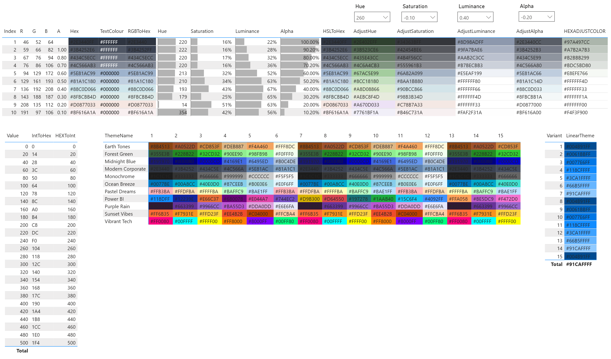

Microsoft have just released [User Defined Functions (UDFs)](https://learn.microsoft.com/en-us/dax/best-practices/dax-user-defined-functions). This game-changing feature allows developers to create and reuse their own custom functions within a semantic model. Once defined, they are treated like any of the pre-built functions, andy can be invoked anywhere in your model, centralizing and simplifying your DAX code. This makes measures less verbose and easier to manage

Additionally [SQLBI](https://www.sqlbi.com/) has released [DAX Lib](https://daxlib.org/), a centralized, community-driven library for sharing and discovering UDFs. With DAX Lib, you can easily find, export, and import libraries using TMDL. This is a massive step for community collaboration, and it's fantastic to see it already populated with libraries for conversions, filtering, SVG, and color manipulation.

## DAX User Defined Functions (UDF)

I am not going to dive too deep on how to define UDFs, as the [docs](https://learn.microsoft.com/en-us/dax/best-practices/dax-user-defined-functions) and [SQLBIs video](https://www.youtube.com/watch?v=60jUmTxpxbw) already do a good job. 

But we can have a quick look at a simple UDF:

```dax
function
    HelloWorld() => "Hello World"
```

UDFs are incredibly versatile. Although the example above doesn't accept any parameters, UDF can accept parameters like strings, numbers, columns, measures, or tables, and return either scalar values or entire tables. The parameters can have hints to provide implicit casting (i.e. int64, double), and define the evaluation mode (val, expr) to determine if the parameter is evaluated before entering the function or within it.

## DAX Lib

[DAX Lib](https://daxlib.org/) is a centralized repository of UDF libraries. You can search for existing library, easily export the library as a TMDL script and import into your model with TMDL view. As of launch there are already libraries for conversions, filtering, SVG and colour manipulation. Anyone can contribute to this platform via github. 

!!! tip "Contribute To DAX Lib"

    Please read and follow the [contribute to DAX Lib](https://docs.daxlib.org/contribute/) guide if you want to contribute a library.

### EvaluationContext.Colour Library

[:material-book-open: Docs](https://evaluationcontext.github.io/evaluationcontext.colour/){ .md-button }
[:material-package-variant: Package](https://daxlib.org/package/EvaluationContext.Colour/){ .md-button }

My recent contribution to DAX Lib was [EvaluationContext.Colour](https://daxlib.org/package/EvaluationContext.Colour/), This library provides a comprehensive set of functions to manipulate HEX color codes, making it easier to manage colors for tasks like SVG visualizations and conditional formatting. The library includes a range of functions, for adjusting properties like hue, saturation, and luminance, using pre-built themes, and determining the best text color for contrast with a given background.

??? example "Functions"
    - [Colour Conversion](https://evaluationcontext.github.io/evaluationcontext.colour/docs/functions/conversion/)
        - [`EvaluationContext.Colour.Int.ToHex`](https://evaluationcontext.github.io/evaluationcontext.colour/docs/functions/conversion/EvaluationContext.Colour.Int.ToHex/)
        - [`EvaluationContext.Colour.Hex.ToInt`](https://evaluationcontext.github.io/evaluationcontext.colour/docs/functions/conversion/EvaluationContext.Colour.Hex.ToInt/)
        - [`EvaluationContext.Colour.RGB.ToHex`](https://evaluationcontext.github.io/evaluationcontext.colour/docs/functions/conversion/EvaluationContext.Colour.RGB.ToHex/)
        - [`EvaluationContext.Colour.HSL.ToHex`](https://evaluationcontext.github.io/evaluationcontext.colour/docs/functions/conversion/EvaluationContext.Colour.HSL.ToHex/)
    - [Hex Colour Manipulation](https://evaluationcontext.github.io/evaluationcontext.colour/docs/functions/hex-manipulation/)
        - [`EvaluationContext.Colour.HEX.Hue`](https://evaluationcontext.github.io/evaluationcontext.colour/docs/functions/hex-manipulation/EvaluationContext.Colour.Hex.Hue/)
        - [`EvaluationContext.Colour.HEX.Saturation`](https://evaluationcontext.github.io/evaluationcontext.colour/docs/functions/hex-manipulation/EvaluationContext.Colour.Hex.Saturation/)
        - [`EvaluationContext.Colour.HEX.Luminance`](https://evaluationcontext.github.io/evaluationcontext.colour/docs/functions/hex-manipulation/EvaluationContext.Colour.Hex.Luminance/)
        - [`EvaluationContext.Colour.HEX.Alpha`](https://evaluationcontext.github.io/evaluationcontext.colour/docs/functions/hex-manipulation/EvaluationContext.Colour.Hex.Alpha/)
        - [`EvaluationContext.Colour.HEX.AdjustHue`](https://evaluationcontext.github.io/evaluationcontext.colour/docs/functions/hex-manipulation/EvaluationContext.Colour.Hex.AdjustHue/)
        - [`EvaluationContext.Colour.HEX.AdjustSaturation`](https://evaluationcontext.github.io/evaluationcontext.colour/docs/functions/hex-manipulation/EvaluationContext.Colour.Hex.AdjustSaturation/)
        - [`EvaluationContext.Colour.HEX.AdjustLuminance`](https://evaluationcontext.github.io/evaluationcontext.colour/docs/functions/hex-manipulation/EvaluationContext.Colour.Hex.AdjustLuminance/)
        - [`EvaluationContext.Colour.HEX.AdjustAlpha`](https://evaluationcontext.github.io/evaluationcontext.colour/docs/functions/hex-manipulation/EvaluationContext.Colour.Hex.AdjustAlpha/)
        - [`EvaluationContext.Colour.HEX.TextColour`](https://evaluationcontext.github.io/evaluationcontext.colour/docs/functions/hex-manipulation/EvaluationContext.Colour.Hex.TextColour/)
    - [Colour Theming](https://evaluationcontext.github.io/evaluationcontext.colour/docs/functions/theming/)
        - [`EvaluationContext.Colour.Hex.Theme`](https://evaluationcontext.github.io/evaluationcontext.colour/docs/functions/theming/EvaluationContext.Colour.Hex.Theme/)
        - [`EvaluationContext.Colour.HEX.LinearTheme`](https://evaluationcontext.github.io/evaluationcontext.colour/docs/functions/theming/EvaluationContext.Colour.Hex.LinearTheme/)
        - [`EvaluationContext.Colour.Hex.Interpolate`](https://evaluationcontext.github.io/evaluationcontext.colour/docs/functions/theming/EvaluationContext.Colour.Hex.Interpolate/)

You can see these functions in action in Power BI:



## Conclusion

Major updates to DAX don't happen often, but UDFs are a game-changer. They will fundamentally transform the way Power BI developers write, share, and use DAX, opening up new possibilities for creating robust, reusable, and maintainable semantic models. I encourage everyone to check out DAX Lib and consider contributing to this incredible community effort!