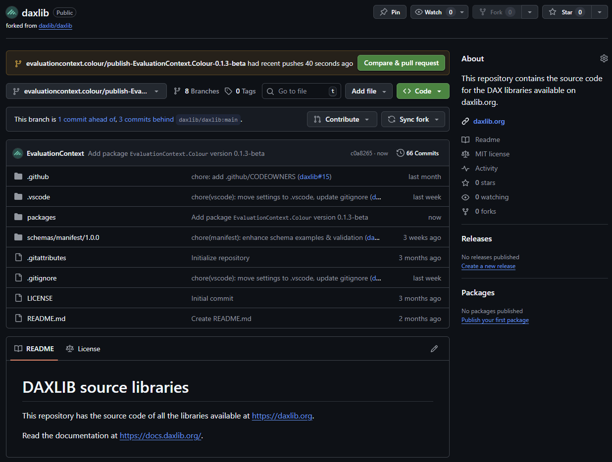

[Dax Lib](https://daxlib.org/), a centralized repository of DAX UDF libraries, has just announced a new type of library - [Medium/Large](https://github.com/daxlib/daxlib/discussions/81). I will show the processes of how to submit a small library, then how to move from a Small to Medium/Large Library, and explore why you might want to do this.

## Small library

In this mode you develop your library on a personal fork of [daxlib/daxlib](https://github.com/daxlib/daxlib), then submit a pull request to `daxlib/daxlib` to submit your library. There is a [guide](https://docs.daxlib.org/contribute/fork-daxlib) on how to contribute a small library to DAX Lib.


The process is as follows:

- Go to [daxlib/daxlib](https://github.com/daxlib/daxlib) github repo, and create a fork
- Create a folder within packages, for your library, and add/update the relevant files

=== "daxlib/daxlib repo structure"

    The example below shows the structure of `daxlib/daxlib repo`, showing only the relevant items

    ``` { .json .annotate .no-copy }
    │
    └── 📁 packages
        |── 📁 a   
        ├── 📁 ...
        ├── 📁 e
        │    └── 📁 evaluationcontext.colour // (1)!
        │         ├── 📁 lib
        │         │    └── functions.tmdl // (2)!
        │         ├── 📄 icon.png // (3)!
        │         ├── 📄 README.md // (4)!
        │         └── 📄 manifest.daxlib // (5)!
        ├── 📁 ...
        └── 📁 z
    ```

    1. Your library
    2. Required - Your DAX UDF functions 
    3. Optional - Icon for your library
    4. Optional - Docs for your library
    5. Required - Declares package properties

=== "lib/functions.tmdl"

    Contains TMDL definition of the functions within your library

    ??? info "Naming Convention"

        There are some guidelines on DAX UDF naming conventions

        - [DAX Lib Naming Conventions](https://docs.daxlib.org/contribute/naming-conventions)
        - [SQLBI DAX Naming Conventions](https://docs.sqlbi.com/dax-style/dax-naming-conventions)

    ??? Warning "Annotation"

        TDML script must *not* have `CreateOrReplace` keyword

        Functions must have the following annotations:

        ```tmdl
        annotation DAXLIB_PackageId = EvaluationContext.Colour
        annotation DAXLIB_PackageVersion = 0.1.2-beta
        ```

    ```dax
    /// Int to Hex conversion
    /// number	INT64	The integer to convert
    /// padTo	INT64	Optional: Minimum number of characters in result
    function 'EvaluationContext.Colour.Int.ToHex' =
        (
          number: INT64,
          padTo: INT64
        ) =>
        
          VAR MinPadding = IF( number = 0, 1, CEILING( LOG( number + 1, 16 ), 1 ) )
          VAR ActualPadding = MAX( MinPadding, IF( ISBLANK( padTo ), MinPadding, padTo ) )
          VAR BitTable = GENERATESERIES( 1, ActualPadding )
          VAR Hex =
            CONCATENATEX(
              BitTable,
              VAR c = MOD( TRUNC( number / POWER( 16, [Value] - 1 ) ), 16 )
              RETURN
                SWITCH( c, 10, "A", 11, "B", 12, "C", 13, "D", 14, "E", 15, "F", c ),
              "",
              [Value],
              DESC
            )
        
          RETURN Hex

      annotation DAXLIB_PackageId = EvaluationContext.Colour
      annotation DAXLIB_PackageVersion = 0.1.2-beta
    ...
    ```

=== "manifest.daxlib"

    Contains the package properties in JSON format

    ``` { .json .annotate }
    {
      "$schema": "https://raw.githubusercontent.com/sql-bi/daxlib/refs/heads/main/schemas/manifest/1.0.0/manifest.1.0.0.schema.json",
      "id": "EvaluationContext.Colour",
      "version": "0.1.2-beta",
      "authors": "Jake Duddy",
      "description": "A comprehensive set of User-Defined Functions designed to enable easy manipulation of hex colours",
      "tags": "DAX,UDF,colour",
      "releaseNotes": "Added Documentation page and `EvaluationContext.Colour.Hex.Interpolate` function",
      "projectUrl": "https://evaluationcontext.github.io/EvaluationContext.Colour/",
      "repositoryUrl": "https://github.com/sql-bi/daxlib/tree/main/packages/e/evaluationcontext.colour",
      "icon": "/icon.png", // (1)!
      "readme": "/README.md" // (2)!
    }
    ```

    1. Required if you include a `icon.png` file
    2. Required if you include a `README.md` file

=== "icon.png"

    Optional icon for library

    !!! remarks

        The icon file must be in PNG format (.PNG), with a maximum size of 100 KB

=== "README.md"

    Optional markdown docs file, with general information about the library, usage instructions, examples, and any notes for users

    !!! remarks

        The file must be in Markdown format (.MD), with a maximum size of 100 KB

        For security reasons, only a limited set of Markdown features are supported, and external links may be restricted to trusted domains

---

- When you are ready to publish a version of the library, submit a pull request from `your fork` to `daxlib/daxlib`
- After approval your library will appear on [DAX Lib](https://daxlib.org/) for other to download and use

!!! info "Packages are immutable"

    After a pull request has been accepted, Packages are immutable. If you want to submit any changes to functions or files, a new version (i.e. v0.1.0 :material-arrow-right: v0.2.0 ) must be created, and function annotations and `manifest.daxlib` must be updated with the new version number. Changes can then be submitted with a new pull request.

## Medium/large Library

The process for Medium/Large libraries uses a slightly different workflow.

We still need a fork of `daxlib/daxlib`, and will still submit a pull request to `daxlib/daxlib` to publish a library. The difference is that development of the library will occur on a copy of `daxlib/lib-quickstart-template` (one per library). A github workflow can be run on the `daxlib/lib-quickstart-template` copy, which will push the library to a new branch of your `daxlib/daxlib` fork, which can then be submitted via a pull request.


### Why Create a Medium/large Library?

Since you have a specific repo for your library you are able to:

- Connect with your users with GitHub issues
- Collaborate with others to develop the library
- (optional) Add documentation site and host (for example) on GitHub Pages
- Opens the door for auto-documentation generation

### Creating a Medium/large Library

#### Creating a Library Repo

Let's start by creating a [evaluationcontext.colour](https://github.com/EvaluationContext/evaluationcontext.colour) repo from the [daxlib/lib-quickstart-template](https://github.com/daxlib/lib-quickstart-template). This is where we can develop our library.


#### Modifying Repo

Now we have the template we need to update it's content.

- Go to vscode and run `#!bash git clone https://github.com/EvaluationContext/evaluationcontext.colour.git`

!!! info "daxlib/lib-quickstart-template structure"

    We can see the structure is slightly different, but the required content remain the same, except your library now lives in the `src` folder

    ```{ .json .annotate .no-copy }
    📁 .github
    ├── 📁 workflows
    │    └── 📄 publish-package.yml // (1)!
    └── 📁 src // (2)!
        ├── 📁 lib
        │    └── functions.tmdl // (3)!
        ├── 📄 icon.png // (4)!
        ├── 📄 README.md // (5)!
        └── 📄 manifest.daxlib // (6)!
    ```

    1. Workflow to create a pull request to daxlib/daxlib repo
    2. Your library
    3. Required - Your DAX UDF functions
    4. Optional - Icon for your library
    5. Optional - Docs for your library
    6. Required - Declares package properties

- Since I already have a Small Library I can copy the files to `src` folder
- Since this will be a new version I need to update the version number in `manifest.daxlib` (0.1.2-beta :material-arrow-right: 0.1.3-beta)
- I can also update the main repo `README.md` to give specific info about this library

!!! Tip "Annotation Placeholders"

    We are able to replace the annotation values in `functions.tmdl` with placeholders. These will be overwritten by the version specified in `manifest.daxlib` when running the `publish-package.yml` workflow. 

    ```diff
    - annotation DAXLIB_PackageId = EvaluationContext.Colour
    + annotation DAXLIB_PackageId = __PLACEHOLDER_PACKAGE_ID__

    - annotation DAXLIB_PackageVersion = 0.1.3-beta
    + annotation DAXLIB_PackageVersion = __PLACEHOLDER_PACKAGE_VERSION__
    ```

### Adding a Docs Site

For my previous library docs I used [Jekyll](https://jekyllrb.com/) and the [Just the Docs theme](https://just-the-docs.com/), primarily because I have been using the chirpy [Material](https://chirpy.cotes.page/) for my blog. But I have recently transitioned my blog over to the [Material](https://squidfunk.github.io/mkdocs-material/) Theme for [MKDocs](https://www.mkdocs.org/), as it has some really nice functionality, and faster build times. So lets quickly add a Material for MKDocs site definition to the repo.

!!! tip "Material for MKDocs"

    The [Material for MKDocs](https://squidfunk.github.io/mkdocs-material/) docs site give really good documentation for how to create a site and clear explanation of all the features and how to use them. Additionally this [video series](https://www.youtube.com/playlist?list=PLw_jGKXm9lIaJCD8YClu6cAz1TcFdJdIf) is very good at getting you started.

I am going to add/update the following:

- Add `DevContainer` and `requirements.txt`
    - So I can serve the site in a container for site development, with all dependencies
- `docs` folder
    - Contains markdown files for all of the site pages
- `mkdocs.yml`
    - Site Configuration
- `.github\workflows\ci.yml`
    - GitHub workflow to land built site in `gh-pages` branch as a source for GitHub pages to deploy the site
- `PowerBI` folder
    - Power BI Project file for function testing and to show example for the usage of library
- Update `.gitignore` 
    - ignore for PBIP and MKdocs specific files

Once I have everything setup I can run the run the site in the Dev Container.

??? info "Dev Container dependencies"

    To run dev containers you need [Docker Desktop](https://docs.docker.com/desktop/) installed. Additionally if you are running on Windows you will need to install [Windows Subsystem for Linux (WSL)](https://learn.microsoft.com/en-us/windows/wsl/install). 

    Since MKdocs runs on python, you could could install python, and pip install the dependencies.

Once the container is built I can go to the terminal and serve the site on localhost.

```bash
mkdocs serve --livereload
```

Then view the site at `http://localhost:8000/` and test to make sure the site is functioning correctly.


Then we can `push` to GitHub, this will run the `ci` job, which will execute `#!bash mkdocs build`, generating the html pages, and saving the result to the `gh-pages` branch. We can now setup GitHub pages to use the `gh-pages` branch as a source to deploy our site, by selecting `Setting` from the top nav bar of the Git Hub repo, select `pages` and set `Deploy from a branch` and set the branch to `gh-pages`, and select save.


We will see a `pages build and deployment` action kick off, which will deploy the site.


Then we can navigate to our site URL and confirm it deployed successfully.


### Deploying Library

After that brief detour, we can deploy the library by following the [Publish Your Library](https://github.com/daxlib/lib-quickstart-template?tab=readme-ov-file#-publish-your-library) guidance.

We first need to create a Personal Access Token, granting `read/write` permissions on your `daxlib/daxlib fork`.


We add the token as a secret on the library repo, granting these permission to your `library repo`.


Navigate to `actions`, select `publish-package` and `Run workflow`.


Once this has run we can navigate to our `daxlib/daxlib fork`, and we can see a new branch (`evaluationcontext.colour/publish-EvaluationContext.Colour-0.1.3-beta`) has been created.



From here we can create a Pull Request to `daxlib/daxlib`.

!!! quote "Pull Request"

    Your pull request will be reviewed by the DAX Lib maintainers and, if changes are requested during the review:

    - Apply the requested fixes to your code and commit them to your repository
    - Re-run the publish-package workflow
    - The pull request will be automatically updated

    Once your pull request is approved and merged, your library will be automatically published on [daxlib.org](https://daxlib.org/).

    <cite>[daxlib/lib-quickstart-template](https://github.com/daxlib/lib-quickstart-template?tab=readme-ov-file#-publish-your-library)</cite>