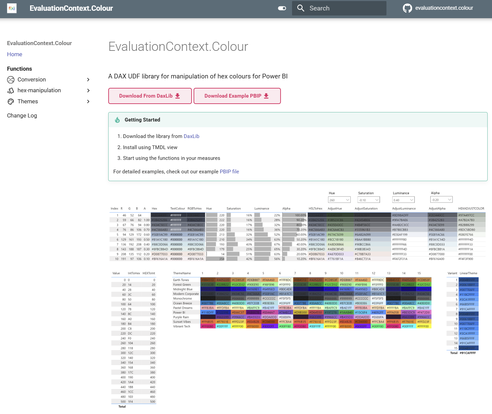
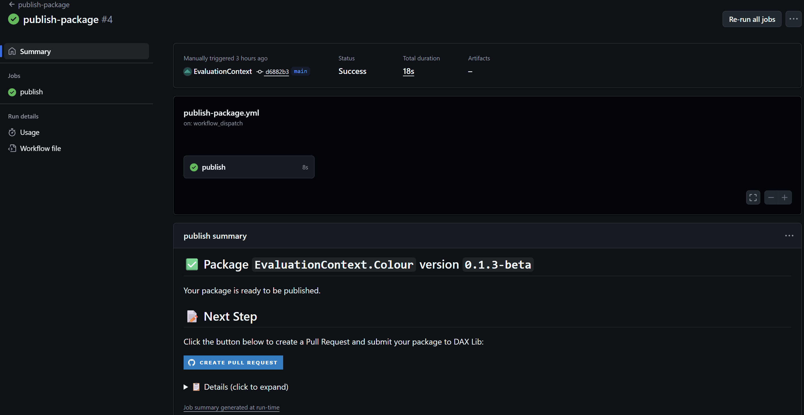

[Dax Lib](https://daxlib.org/), a centralized repository of DAX UDF libraries, has just announced a new type of library - [Medium/Large](https://github.com/daxlib/daxlib/discussions/81). I will show the processes of how to submit a Small library, then how to move from a Small to Medium/Large library, and explore why you might want to do this.

## Small library

In this mode you develop your library on a personal fork of :octicons-repo-24: `daxlib/daxlib` (i.e :material-source-fork: `evaluationcontext/daxlib`), then submit a :octicons-git-pull-request-24: pull request to :octicons-repo-24: `daxlib/daxlib` to submit your library, and your :octicons-package-16: library will be released to `Dax lib`. There is a [guide](https://docs.daxlib.org/contribute/fork-daxlib) on how to contribute a small library to DAX Lib.

The process is as follows:


- Go to :octicons-repo-24: [daxlib/daxlib](https://github.com/daxlib/daxlib) github repo, and create a fork :material-source-fork:
- Create a folder within packages, for your library, and add/update the relevant files

??? example "daxlib/daxlib package"

    === "daxlib/daxlib repo structure"

        The example below shows the structure of the :octicons-repo-24: `daxlib/daxlib` repo, showing only the relevant items

        ``` { .json .annotate .no-copy }
        └── 📁 packages
            |── 📁 a   
            ├── 📁 ...
            ├── 📁 e
            │    └── 📁 evaluationcontext.colour // (1)!
            │         ├── 📁 0.1.0
            │         └── 📁 0.1.1
            │              ├── 📁 lib
            │              │    └── functions.tmdl // (2)!
            │              ├── 📄 icon.png // (3)!
            │              ├── 📄 README.md // (4)!
            │              └── 📄 manifest.daxlib // (5)!
            ├── 📁 ...
            └── 📁 z
        ```

        1. Your library
        2. Required - Your DAX UDF functions 
        3. Optional - Icon for your library
        4. Optional - Docs for your library
        5. Required - Declares package properties

    === "lib/functions.tmdl"

        *Required:* Contains TMDL definition of the functions within your library

        ??? info "Naming Convention"

            There are some guidelines on DAX UDF naming conventions

            - [DAX Lib Naming Conventions](https://docs.daxlib.org/contribute/naming-conventions)
            - [SQLBI DAX Naming Conventions](https://docs.sqlbi.com/dax-style/dax-naming-conventions)

        ??? Warning "Annotation"

            TDML script must *not* have `CreateOrReplace` keyword

            Functions must have the following annotations:

            ```tmdl
            annotation DAXLIB_PackageId = EvaluationContext.Colour
            annotation DAXLIB_PackageVersion = 0.1.2-beta
            ```

        ```dax
        /// Int to Hex conversion
        /// number	INT64	The integer to convert
        /// padTo	INT64	Optional: Minimum number of characters in result
        function 'EvaluationContext.Colour.Int.ToHex' =
            (
              number: INT64,
              padTo: INT64
            ) =>
            
              VAR MinPadding = IF( number = 0, 1, CEILING( LOG( number + 1, 16 ), 1 ) )
              VAR ActualPadding = MAX( MinPadding, IF( ISBLANK( padTo ), MinPadding, padTo ) )
              VAR BitTable = GENERATESERIES( 1, ActualPadding )
              VAR Hex =
                CONCATENATEX(
                  BitTable,
                  VAR c = MOD( TRUNC( number / POWER( 16, [Value] - 1 ) ), 16 )
                  RETURN
                    SWITCH( c, 10, "A", 11, "B", 12, "C", 13, "D", 14, "E", 15, "F", c ),
                  "",
                  [Value],
                  DESC
                )
            
              RETURN Hex

          annotation DAXLIB_PackageId = EvaluationContext.Colour
          annotation DAXLIB_PackageVersion = 0.1.2-beta
        ...
        ```

    === "manifest.daxlib"

        *Required:* The package properties in JSON format

        ``` { .json .annotate }
        {
          "$schema": "https://raw.githubusercontent.com/sql-bi/daxlib/refs/heads/main/schemas/manifest/1.0.0/manifest.1.0.0.schema.json",
          "id": "EvaluationContext.Colour",
          "version": "0.1.2-beta",
          "authors": "Jake Duddy",
          "description": "A comprehensive set of User-Defined Functions designed to enable easy manipulation of hex colours",
          "tags": "DAX,UDF,colour",
          "releaseNotes": "Added Documentation page and `EvaluationContext.Colour.Hex.Interpolate` function",
          "projectUrl": "https://evaluationcontext.github.io/EvaluationContext.Colour/",
          "repositoryUrl": "https://github.com/sql-bi/daxlib/tree/main/packages/e/evaluationcontext.colour",
          "icon": "/icon.png", // (1)!
          "readme": "/README.md" // (2)!
        }
        ```

        6. Required if you include a `icon.png` file
        7. Required if you include a `README.md` file

    === "icon.png"

        *Optional:* icon for library

        !!! remarks

            The icon file must be in PNG format (.PNG), with a maximum size of 100 KB

    === "README.md"

        *Optional:* Markdown docs file, with general information about the library, usage instructions, examples, and any notes for users

        !!! remarks

            The file must be in Markdown format (.MD), with a maximum size of 100 KB

            For security reasons, only a limited set of Markdown features are supported, and external links may be restricted to trusted domains

- When you are ready to publish a version of the :octicons-package-16: library, submit a :octicons-git-pull-request-24: pull request from your :material-source-fork: `fork` to :octicons-repo-24: `daxlib/daxlib`
- After approval your :octicons-package-16: library will appear on [DAX Lib](https://daxlib.org/) for other to download and use

!!! info "Packages are immutable"

    After a pull request has been accepted, Packages are immutable. If you want to submit any changes to functions or files, a new version (i.e. v0.1.0 :material-arrow-right: v0.2.0 ) must be created, and function annotations and `manifest.daxlib` must be updated with the new version number. Changes can then be submitted with a new pull request.

## Medium/large Library

The process for Medium/Large libraries uses a extended workflow.

We still need a fork of :octicons-repo-24: `daxlib/daxlib` (i.e. :material-source-fork: `evaluationscontext/daxlib`), and will still submit a :octicons-git-pull-request-24: pull request to :octicons-repo-24: `daxlib/daxlib` to publish a library.

The difference is that development of the library will occur on a fork of :octicons-repo-24: `daxlib/lib-quickstart-template` (one per library i.e. :material-source-fork: `evaluationcontext/evaluationcontext.colour`). A github workflow can be run on :material-source-fork: `evaluationcontext/evaluationcontext.colour`, which will push the library to a new, version specific, branch of :material-source-fork: `evaluationcontext/daxlib`, which can then be submitted via a :octicons-git-pull-request-24: pull request to :octicons-repo-24: `daxlib/daxlib`.


### Why Create a Medium/large Library?

Since you have a specific repo dedicated to your library you are able to:

- Connect with your users with GitHub issues
- Collaborate with others to develop the library
- Add documentation site and host (for example) on GitHub Pages
- Opens the door for auto-documentation generation

### Creating a Medium/large Library

#### Creating a Library Repo

Let's start by creating a development repo (:material-source-fork: [evaluationcontext/evaluationcontext.colour](https://github.com/EvaluationContext/evaluationcontext.colour)) from :octicons-repo-24: [daxlib/lib-quickstart-template](https://github.com/daxlib/lib-quickstart-template). This is where we can develop our library.


#### Modifying Repo

Now we have a development repo we need to update it's content.

- Go to vscode and run `#!bash git clone https://github.com/EvaluationContext/evaluationcontext.colour.git`

!!! info "daxlib/lib-quickstart-template structure"

    We can see the structure is slightly different, but the required content remain the same, except your library now lives in the `src` folder

    ```{ .json .annotate .no-copy }
    ├── 📁 .github
    │    └── 📁 workflows
    │        └── 📄 publish-package.yml // (1)!
    └── 📁 src // (2)!
         ├── 📁 lib
         │    └── functions.tmdl // (3)!
         ├── 📄 icon.png // (4)!
         ├── 📄 README.md // (5)!
         └── 📄 manifest.daxlib // (6)!
    ```

    1. Workflow to create a pull request to daxlib/daxlib repo
    2. Your library
    3. Required - Your DAX UDF functions
    4. Optional - Icon for your library
    5. Optional - Docs for your library
    6. Required - Declares package properties

- Since I already have a Small Library I can copy the files to `src` folder
- Since this will be a new version I need to update the version number in `manifest.daxlib` (0.1.2-beta :material-arrow-right: 0.1.3-beta)
- I can also update the main repo `README.md` to give specific info about this library

!!! Tip "Annotation Placeholders"

    We are able to replace the annotation values in `functions.tmdl` with placeholders. These will be overwritten by the version specified in `manifest.daxlib` when running the `publish-package.yml` workflow. 

    ```diff
    - annotation DAXLIB_PackageId = EvaluationContext.Colour
    + annotation DAXLIB_PackageId = __PLACEHOLDER_PACKAGE_ID__

    - annotation DAXLIB_PackageVersion = 0.1.3-beta
    + annotation DAXLIB_PackageVersion = __PLACEHOLDER_PACKAGE_VERSION__
    ```

### Adding a Docs Site

For my version of the library docs I used :simple-jekyll: [Jekyll](https://jekyllrb.com/) and the [Just the Docs theme](https://just-the-docs.com/), primarily because I have been using the chirpy [Material](https://chirpy.cotes.page/) for my blog. But I have recently transitioned my blog over to the :simple-materialformkdocs: [Material](https://squidfunk.github.io/mkdocs-material/) Theme for [MKDocs](https://www.mkdocs.org/), as it has some really nice functionality, and faster build times. So lets quickly add a Material for MKDocs site definition to the repo.

??? tip "Material for MKDocs"

    The [Material for MKDocs](https://squidfunk.github.io/mkdocs-material/) docs site give really good documentation for how to create a site and clear explanation of all the features and how to use them. Additionally this [video series](https://www.youtube.com/playlist?list=PLw_jGKXm9lIaJCD8YClu6cAz1TcFdJdIf) is very good at getting you started.

I am going to some files to define the site to the repo:

``` { .json .annotate .no-copy }
├── 📁 .devcontainer // (1)!
│    ├── 📄 devcontainer.json
│    └── 📄 Dockerfile
├── 📁 .github
│    └── 📁 workflows
│        ├── 📄 publish-package.yml
│        └── 📄 ci.yml // (3)!
├── 📁 src
│    ├── 📁 lib
│    │    └── functions.tmdl
│    ├── 📄 icon.png
│    ├── 📄 README.md
│    └── 📄 manifest.daxlib
├── 📁 docs // (4)!
│    ├── 📄 index.md
│    └── 📄 ...
├── 📁 PowerBI // (5)!
│    ├── 📄 Model.pbip
│    └── 📄 ...
├── 📄 mkdocs.yml // (7)!
├── 📄 requirements.txt // (2)!
└── 📄 .gitignore // (6)!
```

1. Dev Container configuration for containerized development
2. Python dependencies for MKDocs and Material theme
3. GitHub workflow to build and deploy site to `gh-pages` branch
4. Markdown files for all site pages
5. Power BI Project file for function testing and examples
6. Ignore PBIP and MKDocs specific files
7. Site configuration

Once I have everything setup I can run the run the site in the Dev Container.

??? info "Dev Container dependencies"

    To run dev containers you need [Docker Desktop](https://docs.docker.com/desktop/) installed. Additionally if you are running on Windows you will need to install [Windows Subsystem for Linux (WSL)](https://learn.microsoft.com/en-us/windows/wsl/install). 

    Since MKdocs runs on python, you could could install python, and pip install the dependencies, on your machine without a container.

Once the container is built I can go to the terminal and serve the site on localhost.

```bash
mkdocs serve --livereload
```

Then view the site at `http://localhost:8000/` and test to make sure the site is functioning correctly.



Then we can `push` to GitHub, this will run the `ci` job, which will execute `#!bash mkdocs build`, generating the html pages, and saving the result to a :octicons-git-branch-24: `gh-pages` branch. 

We can now setup GitHub pages to use the :octicons-git-branch-24: `gh-pages` branch as a source to deploy our site, by selecting `Setting` from the top nav bar of the Git Hub repo, select `pages` and set `Deploy from a branch` and set the branch to :octicons-git-branch-24: `gh-pages`, and select save.


We will see a `pages build and deployment` action kick off, which will deploy the site.


Then we can navigate to our site URL and confirm it deployed successfully.


### Deploying Library

After that brief detour, we can deploy the library by following the [Publish Your Library](https://github.com/daxlib/lib-quickstart-template?tab=readme-ov-file#-publish-your-library) guidance.

We first need to create a Personal Access Token, granting `read/write` permissions on :material-source-fork: `evaluationcontext/daxlib`.


We add the token as a secret on :material-source-fork: `evaluationcontext/evaluationcontext.colour`, granting these permission to :material-source-fork: `evaluationcontext/daxlib`. So that the workflow run from :material-source-fork: `evaluationcontext/evaluationcontext.colour` can create a new :octicons-git-branch-24: branch in :material-source-fork: `evaluationcontext/daxlib`


Navigate to `actions`, select `publish-package` and `Run workflow`.


Once this has run we can navigate to our :material-source-fork: `evaluationcontext/daxlib`, and we confirm new branch (:octicons-git-branch-24: `evaluationcontext.colour/publish-EvaluationContext.Colour-0.1.3-beta`) has been created.


If we go back the actions section of :material-source-fork: `evaluationcontext/evaluationcontext.colour` and open the completed `publish-package` job, you can see we get the option to open a :octicons-git-pull-request-24: pull request.



Then we can select `Open Pull Request` and `Create pull request` to create a :octicons-git-pull-request-24: pull request to :octicons-repo-24: `daxlib/daxlib`.


The :octicons-git-pull-request-24: pull request will then be reviewed by the DAX Lib maintainers. If changes are requested during the review:

- Apply the requested fixes to your code in the development repo, and commit them to your repository
- Re-run the `publish-package` workflow
- The :octicons-git-pull-request-24: pull request will be automatically updated

Once your :octicons-git-pull-request-24: pull request is approved and merged, your :octicons-package-16: library will be automatically published on [daxlib.org](https://daxlib.org/).