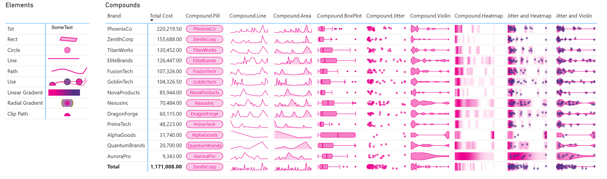

I am happy to announce the release of `DaxLib.SVG v0.2.0-beta`, designed to help make creating SVGs in Power BI easier for everyone.

[:material-book-open: Docs](https://evaluationcontext.github.io/daxlib.svg/){ .md-button }
[:material-package-variant: Package](https://daxlib.org/package/daxlib.svg/){ .md-button }



## What are SVGs?

SVGs are Vector images and defined using `XML`. You can define elements like `#!xml <circle>`, `#!xml <path>`, `#!xml <rect>` which are rendered into images.

For example you can define a simple circle like this:

```svg
<svg width='500' height='100' viewbox= '0 0 100 20' xmlns='http://www.w3.org/2000/svg'>
    <circle cx='50' cy='10' r='10%' fill='#EC008C' fill-opacity='0.5' stroke='#EC008C' stroke-width='1'/>
</svg>
```

<svg width='500' height='100' viewbox= '0 0 100 20' xmlns='http://www.w3.org/2000/svg'><circle cx='50' cy='10' r='10%' fill='#EC008C' fill-opacity='0.5' stroke='#EC008C' stroke-width='1'  /></svg>

!!! info "Intro to SVGs"

    If you want to know more about SVGs, [Joshua Comeau](https://www.linkedin.com/in/joshwcomeau/) has a fantastic blog post on SVGs: [A Friendly Introduction to SVG](https://www.joshwcomeau.com/svg/friendly-introduction-to-svg/)

## DaxLib.SVG Function Categories

DaxLib.SVG has the following function categories: 

<div class="grid cards" markdown>

- :material-svg: [__SVG Wrapper__ ](https://evaluationcontext.github.io/daxlib.svg/svg/)

    ---

    Wraps one or more `Elements`, `Defs`, `Compounds`, applying required metadata and `#!xml <SVG>` tags

- :material-shape-outline: [__Elements__](https://evaluationcontext.github.io/daxlib.svg/elements/)

    ---

    SVG primitives (i.e. `#!xml <Rect>`, `#!xml <Circle>`, `#!xml <line>`)

- :octicons-graph-24: [__Compounds__ ](https://evaluationcontext.github.io/daxlib.svg/compounds/)

    --- 

    Complex `Compound` components (i.e. boxplot, violin) made from `Elements`

- :material-replay: [__Defs__](https://evaluationcontext.github.io/daxlib.svg/defs/)

    ---

    Define reusable SVG elements (i.e. `#!xml <linearGradient>`, `#!xml <clipPath>`, and shapes). 

- :material-format-color-fill: [__Attr__](https://evaluationcontext.github.io/daxlib.svg/attributes/)

    ---
    
    Create Attributes (i.e.fill, stroke, opacity) string that can applied to `Elements` and `Defs`

- :material-format-rotate-90: [__Transforms__](https://evaluationcontext.github.io/daxlib.svg/transforms/)

    ---
    
    Create Transform strings

- :material-resize: [__Scales__](https://evaluationcontext.github.io/daxlib.svg/scales/)

    ---

    Mapping values between scales

- :material-palette-swatch-outline: [__Colors__ ](https://evaluationcontext.github.io/daxlib.svg/colors/)

    ---

    Themes and functions for colour manipulation.

</div>

## How do I use DaxLib.SVG?

For detailed examples and complete API reference, check out the [documentation site](https://evaluationcontext.github.io/daxlib.svg/) or download the [example PBIP file](https://github.com/daxlib/dev-daxlib-svg/tree/main/samples/pbip/svg). But lets have a quick tour of what DaxLib.SVG offers.

!!! Tip "Data Category"

	Any measures or column that use these UDFs must have `DataCategory = "ImageUrl"`, otherwise you will see a string output instead of the image.

### SVG Wrapper

`#!dax DaxLib.SVG.SVG()` is a wrapper function. This wraps `#!dax daxlib.svg.Element.*`, `#!dax daxlib.svg.Compound.*` and `daxlib.svg.Def.*` with `#! <SVG>` tags plus the metadata Power BI need to interpret the SVG definition correctly (`data:image/svg+xml;utf8`)

=== "Example"

    ```dax
    DaxLib.SVG.SVG(
        "100",
        "100",
        "viewBox='0 0 100 100' ",
        DaxLib.SVG.Element.Circle("50", "50", "40", "fill:blue;", BLANK(), BLANK()),
        BLANK()
    )
    ```

=== "Syntax"

	```dax
	DaxLib.SVG.SVG( width, height, viewbox, contents, sortValue)
	```

	| Name      | Type   | Required | Description                                                                 |
	|:---:|:---:|:---:|---|
	| width     | <span class="type-label string">STRING</span> | :material-close: | Width (pixels or percentage)                                                |
	| height    | <span class="type-label string">STRING</span> | :material-close: | Height (pixels or percentage)                                               |
	| viewbox   | <span class="type-label string">STRING</span> | :material-close: | viewBox (e.g., "0 0 100 100")                                               |
	| contents  | <span class="type-label string">STRING</span> | :material-check: | SVG elements to include (e.g., from DaxLib.SVG.Element functions)           |
	| sortValue | <span class="type-label expr">EXPR</span> | :material-close: | Sort value for ordering in tables                                           |

	<span class="type-label string">STRING</span> SVG string

=== "Definition"

	```dax
	function 'DaxLib.SVG.SVG' =
		(
			width : STRING,
			height : STRING,
			viewbox : STRING,
			contents : STRING,
			sortValue : EXPR
		) =>

			VAR _Canvas = 	IF( NOT ISBLANK( width ) && NOT ISBLANK( height ), "width='" & width & "' height='" & height & "' " )
			VAR _SortDesc = IF( NOT ISBLANK( sortValue ), "<desc>" & FORMAT( sortValue, "000000000000" ) & "</desc>" )

			RETURN 
			
				"data:image/svg+xml;utf8," &
				"<svg " &
				_Canvas &
				viewbox &
				"xmlns='http://www.w3.org/2000/svg'>" &
				_SortDesc &
				contents &
				"</svg>"
	```

### Elements

These functions generate SVG primitives such as `#!xml <circle>`, `#!xml <rect>`, `#!xml <line>`, `#!xml <polygon>`, `#!xml <polyline>`, `#!xml <text>`, and `#!xml <<g>`. Use these together to build more complex SVG graphics.

=== "Circle"

    <svg width='500' height='100' viewbox= '0 0 100 20' xmlns='http://www.w3.org/2000/svg'><circle cx='50' cy='10' r='10%' fill='#EC008C' fill-opacity='0.5' stroke='#EC008C' stroke-width='1'  /></svg>

=== "line"

    <svg width='500' height='100' viewbox= '0 0 100 20' xmlns='http://www.w3.org/2000/svg'><line x1='1' y1='5' x2='80' y2='5' stroke='#EC008C' stroke-width='2'  /></svg>

=== "Paths"

    <svg width='500' height='100' viewbox= '0 0 100 20' xmlns='http://www.w3.org/2000/svg'><path d='M10 10 L30 5 C50 0 70 20 90 15 L100 0' fill='none' stroke='#EC008C' stroke-width='2'  /></svg>

=== "Rect"

    <svg width='500' height='100' viewbox= '0 0 100 20' xmlns='http://www.w3.org/2000/svg'><rect x='20%' y='0%' width='50%' height='100%' fill='#EC008C' fill-opacity='0.3' stroke='#EC008C' stroke-width='2' stroke-opacity='0.9'/></svg>

=== "Txt"

    <svg width='500' height='100' viewbox= '0 0 100 20' xmlns='http://www.w3.org/2000/svg'><text x='10' y='10' dx='0' dy='0' font-family='Arial' font-size='12'  >DaxLib</text></svg>

=== "UseDef"

    <svg width='500' height='100' viewbox= '0 0 100 20' xmlns='http://www.w3.org/2000/svg'><defs><circle id='Circle1' cx='0' cy='0' r='8' fill='#EC008C' fill-opacity='0.8' stroke='black' stroke-width='1' stroke-opacity='0.8'  /><circle id='Circle2' cx='0' cy='0' r='8' fill='#533285' fill-opacity='0.8' stroke='black' stroke-width='1' stroke-opacity='0.8'  /><path id='myPath' d='M10 10 L30 5 L90 15 L100 0' fill='none' fill-opacity='0.8' stroke='#EC008C'  /></defs><use href='#Circle1' x='20' y='10' transform='rotate(30) '/><use href='#Circle2' x='50' y='10'/><use href='#Circle1' x='80' y='10'/><use href='#myPath' y='5'/><use href='#myPath' y='10' transform='rotate(-10) '/></svg>

For example we can use `DaxLib.SVG.Element.Circle()` to draw the circle above in Power BI like this:

=== "Example"

    ```dax hl_lines="5-25"
    DaxLib.SVG.SVG(
        500,                // width
        100,                // height
        "0 0 100 20",       // viewbox
        DaxLib.SVG.Element.Circle(
            50,             // cx
            10,             // cy
            "10%",          // r
            DaxLib.SVG.Attr.Shapes(
                DaxLib.SVG.Colour.Theme(
                    "Power BI",
                    25
                ),              // fill
                0.5,            // fillOpacity
                BLANK(),        // fillRule   
                DaxLib.SVG.Colour.Theme(
                    "Power BI",
                    25
                ),              // stroke
                1,              // strokeWidth
                BLANK(),        // strokeOpacity
                BLANK()         // opacity
            ),              // attributes
            BLANK()         // transforms
        ),                  // contents
        BLANK()             // sortValue
    )
    ```

=== "Syntax"

    ```dax
    DaxLib.SVG.Element.Circle( cx, cy, r, attributes, transforms )
    ```

    | Name       | Type   | Required | Description                                                               |
    |:---:|:---:|:---:|---|
    | cx         | <span class="type-label string">STRING</span> | :material-check: | The x position of the center                                             |
    | cy         | <span class="type-label string">STRING</span> | :material-check: | The y position of the center                                             |
    | r          | <span class="type-label string">STRING</span> | :material-check: | The radius                                                               |
    | attributes | <span class="type-label string">STRING</span> | :material-close: | Direct SVG attributes to apply (e.g., "fill='red' stroke-width='2'"), can generate with `DaxLib.SVG.Attr.*` or manually |
    | transforms | <span class="type-label string">STRING</span> | :material-close: | Transformation to apply (can be generated with `DaxLib.SVG.Transforms`)   |

    <span class="type-label string">STRING</span> `#!xml <circle>` element

=== "Definition"

    ```dax
    function 'DaxLib.SVG.Element.Circle' = 
        (
            cx: STRING,
            cy: STRING,
            r: STRING,
            attributes: STRING,
            transforms: STRING
        ) =>

            "<circle" &
            " cx='" & cx & "'" &
            " cy='" & cy & "'" &
            " r='" & r & "'" &
            IF( NOT ISBLANK( attributes ), " " & attributes & " " ) &
            IF( NOT ISBLANK( transforms ), " transform='" & transforms & "'" ) & 
            "/>"
    ```

### Compounds

Compound functions combine multiple `DaxLib.SVG.Element.*` functions into higher-level reusable comcponents and complete chart visualizations. These simplify the creation of complex visuals by providing ready-made chart types.

=== "Area"

    <svg width='500' height='100' viewbox= '0 0 100 20' xmlns='http://www.w3.org/2000/svg'><polygon points='2.5,19.8 2.5,19.6992211720227 4.11016949152542,18.970056710775 10.5508474576271,19.3850283553875 15.3813559322034,18.3475992438563 16.9915254237288,16.5987901701323 23.4322033898305,18.5965822306238 25.0423728813559,19.0737996219282 29.8728813559322,10.9611039697543 31.4830508474576,17.206427221172 36.3135593220339,16.3142381852552 37.9237288135593,16.3764839319471 42.7542372881356,18.0393345935728 44.364406779661,10.90404536862 49.1949152542373,16.5513648393195 50.8050847457627,16.2208695652174 55.635593220339,18.5550850661626 57.2457627118644,7.5153572778828 62.0762711864407,19.5984423440454 63.6864406779661,8.48313043478261 70.1271186440678,17.8437051039698 71.7372881355932,18.1660491493384 76.5677966101695,19.2012551984877 78.1779661016949,16.8173913043478 84.6186440677966,0.199999999999999 89.4491525423729,19.0174820415879 91.0593220338983,17.4139130434783 95.8898305084746,19.2961058601134 97.5,10.255652173913 97.5,19.8' fill='#EC008C' fill-opacity='0.2' stroke='none' stroke-width='0'  /><polyline points='2.5,19.6992211720227 4.11016949152542,18.970056710775 10.5508474576271,19.3850283553875 15.3813559322034,18.3475992438563 16.9915254237288,16.5987901701323 23.4322033898305,18.5965822306238 25.0423728813559,19.0737996219282 29.8728813559322,10.9611039697543 31.4830508474576,17.206427221172 36.3135593220339,16.3142381852552 37.9237288135593,16.3764839319471 42.7542372881356,18.0393345935728 44.364406779661,10.90404536862 49.1949152542373,16.5513648393195 50.8050847457627,16.2208695652174 55.635593220339,18.5550850661626 57.2457627118644,7.5153572778828 62.0762711864407,19.5984423440454 63.6864406779661,8.48313043478261 70.1271186440678,17.8437051039698 71.7372881355932,18.1660491493384 76.5677966101695,19.2012551984877 78.1779661016949,16.8173913043478 84.6186440677966,0.199999999999999 89.4491525423729,19.0174820415879 91.0593220338983,17.4139130434783 95.8898305084746,19.2961058601134 97.5,10.255652173913' fill='none' stroke='#EC008C' stroke-width='1'  /></svg>

=== "BoxPlot"

    <svg width='500' height='100' viewbox= '0 0 100 20' xmlns='http://www.w3.org/2000/svg'><line x1='2.5' y1='10' x2='5.99471764079957' y2='10' stroke='#EC008C' stroke-width='1'  /><line x1='19.105324162043' y1='10' x2='38.7712339439082' y2='10' stroke='#EC008C' stroke-width='1'  /><line x1='2.5' y1='4.12' x2='2.5' y2='15.88' stroke='#EC008C' stroke-width='1'  /><line x1='38.7712339439082' y1='4.12' x2='38.7712339439082' y2='15.88' stroke='#EC008C' stroke-width='1'  /><rect x='5.99471764079957' y='4.12' width='13.1106065212434' height='11.76' rx='2' ry='2' fill='#EC008C' fill-opacity='0.5' stroke='#EC008C' stroke-width='1'  /><line x1='12.5870259177624' y1='4.12' x2='12.5870259177624' y2='15.88' stroke='#EC008C' stroke-width='2'  /><circle cx='48.5089686098655' cy='10' r='2' fill='#EC008C'  /><circle cx='61.8596564566391' cy='10' r='2' fill='#EC008C'  /><circle cx='45.3500038002584' cy='10' r='2' fill='#EC008C'  /><circle cx='45.072014897013' cy='10' r='2' fill='#EC008C'  /><circle cx='97.5' cy='10' r='2' fill='#EC008C'  /><circle cx='57.144675837957' cy='10' r='2' fill='#EC008C'  /></svg>

=== "Heatmap"

    <svg width='500' height='100' viewbox= '0 0 100 20' xmlns='http://www.w3.org/2000/svg'><defs><linearGradient id='kde-gradient' x1='0%' y1='0%' x2='100%' y2='0%'><stop offset='0%' stop-color='#F57AC3' /><stop offset='1.66666666666667%' stop-color='#EE1A98' /><stop offset='3.33333333333333%' stop-color='#EC008C' /><stop offset='5%' stop-color='#F362B8' /><stop offset='6.66666666666667%' stop-color='#F252B1' /><stop offset='8.33333333333333%' stop-color='#F35CB6' /><stop offset='10%' stop-color='#F8A3D6' /><stop offset='11.6666666666667%' stop-color='#F8A0D4' /><stop offset='13.3333333333333%' stop-color='#F8A6D7' /><stop offset='15%' stop-color='#F471BF' /><stop offset='16.6666666666667%' stop-color='#EE1997' /><stop offset='18.3333333333333%' stop-color='#F687C9' /><stop offset='20%' stop-color='#FEF6FB' /><stop offset='21.6666666666667%' stop-color='#FFFFFF' /><stop offset='23.3333333333333%' stop-color='#FFFFFF' /><stop offset='25%' stop-color='#FFFFFF' /><stop offset='26.6666666666667%' stop-color='#FFFFFF' /><stop offset='28.3333333333333%' stop-color='#FFFFFF' /><stop offset='30%' stop-color='#FFFFFF' /><stop offset='31.6666666666667%' stop-color='#FFFFFF' /><stop offset='33.3333333333333%' stop-color='#FFFFFF' /><stop offset='35%' stop-color='#FFFFFF' /><stop offset='36.6666666666667%' stop-color='#FFFFFF' /><stop offset='38.3333333333333%' stop-color='#FFFFFF' /><stop offset='40%' stop-color='#FFFFFF' /><stop offset='41.6666666666667%' stop-color='#FFFEFF' /><stop offset='43.3333333333333%' stop-color='#FDDFF1' /><stop offset='45%' stop-color='#F78ECC' /><stop offset='46.6666666666667%' stop-color='#FCD6ED' /><stop offset='48.3333333333333%' stop-color='#FBC6E5' /><stop offset='50%' stop-color='#FEEEF7' /><stop offset='51.6666666666667%' stop-color='#FFFFFF' /><stop offset='53.3333333333333%' stop-color='#FFFFFF' /><stop offset='55%' stop-color='#FFFCFE' /><stop offset='56.6666666666667%' stop-color='#FCD7ED' /><stop offset='58.3333333333333%' stop-color='#FCD6EC' /><stop offset='60%' stop-color='#FFF9FC' /><stop offset='61.6666666666667%' stop-color='#FCD6EC' /><stop offset='63.3333333333333%' stop-color='#FCD7ED' /><stop offset='65%' stop-color='#FFFCFE' /><stop offset='66.6666666666667%' stop-color='#FFFFFF' /><stop offset='68.3333333333333%' stop-color='#FFFFFF' /><stop offset='70%' stop-color='#FFFFFF' /><stop offset='71.6666666666667%' stop-color='#FFFFFF' /><stop offset='73.3333333333333%' stop-color='#FFFFFF' /><stop offset='75%' stop-color='#FFFFFF' /><stop offset='76.6666666666667%' stop-color='#FFFFFF' /><stop offset='78.3333333333333%' stop-color='#FFFFFF' /><stop offset='80%' stop-color='#FFFFFF' /><stop offset='81.6666666666667%' stop-color='#FFFFFF' /><stop offset='83.3333333333333%' stop-color='#FFFFFF' /><stop offset='85%' stop-color='#FFFFFF' /><stop offset='86.6666666666667%' stop-color='#FFFFFF' /><stop offset='88.3333333333333%' stop-color='#FFFFFF' /><stop offset='90%' stop-color='#FFFFFF' /><stop offset='91.6666666666667%' stop-color='#FFFFFF' /><stop offset='93.3333333333333%' stop-color='#FFFFFF' /><stop offset='95%' stop-color='#FFFFFF' /><stop offset='96.6666666666667%' stop-color='#FFFFFF' /><stop offset='98.3333333333333%' stop-color='#FEF0F8' /><stop offset='100%' stop-color='#FBC6E5' /></linearGradient></defs><rect x='0' y='0' width='100' height='20' rx='0' ry='0' fill='url(#kde-gradient)'  /></svg>

=== "Jitter"

    <svg width='500' height='100' viewbox= '0 0 100 20' xmlns='http://www.w3.org/2000/svg'><circle cx='2.98846880907372' cy='6.5112' r='2' fill='#EC008C' fill-opacity='0.5' stroke='#EC008C' stroke-width='1' stroke-opacity='0.9'  /> <circle cx='6.5226843100189' cy='5.51748' r='2' fill='#EC008C' fill-opacity='0.5' stroke='#EC008C' stroke-width='1' stroke-opacity='0.9'  /> <circle cx='4.51134215500945' cy='7.3638' r='2' fill='#EC008C' fill-opacity='0.5' stroke='#EC008C' stroke-width='1' stroke-opacity='0.9'  /> <circle cx='9.53969754253308' cy='5.44888' r='2' fill='#EC008C' fill-opacity='0.5' stroke='#EC008C' stroke-width='1' stroke-opacity='0.9'  /> <circle cx='18.0160680529301' cy='14.45508' r='2' fill='#EC008C' fill-opacity='0.5' stroke='#EC008C' stroke-width='1' stroke-opacity='0.9'  /> <circle cx='8.33289224952741' cy='12.86748' r='2' fill='#EC008C' fill-opacity='0.5' stroke='#EC008C' stroke-width='1' stroke-opacity='0.9'  /> <circle cx='6.01984877126654' cy='5.63508' r='2' fill='#EC008C' fill-opacity='0.5' stroke='#EC008C' stroke-width='1' stroke-opacity='0.9'  /> <circle cx='45.3415879017013' cy='8.70836' r='2' fill='#EC008C' fill-opacity='0.5' stroke='#EC008C' stroke-width='1' stroke-opacity='0.9'  /> <circle cx='15.0708884688091' cy='11.18188' r='2' fill='#EC008C' fill-opacity='0.5' stroke='#EC008C' stroke-width='1' stroke-opacity='0.9'  /> <circle cx='19.3952741020794' cy='9.94708' r='2' fill='#EC008C' fill-opacity='0.5' stroke='#EC008C' stroke-width='1' stroke-opacity='0.9'  /> <circle cx='19.093572778828' cy='12.31868' r='2' fill='#EC008C' fill-opacity='0.5' stroke='#EC008C' stroke-width='1' stroke-opacity='0.9'  /> <circle cx='11.0338374291115' cy='12.71068' r='2' fill='#EC008C' fill-opacity='0.5' stroke='#EC008C' stroke-width='1' stroke-opacity='0.9'  /> <circle cx='45.6181474480151' cy='5.62871' r='2' fill='#EC008C' fill-opacity='0.5' stroke='#EC008C' stroke-width='1' stroke-opacity='0.9'  /> <circle cx='18.2459357277883' cy='7.51668' r='2' fill='#EC008C' fill-opacity='0.5' stroke='#EC008C' stroke-width='1' stroke-opacity='0.9'  /> <circle cx='19.8478260869565' cy='14.07778' r='2' fill='#EC008C' fill-opacity='0.5' stroke='#EC008C' stroke-width='1' stroke-opacity='0.9'  /> <circle cx='8.53402646502835' cy='7.75188' r='2' fill='#EC008C' fill-opacity='0.5' stroke='#EC008C' stroke-width='1' stroke-opacity='0.9'  /> <circle cx='62.0429111531191' cy='9.20326' r='2' fill='#EC008C' fill-opacity='0.5' stroke='#EC008C' stroke-width='1' stroke-opacity='0.9'  /> <circle cx='3.47693761814745' cy='6.815' r='2' fill='#EC008C' fill-opacity='0.5' stroke='#EC008C' stroke-width='1' stroke-opacity='0.9'  /> <circle cx='57.3521739130435' cy='6.95416' r='2' fill='#EC008C' fill-opacity='0.5' stroke='#EC008C' stroke-width='1' stroke-opacity='0.9'  /> <circle cx='11.9820415879017' cy='5.60568' r='2' fill='#EC008C' fill-opacity='0.5' stroke='#EC008C' stroke-width='1' stroke-opacity='0.9'  /> <circle cx='10.4196597353497' cy='8.32763' r='2' fill='#EC008C' fill-opacity='0.5' stroke='#EC008C' stroke-width='1' stroke-opacity='0.9'  /> <circle cx='5.40207939508507' cy='12.95568' r='2' fill='#EC008C' fill-opacity='0.5' stroke='#EC008C' stroke-width='1' stroke-opacity='0.9'  /> <circle cx='16.9565217391304' cy='11.66943' r='2' fill='#EC008C' fill-opacity='0.5' stroke='#EC008C' stroke-width='1' stroke-opacity='0.9'  /> <circle cx='97.5' cy='8.11546' r='2' fill='#EC008C' fill-opacity='0.5' stroke='#EC008C' stroke-width='1' stroke-opacity='0.9'  /> <circle cx='6.29281663516068' cy='8.50648' r='2' fill='#EC008C' fill-opacity='0.5' stroke='#EC008C' stroke-width='1' stroke-opacity='0.9'  /> <circle cx='14.0652173913043' cy='8.27128' r='2' fill='#EC008C' fill-opacity='0.5' stroke='#EC008C' stroke-width='1' stroke-opacity='0.9'  /> <circle cx='4.94234404536862' cy='7.50688' r='2' fill='#EC008C' fill-opacity='0.5' stroke='#EC008C' stroke-width='1' stroke-opacity='0.9'  /> <circle cx='48.7608695652174' cy='8.74756' r='2' fill='#EC008C' fill-opacity='0.5' stroke='#EC008C' stroke-width='1' stroke-opacity='0.9'  /></svg>

=== "Line"

    <svg width='500' height='100' viewbox= '0 0 100 20' xmlns='http://www.w3.org/2000/svg'><polyline points='2.5,19.5012778827977 4.11016949152542,18.7869943289225 10.5508474576271,19.1934971644612 15.3813559322034,18.1772400756144 16.9915254237288,16.4641209829868 23.4322033898305,18.4211417769376 25.0423728813559,18.8886200378072 29.8728813559322,10.9414896030246 31.4830508474576,17.0593572778828 36.3135593220339,16.1853761814745 37.9237288135593,16.2463516068053 42.7542372881356,17.8752665406427 44.364406779661,10.885595463138 49.1949152542373,16.417663516068 50.8050847457627,16.0939130434783 55.635593220339,18.3804914933837 57.2457627118644,7.56606427221172 62.0762711864407,19.4025557655955 63.6864406779661,8.51408695652174 70.1271186440678,17.683629489603 71.7372881355932,17.9993950850662 76.5677966101695,19.0134744801512 78.1779661016949,16.6782608695652 84.6186440677966,0.399999999999999 89.4491525423729,18.8334517958412 91.0593220338983,17.2626086956522 95.8898305084746,19.1063894139887 97.5,10.2504347826087' fill='none' stroke='#EC008C' stroke-width='1'  /></svg>

=== "Violin"

    <svg width='500' height='100' viewbox= '0 0 100 20' xmlns='http://www.w3.org/2000/svg'><path d='M 2.5 10 L 2.5 4.89144110292255 S 3.29166666666667 1.20606972683534, 4.08333333333333 1.20606972683534 S 4.875 0.199999999999999, 5.66666666666667 0.199999999999999 S 6.45833333333333 3.9578916677529, 7.25 3.9578916677529 S 8.04166666666667 3.35479718748696, 8.83333333333333 3.35479718748696 S 9.625 3.75231256706734, 10.4166666666667 3.75231256706734 S 11.2083333333333 6.47864557826522, 12 6.47864557826522 S 12.7916666666667 6.35862127447642, 13.5833333333333 6.35862127447642 S 14.375 6.5672972843234, 15.1666666666667 6.5672972843234 S 15.9583333333333 4.54849310649522, 16.75 4.54849310649522 S 17.5416666666667 1.16650209772613, 18.3333333333333 1.16650209772613 S 19.125 5.3757903631394, 19.9166666666667 5.3757903631394 S 20.7083333333333 9.66905995631387, 21.5 9.66905995631387 S 22.2916666666667 9.99793178750071, 23.0833333333333 9.99793178750071 S 23.875 9.99999902642176, 24.6666666666667 9.99999902642176 S 25.4583333333333 9.99999999996766, 26.25 9.99999999996766 S 27.0416666666667 10, 27.8333333333333 10 S 28.625 10, 29.4166666666667 10 S 30.2083333333333 10, 31 10 S 31.7916666666667 10, 32.5833333333333 10 S 33.375 10, 34.1666666666667 10 S 34.9583333333333 10, 35.75 10 S 36.5416666666667 9.99999999999998, 37.3333333333333 9.99999999999998 S 38.125 9.99999999665713, 38.9166666666667 9.99999999665713 S 39.7083333333333 9.9999655783716, 40.5 9.9999655783716 S 41.2916666666667 9.97543586002223, 42.0833333333333 9.97543586002223 S 42.875 8.77307303854743, 43.6666666666667 8.77307303854743 S 44.4583333333333 5.67084750293614, 45.25 5.67084750293614 S 46.0416666666667 8.44264194967561, 46.8333333333333 8.44264194967561 S 47.625 7.80568388906012, 48.4166666666667 7.80568388906012 S 49.2083333333333 9.34128845336407, 50 9.34128845336407 S 50.7916666666667 9.98666021114291, 51.5833333333333 9.98666021114291 S 52.375 9.99955329547763, 53.1666666666667 9.99955329547763 S 53.9583333333333 9.90090821574378, 54.75 9.90090821574378 S 55.5416666666667 8.46781510503492, 56.3333333333333 8.46781510503492 S 57.125 8.41494231840535, 57.9166666666667 8.41494231840535 S 58.7083333333333 9.78199123696239, 59.5 9.78199123696239 S 60.2916666666667 8.42065653068517, 61.0833333333333 8.42065653068517 S 61.875 8.46200902219531, 62.6666666666667 8.46200902219531 S 63.4583333333333 9.89979384836692, 64.25 9.89979384836692 S 65.0416666666667 9.99956332427697, 65.8333333333333 9.99956332427697 S 66.625 9.99999987272364, 67.4166666666667 9.99999987272364 S 68.2083333333333 9.99999999999752, 69 9.99999999999752 S 69.7916666666667 10, 70.5833333333333 10 S 71.375 10, 72.1666666666667 10 S 72.9583333333333 10, 73.75 10 S 74.5416666666667 10, 75.3333333333333 10 S 76.125 10, 76.9166666666667 10 S 77.7083333333333 10, 78.5 10 S 79.2916666666667 10, 80.0833333333333 10 S 80.875 10, 81.6666666666667 10 S 82.4583333333333 10, 83.25 10 S 84.0416666666667 10, 84.8333333333333 10 S 85.625 10, 86.4166666666667 10 S 87.2083333333333 10, 88 10 S 88.7916666666667 9.99999999999999, 89.5833333333333 9.99999999999999 S 90.375 9.99999999912476, 91.1666666666667 9.99999999912476 S 91.9583333333333 9.99998868920325, 92.75 9.99998868920325 S 93.5416666666667 9.990223506012, 94.3333333333333 9.990223506012 S 95.125 9.43480657495187, 95.9166666666667 9.43480657495187 S 96.7083333333333 7.81457911631953, 97.5 7.81457911631953 S 98.2916666666667 9.43480657495187, 99.0833333333333 9.43480657495187 S 98.2916666666667 10.5651934250481, 99.0833333333333 10.5651934250481 S 96.7083333333333 12.1854208836805, 97.5 12.1854208836805 S 95.125 10.5651934250481, 95.9166666666667 10.5651934250481 S 93.5416666666667 10.009776493988, 94.3333333333333 10.009776493988 S 91.9583333333333 10.0000113107968, 92.75 10.0000113107968 S 90.375 10.0000000008752, 91.1666666666667 10.0000000008752 S 88.7916666666667 10, 89.5833333333333 10 S 87.2083333333333 10, 88 10 S 85.625 10, 86.4166666666667 10 S 84.0416666666667 10, 84.8333333333333 10 S 82.4583333333333 10, 83.25 10 S 80.875 10, 81.6666666666667 10 S 79.2916666666667 10, 80.0833333333333 10 S 77.7083333333333 10, 78.5 10 S 76.125 10, 76.9166666666667 10 S 74.5416666666667 10, 75.3333333333333 10 S 72.9583333333333 10, 73.75 10 S 71.375 10, 72.1666666666667 10 S 69.7916666666667 10, 70.5833333333333 10 S 68.2083333333333 10.0000000000025, 69 10.0000000000025 S 66.625 10.0000001272764, 67.4166666666667 10.0000001272764 S 65.0416666666667 10.000436675723, 65.8333333333333 10.000436675723 S 63.4583333333333 10.1002061516331, 64.25 10.1002061516331 S 61.875 11.5379909778047, 62.6666666666667 11.5379909778047 S 60.2916666666667 11.5793434693148, 61.0833333333333 11.5793434693148 S 58.7083333333333 10.2180087630376, 59.5 10.2180087630376 S 57.125 11.5850576815946, 57.9166666666667 11.5850576815946 S 55.5416666666667 11.5321848949651, 56.3333333333333 11.5321848949651 S 53.9583333333333 10.0990917842562, 54.75 10.0990917842562 S 52.375 10.0004467045224, 53.1666666666667 10.0004467045224 S 50.7916666666667 10.0133397888571, 51.5833333333333 10.0133397888571 S 49.2083333333333 10.6587115466359, 50 10.6587115466359 S 47.625 12.1943161109399, 48.4166666666667 12.1943161109399 S 46.0416666666667 11.5573580503244, 46.8333333333333 11.5573580503244 S 44.4583333333333 14.3291524970639, 45.25 14.3291524970639 S 42.875 11.2269269614526, 43.6666666666667 11.2269269614526 S 41.2916666666667 10.0245641399778, 42.0833333333333 10.0245641399778 S 39.7083333333333 10.0000344216284, 40.5 10.0000344216284 S 38.125 10.0000000033429, 38.9166666666667 10.0000000033429 S 36.5416666666667 10, 37.3333333333333 10 S 34.9583333333333 10, 35.75 10 S 33.375 10, 34.1666666666667 10 S 31.7916666666667 10, 32.5833333333333 10 S 30.2083333333333 10, 31 10 S 28.625 10, 29.4166666666667 10 S 27.0416666666667 10, 27.8333333333333 10 S 25.4583333333333 10.0000000000323, 26.25 10.0000000000323 S 23.875 10.0000009735782, 24.6666666666667 10.0000009735782 S 22.2916666666667 10.0020682124993, 23.0833333333333 10.0020682124993 S 20.7083333333333 10.3309400436861, 21.5 10.3309400436861 S 19.125 14.6242096368606, 19.9166666666667 14.6242096368606 S 17.5416666666667 18.8334979022739, 18.3333333333333 18.8334979022739 S 15.9583333333333 15.4515068935048, 16.75 15.4515068935048 S 14.375 13.4327027156766, 15.1666666666667 13.4327027156766 S 12.7916666666667 13.6413787255236, 13.5833333333333 13.6413787255236 S 11.2083333333333 13.5213544217348, 12 13.5213544217348 S 9.625 16.2476874329327, 10.4166666666667 16.2476874329327 S 8.04166666666667 16.645202812513, 8.83333333333333 16.645202812513 S 6.45833333333333 16.0421083322471, 7.25 16.0421083322471 S 4.875 19.8, 5.66666666666667 19.8 S 3.29166666666667 18.7939302731647, 4.08333333333333 18.7939302731647 S 1.25 15.1085588970775, 2.5 15.1085588970775 Z' fill='#EC008C' fill-opacity='0.5' stroke='#EC008C' stroke-width='1'  /></svg>

=== "Pill"

    <svg width='500' height='100' viewbox= '0 0 100 20' xmlns='http://www.w3.org/2000/svg'><rect x='1' y='1' width='93.1' height='18.032' rx='10' ry='10' fill='#EC008C' fill-opacity='0.2' stroke='#EC008C' stroke-width='1'  /><text x='47.5' y='11.368' dx='0' dy='0' fill='#EC008C' font-family='Segoe UI' font-size='12' text-anchor='middle' dominant-baseline='middle'  >DaxLib</text></svg>

Each compound function accepts `x`, `y`, `width`, and `height` parameters, making it easy to combine multiple compounds together or mix them with basic elements. Here is how to create a violin plot.

=== "Example"

    ```dax hl_lines="5-20"
    DaxLib.SVG.SVG(
        500,
        100,
        BLANK(),
        DaxLib.SVG.Compound.Violin(
            0,                  // x
            0,                  // y
            500,                // width
            100,                // height
            0.05,               // paddingX
            0.02,               // paddingY
            Dates[Date],        // axisRef
            [Total Cost],       // measureVal
            MAX( Samples[Samples] ), // samples
            MAX( Bandwidth[Bandwidth] ), // bandwidth
            DaxLib.SVG.Colour.Theme(
                "Power BI",
                25
            )                   // color
        ),
        BLANK()
    )
    ```

=== "Syntax"

    ```dax
    DaxLib.SVG.Compound.Violin( x, y, width, height, paddingX, paddingY, axisRef, measureRef, samples, bandwidth, color )
    ```

    | Parameter | Type | Required | Description |
    |:---:|:---:|:---:|---|
    | x | <span class="type-label int64">INT64</span> | :material-check: | The x position of the compound |
    | y | <span class="type-label int64">INT64</span> | :material-check: | The y position of the compound |
    | width | <span class="type-label int64">INT64</span> | :material-check: | The width of the compound |
    | height | <span class="type-label int64">INT64</span> | :material-check: | The height of the compound |
    | paddingX | <span class="type-label number">DOUBLE</span> | :material-close: | The horizontal padding percentage (0.0-1.0, e.g., 0.1 = 10% padding) |
    | paddingY | <span class="type-label number">DOUBLE</span> | :material-close: | The vertical padding percentage (0.0-1.0, e.g., 0.1 = 10% padding) |
    | axisRef | <span class="type-label anyref">ANYREF</span> <span class="type-label expr">EXPR</span> | :material-check: | The column that the measure will be evaluated against |
    | measureRef | <span class="type-label numeric">NUMERIC</span> <span class="type-label expr">EXPR</span> | :material-check: | The measure to evaluate |
    | samples | <span class="type-label int64">INT64</span> | :material-check: | Number of density calculation points |
    | bandwidth | <span class="type-label number">NUMERIC</span> | :material-check: | Kernel bandwidth for smoothing |
    | color | <span class="type-label string">STRING</span> | :material-check: | Fill color for the violin shape |

    <span class="type-label string">**STRING**</span> An SVG violin plot showing the probability density of data using kernel density estimation

=== "Definition"

    ```dax
    function 'DaxLib.SVG.Compound.Violin' =
        (
            x: INT64,
            y: INT64,
            width: INT64,
            height: INT64,
            paddingX: DOUBLE,
            paddingY: DOUBLE,
            axisRef: ANYREF EXPR,
            measureRef: NUMERIC EXPR,
            samples: INT64,
            bandwidth: NUMERIC,
            color: STRING
        ) =>
        
            // Apply padding to dimensions
            VAR _X = 			x + (width * (IF(ISBLANK(paddingX), 0, paddingX) / 2))
            VAR _Y = 			y + (height * (IF(ISBLANK(paddingY), 0, paddingY) / 2))
            VAR _Width = 		width * (1 - IF(ISBLANK(paddingX), 0, paddingX))
            VAR _Height = 		height * (1 - IF(ISBLANK(paddingY), 0, paddingY))

            // Check if Axis is numeric
            VAR axisSample = 	MAX( axisRef )
            VAR axisIsNumeric = ISNUMERIC( axisSample ) || ISDATETIME( axisSample )
            
            // For totals
            VAR _Data = 
                ADDCOLUMNS(
                    FILTER(
                        VALUES( axisRef ),
                        NOT ISBLANK( measureRef )
                    ),
                    "@AxisIndex", 	
                        IF(
                            axisIsNumeric,
                            axisRef,
                            RANK( DENSE, CALCULATETABLE( VALUES( axisRef ), ALLSELECTED() ) )
                        ),
                    "@Value", measureRef
                )

            VAR _NumValues = 		COUNTROWS( _Data )
            VAR _Min = 				MINX( _Data, [@Value] )
            VAR _Max = 				MAXX( _Data, [@Value] )
            VAR _Range = 			_Max - _Min
            VAR _RangePerSample = 	_Range / samples

            // Calculate Kernel Density Estimation using Normal distribution
            VAR _KDE = 
                ADDCOLUMNS(
                    GENERATESERIES( 0, samples + 1, 1 ),
                    "@InputX", _Min + _RangePerSample * [Value],
                    "@KDE", 
                        ( 1 / _NumValues ) * 
                        SUMX(
                            _Data, 
                            NORM.DIST( 
                                _Min + _RangePerSample * [Value], 
                                [@Value], 
                                bandwidth, 
                                FALSE 
                            ) 
                        )
                )

            VAR _MaxKDE = 		MAXX( _KDE, [@KDE] )

            // Map KDE values to SVG coordinates using normalize function
            VAR _Points = 
                ADDCOLUMNS(
                    _KDE,
                    "@X", DaxLib.SVG.Scale.Normalize( [@InputX], _Min, _Max, _X, _X + _Width),
                    "@Y", DaxLib.SVG.Scale.Normalize( [@KDE], 0, _MaxKDE, _Y + _Height * 0.5, _Y )
                )

            // Create control points for smooth Bézier curves
            VAR _PointsWithPrev = 
                NATURALLEFTOUTERJOIN(
                    _Points,
                    SELECTCOLUMNS(
                        _Points,
                        "Value", [Value] + 1,
                        "@PrevX", [@X],
                        "@PrevY", [@Y]
                    )
                )

            VAR _WithControlPoints = 
                ADDCOLUMNS(
                    _PointsWithPrev,
                    "@CX", [@prevX] + ( ( [@x] - [@prevX] ) / 2 ),
                    "@CY", [@y]
                )

            // Create the violin shape as a single closed path
            // Start at the center-left, go up the top curve, then down the bottom curve, and close
            VAR _FirstPoint = MINX( _Points, [@X] )
            VAR _LastPoint = MAXX( _Points, [@X] )
            VAR _CenterY = _Y + (_Height * 0.5)

            // Top half curve (from left to right)
            VAR _TopCurve = 
                CONCATENATEX(
                    _WithControlPoints,
                    IF(
                        [Value] = 0,
                        "M " & [@X] & " " & _CenterY & " L " & [@X] & " " & [@Y],
                        "S " & [@CX] & " " & [@CY] & ", " & [@X] & " " & [@Y]
                    ),
                    " ",
                    [Value],
                    ASC
                )

            // Bottom half curve (from right to left, mirrored)
            VAR _BottomCurve = 
                CONCATENATEX(
                    _WithControlPoints,
                    VAR _MirroredY = _CenterY + (_CenterY - [@Y])
                    VAR _MirroredCY = _CenterY + (_CenterY - [@CY])
                    RETURN
                        "S " & [@CX] & " " & _MirroredCY & ", " & [@X] & " " & _MirroredY,
                    " ",
                    [Value],
                    DESC
                )

            // Create a single closed path for the violin shape
            VAR _ViolinPath = 
                _TopCurve & 
                " " & _BottomCurve & 
                " Z" // Close the path

            // Combined Elements
            VAR _CombinedElements = 
                DaxLib.SVG.Element.Paths(
                    _ViolinPath, // d
                    DaxLib.SVG.Attr.Shapes(
                        color,          // fill
                        0.5,          	// fillOpacity
                        BLANK(),        // fillRule
                        color,          // stroke
                        1,              // strokeWidth
                        BLANK(),        // strokeOpacity
                        BLANK()         // opacity
                    ),
                    BLANK()             // transforms
                )

            RETURN

                IF( NOT ISEMPTY( _Data ), _CombinedElements )
    ```

### Defs

Defs functions allow you to define reusable SVG elements that can be referenced multiple times throughout your visual.

??? tip "Defining Defs"

    `DaxLib.SVG.Def.*` should be wrapped in `#!dax DaxLib.SVG.Element.Defs()`] to add `<defs>...</defs>` tags.

    ```dax
    DaxLib.SVG.Element.Defs(
    	    DaxLib.SVG.Def.Circle(...) &
    	    DaxLib.SVG.Def.Rect(...)
    )
    // Returns: <defs>...</defs>
    ```

??? tip "SVG Performance"

    Using Defs can reduce the string length of the SVG reducing the chance of hitting memory errors in Power BI [Minimizing SVG Strings to Avoid Hitting Power BI Memory Limits](https://evaluationcontext.github.io/posts/minimizing-svg-strings/)

=== "ClipPath"

    <svg width='500' height='100' viewbox= '0 0 100 20' xmlns='http://www.w3.org/2000/svg'><defs><clipPath id='clip-circle'><circle cx='50%' cy='80%' r='8'/></clipPath></defs><rect x='0%' y='0%' width='100%' height='80%' fill='#EC008C' clip-path='url(#clip-circle)' /></svg>

=== "LinearGradient"

    <svg width='500' height='100' viewbox= '0 0 100 20' xmlns='http://www.w3.org/2000/svg'><defs><linearGradient id='myGradient'><stop offset='20%' stop-color='#EC008C'/><stop offset='80%' stop-color='#533285'/></linearGradient></defs><rect x='2' y='2' width='80%' height='80%' fill='url("#myGradient")'  /></svg>

=== "RadialGradient"

    <svg width='500' height='100' viewbox= '0 0 100 20' xmlns='http://www.w3.org/2000/svg'><defs><radialGradient id='myGradient1'><stop offset='10%' stop-color='#EC008C'/><stop offset='80%' stop-color='#533285' stop-opacity='0.5'/><stop offset='95%' stop-color='#99700A'/></radialGradient></defs><circle cx='50%' cy='50%' r='15' fill='url("#myGradient1")'  /></svg>

We can define a linear gradient to be applied to a `rect`.

=== "Example"

    ```dax hl_lines="6-29 38"
    DaxLib.SVG.SVG(
        500,
        100,
        "0 0 100 20",
        DaxLib.SVG.Element.Defs(
            DaxLib.SVG.Def.LinearGradient(
                "myGradient",   // id
                DaxLib.SVG.Def.GradientStop(
                    "20%",      // offset
                    DaxLib.SVG.Colour.Theme(
                        "Power BI",
                        25
                    ),          // colour
                    BLANK()     // opacity
                ) &
                DaxLib.SVG.Def.GradientStop( 
                    "80%",      // offset
                    DaxLib.SVG.Colour.Theme(
                        "Power BI",
                        26
                    ),           // colour
                    BLANK()     // opacity
                ),              // stops
                BLANK(),        // x1
                BLANK(),        // y1
                BLANK(),        // x2
                BLANK()         // y2
            )                   // contents
        ) &
        DaxLib.SVG.Element.Rect(
            2,                  // x
            2,                  // y
            "80%",              // width
            "80%",              // height
            BLANK(),            // rx
            BLANK(),            // ry
            DaxLib.SVG.Attr.Shapes(
                "url(""" & "#myGradient" & """)", // fill
                BLANK(),        // fillOpacity
                BLANK(),        // fillRule   
                BLANK(),        // stroke
                BLANK(),        // strokeWidth
                BLANK(),        // strokeOpacity
                BLANK()         // opacity
            ),                  // attributes
            BLANK()             // transforms
        ),
        BLANK()                 // sortValue               
    )
    ```

=== "Syntax"

    ```dax
    DaxLib.SVG.Def.LinearGradient( defId, stops, x1, y1, x2, y2 )
    ```

    | Name   | Type   | Required | Description                                                        |
    |:---:|:---:|:---:|---|
    | defId  | <span class="type-label string">STRING</span> | :material-check: | The unique identifier for the gradient                             |
    | stops  | <span class="type-label string">STRING</span> | :material-check: | Concatenated list of one or more `DaxLib.SVG.Def.GradientStop` elements |
    | x1     | <span class="type-label string">STRING</span> | :material-close: | Start X position                                                   |
    | y1     | <span class="type-label string">STRING</span> | :material-close: | Start Y position                                                   |
    | x2     | <span class="type-label string">STRING</span> | :material-close: | End X position                                                     |
    | y2     | <span class="type-label string">STRING</span> | :material-close: | End Y position                                                     |

    <span class="type-label string">**STRING**</span> `#!xml <linearGradient>` definition

=== "Definition"

    ```dax
    function 'DaxLib.SVG.Def.LinearGradient' =
        (
            defId: STRING,
            stops: STRING,
            x1: STRING,
            y1: STRING,
            x2: STRING,
            y2: STRING
        ) =>

            "<linearGradient" &
            " id='" & defId & "'" &
            IF( NOT ISBLANK( x1 ), " x1='" & x1 & "'" ) &
            IF( NOT ISBLANK( y1 ), " y1='" & y1 & "'" ) &
            IF( NOT ISBLANK( x2 ), " x2='" & x2 & "'" ) &
            IF( NOT ISBLANK( y2 ), " y2='" & y2 & "'" ) &
            ">" &
            stops &
            "</linearGradient>"
    ```

### Attributes

`Attr` functions generate attribute strings for `fill`, `stroke`, `opacity`, and text formatting. These wrappers ensure consistent attribute application across your SVG elements.

=== "Example"

    ```dax hl_lines="9-23"
    DaxLib.SVG.SVG(
        500,                // width
        100,                // height
        "0 0 100 20",       // viewbox
        DaxLib.SVG.Element.Circle(
            50,             // cx
            10,             // cy
            "10%",          // r
            DaxLib.SVG.Attr.Shapes(
                DaxLib.SVG.Colour.Theme(
                    "Power BI",
                    25
                ),              // fill
                0.5,            // fillOpacity
                BLANK(),        // fillRule   
                DaxLib.SVG.Colour.Theme(
                    "Power BI",
                    25
                ),              // stroke
                1,              // strokeWidth
                BLANK(),        // strokeOpacity
                BLANK()         // opacity
            ),              // attributes
            BLANK()         // transforms
        ),                  // contents
        BLANK()             // sortValue
    )
    ```

=== "Syntax"

    ```dax
    DaxLib.SVG.Attr.Shapes( fill, fillOpacity, fillRule, stroke, strokeWidth, strokeOpacity, opacity )
    ```

    | Parameter     | Type      | Required  | Description                                   |
    |:---:|:---:|:---:|---|
    | fill          | <span class="type-label string">STRING</span>    |  :material-close:       | Fill color (e.g., "#FF0000", "red")         |
    | fillOpacity   | <span class="type-label number">DOUBLE</span>    |  :material-close:       | Fill opacity value between 0 and 1            |
    | fillRule      | <span class="type-label string">STRING</span>    |  :material-close:       | Fill rule ("nonzero", "evenodd")              |
    | stroke        | <span class="type-label string">STRING</span>    |  :material-close:       | Stroke color (e.g., "#000000", "black")     |
    | strokeWidth   | <span class="type-label int64">INT64</span>     |  :material-close:       | Width of the stroke                           |
    | strokeOpacity | <span class="type-label number">DOUBLE</span>    |  :material-close:       | Stroke opacity value between 0 and 1          |
    | opacity       | <span class="type-label number">DOUBLE</span>    |  :material-close:       | Overall opacity value between 0 and 1         |

    <span class="type-label string">STRING</span> An attribute string that can be used directly in SVG elements

=== "Definition"

    ```dax
    function 'DaxLib.SVG.Attr.Shapes' = 
        (
            fill: STRING,
            fillOpacity: DOUBLE,
            fillRule: STRING,
            stroke: STRING,
            strokeWidth: INT64,
            strokeOpacity: DOUBLE,
            opacity: DOUBLE
        ) =>

            IF( NOT ISBLANK( fill ),          "fill='" & fill & "' ") &
            IF( NOT ISBLANK( fillOpacity ),   "fill-opacity='" & fillOpacity & "' ") &
            IF( NOT ISBLANK( fillRule ),      "fill-rule='" & fillRule & "' ") &
            IF( NOT ISBLANK( stroke ),        "stroke='" & stroke & "' ") &
            IF( NOT ISBLANK( strokeWidth ),   "stroke-width='" & strokeWidth & "' ") &
            IF( NOT ISBLANK( strokeOpacity ), "stroke-opacity='" & strokeOpacity & "' ") &
            IF( NOT ISBLANK( opacity ),       "opacity='" & opacity & "' ")
    ```

### Transforms

Transform functions help you create transformation strings for rotating, scaling, translating, and skewing SVG elements. Like rotating this rect.

<svg width='500' height='100' viewbox= '0 0 100 20' xmlns='http://www.w3.org/2000/svg'><rect x='50%' y='0%' width='40%' height='8' fill='#EC008C' fill-opacity='0.3' stroke='#EC008C' stroke-width='2' stroke-opacity='0.9'   transform='translate(-15) rotate(5) skewX(-20) '/></svg>

=== "Example"

    ```dax hl_lines="27-33"
    DaxLib.SVG.SVG( 
        100,                // width
        20,                 // height
        BLANK(),            // viewbox
        DaxLib.SVG.Element.Rect(
            "50%",          // x
            "0%",           // y
            "40%",          // width
            8,              // height
            blank(),        // rx
            blank(),        // ry
            DaxLib.SVG.Attr.Shapes(
                DaxLib.SVG.Colour.Theme(
                    MAX( Theme[Theme] ),
                    MIN( Variant[Variant] )
                ),          // fill
                0.3,        // fillOpacity
                BLANK(),    // fillRule
                DaxLib.SVG.Colour.Theme(
                    MAX( Theme[Theme] ),
                    MIN( Variant[Variant] )
                ),          // stroke
                2,          // strokeWidth
                0.9,        // strokeOpacity
                BLANK()     // opacity
            ),              // attributes
            DaxLib.SVG.Transforms(
                -15,        // translate
                5,          // rotate
                BLANK(),    // scale
                -20,        // skewX
                BLANK()     // skewY
            )               // transforms
        ),                  // contents
        BLANK()             // sortValue
    )
    ```

=== "Syntax"

    ```dax
    DaxLib.SVG.Transforms(translate, rotate, scale, skewX, skewY)
    ```

    | Parameter | Type      | Required | Description | 
    |:---:|:---:|:---:|---|
    | translate | <span class="type-label string">STRING</span>    | :material-close: | Translation coordinates in the format "x,y" | 
    | rotate    | <span class="type-label string">STRING</span>    | :material-close: | Rotation angle in degrees, or "angle x y" for rotation around a point |
    | scale     | <span class="type-label string">STRING</span>    | :material-close: | Scale factor, or "x,y" for different scaling in each dimension | 
    | skewX     | <span class="type-label string">STRING</span>    | :material-close: | Horizontal skew angle in degrees | 
    | skewY     | <span class="type-label string">STRING</span>    | :material-close: | Vertical skew angle in degrees |

    <span class="type-label string">STRING</span> A transform attribute value that can be used with the transform attribute of SVG elements.

=== "Definition"

    ```dax
    function 'DaxLib.SVG.Transforms' = 
        (
            translate: STRING,
            rotate: STRING,
            scale: STRING,
            skewX: STRING,
            skewY: STRING
        ) =>

            IF(NOT ISBLANK(translate),  "translate(" & translate & ") ") &
            IF(NOT ISBLANK(rotate),     "rotate(" & rotate & ") ") &
            IF(NOT ISBLANK(scale),      "scale(" & scale & ") ") &
            IF(NOT ISBLANK(skewX),      "skewX(" & skewX & ") ") &
            IF(NOT ISBLANK(skewY),      "skewY(" & skewY & ") ") 
    ```

### Scales

Scale functions help you map values between different scales - essential for converting data values into SVG coordinates. These are generally helper functions used in `daxlib.svg.compound.*`.

=== "Example"

    ```dax
    DaxLib.SVG.Scale.Normalize(50, 0, 200, 0, 100) 
    // Returns 25
    ```

=== "Syntax"

    ```dax
    DaxLib.SVG.Scale.Normalize( inputValue, fromMin, fromMax, toMin, toMax )
    ```

    | Name       | Type        | Required | Description                         |
    |:---:|:---:|:---:|---|
    | inputValue | <span class="type-label numeric">NUMERIC</span> <span class="type-label val">VAL</span> | :material-check: | The value to map                    |
    | fromMin    | <span class="type-label numeric">NUMERIC</span> <span class="type-label val">VAL</span> | :material-check: | The minimum value of the original scale |
    | fromMax    | <span class="type-label numeric">NUMERIC</span> <span class="type-label val">VAL</span> | :material-check: | The maximum value of the original scale |
    | toMin      | <span class="type-label numeric">NUMERIC</span> <span class="type-label val">VAL</span> | :material-check: | The minimum value of the new scale  |
    | toMax      | <span class="type-label numeric">NUMERIC</span> <span class="type-label val">VAL</span> | :material-check: | The maximum value of the new scale  |

    <span class="type-label numeric">NUMERIC</span> mapped value

=== "Definition"

    ```dax
    function 'DaxLib.SVG.Scale.Normalize' =
        (
            inputValue: NUMERIC VAL,
            fromMin: NUMERIC VAL,
            fromMax: NUMERIC VAL,
            toMin: NUMERIC VAL,
            toMax: NUMERIC VAL
        ) =>

            ( ( inputValue - fromMin ) / ( fromMax - fromMin ) ) * ( toMax - toMin ) + toMin
    ```

### Colors

Color functions provide theme support and color manipulation utilities, for example we can you `DaxLib.SVG.Color.Theme()` to return a theme colours.

=== "Example"

    ```dax hl_lines="10-13 16-19"
    DaxLib.SVG.SVG(
        500,                // width
        100,                // height
        "0 0 100 20",       // viewbox
        DaxLib.SVG.Element.Circle(
            50,             // cx
            10,             // cy
            "10%",          // r
            DaxLib.SVG.Attr.Shapes(
                DaxLib.SVG.Colour.Theme(
                    "Power BI",
                    25
                ),              // fill
                0.5,            // fillOpacity
                BLANK(),        // fillRule   
                DaxLib.SVG.Colour.Theme(
                    "Power BI",
                    25
                ),              // stroke
                1,              // strokeWidth
                BLANK(),        // strokeOpacity
                BLANK()         // opacity
            ),              // attributes
            BLANK()         // transforms
        ),                  // contents
        BLANK()             // sortValue
    )
    ```

=== "Syntax"

    ```dax
    DaxLib.SVG.Color.Theme(themeName, variant)
    ```

    | Name      | Type   | Required | Description                                                     |
    |:---:|:---:|:---:|---|
    | themeName | <span class="type-label string">STRING</span> | :material-check: | Theme name                       |
    | variant   | <span class="type-label int64">INT64</span>  | :material-check: | Variant index (1-N, wraps around if exceeds available variants) |

    <span class="type-label string">**STRING**</span> Hex color code

=== "Available Themes"

    | Variant | Power BI | Modern Corporate | Ocean Breeze | Sunset Vibes | Forest Green | Purple Rain | Monochrome | Vibrant Tech | Earth Tones | Pastel Dreams | Midnight Blue |
    |:---:|:---:|:---:|:---:|:---:|:---:|:---:|:---:|:---:|:---:|:---:|:---:|
    | 1 | <span class="d-inline-block p-2 mr-1 v-align-middle" style="background-color: #118DFF;"></span> | <span class="d-inline-block p-2 mr-1 v-align-middle" style="background-color: #2E3440;"></span> | <span class="d-inline-block p-2 mr-1 v-align-middle" style="background-color: #0077BE;"></span> | <span class="d-inline-block p-2 mr-1 v-align-middle" style="background-color: #FF6B35;"></span> | <span class="d-inline-block p-2 mr-1 v-align-middle" style="background-color: #355E3B;"></span> | <span class="d-inline-block p-2 mr-1 v-align-middle" style="background-color: #301934;"></span> | <span class="d-inline-block p-2 mr-1 v-align-middle" style="background-color: #1C1C1C;"></span> | <span class="d-inline-block p-2 mr-1 v-align-middle" style="background-color: #FF0080;"></span> | <span class="d-inline-block p-2 mr-1 v-align-middle" style="background-color: #8B4513;"></span> | <span class="d-inline-block p-2 mr-1 v-align-middle" style="background-color: #FFB3BA;"></span> | <span class="d-inline-block p-2 mr-1 v-align-middle" style="background-color: #191970;"></span> |
    | 2 | <span class="d-inline-block p-2 mr-1 v-align-middle" style="background-color: #12239E;"></span> | <span class="d-inline-block p-2 mr-1 v-align-middle" style="background-color: #3B4252;"></span> | <span class="d-inline-block p-2 mr-1 v-align-middle" style="background-color: #00A8CC;"></span> | <span class="d-inline-block p-2 mr-1 v-align-middle" style="background-color: #F7931E;"></span> | <span class="d-inline-block p-2 mr-1 v-align-middle" style="background-color: #228B22;"></span> | <span class="d-inline-block p-2 mr-1 v-align-middle" style="background-color: #663399;"></span> | <span class="d-inline-block p-2 mr-1 v-align-middle" style="background-color: #333333;"></span> | <span class="d-inline-block p-2 mr-1 v-align-middle" style="background-color: #00FFFF;"></span> | <span class="d-inline-block p-2 mr-1 v-align-middle" style="background-color: #A0522D;"></span> | <span class="d-inline-block p-2 mr-1 v-align-middle" style="background-color: #FFDFBA;"></span> | <span class="d-inline-block p-2 mr-1 v-align-middle" style="background-color: #000080;"></span> |
    | 3 | <span class="d-inline-block p-2 mr-1 v-align-middle" style="background-color: #E66C37;"></span> | <span class="d-inline-block p-2 mr-1 v-align-middle" style="background-color: #434C5E;"></span> | <span class="d-inline-block p-2 mr-1 v-align-middle" style="background-color: #40E0D0;"></span> | <span class="d-inline-block p-2 mr-1 v-align-middle" style="background-color: #FFD23F;"></span> | <span class="d-inline-block p-2 mr-1 v-align-middle" style="background-color: #32CD32;"></span> | <span class="d-inline-block p-2 mr-1 v-align-middle" style="background-color: #9966CC;"></span> | <span class="d-inline-block p-2 mr-1 v-align-middle" style="background-color: #666666;"></span> | <span class="d-inline-block p-2 mr-1 v-align-middle" style="background-color: #FFFF00;"></span> | <span class="d-inline-block p-2 mr-1 v-align-middle" style="background-color: #CD853F;"></span> | <span class="d-inline-block p-2 mr-1 v-align-middle" style="background-color: #FFFFBA;"></span> | <span class="d-inline-block p-2 mr-1 v-align-middle" style="background-color: #0000CD;"></span> |
    | 4 | <span class="d-inline-block p-2 mr-1 v-align-middle" style="background-color: #6B007B;"></span> | <span class="d-inline-block p-2 mr-1 v-align-middle" style="background-color: #4C566A;"></span> | <span class="d-inline-block p-2 mr-1 v-align-middle" style="background-color: #87CEEB;"></span> | <span class="d-inline-block p-2 mr-1 v-align-middle" style="background-color: #EE4B2B;"></span> | <span class="d-inline-block p-2 mr-1 v-align-middle" style="background-color: #90EE90;"></span> | <span class="d-inline-block p-2 mr-1 v-align-middle" style="background-color: #BA55D3;"></span> | <span class="d-inline-block p-2 mr-1 v-align-middle" style="background-color: #999999;"></span> | <span class="d-inline-block p-2 mr-1 v-align-middle" style="background-color: #FF8000;"></span> | <span class="d-inline-block p-2 mr-1 v-align-middle" style="background-color: #DEB887;"></span> | <span class="d-inline-block p-2 mr-1 v-align-middle" style="background-color: #BAFFC9;"></span> | <span class="d-inline-block p-2 mr-1 v-align-middle" style="background-color: #4169E1;"></span> |
    | 5 | <span class="d-inline-block p-2 mr-1 v-align-middle" style="background-color: #E044A7;"></span> | <span class="d-inline-block p-2 mr-1 v-align-middle" style="background-color: #5E81AC;"></span> | <span class="d-inline-block p-2 mr-1 v-align-middle" style="background-color: #B0E0E6;"></span> | <span class="d-inline-block p-2 mr-1 v-align-middle" style="background-color: #C04000;"></span> | <span class="d-inline-block p-2 mr-1 v-align-middle" style="background-color: #98FB98;"></span> | <span class="d-inline-block p-2 mr-1 v-align-middle" style="background-color: #DDA0DD;"></span> | <span class="d-inline-block p-2 mr-1 v-align-middle" style="background-color: #CCCCCC;"></span> | <span class="d-inline-block p-2 mr-1 v-align-middle" style="background-color: #8000FF;"></span> | <span class="d-inline-block p-2 mr-1 v-align-middle" style="background-color: #F4A460;"></span> | <span class="d-inline-block p-2 mr-1 v-align-middle" style="background-color: #BAE1FF;"></span> | <span class="d-inline-block p-2 mr-1 v-align-middle" style="background-color: #6495ED;"></span> |
    | 6 | <span class="d-inline-block p-2 mr-1 v-align-middle" style="background-color: #744EC2;"></span> | <span class="d-inline-block p-2 mr-1 v-align-middle" style="background-color: #81A1C1;"></span> | <span class="d-inline-block p-2 mr-1 v-align-middle" style="background-color: #E0F6FF;"></span> | <span class="d-inline-block p-2 mr-1 v-align-middle" style="background-color: #FFCBA4;"></span> | <span class="d-inline-block p-2 mr-1 v-align-middle" style="background-color: #F0FFF0;"></span> | <span class="d-inline-block p-2 mr-1 v-align-middle" style="background-color: #E6E6FA;"></span> | <span class="d-inline-block p-2 mr-1 v-align-middle" style="background-color: #F5F5F5;"></span> | <span class="d-inline-block p-2 mr-1 v-align-middle" style="background-color: #00FF80;"></span> | <span class="d-inline-block p-2 mr-1 v-align-middle" style="background-color: #FFF8DC;"></span> | | <span class="d-inline-block p-2 mr-1 v-align-middle" style="background-color: #B0C4DE;"></span> |
    | ... | ... | ... | ... | ... | ... | ... | ... | ... | ... | ... | ... |
    | 41 | <span class="d-inline-block p-2 mr-1 v-align-middle" style="background-color: #0B511F;"></span> | | | | | | | | | | |

=== "Definition"

    ```dax
    function 'DaxLib.SVG.Color.Theme' =
        (
            themeName: STRING,
            variant: INT64
        ) =>
        
            VAR Themes =
                DATATABLE(
                "ThemeName", STRING,
                "Variant", INTEGER,
                "Color", STRING,
                {
                    // Power BI Default
                    {"Power BI", 1, "#118DFF"},
                    {"Power BI", 2, "#12239E"},
                    {"Power BI", 3, "#E66C37"},
                    {"Power BI", 4, "#6B007B"},
                    {"Power BI", 5, "#E044A7"},
                    {"Power BI", 6, "#744EC2"},
                    {"Power BI", 7, "#D9B300"},
                    {"Power BI", 8, "#D64550"},
                    {"Power BI", 9, "#197278"},
                    {"Power BI", 10, "#1AAB40"},
                    {"Power BI", 11, "#15C6F4"},
                    {"Power BI", 12, "#4092FF"},
                    {"Power BI", 13, "#FFA058"},
                    {"Power BI", 14, "#BE5DC9"},
                    {"Power BI", 15, "#F472D0"},
                    {"Power BI", 16, "#B5A1FF"},
                    {"Power BI", 17, "#C4A200"},
                    {"Power BI", 18, "#FF8080"},
                    {"Power BI", 19, "#00DBBC"},
                    {"Power BI", 20, "#5BD667"},
                    {"Power BI", 21, "#0091D5"},
                    {"Power BI", 22, "#4668C5"},
                    {"Power BI", 23, "#FF6300"},
                    {"Power BI", 24, "#99008A"},
                    {"Power BI", 25, "#EC008C"},
                    {"Power BI", 26, "#533285"},
                    {"Power BI", 27, "#99700A"},
                    {"Power BI", 28, "#FF4141"},
                    {"Power BI", 29, "#1F9A85"},
                    {"Power BI", 30, "#25891C"},
                    {"Power BI", 31, "#0057A2"},
                    {"Power BI", 32, "#002050"},
                    {"Power BI", 33, "#C94F0F"},
                    {"Power BI", 34, "#450F54"},
                    {"Power BI", 35, "#B60064"},
                    {"Power BI", 36, "#34124F"},
                    {"Power BI", 37, "#6A5A29"},
                    {"Power BI", 38, "#1AAB40"},
                    {"Power BI", 39, "#BA141A"},
                    {"Power BI", 40, "#0C3D37"},
                    {"Power BI", 41, "#0B511F"},
        
                    // Modern Corporate - Professional blues and grays
                    {"Modern Corporate", 1, "#2E3440"},
                    {"Modern Corporate", 2, "#3B4252"},
                    {"Modern Corporate", 3, "#434C5E"},
                    {"Modern Corporate", 4, "#4C566A"},
                    {"Modern Corporate", 5, "#5E81AC"},
                    {"Modern Corporate", 6, "#81A1C1"},
        
                    // Ocean Breeze - Cool blues and teals
                    {"Ocean Breeze", 1, "#0077BE"},
                    {"Ocean Breeze", 2, "#00A8CC"},
                    {"Ocean Breeze", 3, "#40E0D0"},
                    {"Ocean Breeze", 4, "#87CEEB"},
                    {"Ocean Breeze", 5, "#B0E0E6"},
                    {"Ocean Breeze", 6, "#E0F6FF"},
        
                    // Sunset Vibes - Warm oranges and reds
                    {"Sunset Vibes", 1, "#FF6B35"},
                    {"Sunset Vibes", 2, "#F7931E"},
                    {"Sunset Vibes", 3, "#FFD23F"},
                    {"Sunset Vibes", 4, "#EE4B2B"},
                    {"Sunset Vibes", 5, "#C04000"},
                    {"Sunset Vibes", 6, "#FFCBA4"},
        
                    // Forest Green - Natural greens
                    {"Forest Green", 1, "#355E3B"},
                    {"Forest Green", 2, "#228B22"},
                    {"Forest Green", 3, "#32CD32"},
                    {"Forest Green", 4, "#90EE90"},
                    {"Forest Green", 5, "#98FB98"},
                    {"Forest Green", 6, "#F0FFF0"},
        
                    // Purple Rain - Rich purples
                    {"Purple Rain", 1, "#301934"},
                    {"Purple Rain", 2, "#663399"},
                    {"Purple Rain", 3, "#9966CC"},
                    {"Purple Rain", 4, "#BA55D3"},
                    {"Purple Rain", 5, "#DDA0DD"},
                    {"Purple Rain", 6, "#E6E6FA"},
        
                    // Monochrome - Sophisticated grays
                    {"Monochrome", 1, "#1C1C1C"},
                    {"Monochrome", 2, "#333333"},
                    {"Monochrome", 3, "#666666"},
                    {"Monochrome", 4, "#999999"},
                    {"Monochrome", 5, "#CCCCCC"},
                    {"Monochrome", 6, "#F5F5F5"},
        
                    // Vibrant Tech - Bold and energetic
                    {"Vibrant Tech", 1, "#FF0080"},
                    {"Vibrant Tech", 2, "#00FFFF"},
                    {"Vibrant Tech", 3, "#FFFF00"},
                    {"Vibrant Tech", 4, "#FF8000"},
                    {"Vibrant Tech", 5, "#8000FF"},
                    {"Vibrant Tech", 6, "#00FF80"},
        
                    // Earth Tones - Natural browns and beiges
                    {"Earth Tones", 1, "#8B4513"},
                    {"Earth Tones", 2, "#A0522D"},
                    {"Earth Tones", 3, "#CD853F"},
                    {"Earth Tones", 4, "#DEB887"},
                    {"Earth Tones", 5, "#F4A460"},
                    {"Earth Tones", 6, "#FFF8DC"},
        
                    // Pastel Dreams - Soft and gentle
                    {"Pastel Dreams", 1, "#FFB3BA"},
                    {"Pastel Dreams", 2, "#FFDFBA"},
                    {"Pastel Dreams", 3, "#FFFFBA"},
                    {"Pastel Dreams", 4, "#BAFFC9"},
                    {"Pastel Dreams", 5, "#BAE1FF"},
                    // {"Pastel Dreams", 6, "#E1BAFF"},
        
                    // Midnight Blue - Deep blues and navy
                    {"Midnight Blue", 1, "#191970"},
                    {"Midnight Blue", 2, "#000080"},
                    {"Midnight Blue", 3, "#0000CD"},
                    {"Midnight Blue", 4, "#4169E1"},
                    {"Midnight Blue", 5, "#6495ED"},
                    {"Midnight Blue", 6, "#B0C4DE"}
                }
            )
        
            VAR ThemeColors = FILTER(Themes, [ThemeName] = themeName)
            VAR MaxVariant = MAXX(ThemeColors, [Variant])
            VAR AdjustedVariant = IF(
                MaxVariant > 0,
                MOD( variant - 1, MaxVariant ) + 1,
                variant
            )
            VAR SelectedColor =
                MAXX(
                    FILTER( ThemeColors, [Variant] = AdjustedVariant),
                    [Color]
                )

            RETURN SelectedColor
    ```

## Contribute

This is a good start at defining the basic structure of the library, but I think a missing category of functions is `daxlib.visual.*` which uses the existing function, but with a simpler interface, to create even more elaborate SVGs. Additionally I think there is scope for axis label. Any suggestions or help would be great! Look out for upcoming documentation on how to contribute to DAX Lib official libraries.