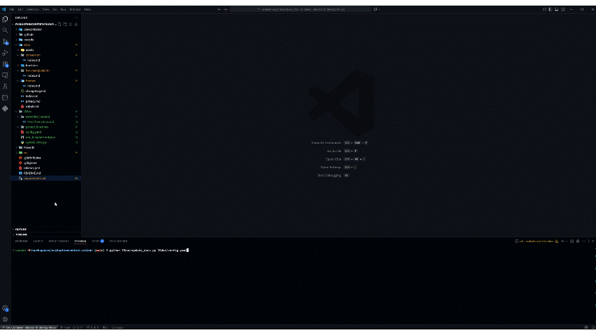

I've been working on a number of DAX UDF libraries for [DAX Lib](https://daxlib.org). We all know the feeling: you've been working hard on development, you've already documented the code, but the thought of having to spend another few hours creating proper documentation feels like a drag. This post is about a solution to auto-generate this documentation.

## JSDoc Format

In SQLBI's [DAX Naming Conventions](https://docs.sqlbi.com/dax-style/dax-naming-conventions#comments), it suggests using the [JSDoc standard](https://jsdoc.app/) for DAX UDF function comments.

JSDoc is a markup language used to annotate source code with documentation. Originally designed for JavaScript, the format uses structured comments with special tags to describe functions, parameters, return values, and other code elements.

### Basic Structure

JSDoc comments start with `///` (triple-slash in DAX) and use `@tags` to denote different documentation elements:

```tmdl
/// Function description goes here
/// @param {type} paramName – Parameter description
/// @returns {type} Return value description
/// @example FunctionName(arg1, arg2)
function 'Library.Function' = ...
```

### Common Tags

The most frequently used JSDoc tags include:

- **`@param`** – Documents function parameters with type, name, and description
- **`@returns`** – Describes what the function returns
- **`@example`** – Provides usage examples
- **`@author`** – Names the function author/maintainer
- **`@version`** – Indicates current version number
- **`@since`** – Records when the function was first introduced
- **`@see`** – References related functions or documentation
- **`@deprecated`** – Marks functions as obsolete with migration guidance

JSDoc's strength lies in its standardization—tools can parse these comments to automatically generate documentation, IDE tooltips, and API references, making it valuable for maintaining consistent documentation across large codebases.


## EvaluationContext.Colour

I have a library `EvaluationContext.Colour` set up as a DAX Lib [Medium/Large](https://evaluationcontext.github.io/posts/DaxLibContribute/#mediumlarge-library) library, and I'm hosting the [documentation](https://evaluationcontext.github.io/evaluationcontext.colour/) on GitHub Pages using :simple-materialformkdocs: Material for MkDocs. The [repo](https://github.com/EvaluationContext/evaluationcontext.colour) has both the source functions for DAX Lib and the site definition.

### Repo Structure

``` { .json .annotate .no-copy }
├── 📁 .devcontainer // (1)!
│    ├── 📄 devcontainer.json
│    └── 📄 Dockerfile
├── 📁 .github
│    └── 📁 workflows
│        ├── 📄 publish-package.yml // (2)!
│        └── 📄 ci.yml // (3)!
├── 📁 src // (4)!
│    ├── 📁 lib
│    │    └── functions.tmdl
│    ├── 📄 icon.png
│    ├── 📄 README.md
│    └── 📄 manifest.daxlib
├── 📁 docs // (5)!
│    ├── 📄 index.md
│    └── 📄 ...
├── 📁 PowerBI // (6)!
│    ├── 📄 Model.pbip
│    └── 📄 ...
├── 📄 mkdocs.yml // (7)!
├── 📄 requirements.txt // (8)!
└── 📄 .gitignore // (9)!
```

1. Dev Container configuration for containerized development
2. Workflow to create a pull request to `daxlib/daxlib` repo
3. GitHub workflow to build and deploy site to `gh-pages` branch
4. DAX Lib library source
5. Markdown files for all MkDocs site pages
6. Power BI Project file for function testing and examples
7. MkDocs site configuration
8. Python dependencies for MkDocs and Material theme
9. Git ignore file for PBIP and MkDocs specific files

### Comments

Currently my comments are formatted like this:

```tmdl
/// Select theme colour, wrapping around to the start if variant exceeds available options
/// themeName	STRING	The theme name e.g. "Office", "Power BI"
/// variant		INT64	The variant index (1-N, wraps around if exceeds available variants)
```

So first things first, we need to update them to JSDoc standards:

``` tmdl
/// Selects a theme color with variant wrapping
/// @param {string} themeName – The theme name (e.g., "Office", "Power BI")
/// @param {int} variant – The variant index (1-N, wraps around if exceeds available variants)
/// @returns {string} Theme color in hex format
/// @example EvaluationContext.Colour.Hex.Theme("Power BI", 2) // Returns "#12239E"
function 'EvaluationContext.Colour.Hex.Theme' = 
...
```

## Solution

We're going to want to generate a script that will perform the following actions:

1. **Parse** - Reads `src/lib/functions.tmdl` and parse JSDoc `@tag` from UDF function comments
2. **Store** - Store `@tags` as json
3. **Enhance** - Include additional content that is too verbose for inclusion in function comments but should be included in the site page
4. **Merge** - Combines JSDoc data + extended content using a [Jinja](https://jinja.palletsprojects.com/en/stable/) template
5. **Generate** - Writes complete markdown documentation pages to the `docs/` folder
6. **Organize** - Automatically places files in correct subfolders (conversion, hex-manipulation, themes) based on function name

??? info "Supported Tags"

    | Tag | Required | Format | Purpose |
    |-----|----------|--------|---------|
    | Description | :material-check: | `/// Description text` | Brief function summary |
    | `@param` | :material-check: | `@param {type} name – description` | Document parameters, `[]` for optional |
    | `@returns` | :material-check: | `@returns {type} description` | Describe return value |
    | `@example` | :material-close: | `@example FunctionCall()` | Override auto-generated example |
    | `@author` | :material-close: | `@author Name` | Function author/maintainer |
    | `@version` | :material-close: | `@version 1.0.0` | Current version |
    | `@since` | :material-close: | `@since 1.0.0` | Version/date introduced |
    | `@see` | :material-close: | `@see Reference` | Related functions (can repeat) |
    | `@deprecated` | :material-close: | `@deprecated Message` | Mark as obsolete |

`update_docs.py` performs the actions above, supported by some other files detailed below.

``` { .json .annotate .no-copy }
...
├── 📁 JSDoc
│    ├── 📁 extended_content 
│    │    ├── 📄 Hex.Theme.pretab.md // (1)!
│    │    └── 📄 Hex.Theme.tabs.md // (2)!
│    ├── 📁 parsed_functions // (3)!
│    │    ├── 📄 EvaluationContext.Colour.Hex.AdjustAlpha.json
│    │    ├── ...
│    │    └── 📄 EvaluationContext.Colour.RGB.ToHex.json
│    ├── 📄 config.yaml // (4)!
│    ├── 📄 doc_template.md.jinja // (5)!
│    └── 📄 update_docs.py // (6)!   
...
```

1. Content that appears **before** the tabbed sections (Syntax/Example/Definition)
2. Additional tabs that appear **alongside** the standard Syntax/Example/Definition tabs
3. Function metadata extracted from JSDoc comments
4. Config file to specify source, destination and template, and path_mapping to map functions to logical folders
5. Template for how function metadata and extended content should generate markdown files
6. Script to extract function metadata and generate function markdown files using Jinja template

=== "config.yaml"

    Configuration for `update_docs.py`

    ```yaml
    # Documentation Generation Configuration

    # REQUIRED: Source TMDL file (relative to repository root)
    source: src/lib/functions.tmdl

    # REQUIRED: Destination directory (relative to repository root)
    destination: docs

    # OPTIONAL: Jinja template file (relative to repository root)
    template: JSdoc/doc_template.md.jinja

    # OPTIONAL: Output directory for JSON metadata (relative to JSdoc folder)
    output_dir: parsed_functions

    path_mapping:
    # Pattern matching: map patterns to subfolders
    # Use | to separate multiple patterns for the same folder
    pattern_match:
        "ToHex|ToInt": conversion
        "Theme|Interpolate|LinearTheme": themes
        "Hex.": hex-manipulation
    
    # Exact function name to path mapping (overrides pattern matching)
    # Use relative paths from destination directory or absolute paths
    function_paths:
        "Hex.Theme": themes
        "Hex.Interpolate": themes
        "Hex.LinearTheme": themes
        "RGB.ToHex": conversion
        "HSL.ToHex": conversion
        "Int.ToHex": conversion
        "Hex.ToInt": conversion
    ```

=== "extended_content/Hex.Theme.tabs.md"

    Extra markdown context to be added to specific function markdown pages

    ```md
    === "Themes"

        | Variant | Power BI | Modern Corporate | Ocean Breeze | Sunset Vibes | Forest Green | Purple Rain | Monochrome | Vibrant Tech | Earth Tones | Pastel Dreams | Midnight Blue |
        |:---:|:---:|:---:|:---:|:---:|:---:|:---:|:---:|:---:|:---:|:---:|:---:|
        | 1 | <span class="d-inline-block p-2 mr-1 v-align-middle" style="background-color: #118DFF;"></span> | <span class="d-inline-block p-2 mr-1 v-align-middle" style="background-color: #2E3440;"></span> | <span class="d-inline-block p-2 mr-1 v-align-middle" style="background-color: #0077BE;"></span> | <span class="d-inline-block p-2 mr-1 v-align-middle" style="background-color: #FF6B35;"></span> | <span class="d-inline-block p-2 mr-1 v-align-middle" style="background-color: #355E3B;"></span> | <span class="d-inline-block p-2 mr-1 v-align-middle" style="background-color: #301934;"></span> | <span class="d-inline-block p-2 mr-1 v-align-middle" style="background-color: #1C1C1C;"></span> | <span class="d-inline-block p-2 mr-1 v-align-middle" style="background-color: #FF0080;"></span> | <span class="d-inline-block p-2 mr-1 v-align-middle" style="background-color: #8B4513;"></span> | <span class="d-inline-block p-2 mr-1 v-align-middle" style="background-color: #FFB3BA;"></span> | <span class="d-inline-block p-2 mr-1 v-align-middle" style="background-color: #191970;"></span> |
        | 2 | <span class="d-inline-block p-2 mr-1 v-align-middle" style="background-color: #12239E;"></span> | <span class="d-inline-block p-2 mr-1 v-align-middle" style="background-color: #3B4252;"></span> | <span class="d-inline-block p-2 mr-1 v-align-middle" style="background-color: #00A8CC;"></span> | <span class="d-inline-block p-2 mr-1 v-align-middle" style="background-color: #F7931E;"></span> | <span class="d-inline-block p-2 mr-1 v-align-middle" style="background-color: #228B22;"></span> | <span class="d-inline-block p-2 mr-1 v-align-middle" style="background-color: #663399;"></span> | <span class="d-inline-block p-2 mr-1 v-align-middle" style="background-color: #333333;"></span> | <span class="d-inline-block p-2 mr-1 v-align-middle" style="background-color: #00FFFF;"></span> | <span class="d-inline-block p-2 mr-1 v-align-middle" style="background-color: #A0522D;"></span> | <span class="d-inline-block p-2 mr-1 v-align-middle" style="background-color: #FFDFBA;"></span> | <span class="d-inline-block p-2 mr-1 v-align-middle" style="background-color: #000080;"></span> |
        | 3 | <span class="d-inline-block p-2 mr-1 v-align-middle" style="background-color: #E66C37;"></span> | <span class="d-inline-block p-2 mr-1 v-align-middle" style="background-color: #434C5E;"></span> | <span class="d-inline-block p-2 mr-1 v-align-middle" style="background-color: #40E0D0;"></span> | <span class="d-inline-block p-2 mr-1 v-align-middle" style="background-color: #FFD23F;"></span> | <span class="d-inline-block p-2 mr-1 v-align-middle" style="background-color: #32CD32;"></span> | <span class="d-inline-block p-2 mr-1 v-align-middle" style="background-color: #9966CC;"></span> | <span class="d-inline-block p-2 mr-1 v-align-middle" style="background-color: #666666;"></span> | <span class="d-inline-block p-2 mr-1 v-align-middle" style="background-color: #FFFF00;"></span> | <span class="d-inline-block p-2 mr-1 v-align-middle" style="background-color: #CD853F;"></span> | <span class="d-inline-block p-2 mr-1 v-align-middle" style="background-color: #FFFFBA;"></span> | <span class="d-inline-block p-2 mr-1 v-align-middle" style="background-color: #0000CD;"></span> |
        | 4 | <span class="d-inline-block p-2 mr-1 v-align-middle" style="background-color: #6B007B;"></span> | <span class="d-inline-block p-2 mr-1 v-align-middle" style="background-color: #4C566A;"></span> | <span class="d-inline-block p-2 mr-1 v-align-middle" style="background-color: #87CEEB;"></span> | <span class="d-inline-block p-2 mr-1 v-align-middle" style="background-color: #EE4B2B;"></span> | <span class="d-inline-block p-2 mr-1 v-align-middle" style="background-color: #90EE90;"></span> | <span class="d-inline-block p-2 mr-1 v-align-middle" style="background-color: #BA55D3;"></span> | <span class="d-inline-block p-2 mr-1 v-align-middle" style="background-color: #999999;"></span> | <span class="d-inline-block p-2 mr-1 v-align-middle" style="background-color: #FF8000;"></span> | <span class="d-inline-block p-2 mr-1 v-align-middle" style="background-color: #DEB887;"></span> | <span class="d-inline-block p-2 mr-1 v-align-middle" style="background-color: #BAFFC9;"></span> | <span class="d-inline-block p-2 mr-1 v-align-middle" style="background-color: #4169E1;"></span> |
        | 5 | <span class="d-inline-block p-2 mr-1 v-align-middle" style="background-color: #E044A7;"></span> | <span class="d-inline-block p-2 mr-1 v-align-middle" style="background-color: #5E81AC;"></span> | <span class="d-inline-block p-2 mr-1 v-align-middle" style="background-color: #B0E0E6;"></span> | <span class="d-inline-block p-2 mr-1 v-align-middle" style="background-color: #C04000;"></span> | <span class="d-inline-block p-2 mr-1 v-align-middle" style="background-color: #98FB98;"></span> | <span class="d-inline-block p-2 mr-1 v-align-middle" style="background-color: #DDA0DD;"></span> | <span class="d-inline-block p-2 mr-1 v-align-middle" style="background-color: #CCCCCC;"></span> | <span class="d-inline-block p-2 mr-1 v-align-middle" style="background-color: #8000FF;"></span> | <span class="d-inline-block p-2 mr-1 v-align-middle" style="background-color: #F4A460;"></span> | <span class="d-inline-block p-2 mr-1 v-align-middle" style="background-color: #BAE1FF;"></span> | <span class="d-inline-block p-2 mr-1 v-align-middle" style="background-color: #6495ED;"></span> |
        | 6 | <span class="d-inline-block p-2 mr-1 v-align-middle" style="background-color: #744EC2;"></span> | <span class="d-inline-block p-2 mr-1 v-align-middle" style="background-color: #81A1C1;"></span> | <span class="d-inline-block p-2 mr-1 v-align-middle" style="background-color: #E0F6FF;"></span> | <span class="d-inline-block p-2 mr-1 v-align-middle" style="background-color: #FFCBA4;"></span> | <span class="d-inline-block p-2 mr-1 v-align-middle" style="background-color: #F0FFF0;"></span> | <span class="d-inline-block p-2 mr-1 v-align-middle" style="background-color: #E6E6FA;"></span> | <span class="d-inline-block p-2 mr-1 v-align-middle" style="background-color: #F5F5F5;"></span> | <span class="d-inline-block p-2 mr-1 v-align-middle" style="background-color: #00FF80;"></span> | <span class="d-inline-block p-2 mr-1 v-align-middle" style="background-color: #FFF8DC;"></span> | | <span class="d-inline-block p-2 mr-1 v-align-middle" style="background-color: #B0C4DE;"></span> |
        | ... | 
        | 41 | <span class="d-inline-block p-2 mr-1 v-align-middle" style="background-color: #0B511F;"></span>
    ```

=== "doc_template.md.jinja"

    Jinja template for how JSON files and extended context should generate markdown pages

    ```jinja
    # {{ short_name }}

    {{ description }}
    

    {{ pretab_content }}
    

    {{ syntax_section }}

    {{ example_section }}
    

    {{ additional_tabs }}
    

    {{ definition_section }}
    ```

=== "update_docs.py"

    Script to parse `function.tmdl` and generate function markdown pages

    ```py
    import re
    import json
    import yaml
    from pathlib import Path
    from typing import Dict, List, Optional
    from dataclasses import dataclass, asdict


    @dataclass
    class FunctionParameter:
        """Represents a function parameter."""
        name: str
        type: str
        description: str
        optional: bool = False
        default_value: Optional[str] = None


    @dataclass
    class FunctionMetadata:
        """Represents extracted function metadata."""
        name: str
        short_name: str  # e.g., "Hex.Theme" from "EvaluationContext.Colour.Hex.Theme"
        description: str
        parameters: List[FunctionParameter]
        return_type: str
        return_description: str
        code: str
        example: Optional[str] = None
        author: Optional[str] = None
        version: Optional[str] = None
        since: Optional[str] = None
        see: Optional[List[str]] = None
        deprecated: Optional[str] = None

    def parse_tmdl_functions(tmdl_path: Path) -> List[FunctionMetadata]:
        """
        Parse TMDL file and extract function metadata from JSDoc comments.
        
        Args:
            tmdl_path: Path to the functions.tmdl file
            
        Returns:
            List of FunctionMetadata objects
        """
        content = tmdl_path.read_text(encoding='utf-8')
        functions = []
        
        # Split by annotation blocks to separate functions
        # Each function ends with annotation lines
        function_blocks = re.split(
            r'(\n\s*annotation\s+DAXLIB_PackageVersion\s*=.*?\n)',
            content
        )
        
        # Process pairs: function_code + annotation
        i = 0
        while i < len(function_blocks):
            block = function_blocks[i]
            
            # Look for JSDoc comment + function definition
            func_match = re.search(
                r"((?:///.*\n)+)"  # JSDoc comments
                r"\s*"
                r"function\s+'([^']+)'\s*="  # function 'name' =
                r"(.*)",  # Function body (rest of block)
                block,
                re.DOTALL | re.MULTILINE
            )
            
            if func_match:
                jsdoc_block = func_match.group(1)
                function_name = func_match.group(2).strip()
                function_body = func_match.group(3).strip()
            
                # Extract short name (e.g., "Hex.Theme" from "EvaluationContext.Colour.Hex.Theme")
                short_name = function_name.replace('EvaluationContext.Colour.', '')
            
                # Parse JSDoc comments
                description_lines = []
                parameters = []
                return_type = ""
                return_description = ""
                custom_example = None  # For @example tag
                author = None
                version = None
                since = None
                see_also = []
                deprecated = None
            
                for line in jsdoc_block.split('\n'):
                    line = line.strip().lstrip('/').strip()
                
                    if line.startswith('@param'):
                        # Parse: @param {type} name – description
                        # or: @param {type} [name] – description (optional)
                        # or: @param {type} [name=default] – description (optional with default)
                        
                        # Try optional parameter with default value first
                        param_match = re.match(r'@param\s+\{([^}]+)\}\s+\[(\w+)=([^\]]+)\]\s+–\s+(.*)', line)
                        if param_match:
                            param_type = param_match.group(1)
                            param_name = param_match.group(2)
                            default_value = param_match.group(3)
                            param_desc = param_match.group(4)
                            parameters.append(FunctionParameter(param_name, param_type, param_desc, optional=True, default_value=default_value))
                        else:
                            # Try optional parameter without default value
                            param_match = re.match(r'@param\s+\{([^}]+)\}\s+\[(\w+)\]\s+–\s+(.*)', line)
                            if param_match:
                                param_type = param_match.group(1)
                                param_name = param_match.group(2)
                                param_desc = param_match.group(3)
                                parameters.append(FunctionParameter(param_name, param_type, param_desc, optional=True))
                            else:
                                # Try required parameter
                                param_match = re.match(r'@param\s+\{([^}]+)\}\s+(\w+)\s+–\s+(.*)', line)
                                if param_match:
                                    param_type = param_match.group(1)
                                    param_name = param_match.group(2)
                                    param_desc = param_match.group(3)
                                    parameters.append(FunctionParameter(param_name, param_type, param_desc))
                    elif line.startswith('@example'):
                        # Parse: @example function call or description
                        example_match = re.match(r'@example\s+(.*)', line)
                        if example_match:
                            custom_example = example_match.group(1)
                    elif line.startswith('@author'):
                        # Parse: @author Name
                        author_match = re.match(r'@author\s+(.*)', line)
                        if author_match:
                            author = author_match.group(1)
                    elif line.startswith('@version'):
                        # Parse: @version 1.0.0
                        version_match = re.match(r'@version\s+(.*)', line)
                        if version_match:
                            version = version_match.group(1)
                    elif line.startswith('@since'):
                        # Parse: @since 1.0.0 or @since 2024-01-01
                        since_match = re.match(r'@since\s+(.*)', line)
                        if since_match:
                            since = since_match.group(1)
                    elif line.startswith('@see'):
                        # Parse: @see RelatedFunction or @see https://url
                        see_match = re.match(r'@see\s+(.*)', line)
                        if see_match:
                            see_also.append(see_match.group(1))
                    elif line.startswith('@deprecated'):
                        # Parse: @deprecated Use NewFunction instead
                        deprecated_match = re.match(r'@deprecated\s+(.*)', line)
                        if deprecated_match:
                            deprecated = deprecated_match.group(1)
                        else:
                            deprecated = "This function is deprecated"
                    elif line.startswith('@returns'):
                        # Parse: @returns {type} description
                        return_match = re.match(r'@returns\s+\{([^}]+)\}\s+(.*)', line)
                        if return_match:
                            return_type = return_match.group(1).upper()
                            return_description = return_match.group(2)
                    elif line and not line.startswith('@'):
                        # Description line
                        description_lines.append(line.strip())
            
                description = ' '.join(description_lines).strip()
            
                # Extract function code (clean up formatting and remove annotations)
                # Split function body to remove annotations
                body_lines = function_body.split('\n')
                clean_body_lines = []
                for line in body_lines:
                    # Stop at annotation lines
                    if 'annotation DAXLIB_' in line:
                        break
                    clean_body_lines.append(line)
                
                # Reconstruct the clean function body
                clean_body = '\n'.join(clean_body_lines).rstrip()
                
                # Ensure opening parenthesis has proper indentation (2 tabs)
                # The function body starts with whitespace + (, we need to ensure it has 2 tabs
                if clean_body.lstrip().startswith('('):
                    # Remove leading whitespace and add 2 tabs
                    clean_body = '\t\t' + clean_body.lstrip()
                
                code = f"function '{function_name}' =\n{clean_body}"
            
                # Generate example (use custom example if provided, otherwise auto-generate)
                example = custom_example if custom_example else generate_example(function_name, parameters)
            
                functions.append(FunctionMetadata(
                    name=function_name,
                    short_name=short_name,
                    description=description,
                    parameters=parameters,
                    return_type=return_type,
                    return_description=return_description,
                    code=code,
                    example=example,
                    author=author,
                    version=version,
                    since=since,
                    see=see_also if see_also else None,
                    deprecated=deprecated
                ))
            
            # Move to next block
            i += 1
        
        return functions


    def generate_example(function_name: str, parameters: List[FunctionParameter]) -> str:
        """
        Generate a basic example usage for a function.
        This is just a fallback - use @example tag for better examples.
        
        Args:
            function_name: Full function name
            parameters: List of function parameters
            
        Returns:
            Example DAX code as string
        """
        # Create simple placeholder example
        if len(parameters) == 0:
            return f"{function_name}()"
        
        # Create generic parameter placeholders
        param_names = [p.name for p in parameters]
        params_str = ', '.join(param_names)
        return f"{function_name}({params_str})"


    def type_to_label(dax_type: str) -> str:
        """
        Convert DAX type to HTML span with proper class.
        
        Args:
            dax_type: DAX type (STRING, INT64, DOUBLE, DECIMAL, etc.)
            
        Returns:
            HTML span element
        """
        type_map = {
            'STRING': ('string', 'STRING'),
            'INT64': ('int64', 'INT64'),
            'INT': ('int64', 'INT64'),
            'INTEGER': ('int64', 'INT64'),
            'DOUBLE': ('number', 'DOUBLE'),
            'NUMBER': ('number', 'DOUBLE'),
            'DECIMAL': ('number', 'DOUBLE'),
        }
        
        css_class, display_text = type_map.get(dax_type.upper(), ('string', 'STRING'))
        return f'<span class="type-label {css_class}">{display_text}</span>'


    def create_syntax_section(func: FunctionMetadata) -> str:
        """
        Create the Syntax tab content.
        
        Args:
            func: Function metadata
            
        Returns:
            Markdown string for syntax section
        """
        lines = ['=== "Syntax"', '', '    ```dax']
        
        # Function signature - do NOT use brackets in code sample
        param_parts = []
        for p in func.parameters:
            param_parts.append(p.name)
        param_list = ', '.join(param_parts)
        lines.append(f'    {func.name}( {param_list} )')
        lines.append('    ```')
        lines.append('')
        
        # Parameters table
        if func.parameters:
            lines.append('    | Parameter | Type | Required | Description |')
            lines.append('    |:---:|:---:|:---:|---|')
            
            for param in func.parameters:
                type_label = type_to_label(param.type)
                # Use :material-close: for optional, :material-check: for required
                required_icon = ':material-close:' if param.optional else ':material-check:'
                # Add default value to description if present
                description = param.description
                if param.optional and param.default_value:
                    description += f' (default: {param.default_value})'
                lines.append(f'    | {param.name} | {type_label} | {required_icon} | {description} |')
            
            lines.append('')
        
        # Return type
        return_label = type_to_label(func.return_type)
        lines.append(f'    {return_label} {func.return_description}')
        
        return '\n'.join(lines)


    def create_example_section(func: FunctionMetadata) -> str:
        """
        Create the Example tab content.
        
        Args:
            func: Function metadata
            
        Returns:
            Markdown string for example section
        """
        lines = ['=== "Example"', '', '    ```dax']
        lines.append(f'    {func.example}')
        lines.append('    ```')
        
        return '\n'.join(lines)


    def create_definition_section(func: FunctionMetadata) -> str:
        """
        Create the Definition tab content.
        
        Args:
            func: Function metadata
            
        Returns:
            Markdown string for definition section
        """
        lines = ['=== "Definition"', '', '    ```dax']
        
        # Add function code with proper indentation
        # Annotations already removed during parsing
        for line in func.code.split('\n'):
            lines.append(f'    {line}')
        
        lines.append('    ```')
        
        return '\n'.join(lines)


    def get_doc_path(base_dir: Path, func: FunctionMetadata, custom_mapping: Optional[Dict] = None) -> Path:
        """
        Determine the appropriate documentation path based on function type.
        
        Args:
            base_dir: Base docs directory
            func: Function metadata
            custom_mapping: Optional custom mapping from config (pattern_match or function_paths)
            
        Returns:
            Path to the documentation file
        """
        short_name = func.short_name
        filename = f"{func.short_name}.md"
        
        # Check custom mapping first
        if custom_mapping:
            # Check for exact function name match
            if 'function_paths' in custom_mapping and short_name in custom_mapping['function_paths']:
                custom_path = custom_mapping['function_paths'][short_name]
                return Path(custom_path) if Path(custom_path).is_absolute() else base_dir / custom_path / filename
            
            # Check pattern matching
            if 'pattern_match' in custom_mapping:
                for pattern, subfolder in custom_mapping['pattern_match'].items():
                    # Split pattern by | for OR matching
                    patterns = [p.strip() for p in pattern.split('|')]
                    if any(p in short_name for p in patterns):
                        return base_dir / subfolder / filename
        
        # Default pattern matching
        if any(x in short_name for x in ['ToHex', 'ToInt']):
            subfolder = 'conversion'
        elif any(x in short_name for x in ['Theme', 'Interpolate', 'LinearTheme']):
            subfolder = 'theming'
        elif short_name.startswith('Hex.'):
            subfolder = 'hex-manipulation'
        else:
            subfolder = 'conversion'  # Default
        
        return base_dir / subfolder / filename


    def save_function_metadata(output_dir: Path, func: FunctionMetadata) -> Path:
        """
        Save function metadata to a JSON file for use with Jinja templates.
        
        Args:
            output_dir: Directory to save JSON files
            func: Function metadata
            
        Returns:
            Path to the saved JSON file
        """
        output_dir.mkdir(parents=True, exist_ok=True)
        
        # Convert to dictionary, handling the dataclass nested structure
        func_dict = {
            'name': func.name,
            'short_name': func.short_name,
            'description': func.description,
            'parameters': [
                {
                    'name': p.name,
                    'type': p.type,
                    'type_label': type_to_label(p.type),
                    'description': p.description,
                    'optional': p.optional,
                    'default_value': p.default_value
                }
                for p in func.parameters
            ],
            'return_type': func.return_type,
            'return_type_label': type_to_label(func.return_type),
            'return_description': func.return_description,
            'code': func.code,
            'example': func.example,
            'author': func.author,
            'version': func.version,
            'since': func.since,
            'see': func.see,
            'deprecated': func.deprecated,
            # Pre-rendered sections for convenience
            'sections': {
                'syntax': create_syntax_section(func),
                'example': create_example_section(func),
                'definition': create_definition_section(func)
            }
        }
        
        # Save to JSON file named after the function
        json_path = output_dir / f"{func.name}.json"
        with json_path.open('w', encoding='utf-8') as f:
            json.dump(func_dict, f, indent=2, ensure_ascii=False)
        
        return json_path


    def load_extended_content(base_dir: Path, func: FunctionMetadata, content_type: str) -> Optional[str]:
        """
        Load extended content for a function if it exists.
        
        Args:
            base_dir: Base directory containing extended_content folder
            func: Function metadata
            content_type: Type of content ('pretab' or 'tabs')
            
        Returns:
            Content string if file exists (with trailing whitespace stripped), None otherwise
        """
        extended_dir = base_dir / 'extended_content'
        filename = f"{func.short_name}.{content_type}.md"
        filepath = extended_dir / filename
        
        if filepath.exists():
            try:
                # Read and strip trailing whitespace/newlines
                return filepath.read_text(encoding='utf-8').rstrip()
            except Exception as e:
                print(f"Warning: Could not read {filepath}: {e}")
                return None
        
        return None


    def create_page_from_template(template_path: Path, output_path: Path, func: FunctionMetadata, extended_content_dir: Optional[Path] = None) -> bool:
        """
        Create a documentation page from a Jinja template.
        
        Args:
            template_path: Path to the Jinja template file
            output_path: Path where the markdown file should be created
            func: Function metadata
            extended_content_dir: Optional directory containing extended content files
            
        Returns:
            True if created successfully
        """
        try:
            from jinja2 import Template
            
            # Read template
            template_content = template_path.read_text(encoding='utf-8')
            template = Template(template_content)
            
            # Load extended content if directory provided
            pretab_content = None
            additional_tabs = None
            if extended_content_dir:
                pretab_content = load_extended_content(extended_content_dir.parent, func, 'pretab')
                additional_tabs = load_extended_content(extended_content_dir.parent, func, 'tabs')
            
            # Prepare context
            context = {
                'name': func.name,
                'short_name': func.short_name,
                'description': func.description,
                'parameters': func.parameters,
                'return_type': func.return_type,
                'return_type_label': type_to_label(func.return_type),
                'return_description': func.return_description,
                'code': func.code,
                'example': func.example,
                'syntax_section': create_syntax_section(func),
                'example_section': create_example_section(func),
                'definition_section': create_definition_section(func),
                'pretab_content': pretab_content,
                'additional_tabs': additional_tabs,
            }
            
            # Render template
            rendered = template.render(**context)
            
            # Ensure directory exists
            output_path.parent.mkdir(parents=True, exist_ok=True)
            
            # Write content
            output_path.write_text(rendered, encoding='utf-8')
            return True
            
        except ImportError:
            print("Warning: jinja2 not installed. Install with: pip install jinja2")
            return False
        except Exception as e:
            print(f"Error creating page from template: {e}")
            return False


    def main():
        """Main execution function."""
        import argparse
        
        parser = argparse.ArgumentParser(description='Parse TMDL functions and generate documentation data')
        parser.add_argument('config', type=str,
                        help='Path to YAML configuration file')
        
        args = parser.parse_args()
        
        # Load configuration from YAML
        config_path = Path(args.config)
        if not config_path.exists():
            print(f"Error: Config file not found: {config_path}")
            return
        
        with config_path.open('r', encoding='utf-8') as f:
            config = yaml.safe_load(f)
        
        print(f"Loaded configuration from: {config_path}")
        
        # Paths - script is now in JSdoc folder, so go up one level to root
        script_dir = Path(__file__).parent
        root_dir = script_dir.parent
        
        # Get paths from config (required)
        if 'source' not in config:
            print("Error: 'source' not specified in config file")
            return
        if 'destination' not in config:
            print("Error: 'destination' not specified in config file")
            return
        
        tmdl_path = root_dir / config['source']
        docs_dir = root_dir / config['destination']
        output_dir = script_dir / config.get('output_dir', 'parsed_functions')
        template_path = config.get('template', None)
        
        if not tmdl_path.exists():
            print(f"Error: Source file not found: {tmdl_path}")
            return
        
        print(f"Parsing functions from: {tmdl_path}")
        print(f"Documentation directory: {docs_dir}")
        print(f"Metadata output: {output_dir}")
        if template_path:
            print(f"Using template: {template_path}")
        
        # Parse functions
        functions = parse_tmdl_functions(tmdl_path)
        
        print(f"Found {len(functions)} functions")
        print(f"Saving metadata to: {output_dir}")
        
        # Extended content directory
        extended_content_dir = script_dir / 'extended_content'
        
        # Save metadata and create/update pages
        saved_count = 0
        created_count = 0
        updated_count = 0
        
        # Get custom path mapping from config
        custom_mapping = config.get('path_mapping', None)
        
        for func in functions:
            # Save JSON metadata
            json_path = save_function_metadata(output_dir, func)
            saved_count += 1
            print(f"\n✓ Saved metadata: {json_path.name}")
            
            # Always create/update pages when running with config
            doc_path = get_doc_path(docs_dir, func, custom_mapping)
            
            if not doc_path.exists():
                print(f"  Creating page: {doc_path}")
                
                if not template_path:
                    print(f"  ✗ No template specified in config file")
                    continue
                
                # Use Jinja template
                template_file = root_dir / template_path if not Path(template_path).is_absolute() else Path(template_path)
                if template_file.exists():
                    if create_page_from_template(template_file, doc_path, func, extended_content_dir):
                        created_count += 1
                        print(f"  ✓ Created from template")
                    else:
                        print(f"  ✗ Failed to create from template")
                else:
                    print(f"  ✗ Template not found: {template_file}")
            else:
                print(f"  Updating page: {doc_path.name}")
                
                if not template_path:
                    print(f"  ✗ No template specified in config file")
                    continue
                
                # Use Jinja template
                template_file = root_dir / template_path if not Path(template_path).is_absolute() else Path(template_path)
                if template_file.exists():
                    if create_page_from_template(template_file, doc_path, func, extended_content_dir):
                        updated_count += 1
                        print(f"  ✓ Updated from template")
                    else:
                        print(f"  ✗ Failed to update from template")
                else:
                    print(f"  ✗ Template not found: {template_file}")
        
        # Create summary JSON with all functions
        summary_path = output_dir / '_all_functions.json'
        summary_data = {
            'functions': [
                {
                    'name': f.name,
                    'short_name': f.short_name,
                    'description': f.description,
                    'json_file': f"{f.name}.json"
                }
                for f in functions
            ],
            'total_count': len(functions),
            'categories': {
                'conversion': [f.short_name for f in functions if any(x in f.short_name for x in ['ToHex', 'ToInt'])],
                'hex_manipulation': [f.short_name for f in functions if f.short_name.startswith('Hex.') and not any(x in f.short_name for x in ['Theme', 'Interpolate', 'LinearTheme'])],
                'themes': [f.short_name for f in functions if any(x in f.short_name for x in ['Theme', 'Interpolate', 'LinearTheme'])]
            }
        }
        
        with summary_path.open('w', encoding='utf-8') as f:
            json.dump(summary_data, f, indent=2, ensure_ascii=False)
        
        print(f"\n{'='*60}")
        print(f"Summary:")
        print(f"  Functions parsed: {len(functions)}")
        print(f"  Metadata files saved: {saved_count}")
        print(f"  New pages created: {created_count}")
        print(f"  Existing pages updated: {updated_count}")
        print(f"  Summary file: {summary_path}")
        print(f"{'='*60}")
        print(f"\n✓ Documentation generation complete!")


    if __name__ == '__main__':
        main()
    ```

=== "parsed_functions/EvaluationContext.Colour.Hex.Theme.json"

    Script extracts tags from function comments and stores them as a JSON file.

    ```json
    {
        "name": "EvaluationContext.Colour.Hex.Theme",
        "short_name": "Hex.Theme",
        "description": "Selects a theme color with variant wrapping",
        "parameters": [
            {
            "name": "themeName",
            "type": "string",
            "type_label": "<span class=\"type-label string\">STRING</span>",
            "description": "The theme name (e.g., \"Office\", \"Power BI\")",
            "optional": false,
            "default_value": null
            },
            {
            "name": "variant",
            "type": "int",
            "type_label": "<span class=\"type-label int64\">INT64</span>",
            "description": "The variant index (1-N, wraps around if exceeds available variants)",
            "optional": false,
            "default_value": null
            }
        ],
        "return_type": "STRING",
        "return_type_label": "<span class=\"type-label string\">STRING</span>",
        "return_description": "Theme color in hex format",
        "code": "function 'EvaluationContext.Colour.Hex.Theme' =\n\t\t(\n\t\t\tthemeName: STRING,\n\t\t\tvariant: INT64\n\t\t) =>\n\t\t\n\t\t\tVAR Themes =\n\t\t\t\tDATATABLE(\n\t\t\t\t\"ThemeName\", STRING,\n\t\t\t\t\"Variant\", INTEGER,\n\t\t\t\t\"Colour\", STRING,\n\t\t\t\t{\n\t\t\t\t\t// Power BI Default\n\t\t\t\t\t{\"Power BI\", 1, \"#118DFF\"},\n\t\t\t\t\t{\"Power BI\", 2, \"#12239E\"},\n\t\t\t\t\t{\"Power BI\", 3, \"#E66C37\"},\n\t\t\t\t\t{\"Power BI\", 4, \"#6B007B\"},\n\t\t\t\t\t{\"Power BI\", 5, \"#E044A7\"},\n\t\t\t\t\t{\"Power BI\", 6, \"#744EC2\"},\n\t\t\t\t\t{\"Power BI\", 7, \"#D9B300\"},\n\t\t\t\t\t{\"Power BI\", 8, \"#D64550\"},\n\t\t\t\t\t{\"Power BI\", 9, \"#197278\"},\n\t\t\t\t\t{\"Power BI\", 10, \"#1AAB40\"},\n\t\t\t\t\t{\"Power BI\", 11, \"#15C6F4\"},\n\t\t\t\t\t{\"Power BI\", 12, \"#4092FF\"},\n\t\t\t\t\t{\"Power BI\", 13, \"#FFA058\"},\n\t\t\t\t\t{\"Power BI\", 14, \"#BE5DC9\"},\n\t\t\t\t\t{\"Power BI\", 15, \"#F472D0\"},\n\t\t\t\t\t{\"Power BI\", 16, \"#B5A1FF\"},\n\t\t\t\t\t{\"Power BI\", 17, \"#C4A200\"},\n\t\t\t\t\t{\"Power BI\", 18, \"#FF8080\"},\n\t\t\t\t\t{\"Power BI\", 19, \"#00DBBC\"},\n\t\t\t\t\t{\"Power BI\", 20, \"#5BD667\"},\n\t\t\t\t\t{\"Power BI\", 21, \"#0091D5\"},\n\t\t\t\t\t{\"Power BI\", 22, \"#4668C5\"},\n\t\t\t\t\t{\"Power BI\", 23, \"#FF6300\"},\n\t\t\t\t\t{\"Power BI\", 24, \"#99008A\"},\n\t\t\t\t\t{\"Power BI\", 25, \"#EC008C\"},\n\t\t\t\t\t{\"Power BI\", 26, \"#533285\"},\n\t\t\t\t\t{\"Power BI\", 27, \"#99700A\"},\n\t\t\t\t\t{\"Power BI\", 28, \"#FF4141\"},\n\t\t\t\t\t{\"Power BI\", 29, \"#1F9A85\"},\n\t\t\t\t\t{\"Power BI\", 30, \"#25891C\"},\n\t\t\t\t\t{\"Power BI\", 31, \"#0057A2\"},\n\t\t\t\t\t{\"Power BI\", 32, \"#002050\"},\n\t\t\t\t\t{\"Power BI\", 33, \"#C94F0F\"},\n\t\t\t\t\t{\"Power BI\", 34, \"#450F54\"},\n\t\t\t\t\t{\"Power BI\", 35, \"#B60064\"},\n\t\t\t\t\t{\"Power BI\", 36, \"#34124F\"},\n\t\t\t\t\t{\"Power BI\", 37, \"#6A5A29\"},\n\t\t\t\t\t{\"Power BI\", 38, \"#1AAB40\"},\n\t\t\t\t\t{\"Power BI\", 39, \"#BA141A\"},\n\t\t\t\t\t{\"Power BI\", 40, \"#0C3D37\"},\n\t\t\t\t\t{\"Power BI\", 41, \"#0B511F\"},\n\t\t\n\t\t\t\t\t// Modern Corporate - Professional blues and grays\n\t\t\t\t\t{\"Modern Corporate\", 1, \"#2E3440\"},\n\t\t\t\t\t{\"Modern Corporate\", 2, \"#3B4252\"},\n\t\t\t\t\t{\"Modern Corporate\", 3, \"#434C5E\"},\n\t\t\t\t\t{\"Modern Corporate\", 4, \"#4C566A\"},\n\t\t\t\t\t{\"Modern Corporate\", 5, \"#5E81AC\"},\n\t\t\t\t\t{\"Modern Corporate\", 6, \"#81A1C1\"},\n\t\t\n\t\t\t\t\t// Ocean Breeze - Cool blues and teals\n\t\t\t\t\t{\"Ocean Breeze\", 1, \"#0077BE\"},\n\t\t\t\t\t{\"Ocean Breeze\", 2, \"#00A8CC\"},\n\t\t\t\t\t{\"Ocean Breeze\", 3, \"#40E0D0\"},\n\t\t\t\t\t{\"Ocean Breeze\", 4, \"#87CEEB\"},\n\t\t\t\t\t{\"Ocean Breeze\", 5, \"#B0E0E6\"},\n\t\t\t\t\t{\"Ocean Breeze\", 6, \"#E0F6FF\"},\n\t\t\n\t\t\t\t\t// Sunset Vibes - Warm oranges and reds\n\t\t\t\t\t{\"Sunset Vibes\", 1, \"#FF6B35\"},\n\t\t\t\t\t{\"Sunset Vibes\", 2, \"#F7931E\"},\n\t\t\t\t\t{\"Sunset Vibes\", 3, \"#FFD23F\"},\n\t\t\t\t\t{\"Sunset Vibes\", 4, \"#EE4B2B\"},\n\t\t\t\t\t{\"Sunset Vibes\", 5, \"#C04000\"},\n\t\t\t\t\t{\"Sunset Vibes\", 6, \"#FFCBA4\"},\n\t\t\n\t\t\t\t\t// Forest Green - Natural greens\n\t\t\t\t\t{\"Forest Green\", 1, \"#355E3B\"},\n\t\t\t\t\t{\"Forest Green\", 2, \"#228B22\"},\n\t\t\t\t\t{\"Forest Green\", 3, \"#32CD32\"},\n\t\t\t\t\t{\"Forest Green\", 4, \"#90EE90\"},\n\t\t\t\t\t{\"Forest Green\", 5, \"#98FB98\"},\n\t\t\t\t\t{\"Forest Green\", 6, \"#F0FFF0\"},\n\t\t\n\t\t\t\t\t// Purple Rain - Rich purples\n\t\t\t\t\t{\"Purple Rain\", 1, \"#301934\"},\n\t\t\t\t\t{\"Purple Rain\", 2, \"#663399\"},\n\t\t\t\t\t{\"Purple Rain\", 3, \"#9966CC\"},\n\t\t\t\t\t{\"Purple Rain\", 4, \"#BA55D3\"},\n\t\t\t\t\t{\"Purple Rain\", 5, \"#DDA0DD\"},\n\t\t\t\t\t{\"Purple Rain\", 6, \"#E6E6FA\"},\n\t\t\n\t\t\t\t\t// Monochrome - Sophisticated grays\n\t\t\t\t\t{\"Monochrome\", 1, \"#1C1C1C\"},\n\t\t\t\t\t{\"Monochrome\", 2, \"#333333\"},\n\t\t\t\t\t{\"Monochrome\", 3, \"#666666\"},\n\t\t\t\t\t{\"Monochrome\", 4, \"#999999\"},\n\t\t\t\t\t{\"Monochrome\", 5, \"#CCCCCC\"},\n\t\t\t\t\t{\"Monochrome\", 6, \"#F5F5F5\"},\n\t\t\n\t\t\t\t\t// Vibrant Tech - Bold and energetic\n\t\t\t\t\t{\"Vibrant Tech\", 1, \"#FF0080\"},\n\t\t\t\t\t{\"Vibrant Tech\", 2, \"#00FFFF\"},\n\t\t\t\t\t{\"Vibrant Tech\", 3, \"#FFFF00\"},\n\t\t\t\t\t{\"Vibrant Tech\", 4, \"#FF8000\"},\n\t\t\t\t\t{\"Vibrant Tech\", 5, \"#8000FF\"},\n\t\t\t\t\t{\"Vibrant Tech\", 6, \"#00FF80\"},\n\t\t\n\t\t\t\t\t// Earth Tones - Natural browns and beiges\n\t\t\t\t\t{\"Earth Tones\", 1, \"#8B4513\"},\n\t\t\t\t\t{\"Earth Tones\", 2, \"#A0522D\"},\n\t\t\t\t\t{\"Earth Tones\", 3, \"#CD853F\"},\n\t\t\t\t\t{\"Earth Tones\", 4, \"#DEB887\"},\n\t\t\t\t\t{\"Earth Tones\", 5, \"#F4A460\"},\n\t\t\t\t\t{\"Earth Tones\", 6, \"#FFF8DC\"},\n\t\t\n\t\t\t\t\t// Pastel Dreams - Soft and gentle\n\t\t\t\t\t{\"Pastel Dreams\", 1, \"#FFB3BA\"},\n\t\t\t\t\t{\"Pastel Dreams\", 2, \"#FFDFBA\"},\n\t\t\t\t\t{\"Pastel Dreams\", 3, \"#FFFFBA\"},\n\t\t\t\t\t{\"Pastel Dreams\", 4, \"#BAFFC9\"},\n\t\t\t\t\t{\"Pastel Dreams\", 5, \"#BAE1FF\"},\n\t\t\t\t\t// {\"Pastel Dreams\", 6, \"#E1BAFF\"},\n\t\t\n\t\t\t\t\t// Midnight Blue - Deep blues and navy\n\t\t\t\t\t{\"Midnight Blue\", 1, \"#191970\"},\n\t\t\t\t\t{\"Midnight Blue\", 2, \"#000080\"},\n\t\t\t\t\t{\"Midnight Blue\", 3, \"#0000CD\"},\n\t\t\t\t\t{\"Midnight Blue\", 4, \"#4169E1\"},\n\t\t\t\t\t{\"Midnight Blue\", 5, \"#6495ED\"},\n\t\t\t\t\t{\"Midnight Blue\", 6, \"#B0C4DE\"}\n\t\t\t\t}\n\t\t\t)\n\t\t\n\t\t\tVAR ThemeColors = FILTER(Themes, [ThemeName] = themeName)\n\t\t\tVAR MaxVariant = MAXX(ThemeColors, [Variant])\n\t\t\tVAR AdjustedVariant = IF(\n\t\t\t\tMaxVariant > 0,\n\t\t\t\tMOD( variant - 1, MaxVariant ) + 1,\n\t\t\t\tvariant\n\t\t\t)\n\t\t\tVAR SelectedColor =\n\t\t\t\tMAXX(\n\t\t\t\t\tFILTER( ThemeColors, [Variant] = AdjustedVariant),\n\t\t\t\t\t[Colour]\n\t\t\t\t)\n\t\t\n\t\t\tRETURN SelectedColor",
        "example": "EvaluationContext.Colour.Hex.Theme(\"Power BI\", 2) // Returns \"#12239E\"",
        "author": "None",
        "version": null,
        "since": null,
        "see": null,
        "deprecated": null,
        "sections": {
            "syntax": "=== \"Syntax\"\n\n    ```dax\n    EvaluationContext.Colour.Hex.Theme( themeName, variant )\n    ```\n\n    | Parameter | Type | Required | Description |\n    |:---:|:---:|:---:|---|\n    | themeName | <span class=\"type-label string\">STRING</span> | :material-check: | The theme name (e.g., \"Office\", \"Power BI\") |\n    | variant | <span class=\"type-label int64\">INT64</span> | :material-check: | The variant index (1-N, wraps around if exceeds available variants) |\n\n    <span class=\"type-label string\">STRING</span> Theme color in hex format",
            "example": "=== \"Example\"\n\n    ```dax\n    EvaluationContext.Colour.Hex.Theme(\"Power BI\", 2) // Returns \"#12239E\"\n    ```",
            "definition": "=== \"Definition\"\n\n    ```dax\n    function 'EvaluationContext.Colour.Hex.Theme' =\n    \t\t(\n    \t\t\tthemeName: STRING,\n    \t\t\tvariant: INT64\n    \t\t) =>\n    \t\t\n    \t\t\tVAR Themes =\n    \t\t\t\tDATATABLE(\n    \t\t\t\t\"ThemeName\", STRING,\n    \t\t\t\t\"Variant\", INTEGER,\n    \t\t\t\t\"Colour\", STRING,\n    \t\t\t\t{\n    \t\t\t\t\t// Power BI Default\n    \t\t\t\t\t{\"Power BI\", 1, \"#118DFF\"},\n    \t\t\t\t\t{\"Power BI\", 2, \"#12239E\"},\n    \t\t\t\t\t{\"Power BI\", 3, \"#E66C37\"},\n    \t\t\t\t\t{\"Power BI\", 4, \"#6B007B\"},\n    \t\t\t\t\t{\"Power BI\", 5, \"#E044A7\"},\n    \t\t\t\t\t{\"Power BI\", 6, \"#744EC2\"},\n    \t\t\t\t\t{\"Power BI\", 7, \"#D9B300\"},\n    \t\t\t\t\t{\"Power BI\", 8, \"#D64550\"},\n    \t\t\t\t\t{\"Power BI\", 9, \"#197278\"},\n    \t\t\t\t\t{\"Power BI\", 10, \"#1AAB40\"},\n    \t\t\t\t\t{\"Power BI\", 11, \"#15C6F4\"},\n    \t\t\t\t\t{\"Power BI\", 12, \"#4092FF\"},\n    \t\t\t\t\t{\"Power BI\", 13, \"#FFA058\"},\n    \t\t\t\t\t{\"Power BI\", 14, \"#BE5DC9\"},\n    \t\t\t\t\t{\"Power BI\", 15, \"#F472D0\"},\n    \t\t\t\t\t{\"Power BI\", 16, \"#B5A1FF\"},\n    \t\t\t\t\t{\"Power BI\", 17, \"#C4A200\"},\n    \t\t\t\t\t{\"Power BI\", 18, \"#FF8080\"},\n    \t\t\t\t\t{\"Power BI\", 19, \"#00DBBC\"},\n    \t\t\t\t\t{\"Power BI\", 20, \"#5BD667\"},\n    \t\t\t\t\t{\"Power BI\", 21, \"#0091D5\"},\n    \t\t\t\t\t{\"Power BI\", 22, \"#4668C5\"},\n    \t\t\t\t\t{\"Power BI\", 23, \"#FF6300\"},\n    \t\t\t\t\t{\"Power BI\", 24, \"#99008A\"},\n    \t\t\t\t\t{\"Power BI\", 25, \"#EC008C\"},\n    \t\t\t\t\t{\"Power BI\", 26, \"#533285\"},\n    \t\t\t\t\t{\"Power BI\", 27, \"#99700A\"},\n    \t\t\t\t\t{\"Power BI\", 28, \"#FF4141\"},\n    \t\t\t\t\t{\"Power BI\", 29, \"#1F9A85\"},\n    \t\t\t\t\t{\"Power BI\", 30, \"#25891C\"},\n    \t\t\t\t\t{\"Power BI\", 31, \"#0057A2\"},\n    \t\t\t\t\t{\"Power BI\", 32, \"#002050\"},\n    \t\t\t\t\t{\"Power BI\", 33, \"#C94F0F\"},\n    \t\t\t\t\t{\"Power BI\", 34, \"#450F54\"},\n    \t\t\t\t\t{\"Power BI\", 35, \"#B60064\"},\n    \t\t\t\t\t{\"Power BI\", 36, \"#34124F\"},\n    \t\t\t\t\t{\"Power BI\", 37, \"#6A5A29\"},\n    \t\t\t\t\t{\"Power BI\", 38, \"#1AAB40\"},\n    \t\t\t\t\t{\"Power BI\", 39, \"#BA141A\"},\n    \t\t\t\t\t{\"Power BI\", 40, \"#0C3D37\"},\n    \t\t\t\t\t{\"Power BI\", 41, \"#0B511F\"},\n    \t\t\n    \t\t\t\t\t// Modern Corporate - Professional blues and grays\n    \t\t\t\t\t{\"Modern Corporate\", 1, \"#2E3440\"},\n    \t\t\t\t\t{\"Modern Corporate\", 2, \"#3B4252\"},\n    \t\t\t\t\t{\"Modern Corporate\", 3, \"#434C5E\"},\n    \t\t\t\t\t{\"Modern Corporate\", 4, \"#4C566A\"},\n    \t\t\t\t\t{\"Modern Corporate\", 5, \"#5E81AC\"},\n    \t\t\t\t\t{\"Modern Corporate\", 6, \"#81A1C1\"},\n    \t\t\n    \t\t\t\t\t// Ocean Breeze - Cool blues and teals\n    \t\t\t\t\t{\"Ocean Breeze\", 1, \"#0077BE\"},\n    \t\t\t\t\t{\"Ocean Breeze\", 2, \"#00A8CC\"},\n    \t\t\t\t\t{\"Ocean Breeze\", 3, \"#40E0D0\"},\n    \t\t\t\t\t{\"Ocean Breeze\", 4, \"#87CEEB\"},\n    \t\t\t\t\t{\"Ocean Breeze\", 5, \"#B0E0E6\"},\n    \t\t\t\t\t{\"Ocean Breeze\", 6, \"#E0F6FF\"},\n    \t\t\n    \t\t\t\t\t// Sunset Vibes - Warm oranges and reds\n    \t\t\t\t\t{\"Sunset Vibes\", 1, \"#FF6B35\"},\n    \t\t\t\t\t{\"Sunset Vibes\", 2, \"#F7931E\"},\n    \t\t\t\t\t{\"Sunset Vibes\", 3, \"#FFD23F\"},\n    \t\t\t\t\t{\"Sunset Vibes\", 4, \"#EE4B2B\"},\n    \t\t\t\t\t{\"Sunset Vibes\", 5, \"#C04000\"},\n    \t\t\t\t\t{\"Sunset Vibes\", 6, \"#FFCBA4\"},\n    \t\t\n    \t\t\t\t\t// Forest Green - Natural greens\n    \t\t\t\t\t{\"Forest Green\", 1, \"#355E3B\"},\n    \t\t\t\t\t{\"Forest Green\", 2, \"#228B22\"},\n    \t\t\t\t\t{\"Forest Green\", 3, \"#32CD32\"},\n    \t\t\t\t\t{\"Forest Green\", 4, \"#90EE90\"},\n    \t\t\t\t\t{\"Forest Green\", 5, \"#98FB98\"},\n    \t\t\t\t\t{\"Forest Green\", 6, \"#F0FFF0\"},\n    \t\t\n    \t\t\t\t\t// Purple Rain - Rich purples\n    \t\t\t\t\t{\"Purple Rain\", 1, \"#301934\"},\n    \t\t\t\t\t{\"Purple Rain\", 2, \"#663399\"},\n    \t\t\t\t\t{\"Purple Rain\", 3, \"#9966CC\"},\n    \t\t\t\t\t{\"Purple Rain\", 4, \"#BA55D3\"},\n    \t\t\t\t\t{\"Purple Rain\", 5, \"#DDA0DD\"},\n    \t\t\t\t\t{\"Purple Rain\", 6, \"#E6E6FA\"},\n    \t\t\n    \t\t\t\t\t// Monochrome - Sophisticated grays\n    \t\t\t\t\t{\"Monochrome\", 1, \"#1C1C1C\"},\n    \t\t\t\t\t{\"Monochrome\", 2, \"#333333\"},\n    \t\t\t\t\t{\"Monochrome\", 3, \"#666666\"},\n    \t\t\t\t\t{\"Monochrome\", 4, \"#999999\"},\n    \t\t\t\t\t{\"Monochrome\", 5, \"#CCCCCC\"},\n    \t\t\t\t\t{\"Monochrome\", 6, \"#F5F5F5\"},\n    \t\t\n    \t\t\t\t\t// Vibrant Tech - Bold and energetic\n    \t\t\t\t\t{\"Vibrant Tech\", 1, \"#FF0080\"},\n    \t\t\t\t\t{\"Vibrant Tech\", 2, \"#00FFFF\"},\n    \t\t\t\t\t{\"Vibrant Tech\", 3, \"#FFFF00\"},\n    \t\t\t\t\t{\"Vibrant Tech\", 4, \"#FF8000\"},\n    \t\t\t\t\t{\"Vibrant Tech\", 5, \"#8000FF\"},\n    \t\t\t\t\t{\"Vibrant Tech\", 6, \"#00FF80\"},\n    \t\t\n    \t\t\t\t\t// Earth Tones - Natural browns and beiges\n    \t\t\t\t\t{\"Earth Tones\", 1, \"#8B4513\"},\n    \t\t\t\t\t{\"Earth Tones\", 2, \"#A0522D\"},\n    \t\t\t\t\t{\"Earth Tones\", 3, \"#CD853F\"},\n    \t\t\t\t\t{\"Earth Tones\", 4, \"#DEB887\"},\n    \t\t\t\t\t{\"Earth Tones\", 5, \"#F4A460\"},\n    \t\t\t\t\t{\"Earth Tones\", 6, \"#FFF8DC\"},\n    \t\t\n    \t\t\t\t\t// Pastel Dreams - Soft and gentle\n    \t\t\t\t\t{\"Pastel Dreams\", 1, \"#FFB3BA\"},\n    \t\t\t\t\t{\"Pastel Dreams\", 2, \"#FFDFBA\"},\n    \t\t\t\t\t{\"Pastel Dreams\", 3, \"#FFFFBA\"},\n    \t\t\t\t\t{\"Pastel Dreams\", 4, \"#BAFFC9\"},\n    \t\t\t\t\t{\"Pastel Dreams\", 5, \"#BAE1FF\"},\n    \t\t\t\t\t// {\"Pastel Dreams\", 6, \"#E1BAFF\"},\n    \t\t\n    \t\t\t\t\t// Midnight Blue - Deep blues and navy\n    \t\t\t\t\t{\"Midnight Blue\", 1, \"#191970\"},\n    \t\t\t\t\t{\"Midnight Blue\", 2, \"#000080\"},\n    \t\t\t\t\t{\"Midnight Blue\", 3, \"#0000CD\"},\n    \t\t\t\t\t{\"Midnight Blue\", 4, \"#4169E1\"},\n    \t\t\t\t\t{\"Midnight Blue\", 5, \"#6495ED\"},\n    \t\t\t\t\t{\"Midnight Blue\", 6, \"#B0C4DE\"}\n    \t\t\t\t}\n    \t\t\t)\n    \t\t\n    \t\t\tVAR ThemeColors = FILTER(Themes, [ThemeName] = themeName)\n    \t\t\tVAR MaxVariant = MAXX(ThemeColors, [Variant])\n    \t\t\tVAR AdjustedVariant = IF(\n    \t\t\t\tMaxVariant > 0,\n    \t\t\t\tMOD( variant - 1, MaxVariant ) + 1,\n    \t\t\t\tvariant\n    \t\t\t)\n    \t\t\tVAR SelectedColor =\n    \t\t\t\tMAXX(\n    \t\t\t\t\tFILTER( ThemeColors, [Variant] = AdjustedVariant),\n    \t\t\t\t\t[Colour]\n    \t\t\t\t)\n    \t\t\n    \t\t\tRETURN SelectedColor\n    ```"
        }
    }
    ```

### Auto Generating Documentation Pages

Once we have the configuration set up, we can invoke the script to auto-generate our function markdown files. It will create new pages if they don't exist and overwrite existing pages.

```bash
python JSdoc/update_docs.py JSdoc/config.yaml
```

Then we build the site to ensure everything looks as expected.

```bash
mkdocs serve --livereload
```



## Closing Thoughts

The only extra parts this automation doesn't cover are `index.md` pages for section folders (i.e `themes/index.md`) and setting up site navigation in `mkdocs.yml`. Hopefully this template repo will help others build documentation sites for medium/large DAX Lib libraries a bit more easily.