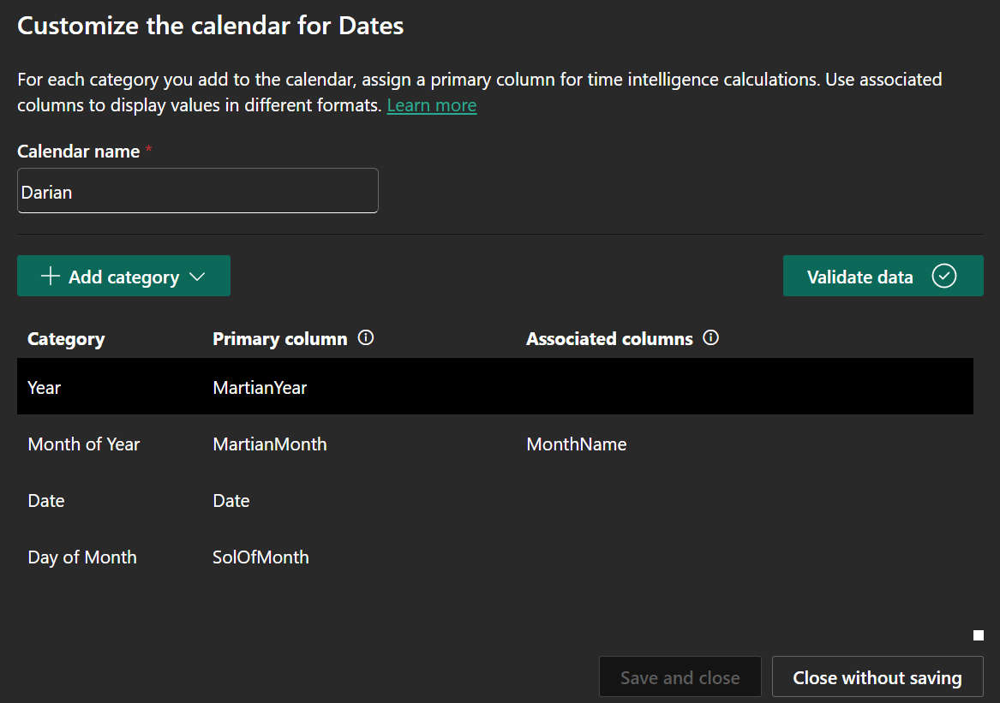

Microsoft recently released [Calendar-based time intelligence](https://learn.microsoft.com/en-us/power-bi/transform-model/desktop-time-intelligence#calendar-based-time-intelligence-preview) and it is out of this world. So much so lets try and make a Martian Calendar.

## Calendar-Based Time Intelligence

Calendar-Based Time Intelligence allows you to add metadata to your Date Dimension, specifying fields as periods (Year, Month, Quarter, **Week**), and you can define one of more different calendars for the same dimension. But why is this helpful?

- **Any Calendar**: Not limited to single Gregorian, you can have Shifted Gregorian, 445, or something more exotic
- **Sparse dates**: Classic time intelligence requires complete date columns with no missing dates between first and last dates. Calendar-based time intelligence operates on dates as-is, so if your stores are closed on weekends, you can skip those days entirely
- **Week-based calculations**: Direct support for week granularity functions like `TOTALWTD()`
- **Optimized queries**: If you filter by a defined period (Year, Month etc.) the engine can filter by the period (`Year: {2021, 2022, 2023}`), rather than falling back to date (`Date: {01-01-2021,....,31-12-2023}`), resulting in smaller cache and faster queries

## Martian Calendar

On Mars a day (Sol) is 24 hours, 39 minutes, and 35 seconds, nearly 40 minutes longer than a day on Earth, and the Martian year is 668.5907 sols (686.9711 Earth days). One proposed calendar for Mars is the [Darian calendar](https://en.wikipedia.org/wiki/Darian_calendar), which splits the year into 24 months with varying lengths.

=== "Darian Calendar"

    |MartianYear | MartianMonth | SolOfMonth | MonthName | Date | SolsSinceEpoch |
    |---|---|---|---|---|---|
    |200 | 1 | 1 | Sagittarius | 1-Sagittarius-200 | 1 |
    |200 | 1 | 2 | Sagittarius | 2-Sagittarius-200 | 2 |
    |200 | 1 | 3 | Sagittarius | 3-Sagittarius-200 | 3 |
    |200 | 1 | 4 | Sagittarius | 4-Sagittarius-200 | 4 |
    |200 | 1 | 5 | Sagittarius | 5-Sagittarius-200 | 5 |

=== "DAX"

    ```dax
    Dates = 
    VAR StartMartianYear = 200 // Adjust as needed
    VAR EndMartianYear = 220
    VAR EarthEpoch = DATE(1609, 3, 11) // Telescopic Epoch (Start of Mars Year 0)
    VAR SolsPerEarthDay = 1.02749125
    VAR StandardYearSols = 668 // Sols in a standard Martian Year (Darian Calendar)
    VAR LeapYearSols = 669   // Sols in a leap Martian Year (Darian Calendar)

    VAR MonthNames = 
        DATATABLE(
            "MartianMonth", INTEGER,
            "MonthName", STRING,
            {
                {1, "Sagittarius"}, {2, "Dhanus"}, {3, "Capricornus"}, {4, "Makara"},
                {5, "Aquarius"}, {6, "Kumbha"}, {7, "Pisces"}, {8, "Mina"},
                {9, "Aries"}, {10, "Mesha"}, {11, "Taurus"}, {12, "Rishabha"},
                {13, "Gemini"}, {14, "Mithuna"}, {15, "Cancer"}, {16, "Karka"},
                {17, "Leo"}, {18, "Simha"}, {19, "Virgo"}, {20, "Kanya"},
                {21, "Libra"}, {22, "Tula"}, {23, "Scorpius"}, {24, "Vrishika"}
            }
        )

    VAR IsLeapYear = 
        SELECTCOLUMNS(
            GENERATESERIES(StartMartianYear, EndMartianYear, 1),
            "MartianYear", [Value],
            // Your Leap Rule: Odd years OR years ending in 0 (Custom Darian)
            "IsLeap", MOD([Value], 2) = 1 || MOD([Value], 10) = 0,
            "SolsInYear", IF(MOD([Value], 2) = 1 || MOD([Value], 10) = 0, LeapYearSols, StandardYearSols)
        )

    VAR CalendarMonthSols = 
        SELECTCOLUMNS(
            GENERATE(
                IsLeapYear,
                GENERATESERIES(1, 24, 1) // 24 months
            ),
            [MartianYear],
            "MartianMonth", [Value],
            "SolsInMonth", 
                IF(
                    MOD([Value] - 1, 6) + 1 <= 5,
                    28, 
                    IF([Value] = 24 && [IsLeap], 28, 27)
                )
        )

    VAR CalendarDayBase =
        SELECTCOLUMNS(
            GENERATE(
                CalendarMonthSols,
                GENERATESERIES(1, [SolsInMonth], 1)
            ),
            [MartianYear],
            [MartianMonth],
            "SolOfMonth", [Value]
        )

    VAR AddSolsSinceEpoch =
        ADDCOLUMNS(
            CalendarDayBase,
            "SolsSinceEpoch",
                VAR CurrentYear = [MartianYear]
                VAR CurrentMonth = [MartianMonth]
                VAR CurrentSol = [SolOfMonth]
                // Calculate total sols from all complete previous years
                VAR SolsFromPreviousYears = 
                    SUMX(
                        FILTER(IsLeapYear, [MartianYear] < CurrentYear),
                        [SolsInYear]
                    )
                // Calculate sols from complete previous months in current year
                VAR SolsFromPreviousMonths = 
                    SUMX(
                        FILTER(CalendarMonthSols, 
                            [MartianYear] = CurrentYear && [MartianMonth] < CurrentMonth
                        ),
                        [SolsInMonth]
                    )
                RETURN SolsFromPreviousYears + SolsFromPreviousMonths + CurrentSol
        )

    VAR Combine = 
        ADDCOLUMNS(
            NATURALLEFTOUTERJOIN(
                AddSolsSinceEpoch,
                MonthNames
            ),
            "Date", [SolOfMonth] & "-" & [MonthName] & "-" & [MartianYear]
        )
    RETURN
    Combine
    ```

Since the `[Date]` field is not a tradition date, we are not able to mark this as a date table. But we are still able to define our calendar.



And we can create some fake weather data to test our calendar.

??? example "Weather Table"

    ```dax
    FactWeather = 
    VAR BaseTemp = -60 // Average global surface temp on Mars in Celsius
    VAR TempRange = 25 // Typical daily temperature variation
    VAR MaxDailyVariance = 5
    RETURN
        ADDCOLUMNS(
            SELECTCOLUMNS(
                Dates,
                "Date", [Date],
                "AvgTemp_C", BaseTemp + (RAND() * TempRange)
            ),
            "MinTemp_C", [AvgTemp_C] - (RAND() * MaxDailyVariance),
            "MaxTemp_C", [AvgTemp_C] + (RAND() * MaxDailyVariance)
        )
    ```

Then we are able to use any of the regular time intelligence functions by specifying our calendar, like seeing what the weather was like last year.

```dax
Avg Temp Previous Year = 
CALCULATE(
    [Avg Temp],
    SAMEPERIODLASTYEAR( 'Darian')
)
```


## Conclusion

Calendar-Based Time Intelligence opens up exciting possibilities beyond traditional Gregorian calendars, and finally Martian's can use DAX's Time Intelligence functions.