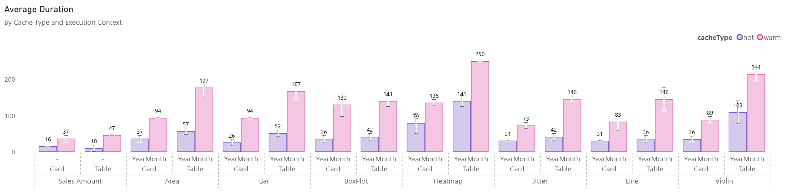

I recently presented the [daxlib.svg](https://daxlib.org/package/DaxLib.SVG/) library on [Fabric Fridays](https://www.youtube.com/watch?v=eDuTGJMr6HY), and was asked about the performance of the function. In this post I will profile the performance of the library using the [DAX Performance Testing](https://github.com/microsoft/fabric-toolbox/tree/main/tools/DAXPerformanceTesting) notebook from the Fabric Toolbox.

## DaxLib.SVG

[DaxLib.SVG](https://evaluationcontext.github.io/daxlib.svg/) consists of a few function categories:

| Category | Description |
|---|---|
| **SVG Wrapper** | Wraps one or more `Elements`, `Defs`, `Compounds`, applying required metadata and `<SVG>` tags |
| **Elements** | SVG primitives (i.e. `<Rect>`, `<Circle>`, `<line>`) |
| **Compounds** | Complex components (i.e. boxplot, violin) made from `Elements` |
| **Defs** | Define reusable SVG elements (i.e. `<linearGradient>`, `<clipPath>`, and shapes) |
| **Attributes** | Create Attributes (i.e. fill, stroke, opacity) string that can be applied to `Elements` and `Defs` |
| **Transforms** | Create Transform strings |
| **Scales** | Mapping values between scales |
| **Colors** | Themes and functions for colour manipulation |

`Compounds` are the highest level abstraction, combine multiple `DaxLib.SVG.Element.*` into higher-level reusable components for the generation of chart visualizations. They are designed to be easy to use, while outputting complex visuals. They are the most complex and demanding functions in the library, and will be the functions I will be focusing on profiling.

=== "Area"

    [Area](https://evaluationcontext.github.io/daxlib.svg/compounds/Area/)

    <svg width='500' height='100' viewbox= '0 0 100 20' xmlns='http://www.w3.org/2000/svg'><polygon points='2.5,19.8 2.5,19.6992211720227 4.11016949152542,18.970056710775 10.5508474576271,19.3850283553875 15.3813559322034,18.3475992438563 16.9915254237288,16.5987901701323 23.4322033898305,18.5965822306238 25.0423728813559,19.0737996219282 29.8728813559322,10.9611039697543 31.4830508474576,17.206427221172 36.3135593220339,16.3142381852552 37.9237288135593,16.3764839319471 42.7542372881356,18.0393345935728 44.364406779661,10.90404536862 49.1949152542373,16.5513648393195 50.8050847457627,16.2208695652174 55.635593220339,18.5550850661626 57.2457627118644,7.5153572778828 62.0762711864407,19.5984423440454 63.6864406779661,8.48313043478261 70.1271186440678,17.8437051039698 71.7372881355932,18.1660491493384 76.5677966101695,19.2012551984877 78.1779661016949,16.8173913043478 84.6186440677966,0.199999999999999 89.4491525423729,19.0174820415879 91.0593220338983,17.4139130434783 95.8898305084746,19.2961058601134 97.5,10.255652173913 97.5,19.8' fill='#EC008C' fill-opacity='0.2' stroke='none' stroke-width='0'  /><polyline points='2.5,19.6992211720227 4.11016949152542,18.970056710775 10.5508474576271,19.3850283553875 15.3813559322034,18.3475992438563 16.9915254237288,16.5987901701323 23.4322033898305,18.5965822306238 25.0423728813559,19.0737996219282 29.8728813559322,10.9611039697543 31.4830508474576,17.206427221172 36.3135593220339,16.3142381852552 37.9237288135593,16.3764839319471 42.7542372881356,18.0393345935728 44.364406779661,10.90404536862 49.1949152542373,16.5513648393195 50.8050847457627,16.2208695652174 55.635593220339,18.5550850661626 57.2457627118644,7.5153572778828 62.0762711864407,19.5984423440454 63.6864406779661,8.48313043478261 70.1271186440678,17.8437051039698 71.7372881355932,18.1660491493384 76.5677966101695,19.2012551984877 78.1779661016949,16.8173913043478 84.6186440677966,0.199999999999999 89.4491525423729,19.0174820415879 91.0593220338983,17.4139130434783 95.8898305084746,19.2961058601134 97.5,10.255652173913' fill='none' stroke='#EC008C' stroke-width='1'  /></svg>

=== "BoxPlot"

    [BoxPlot](https://evaluationcontext.github.io/daxlib.svg/compounds/Boxplot/)

    <svg width='500' height='100' viewbox= '0 0 100 20' xmlns='http://www.w3.org/2000/svg'><line x1='2.5' y1='10' x2='5.99471764079957' y2='10' stroke='#EC008C' stroke-width='1'  /><line x1='19.105324162043' y1='10' x2='38.7712339439082' y2='10' stroke='#EC008C' stroke-width='1'  /><line x1='2.5' y1='4.12' x2='2.5' y2='15.88' stroke='#EC008C' stroke-width='1'  /><line x1='38.7712339439082' y1='4.12' x2='38.7712339439082' y2='15.88' stroke='#EC008C' stroke-width='1'  /><rect x='5.99471764079957' y='4.12' width='13.1106065212434' height='11.76' rx='2' ry='2' fill='#EC008C' fill-opacity='0.5' stroke='#EC008C' stroke-width='1'  /><line x1='12.5870259177624' y1='4.12' x2='12.5870259177624' y2='15.88' stroke='#EC008C' stroke-width='2'  /><circle cx='48.5089686098655' cy='10' r='2' fill='#EC008C'  /><circle cx='61.8596564566391' cy='10' r='2' fill='#EC008C'  /><circle cx='45.3500038002584' cy='10' r='2' fill='#EC008C'  /><circle cx='45.072014897013' cy='10' r='2' fill='#EC008C'  /><circle cx='97.5' cy='10' r='2' fill='#EC008C'  /><circle cx='57.144675837957' cy='10' r='2' fill='#EC008C'  /></svg>

=== "Heatmap"

    [Heatmap](https://evaluationcontext.github.io/daxlib.svg/compounds/Heatmap/)

    <svg width='500' height='100' viewbox= '0 0 100 20' xmlns='http://www.w3.org/2000/svg'><defs><linearGradient id='kde-gradient' x1='0%' y1='0%' x2='100%' y2='0%'><stop offset='0%' stop-color='#F57AC3' /><stop offset='1.66666666666667%' stop-color='#EE1A98' /><stop offset='3.33333333333333%' stop-color='#EC008C' /><stop offset='5%' stop-color='#F362B8' /><stop offset='6.66666666666667%' stop-color='#F252B1' /><stop offset='8.33333333333333%' stop-color='#F35CB6' /><stop offset='10%' stop-color='#F8A3D6' /><stop offset='11.6666666666667%' stop-color='#F8A0D4' /><stop offset='13.3333333333333%' stop-color='#F8A6D7' /><stop offset='15%' stop-color='#F471BF' /><stop offset='16.6666666666667%' stop-color='#EE1997' /><stop offset='18.3333333333333%' stop-color='#F687C9' /><stop offset='20%' stop-color='#FEF6FB' /><stop offset='21.6666666666667%' stop-color='#FFFFFF' /><stop offset='23.3333333333333%' stop-color='#FFFFFF' /><stop offset='25%' stop-color='#FFFFFF' /><stop offset='26.6666666666667%' stop-color='#FFFFFF' /><stop offset='28.3333333333333%' stop-color='#FFFFFF' /><stop offset='30%' stop-color='#FFFFFF' /><stop offset='31.6666666666667%' stop-color='#FFFFFF' /><stop offset='33.3333333333333%' stop-color='#FFFFFF' /><stop offset='35%' stop-color='#FFFFFF' /><stop offset='36.6666666666667%' stop-color='#FFFFFF' /><stop offset='38.3333333333333%' stop-color='#FFFFFF' /><stop offset='40%' stop-color='#FFFFFF' /><stop offset='41.6666666666667%' stop-color='#FFFEFF' /><stop offset='43.3333333333333%' stop-color='#FDDFF1' /><stop offset='45%' stop-color='#F78ECC' /><stop offset='46.6666666666667%' stop-color='#FCD6ED' /><stop offset='48.3333333333333%' stop-color='#FBC6E5' /><stop offset='50%' stop-color='#FEEEF7' /><stop offset='51.6666666666667%' stop-color='#FFFFFF' /><stop offset='53.3333333333333%' stop-color='#FFFFFF' /><stop offset='55%' stop-color='#FFFCFE' /><stop offset='56.6666666666667%' stop-color='#FCD7ED' /><stop offset='58.3333333333333%' stop-color='#FCD6EC' /><stop offset='60%' stop-color='#FFF9FC' /><stop offset='61.6666666666667%' stop-color='#FCD6EC' /><stop offset='63.3333333333333%' stop-color='#FCD7ED' /><stop offset='65%' stop-color='#FFFCFE' /><stop offset='66.6666666666667%' stop-color='#FFFFFF' /><stop offset='68.3333333333333%' stop-color='#FFFFFF' /><stop offset='70%' stop-color='#FFFFFF' /><stop offset='71.6666666666667%' stop-color='#FFFFFF' /><stop offset='73.3333333333333%' stop-color='#FFFFFF' /><stop offset='75%' stop-color='#FFFFFF' /><stop offset='76.6666666666667%' stop-color='#FFFFFF' /><stop offset='78.3333333333333%' stop-color='#FFFFFF' /><stop offset='80%' stop-color='#FFFFFF' /><stop offset='81.6666666666667%' stop-color='#FFFFFF' /><stop offset='83.3333333333333%' stop-color='#FFFFFF' /><stop offset='85%' stop-color='#FFFFFF' /><stop offset='86.6666666666667%' stop-color='#FFFFFF' /><stop offset='88.3333333333333%' stop-color='#FFFFFF' /><stop offset='90%' stop-color='#FFFFFF' /><stop offset='91.6666666666667%' stop-color='#FFFFFF' /><stop offset='93.3333333333333%' stop-color='#FFFFFF' /><stop offset='95%' stop-color='#FFFFFF' /><stop offset='96.6666666666667%' stop-color='#FFFFFF' /><stop offset='98.3333333333333%' stop-color='#FEF0F8' /><stop offset='100%' stop-color='#FBC6E5' /></linearGradient></defs><rect x='0' y='0' width='100' height='20' rx='0' ry='0' fill='url(#kde-gradient)'  /></svg>

=== "Jitter"

    [Jitter](https://evaluationcontext.github.io/daxlib.svg/compounds/Jitter/)

    <svg width='500' height='100' viewbox= '0 0 100 20' xmlns='http://www.w3.org/2000/svg'><circle cx='2.98846880907372' cy='6.5112' r='2' fill='#EC008C' fill-opacity='0.5' stroke='#EC008C' stroke-width='1' stroke-opacity='0.9'  /> <circle cx='6.5226843100189' cy='5.51748' r='2' fill='#EC008C' fill-opacity='0.5' stroke='#EC008C' stroke-width='1' stroke-opacity='0.9'  /> <circle cx='4.51134215500945' cy='7.3638' r='2' fill='#EC008C' fill-opacity='0.5' stroke='#EC008C' stroke-width='1' stroke-opacity='0.9'  /> <circle cx='9.53969754253308' cy='5.44888' r='2' fill='#EC008C' fill-opacity='0.5' stroke='#EC008C' stroke-width='1' stroke-opacity='0.9'  /> <circle cx='18.0160680529301' cy='14.45508' r='2' fill='#EC008C' fill-opacity='0.5' stroke='#EC008C' stroke-width='1' stroke-opacity='0.9'  /> <circle cx='8.33289224952741' cy='12.86748' r='2' fill='#EC008C' fill-opacity='0.5' stroke='#EC008C' stroke-width='1' stroke-opacity='0.9'  /> <circle cx='6.01984877126654' cy='5.63508' r='2' fill='#EC008C' fill-opacity='0.5' stroke='#EC008C' stroke-width='1' stroke-opacity='0.9'  /> <circle cx='45.3415879017013' cy='8.70836' r='2' fill='#EC008C' fill-opacity='0.5' stroke='#EC008C' stroke-width='1' stroke-opacity='0.9'  /> <circle cx='15.0708884688091' cy='11.18188' r='2' fill='#EC008C' fill-opacity='0.5' stroke='#EC008C' stroke-width='1' stroke-opacity='0.9'  /> <circle cx='19.3952741020794' cy='9.94708' r='2' fill='#EC008C' fill-opacity='0.5' stroke='#EC008C' stroke-width='1' stroke-opacity='0.9'  /> <circle cx='19.093572778828' cy='12.31868' r='2' fill='#EC008C' fill-opacity='0.5' stroke='#EC008C' stroke-width='1' stroke-opacity='0.9'  /> <circle cx='11.0338374291115' cy='12.71068' r='2' fill='#EC008C' fill-opacity='0.5' stroke='#EC008C' stroke-width='1' stroke-opacity='0.9'  /> <circle cx='45.6181474480151' cy='5.62871' r='2' fill='#EC008C' fill-opacity='0.5' stroke='#EC008C' stroke-width='1' stroke-opacity='0.9'  /> <circle cx='18.2459357277883' cy='7.51668' r='2' fill='#EC008C' fill-opacity='0.5' stroke='#EC008C' stroke-width='1' stroke-opacity='0.9'  /> <circle cx='19.8478260869565' cy='14.07778' r='2' fill='#EC008C' fill-opacity='0.5' stroke='#EC008C' stroke-width='1' stroke-opacity='0.9'  /> <circle cx='8.53402646502835' cy='7.75188' r='2' fill='#EC008C' fill-opacity='0.5' stroke='#EC008C' stroke-width='1' stroke-opacity='0.9'  /> <circle cx='62.0429111531191' cy='9.20326' r='2' fill='#EC008C' fill-opacity='0.5' stroke='#EC008C' stroke-width='1' stroke-opacity='0.9'  /> <circle cx='3.47693761814745' cy='6.815' r='2' fill='#EC008C' fill-opacity='0.5' stroke='#EC008C' stroke-width='1' stroke-opacity='0.9'  /> <circle cx='57.3521739130435' cy='6.95416' r='2' fill='#EC008C' fill-opacity='0.5' stroke='#EC008C' stroke-width='1' stroke-opacity='0.9'  /> <circle cx='11.9820415879017' cy='5.60568' r='2' fill='#EC008C' fill-opacity='0.5' stroke='#EC008C' stroke-width='1' stroke-opacity='0.9'  /> <circle cx='10.4196597353497' cy='8.32763' r='2' fill='#EC008C' fill-opacity='0.5' stroke='#EC008C' stroke-width='1' stroke-opacity='0.9'  /> <circle cx='5.40207939508507' cy='12.95568' r='2' fill='#EC008C' fill-opacity='0.5' stroke='#EC008C' stroke-width='1' stroke-opacity='0.9'  /> <circle cx='16.9565217391304' cy='11.66943' r='2' fill='#EC008C' fill-opacity='0.5' stroke='#EC008C' stroke-width='1' stroke-opacity='0.9'  /> <circle cx='97.5' cy='8.11546' r='2' fill='#EC008C' fill-opacity='0.5' stroke='#EC008C' stroke-width='1' stroke-opacity='0.9'  /> <circle cx='6.29281663516068' cy='8.50648' r='2' fill='#EC008C' fill-opacity='0.5' stroke='#EC008C' stroke-width='1' stroke-opacity='0.9'  /> <circle cx='14.0652173913043' cy='8.27128' r='2' fill='#EC008C' fill-opacity='0.5' stroke='#EC008C' stroke-width='1' stroke-opacity='0.9'  /> <circle cx='4.94234404536862' cy='7.50688' r='2' fill='#EC008C' fill-opacity='0.5' stroke='#EC008C' stroke-width='1' stroke-opacity='0.9'  /> <circle cx='48.7608695652174' cy='8.74756' r='2' fill='#EC008C' fill-opacity='0.5' stroke='#EC008C' stroke-width='1' stroke-opacity='0.9'  /></svg>

=== "Line"

    [Line](https://evaluationcontext.github.io/daxlib.svg/compounds/Line/)

    <svg width='500' height='100' viewbox= '0 0 100 20' xmlns='http://www.w3.org/2000/svg'><polyline points='2.5,19.5012778827977 4.11016949152542,18.7869943289225 10.5508474576271,19.1934971644612 15.3813559322034,18.1772400756144 16.9915254237288,16.4641209829868 23.4322033898305,18.4211417769376 25.0423728813559,18.8886200378072 29.8728813559322,10.9414896030246 31.4830508474576,17.0593572778828 36.3135593220339,16.1853761814745 37.9237288135593,16.2463516068053 42.7542372881356,17.8752665406427 44.364406779661,10.885595463138 49.1949152542373,16.417663516068 50.8050847457627,16.0939130434783 55.635593220339,18.3804914933837 57.2457627118644,7.56606427221172 62.0762711864407,19.4025557655955 63.6864406779661,8.51408695652174 70.1271186440678,17.683629489603 71.7372881355932,17.9993950850662 76.5677966101695,19.0134744801512 78.1779661016949,16.6782608695652 84.6186440677966,0.399999999999999 89.4491525423729,18.8334517958412 91.0593220338983,17.2626086956522 95.8898305084746,19.1063894139887 97.5,10.2504347826087' fill='none' stroke='#EC008C' stroke-width='1'  /></svg>

=== "Violin"

    [Violin](https://evaluationcontext.github.io/daxlib.svg/compounds/Violin/)

    <svg width='500' height='100' viewbox= '0 0 100 20' xmlns='http://www.w3.org/2000/svg'><path d='M 2.5 10 L 2.5 4.89144110292255 S 3.29166666666667 1.20606972683534, 4.08333333333333 1.20606972683534 S 4.875 0.199999999999999, 5.66666666666667 0.199999999999999 S 6.45833333333333 3.9578916677529, 7.25 3.9578916677529 S 8.04166666666667 3.35479718748696, 8.83333333333333 3.35479718748696 S 9.625 3.75231256706734, 10.4166666666667 3.75231256706734 S 11.2083333333333 6.47864557826522, 12 6.47864557826522 S 12.7916666666667 6.35862127447642, 13.5833333333333 6.35862127447642 S 14.375 6.5672972843234, 15.1666666666667 6.5672972843234 S 15.9583333333333 4.54849310649522, 16.75 4.54849310649522 S 17.5416666666667 1.16650209772613, 18.3333333333333 1.16650209772613 S 19.125 5.3757903631394, 19.9166666666667 5.3757903631394 S 20.7083333333333 9.66905995631387, 21.5 9.66905995631387 S 22.2916666666667 9.99793178750071, 23.0833333333333 9.99793178750071 S 23.875 9.99999902642176, 24.6666666666667 9.99999902642176 S 25.4583333333333 9.99999999996766, 26.25 9.99999999996766 S 27.0416666666667 10, 27.8333333333333 10 S 28.625 10, 29.4166666666667 10 S 30.2083333333333 10, 31 10 S 31.7916666666667 10, 32.5833333333333 10 S 33.375 10, 34.1666666666667 10 S 34.9583333333333 10, 35.75 10 S 36.5416666666667 9.99999999999998, 37.3333333333333 9.99999999999998 S 38.125 9.99999999665713, 38.9166666666667 9.99999999665713 S 39.7083333333333 9.9999655783716, 40.5 9.9999655783716 S 41.2916666666667 9.97543586002223, 42.0833333333333 9.97543586002223 S 42.875 8.77307303854743, 43.6666666666667 8.77307303854743 S 44.4583333333333 5.67084750293614, 45.25 5.67084750293614 S 46.0416666666667 8.44264194967561, 46.8333333333333 8.44264194967561 S 47.625 7.80568388906012, 48.4166666666667 7.80568388906012 S 49.2083333333333 9.34128845336407, 50 9.34128845336407 S 50.7916666666667 9.98666021114291, 51.5833333333333 9.98666021114291 S 52.375 9.99955329547763, 53.1666666666667 9.99955329547763 S 53.9583333333333 9.90090821574378, 54.75 9.90090821574378 S 55.5416666666667 8.46781510503492, 56.3333333333333 8.46781510503492 S 57.125 8.41494231840535, 57.9166666666667 8.41494231840535 S 58.7083333333333 9.78199123696239, 59.5 9.78199123696239 S 60.2916666666667 8.42065653068517, 61.0833333333333 8.42065653068517 S 61.875 8.46200902219531, 62.6666666666667 8.46200902219531 S 63.4583333333333 9.89979384836692, 64.25 9.89979384836692 S 65.0416666666667 9.99956332427697, 65.8333333333333 9.99956332427697 S 66.625 9.99999987272364, 67.4166666666667 9.99999987272364 S 68.2083333333333 9.99999999999752, 69 9.99999999999752 S 69.7916666666667 10, 70.5833333333333 10 S 71.375 10, 72.1666666666667 10 S 72.9583333333333 10, 73.75 10 S 74.5416666666667 10, 75.3333333333333 10 S 76.125 10, 76.9166666666667 10 S 77.7083333333333 10, 78.5 10 S 79.2916666666667 10, 80.0833333333333 10 S 80.875 10, 81.6666666666667 10 S 82.4583333333333 10, 83.25 10 S 84.0416666666667 10, 84.8333333333333 10 S 85.625 10, 86.4166666666667 10 S 87.2083333333333 10, 88 10 S 88.7916666666667 9.99999999999999, 89.5833333333333 9.99999999999999 S 90.375 9.99999999912476, 91.1666666666667 9.99999999912476 S 91.9583333333333 9.99998868920325, 92.75 9.99998868920325 S 93.5416666666667 9.990223506012, 94.3333333333333 9.990223506012 S 95.125 9.43480657495187, 95.9166666666667 9.43480657495187 S 96.7083333333333 7.81457911631953, 97.5 7.81457911631953 S 98.2916666666667 9.43480657495187, 99.0833333333333 9.43480657495187 S 98.2916666666667 10.5651934250481, 99.0833333333333 10.5651934250481 S 96.7083333333333 12.1854208836805, 97.5 12.1854208836805 S 95.125 10.5651934250481, 95.9166666666667 10.5651934250481 S 93.5416666666667 10.009776493988, 94.3333333333333 10.009776493988 S 91.9583333333333 10.0000113107968, 92.75 10.0000113107968 S 90.375 10.0000000008752, 91.1666666666667 10.0000000008752 S 88.7916666666667 10, 89.5833333333333 10 S 87.2083333333333 10, 88 10 S 85.625 10, 86.4166666666667 10 S 84.0416666666667 10, 84.8333333333333 10 S 82.4583333333333 10, 83.25 10 S 80.875 10, 81.6666666666667 10 S 79.2916666666667 10, 80.0833333333333 10 S 77.7083333333333 10, 78.5 10 S 76.125 10, 76.9166666666667 10 S 74.5416666666667 10, 75.3333333333333 10 S 72.9583333333333 10, 73.75 10 S 71.375 10, 72.1666666666667 10 S 69.7916666666667 10, 70.5833333333333 10 S 68.2083333333333 10.0000000000025, 69 10.0000000000025 S 66.625 10.0000001272764, 67.4166666666667 10.0000001272764 S 65.0416666666667 10.000436675723, 65.8333333333333 10.000436675723 S 63.4583333333333 10.1002061516331, 64.25 10.1002061516331 S 61.875 11.5379909778047, 62.6666666666667 11.5379909778047 S 60.2916666666667 11.5793434693148, 61.0833333333333 11.5793434693148 S 58.7083333333333 10.2180087630376, 59.5 10.2180087630376 S 57.125 11.5850576815946, 57.9166666666667 11.5850576815946 S 55.5416666666667 11.5321848949651, 56.3333333333333 11.5321848949651 S 53.9583333333333 10.0990917842562, 54.75 10.0990917842562 S 52.375 10.0004467045224, 53.1666666666667 10.0004467045224 S 50.7916666666667 10.0133397888571, 51.5833333333333 10.0133397888571 S 49.2083333333333 10.6587115466359, 50 10.6587115466359 S 47.625 12.1943161109399, 48.4166666666667 12.1943161109399 S 46.0416666666667 11.5573580503244, 46.8333333333333 11.5573580503244 S 44.4583333333333 14.3291524970639, 45.25 14.3291524970639 S 42.875 11.2269269614526, 43.6666666666667 11.2269269614526 S 41.2916666666667 10.0245641399778, 42.0833333333333 10.0245641399778 S 39.7083333333333 10.0000344216284, 40.5 10.0000344216284 S 38.125 10.0000000033429, 38.9166666666667 10.0000000033429 S 36.5416666666667 10, 37.3333333333333 10 S 34.9583333333333 10, 35.75 10 S 33.375 10, 34.1666666666667 10 S 31.7916666666667 10, 32.5833333333333 10 S 30.2083333333333 10, 31 10 S 28.625 10, 29.4166666666667 10 S 27.0416666666667 10, 27.8333333333333 10 S 25.4583333333333 10.0000000000323, 26.25 10.0000000000323 S 23.875 10.0000009735782, 24.6666666666667 10.0000009735782 S 22.2916666666667 10.0020682124993, 23.0833333333333 10.0020682124993 S 20.7083333333333 10.3309400436861, 21.5 10.3309400436861 S 19.125 14.6242096368606, 19.9166666666667 14.6242096368606 S 17.5416666666667 18.8334979022739, 18.3333333333333 18.8334979022739 S 15.9583333333333 15.4515068935048, 16.75 15.4515068935048 S 14.375 13.4327027156766, 15.1666666666667 13.4327027156766 S 12.7916666666667 13.6413787255236, 13.5833333333333 13.6413787255236 S 11.2083333333333 13.5213544217348, 12 13.5213544217348 S 9.625 16.2476874329327, 10.4166666666667 16.2476874329327 S 8.04166666666667 16.645202812513, 8.83333333333333 16.645202812513 S 6.45833333333333 16.0421083322471, 7.25 16.0421083322471 S 4.875 19.8, 5.66666666666667 19.8 S 3.29166666666667 18.7939302731647, 4.08333333333333 18.7939302731647 S 1.25 15.1085588970775, 2.5 15.1085588970775 Z' fill='#EC008C' fill-opacity='0.5' stroke='#EC008C' stroke-width='1'  /></svg>

=== "Pill"

    [Pill](https://evaluationcontext.github.io/daxlib.svg/compounds/Pill/)

    <svg width='500' height='100' viewbox= '0 0 100 20' xmlns='http://www.w3.org/2000/svg'><rect x='1' y='1' width='93.1' height='18.032' rx='10' ry='10' fill='#EC008C' fill-opacity='0.2' stroke='#EC008C' stroke-width='1'  /><text x='47.5' y='11.368' dx='0' dy='0' fill='#EC008C' font-family='Segoe UI' font-size='12' text-anchor='middle' dominant-baseline='middle'  >DaxLib</text></svg>

=== "Bar"

    [Bar](https://evaluationcontext.github.io/daxlib.svg/compounds/Bar/)

    <svg width='500' height='100' xmlns='http://www.w3.org/2000/svg'><rect x='42.5' y='90.9073202402207' width='7.66129032258065' height='7.09267975977926' rx='0' ry='0' fill='#EC008C' stroke-width='1'  /> <rect x='50.2868852459016' y='95.1368284369421' width='7.66129032258065' height='2.86317156305795' rx='0' ry='0' fill='#EC008C' stroke-width='1'  /> <rect x='58.0737704918033' y='97.406914461938' width='7.66129032258065' height='0.593085538061999' rx='0' ry='0' fill='#EC008C' stroke-width='1'  /> <rect x='65.8606557377049' y='90.2314559324785' width='7.66129032258065' height='7.7685440675215' rx='0' ry='0' fill='#EC008C' stroke-width='1'  /> <rect x='73.6475409836066' y='53.4260671968836' width='7.66129032258065' height='44.5739328031164' rx='0' ry='0' fill='#EC008C' stroke-width='1'  /> <rect x='81.4344262295082' y='96.0912189579614' width='7.66129032258065' height='1.90878104203863' rx='0' ry='0' fill='#EC008C' stroke-width='1'  /> <rect x='89.2213114754098' y='57.2577503652005' width='7.66129032258065' height='40.7422496347995' rx='0' ry='0' fill='#EC008C' stroke-width='1'  /> <rect x='97.0081967213115' y='96.6877130335984' width='7.66129032258065' height='1.31228696640156' rx='0' ry='0' fill='#EC008C' stroke-width='1'  /> <rect x='104.795081967213' y='52.8125304333712' width='7.66129032258065' height='45.1874695666288' rx='0' ry='0' fill='#EC008C' stroke-width='1'  /> <rect x='112.581967213115' y='87.3780230482065' width='7.66129032258065' height='10.6219769517935' rx='0' ry='0' fill='#EC008C' stroke-width='1'  /> <rect x='120.368852459016' y='92.2795000811557' width='7.66129032258065' height='5.72049991884434' rx='0' ry='0' fill='#EC008C' stroke-width='1'  /> <rect x='128.155737704918' y='96.6010387924038' width='7.66129032258065' height='1.39896120759617' rx='0' ry='0' fill='#EC008C' stroke-width='1'  /> <rect x='135.94262295082' y='59.4153546502191' width='7.66129032258065' height='38.5846453497809' rx='0' ry='0' fill='#EC008C' stroke-width='1'  /> <rect x='143.729508196721' y='85.1498133419899' width='7.66129032258065' height='12.8501866580101' rx='0' ry='0' fill='#EC008C' stroke-width='1'  /> <rect x='151.516393442623' y='86.0146080181789' width='7.66129032258065' height='11.9853919818211' rx='0' ry='0' fill='#EC008C' stroke-width='1'  /> <rect x='159.303278688525' y='75.2153871124817' width='7.66129032258065' height='22.7846128875183' rx='0' ry='0' fill='#EC008C' stroke-width='1'  /> <rect x='167.090163934426' y='95.0394416490829' width='7.66129032258065' height='2.96055835091705' rx='0' ry='0' fill='#EC008C' stroke-width='1'  /> <rect x='174.877049180328' y='73.5578639831196' width='7.66129032258065' height='24.4421360168804' rx='0' ry='0' fill='#EC008C' stroke-width='1'  /> <rect x='182.66393442623' y='88.5267002110047' width='7.66129032258065' height='9.47329978899529' rx='0' ry='0' fill='#EC008C' stroke-width='1'  /> <rect x='190.450819672131' y='72.4651842233404' width='7.66129032258065' height='25.5348157766596' rx='0' ry='0' fill='#EC008C' stroke-width='1'  /> <rect x='198.237704918033' y='88.4010712546664' width='7.66129032258065' height='9.59892874533355' rx='0' ry='0' fill='#EC008C' stroke-width='1'  /> <rect x='206.024590163934' y='84.0240220743386' width='7.66129032258065' height='13.9759779256614' rx='0' ry='0' fill='#EC008C' stroke-width='1'  /> <rect x='213.811475409836' y='86.4109722447655' width='7.66129032258065' height='11.5890277552345' rx='0' ry='0' fill='#EC008C' stroke-width='1'  /> <rect x='221.598360655738' y='23.2984905047882' width='7.66129032258065' height='74.7015094952118' rx='0' ry='0' fill='#EC008C' stroke-width='1'  /> <rect x='229.385245901639' y='94.243791592274' width='7.66129032258065' height='3.75620840772602' rx='0' ry='0' fill='#EC008C' stroke-width='1'  /> <rect x='237.172131147541' y='90.5440675215062' width='7.66129032258065' height='7.45593247849375' rx='0' ry='0' fill='#EC008C' stroke-width='1'  /> <rect x='244.959016393443' y='77.0749878266515' width='7.66129032258065' height='20.9250121733485' rx='0' ry='0' fill='#EC008C' stroke-width='1'  /> <rect x='252.745901639344' y='68.004869339393' width='7.66129032258065' height='29.995130660607' rx='0' ry='0' fill='#EC008C' stroke-width='1'  /> <rect x='260.532786885246' y='95.2040253205648' width='7.66129032258065' height='2.79597467943516' rx='0' ry='0' fill='#EC008C' stroke-width='1'  /> <rect x='268.319672131148' y='65.1397500405778' width='7.66129032258065' height='32.8602499594222' rx='0' ry='0' fill='#EC008C' stroke-width='1'  /> <rect x='276.106557377049' y='84.6726180814803' width='7.66129032258065' height='13.3273819185197' rx='0' ry='0' fill='#EC008C' stroke-width='1'  /> <rect x='283.893442622951' y='81.9662392468755' width='7.66129032258065' height='16.0337607531245' rx='0' ry='0' fill='#EC008C' stroke-width='1'  /> <rect x='291.680327868852' y='85.230644375913' width='7.66129032258065' height='12.769355624087' rx='0' ry='0' fill='#EC008C' stroke-width='1'  /> <rect x='299.467213114754' y='87.9788995292972' width='7.66129032258065' height='10.0211004707028' rx='0' ry='0' fill='#EC008C' stroke-width='1'  /> <rect x='307.254098360656' y='53.8175620840773' width='7.66129032258065' height='44.1824379159227' rx='0' ry='0' fill='#EC008C' stroke-width='1'  /> <rect x='315.040983606557' y='95.924200616783' width='7.66129032258065' height='2.075799383217' rx='0' ry='0' fill='#EC008C' stroke-width='1'  /> <rect x='322.827868852459' y='97.8178867067035' width='7.66129032258065' height='0.182113293296538' rx='0' ry='0' fill='#EC008C' stroke-width='1'  /> <rect x='330.614754098361' y='93.2986528161013' width='7.66129032258065' height='4.70134718389872' rx='0' ry='0' fill='#EC008C' stroke-width='1'  /> <rect x='338.401639344262' y='57.3127739003409' width='7.66129032258065' height='40.6872260996591' rx='0' ry='0' fill='#EC008C' stroke-width='1'  /> <rect x='346.188524590164' y='93.5377373802954' width='7.66129032258065' height='4.46226261970459' rx='0' ry='0' fill='#EC008C' stroke-width='1'  /> <rect x='353.975409836066' y='94.3635773413407' width='7.66129032258065' height='3.63642265865931' rx='0' ry='0' fill='#EC008C' stroke-width='1'  /> <rect x='361.762295081967' y='91.2803116377212' width='7.66129032258065' height='6.71968836227884' rx='0' ry='0' fill='#EC008C' stroke-width='1'  /> <rect x='369.549180327869' y='91.3776984255803' width='7.66129032258065' height='6.62230157441974' rx='0' ry='0' fill='#EC008C' stroke-width='1'  /> <rect x='377.33606557377' y='84.8849212790131' width='7.66129032258065' height='13.1150787209869' rx='0' ry='0' fill='#EC008C' stroke-width='1'  /> <rect x='385.122950819672' y='91.2851809771141' width='7.66129032258065' height='6.71481902288589' rx='0' ry='0' fill='#EC008C' stroke-width='1'  /> <rect x='392.909836065574' y='97.78574906671' width='7.66129032258065' height='0.214250933290046' rx='0' ry='0' fill='#EC008C' stroke-width='1'  /> <rect x='400.696721311475' y='92.2079207920792' width='7.66129032258065' height='5.79207920792079' rx='0' ry='0' fill='#EC008C' stroke-width='1'  /> <rect x='408.483606557377' y='84.4223340366824' width='7.66129032258065' height='13.5776659633176' rx='0' ry='0' fill='#EC008C' stroke-width='1'  /> <rect x='416.270491803279' y='78.6122382730076' width='7.66129032258065' height='19.3877617269924' rx='0' ry='0' fill='#EC008C' stroke-width='1'  /> <rect x='424.05737704918' y='83.9295568901152' width='7.66129032258065' height='14.0704431098848' rx='0' ry='0' fill='#EC008C' stroke-width='1'  /> <rect x='431.844262295082' y='94.5130660607044' width='7.66129032258065' height='3.48693393929557' rx='0' ry='0' fill='#EC008C' stroke-width='1'  /> <rect x='439.631147540984' y='32.4148677162798' width='7.66129032258065' height='65.5851322837202' rx='0' ry='0' fill='#EC008C' stroke-width='1'  /> <rect x='447.418032786885' y='2' width='7.66129032258065' height='96' rx='0' ry='0' fill='#EC008C' stroke-width='1'  /> <rect x='455.204918032787' y='59.1699399448142' width='7.66129032258065' height='38.8300600551858' rx='0' ry='0' fill='#EC008C' stroke-width='1'  /> <rect x='462.991803278689' y='93.1666937185522' width='7.66129032258065' height='4.83330628144782' rx='0' ry='0' fill='#EC008C' stroke-width='1'  /> <rect x='470.77868852459' y='93.2962181464048' width='7.66129032258065' height='4.70378185359519' rx='0' ry='0' fill='#EC008C' stroke-width='1'  /> <rect x='478.565573770492' y='49.8178867067035' width='7.66129032258065' height='48.1821132932965' rx='0' ry='0' fill='#EC008C' stroke-width='1'  /> <rect x='486.352459016393' y='51.4763837039442' width='7.66129032258065' height='46.5236162960558' rx='0' ry='0' fill='#EC008C' stroke-width='1'  /> <rect x='494.139344262295' y='95.6325271871449' width='7.66129032258065' height='2.36747281285506' rx='0' ry='0' fill='#EC008C' stroke-width='1'  /> <rect x='501.926229508197' y='65.0735270248336' width='7.66129032258065' height='32.9264729751664' rx='0' ry='0' fill='#EC008C' stroke-width='1'  /> <rect x='509.713114754098' y='78.7855867553968' width='7.66129032258065' height='19.2144132446032' rx='0' ry='0' fill='#EC008C' stroke-width='1'  /> <rect x='517.5' y='84.5927609154358' width='7.66129032258065' height='13.4072390845642' rx='0' ry='0' fill='#EC008C' stroke-width='1'  /></svg>

## Performance Testing

As a base for this testing I will use the [Contoso](https://github.com/sql-bi/Contoso-Data-Generator-V2-data/releases/tag/ready-to-use-data) 1 Million Row Dataset, and I will use the most recent release of library: [DaxLib.SVG v0.2.2-beta](https://daxlib.org/package/DaxLib.SVG/).

### Testing Plan

SVG's measures can be viewed in a few visuals which I will group into two categories:

| Category | Visuals | Behavior | 
| --- | --- | --- |
| :material-card-multiple-outline: Card | Image <br> Button Slicer <br> List Slicer | Single function call |
| :material-table: Table | Table <br> Matrix | Multiple function call (once per row) |

I will test each measure either as a simple measure call to simulate a card, or in `#!dax SUMMARIZECOLUMNS()` to simulate a table.

=== "Card"

    ```dax
    EVALUATE
    {[measures]}
    ```

=== "Table"

    ```dax
    EVALUATE
    SUMMARIZECOLUMNS(
        Product[Brand]],
        "foo", [Measure]
    )
    ```

Most of the `#!dax daxlib.svg.compound.*` functions require a `measureVal` and `xAxis` parameter. The column `xAxis` can be datetime, numeric or string. The function will evaluate the `measureVal` measure for each value of the `xAxis` column. 

For testing `#!dax DaxLib.SVG.Compound.*` `xAxis` will be `#!dax 'Date'[Date]` (1-Jun-2016..31-Dec-2026) and `measureVal` will be a simple measure `#! [Sales Amount]`. The performance of the SVG measure is going to depend greatly on the measure being evaluated. The measure will be evaluated over the given axis, so the grain of the axis will also contribute to the performance of the measure. In this case the performance could be greatly improved by instead evaluating over Year-Month. Therefore I will also test `#!dax DaxLib.SVG.Compound.*` with a `xAxis` of `#!dax 'Date'[Year Month]`. Finally I will evaluate `#! [Sales Amount]` as a baseline.

#### Measures

The tested measures are defined below.

=== "Compounds"

    We can check to see that the defined measure output as expected

    

=== "Sales Amount"

    ```dax
    Sales Amount = 
    SUMX ( Sales, Sales[Quantity] * Sales[Net Price] )
    ```

=== "Compound.Area.Date"

    ```dax
    Compound.Area = 
    VAR Compound = 
        DaxLib.SVG.Compound.Area(
            0,              // x
            0,              // y
            100,            // width
            20,             // height
            0.05,           // paddingX
            0.02,           // paddingY
            'Date'[Date],   // xAxis
            [Sales Amount], // measureVal
            "#EC008C",      // fillColour
            0.2,            // fillOpacity
            "#EC008C"       // strokeColour
        )
    RETURN

        IF(
            NOT ISBLANK( Compound ),
            DaxLib.SVG.SVG(
                100,        // width
                20,         // height
                BLANK(),
                Compound,
                BLANK()
            )
        )
    ```

=== "Compound.Bar.Date"

    ```dax
    Compound.Bar = 
    VAR Compound = 
        DaxLib.SVG.Compound.Bar(
            0,              // x
            0,              // y
            100,            // width
            20,             // height
            0.05,           // paddingX
            0.04,           // paddingY
            'Date'[Date],   // xAxis
            [Sales Amount], // measureVal
            "#EC008C"       // lineColour
        )
    RETURN

        IF(
            NOT ISBLANK( Compound ),
            DaxLib.SVG.SVG(
                100,        // width
                20,         // height
                BLANK(),
                Compound,
                BLANK()
            )
        )
    ```

=== "Compound.BoxPlot.Date"

    ```dax
    Compound.BoxPlot = 
    VAR Compound = 
        DaxLib.SVG.Compound.Boxplot(
            0,              // x
            0,              // y
            100,            // width
            20,             // height
            0.05,           // paddingX
            0.02,           // paddingY
            'Date'[Date],   // axisRef
            [Sales Amount], // measureVal
            "#EC008C",      // fillColour
            "#EC008C",      // strokeColour
            TRUE            // showOutliers
        )
    RETURN

        IF(
            NOT ISBLANK( Compound ),
            DaxLib.SVG.SVG(
                100,        // width
                20,         // height
                BLANK(),
                Compound,                 
                BLANK()
            )
        )
    ```

=== "Compound.Heatmap.Date"

    ```dax
    Compound.Heatmap = 
    VAR Compound = 
        DaxLib.SVG.Compound.Heatmap(
            0,              // x
            0,              // y
            100,            // width
            20,             // height
            0.05,           // paddingX
            0.02,           // paddingY
            'Date'[Date],   // axisRef
            [Sales Amount], // measureVal
            60,             // samples
            100,            // bandwidth
            "#EC008C"       // Colour
        )
    RETURN

        IF(
            NOT ISBLANK( Compound ),
            DaxLib.SVG.SVG(
                100,        // width
                20,         // height
                BLANK(),
                Compound,                 
                BLANK()
            )
        )
    ```

=== "Compound.Jitter.Date"

    ```dax
    Compound.Jitter = 
    VAR Compound =
        DaxLib.SVG.Compound.Jitter(
            0,              // x
            0,              // y
            100,            // width
            20,             // height
            0.05,           // paddingX
            0.02,           // paddingY
            'Date'[Date],   // xAxis
            [Sales Amount], // measureRef
            "#EC008C",      // pointColour
            0.5             // jitterAmount
        )
    RETURN

        IF(
            NOT ISBLANK( Compound ),
            DaxLib.SVG.SVG(
                100,        // width
                20,         // height
                BLANK(),
                Compound,
                BLANK()
            )
        )
    ```

=== "Compound.Line.Date"

    ```dax
    Compound.Line = 
    VAR Compound = 
        DaxLib.SVG.Compound.Line(
            0,              // x
            0,              // y
            100,            // width
            20,             // height
            0.05,           // paddingX
            0.04,           // paddingY
            'Date'[Date],   // xAxis
            [Sales Amount], // measureVal
            "#EC008C"       // lineColour
        )
    RETURN

        IF(
            NOT ISBLANK( Compound ),
            DaxLib.SVG.SVG(
                100,        // width
                20,         // height
                BLANK(),
                Compound,
                BLANK()
            )
        )
    ```

=== "Compound.Violin.Date"

    ```dax
    Compound.Violin = 
    VAR Compound =
        DaxLib.SVG.Compound.Violin(
            0,              // x
            0,              // y
            100,            // width
            20,             // height
            0.05,           // paddingX
            0.02,           // paddingY
            'Date'[Date],   // axisRef
            [Total Cost],   // measureVal
            60,             // samples
            400,            // bandwidth
            "#EC008C"       // color
        )
    RETURN

        IF( 
            NOT ISBLANK( Compound ),
            DaxLib.SVG.SVG(
                100,        // width
                20,         // height
                BLANK(),
                Compound,
                BLANK()
            )
        )
    ```

=== "Compound.Area.YearMonth"

    ```dax
    Compound.Area = 
    VAR Compound = 
        DaxLib.SVG.Compound.Area(
            0,              // x
            0,              // y
            100,            // width
            20,             // height
            0.05,           // paddingX
            0.02,           // paddingY
            'Date'[Year Month], // xAxis
            [Sales Amount], // measureVal
            "#EC008C",      // fillColour
            0.2,            // fillOpacity
            "#EC008C"       // strokeColour
        )
    RETURN

        IF(
            NOT ISBLANK( Compound ),
            DaxLib.SVG.SVG(
                100,        // width
                20,         // height
                BLANK(),
                Compound,
                BLANK()
            )
        )
    ```

=== "Compound.Bar.YearMonth"

    ```dax
    Compound.Bar = 
    VAR Compound = 
        DaxLib.SVG.Compound.Bar(
            0,              // x
            0,              // y
            100,            // width
            20,             // height
            0.05,           // paddingX
            0.04,           // paddingY
            'Date'[Year Month], // xAxis
            [Sales Amount], // measureVal
            "#EC008C"       // lineColour
        )
    RETURN

        IF(
            NOT ISBLANK( Compound ),
            DaxLib.SVG.SVG(
                100,        // width
                20,         // height
                BLANK(),
                Compound,
                BLANK()
            )
        )
    ```

=== "Compound.BoxPlot.YearMonth"

    ```dax
    Compound.BoxPlot = 
    VAR Compound = 
        DaxLib.SVG.Compound.Boxplot(
            0,              // x
            0,              // y
            100,            // width
            20,             // height
            0.05,           // paddingX
            0.02,           // paddingY
            'Date'[Year Month], // axisRef
            [Sales Amount], // measureVal
            "#EC008C",      // fillColour
            "#EC008C",      // strokeColour
            TRUE            // showOutliers
        )
    RETURN

        IF(
            NOT ISBLANK( Compound ),
            DaxLib.SVG.SVG(
                100,        // width
                20,         // height
                BLANK(),
                Compound,                 
                BLANK()
            )
        )
    ```

=== "Compound.Heatmap.YearMonth"

    ```dax
    Compound.Heatmap = 
    VAR Compound = 
        DaxLib.SVG.Compound.Heatmap(
            0,              // x
            0,              // y
            100,            // width
            20,             // height
            0.05,           // paddingX
            0.02,           // paddingY
            'Date'[Year Month], // axisRef
            [Sales Amount], // measureVal
            60,             // samples
            100,            // bandwidth
            "#EC008C"       // Colour
        )
    RETURN

        IF(
            NOT ISBLANK( Compound ),
            DaxLib.SVG.SVG(
                100,        // width
                20,         // height
                BLANK(),
                Compound,                 
                BLANK()
            )
        )
    ```

=== "Compound.Jitter.YearMonth"

    ```dax
    Compound.Jitter = 
    VAR Compound =
        DaxLib.SVG.Compound.Jitter(
            0,              // x
            0,              // y
            100,            // width
            20,             // height
            0.05,           // paddingX
            0.02,           // paddingY
            'Date'[Year Month], // xAxis
            [Sales Amount], // measureRef
            "#EC008C",      // pointColour
            0.5             // jitterAmount
        )
    RETURN

        IF(
            NOT ISBLANK( Compound ),
            DaxLib.SVG.SVG(
                100,        // width
                20,         // height
                BLANK(),
                Compound,
                BLANK()
            )
        )
    ```

=== "Compound.Line.YearMonth"

    ```dax
    Compound.Line = 
    VAR Compound = 
        DaxLib.SVG.Compound.Line(
            0,              // x
            0,              // y
            100,            // width
            20,             // height
            0.05,           // paddingX
            0.04,           // paddingY
            'Date'[Year Month], // xAxis
            [Sales Amount], // measureVal
            "#EC008C"       // lineColour
        )
    RETURN

        IF(
            NOT ISBLANK( Compound ),
            DaxLib.SVG.SVG(
                100,        // width
                20,         // height
                BLANK(),
                Compound,
                BLANK()
            )
        )
    ```

=== "Compound.Violin.YearMonth"

    ```dax
    Compound.Violin = 
    VAR Compound =
        DaxLib.SVG.Compound.Violin(
            0,              // x
            0,              // y
            100,            // width
            20,             // height
            0.05,           // paddingX
            0.02,           // paddingY
            'Date'[Year Month], // axisRef
            [Total Cost],   // measureVal
            60,             // samples
            400,            // bandwidth
            "#EC008C"       // color
        )
    RETURN

        IF( 
            NOT ISBLANK( Compound ),
            DaxLib.SVG.SVG(
                100,        // width
                20,         // height
                BLANK(),
                Compound,
                BLANK()
            )
        )
    ```

#### DAX Performance Testing Notebook

I will use the [DAX Performance Testing](https://github.com/microsoft/fabric-toolbox/tree/main/tools/DAXPerformanceTesting) notebook from the Fabric Toolbox to perform the testing. DAXNoob (aka [Justin Martin](https://www.linkedin.com/in/daxnoobjustin/)) has a [blog post](https://daxnoob.blog/2025/03/03/fabric-tools-dax-performance-testing/) on this. This is a notebook that will run various DAX queries, defined in a Excel file, under different cache states, and save the results to a Lakehouse. I ran 3 queries per measure.

!!! tip "Trace Start Delay"

    I ended up adding a delay of 10s to Trace start `#!py trace.start(delay=10)`) to reduce the number of no trace log found warnings

    ```bash
    /nfs4/pyenv-58b912cf-d895-40b8-9110-49a93f1a1230/lib/python3.11/site-packages/sempy/fabric/_trace/_trace.py:179: UserWarning: No trace logs have been recorded. Try starting the trace with a larger 'delay' parameter (default is 3 seconds)                            to allow the engine enough time to register and subscribe to the trace events.
    warnings.warn("No trace logs have been recorded. Try starting the trace with a larger 'delay' parameter (default is 3 seconds)
    ```

=== "Notebook Config"

    ```py
    # Define models and their configurations for testing
    models = [
    {
            "name": "Contoso 1M", # The name of the semantic model
            "storageMode": "Import",  # Import, DirectQuery, or DirectLake
            "cache_types": ["warm", "hot"], # List of cache types to be run (hot, warm, and cold)
            "model_workspace_name": "SVG", # The workspace name of the semantic model
            "runQueryType": "query", # The name of the column in your DAX Excel file contains the query to be run
        },
    ]

    # Additional arguments controlling the behavior of query execution and logging
    additional_arguments = {
        "roundNumber": 1, # The current round of DAX testing. Will be considered when determine if maxNumberPerQuery is met or not
        "onlyRunNewQueries": True, # Will determine if queries will stop being tested after maxNumberPerQuery is met
        "maxNumberPerQuery": 3, # The max number of queries to capture per round, queryId, model and cache type
        "maxFailuresBeforeSkipping": 3, # The number of failed query attempts per round, queryId, model and cache type before skipping
        "numberOfRunsPerQueryId": 15, # The number of times to loop over each queryId. If all combos have met maxNumberPerQuery, the loop will break
        "stopQueryIdsAt": 99, # Allows you to stop the queryId loop at a certain number, even if there are more queries present, i.e., there are queryIds 1-20 but stop at 5
        "forceStartQueriesAt1": False, # If set to False, testing will stop at the first incomplete queryId instead of starting at queryId 1  
        "logTableName": "svgTesting", # The name of the table in the attached lakehouse to save the performance logs to
        "clearAllLogs": False, # Will drop the existing logs table before starting testing
        "clearCurrentRoundLogs": False, # Will delete the logs associated with the current roundNumber before starting testing
        "randomizeRuns": True, # Will randomize the model and cache type combos when testing
        "skipSettingHotCache": False, # Should be False if randomizing the runs. If the runs are randomized, the previous warm cache run will set the hot cache
        "pauseAfterSettingCache": 5, # The number of seconds to wait after setting the cache
        "pauseAfterRunningQuery": 5, # The number of second to wait before writing the logs to the log table
        "pauseBetweenRuns": 30, # The number of seconds to wait before starting the next query
    }
    ```

=== "DAX Excel File"

    | queryId | query |
    |---|---|
    | 1 | `EVALUATE { [Sales Amount] }` |
    | 2 | `EVALUATE { [Compound.Area.Date] }` |
    | 3 | `EVALUATE { [Compound.Bar.Date] }` |
    | 4 | `EVALUATE { [Compound.BoxPlot.Date] }` |
    | 5 | `EVALUATE { [Compound.Heatmap.Date] }` |
    | 6 | `EVALUATE { [Compound.Jitter.Date] }` |
    | 7 | `EVALUATE { [Compound.Line.Date] }` |
    | 8 | `EVALUATE { [Compound.Violin.Date] }` |
    | 9 | `EVALUATE { [Compound.Area.YearMonth] }` |
    | 10 | `EVALUATE { [Compound.Bar.YearMonth] }` |
    | 11 | `EVALUATE { [Compound.BoxPlot.YearMonth] }` |
    | 12 | `EVALUATE { [Compound.Heatmap.YearMonth] }` |
    | 13 | `EVALUATE { [Compound.Jitter.YearMonth] }` |
    | 14 | `EVALUATE { [Compound.Line.YearMonth] }` |
    | 15 | `EVALUATE { [Compound.Violin.YearMonth] }` |
    | 16 | `EVALUATE SUMMARIZECOLUMNS( Product[Brand], "foo", [Sales Amount] )` |
    | 17 | `EVALUATE SUMMARIZECOLUMNS( Product[Brand], "foo", [Compound.Area.Date] )` |
    | 18 | `EVALUATE SUMMARIZECOLUMNS( Product[Brand], "foo", [Compound.Bar.Date] )` |
    | 19 | `EVALUATE SUMMARIZECOLUMNS( Product[Brand], "foo", [Compound.BoxPlot.Date] )` |
    | 20 | `EVALUATE SUMMARIZECOLUMNS( Product[Brand], "foo", [Compound.Heatmap.Date] )` |
    | 21 | `EVALUATE SUMMARIZECOLUMNS( Product[Brand], "foo", [Compound.Jitter.Date] )` |
    | 22 | `EVALUATE SUMMARIZECOLUMNS( Product[Brand], "foo", [Compound.Line.Date] )` |
    | 23 | `EVALUATE SUMMARIZECOLUMNS( Product[Brand], "foo", [Compound.Violin.Date] )` |
    | 24 | `EVALUATE SUMMARIZECOLUMNS( Product[Brand], "foo", [Compound.Area.YearMonth] )` |
    | 25 | `EVALUATE SUMMARIZECOLUMNS( Product[Brand], "foo", [Compound.Bar.YearMonth] )` |
    | 26 | `EVALUATE SUMMARIZECOLUMNS( Product[Brand], "foo", [Compound.BoxPlot.YearMonth] )` |
    | 27 | `EVALUATE SUMMARIZECOLUMNS( Product[Brand], "foo", [Compound.Heatmap.YearMonth] )` |
    | 28 | `EVALUATE SUMMARIZECOLUMNS( Product[Brand], "foo", [Compound.Jitter.YearMonth] )` |
    | 29 | `EVALUATE SUMMARIZECOLUMNS( Product[Brand], "foo", [Compound.Line.YearMonth] )` |
    | 30 | `EVALUATE SUMMARIZECOLUMNS( Product[Brand], "foo", [Compound.Violin.YearMonth] )` |

Now we can run the notebook and the results will get saved to the mounted Lakehouse.

#### Results

One thing to note is that the DAX Performance testing notebook is not particularly fast, it took 4 hours to process these queries. But it is automated and repeatable. Additionally the notebook counts as a background operation rather than interactive, which will make your Fabric Admin happy. The average duration per measure is shown below. For context, for the table we are evaluating the measures against `#!dax 'product'[Brand]`, which has 11 brands.


If we look at Compound, Context and Granularity we can first see that there isn't a huge difference between warm and hot cache. This hints that each measure is likely relying on a lot of Formula Engine (FE) vs Storage Engine (SE), which is not unexpected. All of the `#!dax daxlib.svg.compound.*` functions have a similar construction and although I have tried to calculate a data table early to aid with generating a reusable data cache, there is still a decent amount of string manipulation which will require a reasonable amount of FE involvement. Secondly we can see the impact of the choice of `xAxis`. The increased granularity of `#!dax 'date'[Date]` vs `#!dax 'date'[Year Month]` has a large effect for many of the `#!dax daxlib.svg.compound.*` functions. The Heatmap and Violin plots are the slowest, which is to be expected since they have additional processing over the other `#!dax daxlib.svg.compound.*` functions. They both need to sample data across the data range; see my previous blog post on [SVG Violin plot](https://evaluationcontext.github.io/posts/SVG-Violin/?h=vio) for info on how and why this sampling occurs.



If we exclude the `#!dax 'date'[Date]` granularity measure, we can see the hot cache is at least 50% faster than the warm cache. Additionally the measures all return results in a range of 141-250ms in the table context, with `#!dax daxlib.svg.compound.Heatmap` and `#!dax daxlib.svg.compound.Violin` being the slowest.


If we ignore the execution context (table and card) and sort by Average Duration, we can more easily see the speed of each `#!dax daxlib.svg.compound.*` function across the different scenarios.

## DAX Studio

To have a closer look at the query characteristics of these functions, we can load up DAX Studio. Then we can turn on server timings, turn on clear cache on run, and have a look at queryId 30 `#!dax EVALUATE SUMMARIZECOLUMNS( Product[Brand], "foo", [Compound.Violin.YearMonth] )`.


The measure has a 50% SE and 50% FE, with 3 SE queries.

The first query gets the `SUM()` of Sales per `#!dax 'Date'[Year Month]` and `#!dax 'Product'[Brand]`, resulting in 1,890 rows, duration of 17ms and CPU of 16ms. This likely the generation of the initial cache to calculate the min and max data range to allow mapping from the data scale to the visual scale.

```sql
WITH
    $Expr0 := ( PFCAST ( 'Sales'[Quantity] AS INT ) * PFCAST ( 'Sales'[Unit Cost] AS INT ) ) 
SELECT
    'Date'[Year Month],
    'Product'[Brand],
    SUM ( @$Expr0 )
FROM 'Sales'
    LEFT OUTER JOIN 'Date'
        ON 'Sales'[Order Date]='Date'[Date]
    LEFT OUTER JOIN 'Product'
        ON 'Sales'[ProductKey]='Product'[ProductKey];
```

Followed by a similar query but with tuple firsts on `#!dax 'Date'[Year Month]` and `#!dax 'Product'[Brand]`, returning the same number of rows, but with a duration of 94ms and CPU of 125ms.

```sql 
SET DC_KIND="AUTO";
WITH
    $Expr0 := ( PFCAST ( 'Sales'[Quantity] AS INT ) * PFCAST ( 'Sales'[Unit Cost] AS INT ) ) 
SELECT
    'Date'[Year Month],
    'Product'[Brand],
    SUM ( @$Expr0 )
FROM 'Sales'
    LEFT OUTER JOIN 'Date'
        ON 'Sales'[Order Date]='Date'[Date]
    LEFT OUTER JOIN 'Product'
        ON 'Sales'[ProductKey]='Product'[ProductKey]
WHERE
     ( 'Product'[Brand], 'Date'[Year Month] ) IN { ( 'Contoso', 'December 2025' ) , ( 'Wide World Importers', 'July 2020' ) , ( 'Proseware', 'September 2025' ) , ( 'A. Datum', 'April 2020' ) , ( 'Tailspin Toys', 'September 2020' ) , ( 'Adventure Works', 'November 2024' ) , ( 'Southridge Video', 'June 2019' ) , ( 'Litware', 'April 2025' ) , ( 'Fabrikam', 'November 2019' ) , ( 'Tailspin Toys', 'August 2024' ) ..[1,276 total tuples, not all displayed]};
```

Then the last is a simple one to get the distinct `#!dax 'Product'[Brand]` for filtering the second query to plot the table.

```sql
SET DC_KIND="AUTO";
SELECT
    'Product'[Brand]
FROM 'Product';
```

The other `#!dax daxlib.svg.compound.*` have a similar profile.

## Conclusion

SVGs are a fantastic storytelling tool in Power BI, but should be used for impact and sparingly, both from a visual design and performance viewpoint. With DaxLib libraries so easy to install, you can test the performance for your specific model and determine if it is acceptable for your use-case. Overall I'm reasonably happy with the performance characteristics of these functions. I have plans to try out [MCP Server: DAX Performance Tuner](https://github.com/microsoft/fabric-toolbox/tree/main/tools/DAXPerformanceTunerMCPServer) in a future post to see if it can find any avenues for improvements.