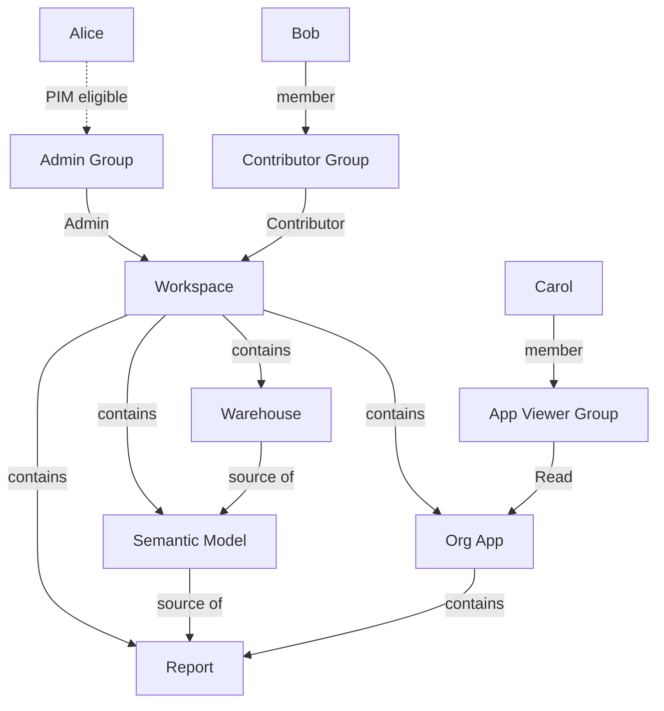
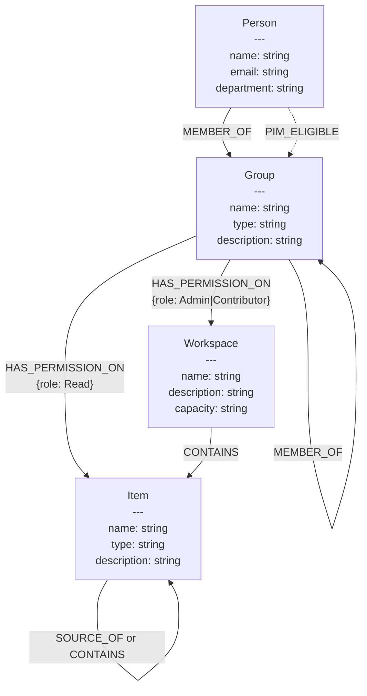
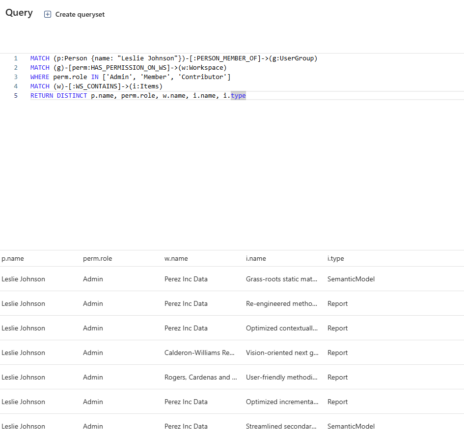

Previously I created a range of posts about how to visualize graphs of permissions for Fabric Items in Power BI. In this post I test out the new [Fabric Graph](https://learn.microsoft.com/en-us/fabric/graph/) to see how that fairs at answering similar questions.

## Graphs

A graph is a data structure consisting of nodes (vertices) representing entities and edges (relationships) connecting them. Unlike traditional databases that store data in tables with rows and columns, graphs directly model and store the relationships between data points, allowing for complex relationships to be modelled. They excel when relationships between entities are important. 

Fabric Graphs are [Labeled Property Graphs (LPG)](https://learn.microsoft.com/en-us/fabric/graph/graph-data-models):

- :octicons-circle-16: **Nodes**: Represent entities and can be thought of as nouns with labels (types) like `Person`, `Group`, or `Item`. Each node can have multiple labels
- :material-vector-line: **Edges**: Connect nodes and are directed (have a source and target). These can thought of as verbs. Each edge has exactly one label/type like `member`, `Read`, or `contains`
- :material-shape-plus: **Properties**: Both nodes and edges can have key-value properties. For example, a `Person` node might have properties like `{name: "Alice", email: "alice@example.com"}`
- :material-label: **Labels**: Act as types or categories, allowing you to organize and query specific subsets of nodes or edges

They have benefits over traditional databases:

- **Relationship Performance:** Graphs excel at traversing relationships - operations like "find friends of friends" or "shortest path" are near-instantaneous. Traditional databases require expensive JOIN operations that slow down exponentially with relationship depth
- **Natural Data Modeling:** Models real-world connections intuitively (social networks, supply chains, knowledge graphs)
- **Query Simplicity:** Relationship queries are more readable and maintainable. No need to construct complex multi-table JOINs
- **Flexible Schema:** Nodes can have different properties without requiring uniform table structures. Easy to add new relationship types without schema migrations

Common graph use cases include:

- Social networks (connections, recommendations)
- Fraud detection (finding suspicious patterns)
- Knowledge graphs (linked information)
- Network/IT operations (dependency mapping)
- Recommendation engines (collaborative filtering)

!!! warning "Limitations"

    Fabric Graph is still in preview, and currently has some [limitations](https://learn.microsoft.com/en-us/fabric/graph/limitations)

Lets look at a example Fabric workspace:



This can be modeled as a graph with four node types and various relationship types:



If we start to model our Fabric tenant, particularly if we add in data lineage, we can start to ask some interesting questions:

- What permissions does someone have on different items?
- Is a person's permissions excessive?
- If a job fails or we want to delete a item, what downstream artifacts and users are affected?
- What reports can we recommend to people?
- Do items have the correct security labels?
- Which fabric items are highly connected to other fabric items or users. Should these items be targetted to ensure they are reliable? Are they self-service and be supported by central team?

Fabric Graph uses [Graph Query Language (GQL)](https://learn.microsoft.com/en-us/fabric/graph/gql-language-guide) for querying the graph. If we had modelled the entire Fabric tenant, we can create a single query to find out which Items Bob has inherited build access to, from workspace-level permissions:

```gql
MATCH (p:Person {name: "Bob"})-[:MEMBER_OF*0..3]->(g:Group)
MATCH (g)-[perm:HAS_PERMISSION_ON]->(w:Workspace)
WHERE perm.role IN ['Admin', 'Member', 'Contributor']
MATCH (w)-[:CONTAINS]->(i:Item)
RETURN DISTINCT i
```

This query works in several steps:

1. **Find all groups Bob belongs to**: `(p:Person {name: "Bob"})-[:MEMBER_OF*0..3]->(g:Group)` uses a variable-length path pattern (`*0..3`) to traverse up to 3 levels of nested group memberships, capturing both direct membership and inherited membership through parent groups
2. **Find workspace permissions**: `(g)-[perm:HAS_PERMISSION_ON]->(w:Workspace)` identifies all HAS_PERMISSION_ON relationships from Bob's groups to Workspaces
3. **Filter for Build-relevant permissions**: The WHERE clause checks if the permission role is either 'Admin' or 'Contributor', which inherit Build access to contained items
4. **Expand to contained items**: The MATCH finds all Items contained within Workspaces where Bob has workspace-level permissions
5. **Return distinct results**: Returns unique Items that Bob has build permission on (inherited from workspace permissions)

## Creating Graph

So lets try to make a graph to represent a Fabric Tenant.

### Lakehouse

Firstly we need some data, normally this can be obtained via the Scanner API, and Graph API calls. But in this case we are going to create some dummy data. We can use `faker` to generate workspaces, fabric items, user groups and users, plus relationships between them. We want to end up with a table for each node type (Person, Workspace, etc), plus a table per label type (MEMBER_OF, CONTAINS etc).

=== "Script.py"

    ```py
    """
    Generate synthetic Fabric workspace data for Graph database
    This script creates a realistic Fabric tenant structure with workspaces, items, groups, and users
    """

    from faker import Faker
    import json
    import random
    from datetime import datetime, timedelta

    fake = Faker()
    Faker.seed(42)  # For reproducible results
    random.seed(42)

    # Configuration
    NUM_WORKSPACES = 8
    NUM_ADMIN_USERS = 3
    NUM_CONTRIBUTOR_USERS_PER_GROUP = 5
    NUM_VIEWER_USERS_PER_APP = 4
    LAKEHOUSE_WORKSPACES = 2

    # Storage for all entities
    persons = []
    groups = []
    workspaces = []
    items = []
    
    # Storage for edges by type
    member_of_edges = []
    pim_eligible_edges = []
    has_permission_on_edges = []
    contains_edges = []
    source_of_edges = []
    
    node_id_counter = 1


    def create_node(node_type, properties):
        """Create a node with a unique ID"""
        global node_id_counter
        node = {
            "id": node_id_counter,
            **properties
        }
        node_id_counter += 1
        
        if node_type == "Person":
            persons.append(node)
        elif node_type == "Group":
            groups.append(node)
        elif node_type == "Workspace":
            workspaces.append(node)
        elif node_type == "Item":
            items.append(node)
        
        return node


    def create_edge(source_id, target_id, edge_type, properties=None):
        """Create an edge between two nodes"""
        edge = {
            "source": source_id,
            "target": target_id,
            **({} if properties is None else properties)
        }
        
        if edge_type == "MEMBER_OF":
            member_of_edges.append(edge)
        elif edge_type == "PIM_ELIGIBLE":
            pim_eligible_edges.append(edge)
        elif edge_type == "HAS_PERMISSION_ON":
            has_permission_on_edges.append(edge)
        elif edge_type == "CONTAINS":
            contains_edges.append(edge)
        elif edge_type == "SOURCE_OF":
            source_of_edges.append(edge)
        
        return edge


    # Create Admin Group with users
    admin_group = create_node("Group", {
        "name": "Fabric Administrators",
        "type": "Security",
        "description": "Global Fabric administrators"
    })

    admin_users = []
    for i in range(NUM_ADMIN_USERS):
        user = create_node("Person", {
            "name": fake.name(),
            "email": fake.email(),
            "department": "IT"
        })
        admin_users.append(user)
        create_edge(user["id"], admin_group["id"], "MEMBER_OF", {
            "since": fake.date_between(start_date="-2y", end_date="-6m").isoformat()
        })

    # Create two Contributor Groups with users
    contributor_groups = []
    contributor_users_by_group = []

    for i in range(2):
        group = create_node("Group", {
            "name": f"Data Contributors Team {chr(65 + i)}",
            "type": "Security",
            "description": f"Contributors for Team {chr(65 + i)}"
        })
        contributor_groups.append(group)
        
        users = []
        for j in range(NUM_CONTRIBUTOR_USERS_PER_GROUP):
            user = create_node("Person", {
                "name": fake.name(),
                "email": fake.email(),
                "department": random.choice(["Analytics", "Data Engineering", "Business Intelligence"])
            })
            users.append(user)
            create_edge(user["id"], group["id"], "MEMBER_OF", {
                "since": fake.date_between(start_date="-1y", end_date="-1m").isoformat()
            })
        
        contributor_users_by_group.append(users)

    # Generate workspaces and their contents
    lakehouses = []
    semantic_models = []
    reports = []
    apps = []
    viewer_groups = []

    for ws_idx in range(NUM_WORKSPACES):
        # Create workspace
        workspace_name = f"{fake.company()} {random.choice(['Analytics', 'Data', 'BI', 'Insights', 'Reporting'])}"
        workspace = create_node("Workspace", {
            "name": workspace_name,
            "description": fake.bs(),
            "capacity": random.choice(["F2", "F4", "F8", "F16", "F32", "F64"])
        })
        
        # Admin group has Admin permission on all workspaces
        create_edge(admin_group["id"], workspace["id"], "HAS_PERMISSION_ON", {
            "role": "Admin",
            "assignedDate": fake.date_between(start_date="-1y", end_date="-6m").isoformat()
        })
        
        # Assign one of the contributor groups
        assigned_contributor_group = contributor_groups[ws_idx % 2]
        create_edge(assigned_contributor_group["id"], workspace["id"], "HAS_PERMISSION_ON", {
            "role": "Contributor",
            "assignedDate": fake.date_between(start_date="-6m", end_date="-1m").isoformat()
        })
        
        # Workspace contains relationship
        has_lakehouse = ws_idx < LAKEHOUSE_WORKSPACES
        lakehouse_node = None
        
        if has_lakehouse:
            # Create lakehouse
            lakehouse_node = create_node("Item", {
                "name": f"{workspace_name} Lakehouse",
                "type": "Lakehouse",
                "description": "Data lakehouse for analytics"
            })
            lakehouses.append(lakehouse_node)
            create_edge(workspace["id"], lakehouse_node["id"], "CONTAINS")
        
        # Create 1-3 semantic models per workspace
        num_models = random.randint(1, 3)
        workspace_models = []
        
        for model_idx in range(num_models):
            semantic_model = create_node("Item", {
                "name": f"{fake.catch_phrase()} Model",
                "type": "SemanticModel",
                "description": fake.bs()
            })
            semantic_models.append(semantic_model)
            workspace_models.append(semantic_model)
            create_edge(workspace["id"], semantic_model["id"], "CONTAINS")
            
            # Connect to lakehouse if available
            if has_lakehouse:
                if random.random() > 0.3:  # 70% chance to connect to lakehouse
                    create_edge(lakehouse_node["id"], semantic_model["id"], "SOURCE_OF")
            
            # If there are 2 lakehouses and this is a workspace without one, 
            # connect to one of the lakehouses
            if not has_lakehouse and len(lakehouses) > 0:
                if random.random() > 0.5:  # 50% chance
                    source_lakehouse = random.choice(lakehouses)
                    create_edge(source_lakehouse["id"], semantic_model["id"], "SOURCE_OF")
            
            # Create 1-2 reports per semantic model
            num_reports = random.randint(1, 2)
            
            for report_idx in range(num_reports):
                report = create_node("Item", {
                    "name": f"{fake.catch_phrase()} Report",
                    "type": "Report",
                    "description": fake.bs()
                })
                reports.append(report)
                create_edge(workspace["id"], report["id"], "CONTAINS")
                create_edge(semantic_model["id"], report["id"], "SOURCE_OF")
        
        # Create org app if workspace has reports
        workspace_reports = [r for r in reports if any(
            e["source"] == workspace["id"] and e["target"] == r["id"]
            for e in contains_edges
        )]
        
        if workspace_reports:
            # Create app
            app = create_node("Item", {
                "name": f"{workspace_name} App",
                "type": "OrgApp",
                "description": f"Organizational app for {workspace_name}"
            })
            apps.append(app)
            create_edge(workspace["id"], app["id"], "CONTAINS")
            
            # App contains all workspace reports
            for report in workspace_reports:
                create_edge(app["id"], report["id"], "CONTAINS")
            
            # Create viewer group for this app
            viewer_group = create_node("Group", {
                "name": f"{workspace_name} Viewers",
                "type": "Security",
                "description": f"Viewers for {workspace_name} app"
            })
            viewer_groups.append(viewer_group)
            
            # Viewer group has Read permission on app
            create_edge(viewer_group["id"], app["id"], "HAS_PERMISSION_ON", {
                "role": "Read"
            })
            
            # Create viewer users
            for viewer_idx in range(NUM_VIEWER_USERS_PER_APP):
                user = create_node("Person", {
                    "name": fake.name(),
                    "email": fake.email(),
                    "department": random.choice(["Sales", "Marketing", "Finance", "Operations", "HR"])
                })
                create_edge(user["id"], viewer_group["id"], "MEMBER_OF", {
                    "since": fake.date_between(start_date="-3m", end_date="today").isoformat()
                })

    # Add PIM eligible users (some admin users have PIM eligibility)
    pim_eligible_users = random.sample(admin_users, k=min(2, len(admin_users)))
    for user in pim_eligible_users:
        # Find the MEMBER_OF edge and move it to PIM_ELIGIBLE
        edge_to_move = None
        for i, edge in enumerate(member_of_edges):
            if edge["source"] == user["id"] and edge["target"] == admin_group["id"]:
                edge_to_move = member_of_edges.pop(i)
                break
        
        if edge_to_move:
            edge_to_move["eligibilityStart"] = fake.date_between(start_date="-6m", end_date="today").isoformat()
            pim_eligible_edges.append(edge_to_move)

    # Generate output
    total_edges = (len(member_of_edges) + len(pim_eligible_edges) + len(has_permission_on_edges) + 
                   len(contains_edges) + len(source_of_edges))
    
    output = {
        "metadata": {
            "generated": datetime.now().isoformat(),
            "description": "Synthetic Fabric workspace data",
            "counts": {
                "persons": len(persons),
                "groups": len(groups),
                "workspaces": len(workspaces),
                "items": len(items),
                "member_of_edges": len(member_of_edges),
                "pim_eligible_edges": len(pim_eligible_edges),
                "has_permission_on_edges": len(has_permission_on_edges),
                "contains_edges": len(contains_edges),
                "source_of_edges": len(source_of_edges),
                "total_edges": total_edges
            }
        },
        "persons": persons,
        "groups": groups,
        "workspaces": workspaces,
        "items": items,
        "member_of_edges": member_of_edges,
        "pim_eligible_edges": pim_eligible_edges,
        "has_permission_on_edges": has_permission_on_edges,
        "contains_edges": contains_edges,
        "source_of_edges": source_of_edges
    }

    # Save to JSON files - one per table
    import os
    output_dir = "fabric_graph_tables"
    os.makedirs(output_dir, exist_ok=True)
    
    # Save node tables
    with open(f"{output_dir}/persons.json", 'w', encoding='utf-8') as f:
        json.dump(persons, f, indent=2, ensure_ascii=False)
    
    with open(f"{output_dir}/groups.json", 'w', encoding='utf-8') as f:
        json.dump(groups, f, indent=2, ensure_ascii=False)
    
    with open(f"{output_dir}/workspaces.json", 'w', encoding='utf-8') as f:
        json.dump(workspaces, f, indent=2, ensure_ascii=False)
    
    with open(f"{output_dir}/items.json", 'w', encoding='utf-8') as f:
        json.dump(items, f, indent=2, ensure_ascii=False)
    
    # Save edge tables
    with open(f"{output_dir}/member_of_edges.json", 'w', encoding='utf-8') as f:
        json.dump(member_of_edges, f, indent=2, ensure_ascii=False)
    
    with open(f"{output_dir}/pim_eligible_edges.json", 'w', encoding='utf-8') as f:
        json.dump(pim_eligible_edges, f, indent=2, ensure_ascii=False)
    
    with open(f"{output_dir}/has_permission_on_edges.json", 'w', encoding='utf-8') as f:
        json.dump(has_permission_on_edges, f, indent=2, ensure_ascii=False)
    
    with open(f"{output_dir}/contains_edges.json", 'w', encoding='utf-8') as f:
        json.dump(contains_edges, f, indent=2, ensure_ascii=False)
    
    with open(f"{output_dir}/source_of_edges.json", 'w', encoding='utf-8') as f:
        json.dump(source_of_edges, f, indent=2, ensure_ascii=False)

    print(f"✅ Generated {len(persons)} persons, {len(groups)} groups, {len(workspaces)} workspaces, {len(items)} items")
    print(f"📊 Summary:")
    print(f"   - {len(persons)} persons")
    print(f"   - {len(groups)} groups")
    print(f"   - {len(workspaces)} workspaces")
    print(f"   - {len([i for i in items if i['type'] == 'Lakehouse'])} lakehouses")
    print(f"   - {len([i for i in items if i['type'] == 'SemanticModel'])} semantic models")
    print(f"   - {len([i for i in items if i['type'] == 'Report'])} reports")
    print(f"   - {len([i for i in items if i['type'] == 'OrgApp'])} organizational apps")
    print(f"\n📊 Edges:")
    print(f"   - {len(member_of_edges)} MEMBER_OF")
    print(f"   - {len(pim_eligible_edges)} PIM_ELIGIBLE")
    print(f"   - {len(has_permission_on_edges)} HAS_PERMISSION_ON")
    print(f"   - {len(contains_edges)} CONTAINS")
    print(f"   - {len(source_of_edges)} SOURCE_OF")
    print(f"\n💾 Tables saved to: {output_dir}/")
    print(f"   Node tables: persons.json, groups.json, workspaces.json, items.json")
    print(f"   Edge tables: member_of_edges.json, pim_eligible_edges.json, has_permission_on_edges.json, contains_edges.json, source_of_edges.json")
    ```

=== "Output Files"

    ```txt
    ✅ Generated 45 persons, 11 groups, 8 workspaces, 58 items
    📊 Summary:
      - 45 persons
      - 11 groups
      - 8 workspaces
      - 2 lakehouses
      - 20 semantic models
      - 28 reports
      - 8 organizational apps

    📊 Edges:
      - 43 MEMBER_OF
      - 2 PIM_ELIGIBLE
      - 24 HAS_PERMISSION_ON
      - 64 CONTAINS
      - 63 SOURCE_OF

    💾 Tables saved to: fabric_graph_tables/
      Node tables: persons.json, groups.json, workspaces.json, items.json
      Edge tables: member_of_edges.json, pim_eligible_edges.json, has_permission_on_edges.json, contains_edges.json, source_of_edges.json
    ```

=== "persons.json"

    ```json
    [
      {
        "id": 2,
        "name": "John Smith",
        "email": "john@example.com",
        "department": "IT"
      },
      {
        "id": 3,
        "name": "Jane Doe",
        "email": "jane@example.com",
        "department": "IT"
      },
      ...
    ]
    ```

=== "groups.json"

    ```json
    [
      {
        "id": 1,
        "name": "Fabric Administrators",
        "type": "Security",
        "description": "Global Fabric administrators"
      },
      {
        "id": 7,
        "name": "Data Contributors Team A",
        "type": "Security",
        "description": "Contributors for Team A"
      },
      ...
    ]
    ```

=== "workspaces.json"

    ```json
    [
      {
        "id": 15,
        "name": "Acme Corp Analytics",
        "description": "drive end-to-end action-items",
        "capacity": "F64"
      },
      ...
    ]
    ```

=== "items.json"

    ```json
    [
      {
        "id": 16,
        "name": "Acme Corp Analytics Lakehouse",
        "type": "Lakehouse",
        "description": "Data lakehouse for analytics"
      },
      {
        "id": 17,
        "name": "Multi-layered Model",
        "type": "SemanticModel",
        "description": "synergize B2C e-markets"
      },
      {
        "id": 18,
        "name": "Organic Report",
        "type": "Report",
        "description": "revolutionize scalable systems"
      },
      ...
    ]
    ```

=== "member_of_edges.json"

    ```json
    [
      {
        "source": 5,
        "target": 1,
        "since": "2023-05-15"
      },
      {
        "source": 6,
        "target": 7,
        "since": "2024-08-20"
      },
      ...
    ]
    ```

=== "pim_eligible_edges.json"

    ```json
    [
      {
        "source": 2,
        "target": 1,
        "since": "2023-05-15",
        "eligibilityStart": "2025-11-22"
      },
      {
        "source": 3,
        "target": 1,
        "since": "2023-06-10",
        "eligibilityStart": "2025-09-15"
      }
    ]
    ```

=== "has_permission_on_edges.json"

    ```json
    [
      {
        "source": 1,
        "target": 15,
        "role": "Admin",
        "assignedDate": "2024-08-10"
      },
      {
        "source": 7,
        "target": 15,
        "role": "Contributor",
        "assignedDate": "2025-04-05"
      },
      {
        "source": 23,
        "target": 22,
        "role": "Read"
      },
      ...
    ]
    ```

=== "contains_edges.json"

    ```json
    [
      {
        "source": 15,
        "target": 16
      },
      {
        "source": 15,
        "target": 17
      },
      {
        "source": 22,
        "target": 18
      },
      ...
    ]
    ```

=== "source_of_edges.json"

    ```json
    [
      {
        "source": 16,
        "target": 17
      },
      {
        "source": 17,
        "target": 18
      },
      ...
    ]
    ```

### Lakehouse

We can upload these JSON files to a Lakehouse Files directory and run a notebook to register them as Delta tables:

```py
from pyspark.sql import SparkSession

spark = SparkSession.builder.getOrCreate()

# Define table configurations
tables = [
    # Node tables
    {"file": "persons.json", "table": "persons"},
    {"file": "groups.json", "table": "groups"},
    {"file": "workspaces.json", "table": "workspaces"},
    {"file": "items.json", "table": "items"},
    # Edge tables
    {"file": "member_of_edges.json", "table": "member_of_edges"},
    {"file": "pim_eligible_edges.json", "table": "pim_eligible_edges"},
    {"file": "has_permission_on_edges.json", "table": "has_permission_on_edges"},
    {"file": "contains_edges.json", "table": "contains_edges"},
    {"file": "source_of_edges.json", "table": "source_of_edges"}
]

# Process each table
for table_config in tables:
    file_name = table_config["file"]
    table_name = table_config["table"]
    
    # Read JSON file
    file_path = f"Files/{file_name}"
    df = spark.read.option("multiLine", "true").json(file_path)

    # Write to Delta table
    df.write.format("delta") \
        .mode("overwrite") \
        .option("overwriteSchema", "true") \
        .saveAsTable(table_name)
    
    row_count = df.count()
    print(f"Created table: {table_name} ({row_count} rows)")
```

### Fabric Graph

Now we can create a Graph Model and configure our graph. Start by adding all node types:


Then add the edges:


!!! warning "Edge Naming Constraints"

    During graph modeling, different graph edge types must have unique names even if they represent the same relationship type.

    For example, if both Person→Group and Group→Group use `MEMBER_OF` relationships, they must be named differently (e.g., `PERSON_MEMBER_OF` and `GROUP_MEMBER_OF`). Additionally, edges with the same label must have matching property schemas.

    <cite>[Limitations](https://learn.microsoft.com/en-us/fabric/graph/limitations#edge-creation)</cite>

### Querying the Graph

With the graph created, we can query it using GQL:

```gql
MATCH (p:Person {name: "Leslie Johnson"})-[:PERSON_MEMBER_OF]->(g:UserGroup)
MATCH (g)-[perm:HAS_PERMISSION_ON_WS]->(w:Workspace)
WHERE perm.role IN ['Admin', 'Member', 'Contributor']
MATCH (w)-[:WS_CONTAINS]->(i:Items)
RETURN DISTINCT p.name, perm.role, w.name, i.name, i.type
```

This query finds all Items that Leslie Johnson can access through direct group membership where the group has Admin, Member, or Contributor permissions on Workspaces.



Fabric Graph also provides a visual Query Builder for constructing queries without writing GQL:


## Conclusion

This feature is cool, but very rough. I ran into issues with query errors with multiple paths and self referencing edges. The error messages didn't help to much. I did use single edge tables (i.e MEMBER_OF) rather than splitting into two tables, which likely didn't help. With the large list of limitations at this time, I decided not to dive too much deeper. I think this feature is one to keep a eye on but maybe stay away from at the moment.
