## [Analysis Management Objects (AMO)](https://learn.microsoft.com/en-us/analysis-services/amo/developing-with-analysis-management-objects-amo?view=asallproducts-allversions)

multidimensional and tabular databases at compatibility levels below 1200

## [Tabular Object Model (TOM)](https://learn.microsoft.com/en-us/analysis-services/tom/introduction-to-the-tabular-object-model-tom-in-analysis-services-amo?view=asallproducts-allversions)

TOM is built on top of the AMO infrastructure

Communicate with TOM via XMLA

Tabular metadata, which is structured as JSON documents, has a new command and object model definition syntax via the Tabular Model Scripting Language (TMSL). The scripting language uses JSON for the body of requests and responses.

Although both TMSL and TOM expose the same objects, Table, Column and so forth, and the same operations, Create, Delete, Refresh, TOM does not use TMSL on the wire. TOM uses the MS-SSAS-T tabular protocol instead, as previously noted.

As a user, you can choose whether to manage tabular databases through the TOM library from your C# program or PowerShell script, or through TMSL script executed through PowerShell, SQL Server Management Studio (SSMS), or a SQL Server Agent Job.

The decision to use one or the other will come down to the specifics of your requirements. The TOM library provides richer functionality compared to TMSL. Specifically, whereas TMSL only offers coarse-grained operations at the database, table, partition, or role level, TOM allows operations at a much finer grain. To generate or update models programmatically, you will need the full extent of the API in the TOM library.

TMSL and TMDL. TMSL for TOM metadata and for scripting. TMDL mostly for metadata but scripting is being developed, with introduction of `createOrReplace`.

## Tabular Object Model Hierarchy

```mermaid
graph TB
    Server[Server]
    
    Server --> Database[Database]
    Database --> Model[Model]
    
    Model --> DataSource[DataSource]
    DataSource --> Annotation1[Annotation]
    
    Model --> Table[Table]
    Table --> Column[Column]
    Column --> ColumnAnnotation[Annotation]
    
    Table --> AttributeHierarchy[AttributeHierarchy]
    AttributeHierarchy --> AttrAnnotation[Annotation]
    
    Table --> Partition[Partition]
    Partition --> PartitionSource[PartitionSource]
    Partition --> PartAnnotation[Annotation]
    
    Table --> Measure[Measure]
    Measure --> MeasureLevel[Level]
    MeasureLevel --> LevelAnnotation[Annotation]
    Measure --> MeasureAnnotation[Annotation]
    
    Table --> Hierarchy[Hierarchy]
    Hierarchy --> HierAnnotation[Annotation]
    
    Table --> TableAnnotation[Annotation]
    
    Model --> Relationship[Relationship]
    Relationship --> RelAnnotation[Annotation]
    
    Model --> Perspective[Perspective]
    Perspective --> PerspectiveTable[PerspectiveTable]
    PerspectiveTable --> PerspectiveColumn[PerspectiveColumn]
    PerspectiveColumn --> PerspColAnnotation[Annotation]
    
    PerspectiveTable --> PerspectiveMeasure[PerspectiveMeasure]
    PerspectiveMeasure --> PerspMeasAnnotation[Annotation]
    
    PerspectiveTable --> PerspectiveHierarchy[PerspectiveHierarchy]
    PerspectiveHierarchy --> PerspHierAnnotation[Annotation]
    
    PerspectiveTable --> PerspTableAnnotation[Annotation]
    
    Model --> Culture[Culture]
    Culture --> ObjectTranslation[ObjectTranslation]
    ObjectTranslation --> ObjTransAnnotation[Annotation]
    
    Culture --> LinguisticMetadata[LinguisticMetadata]
    LinguisticMetadata --> LingAnnotation[Annotation]
    
    Culture --> CultureAnnotation[Annotation]
    
    Model --> Role[Role]
    Role --> RoleMembership[RoleMembership]
    RoleMembership --> RoleMemberAnnotation[Annotation]
    
    Role --> TablePermission[TablePermission]
    TablePermission --> TablePermAnnotation[Annotation]
    
    Role --> RoleAnnotation[Annotation]
    
    Model --> ModelAnnotation[Annotation]
    
    style Server fill:#e1f5ff
    style Database fill:#e1f5ff
    style Model fill:#e1f5ff
    style DataSource fill:#e1f5ff
    style Table fill:#e1f5ff
    style Relationship fill:#e1f5ff
    style Perspective fill:#e1f5ff
    style Culture fill:#e1f5ff
    style Role fill:#e1f5ff
```




## .NET Libraries for Power BI

### 1. Analysis Services Libraries

#### **Microsoft.AnalysisServices.AdomdClient**

- Client library for connecting to Analysis Services (including Power BI datasets)
- Execute DAX/MDX queries
- Retrieve data from Power BI datasets
- **NuGet:** `Microsoft.AnalysisServices.AdomdClient`

#### **Microsoft.AnalysisServices.Tabular**

- Tabular Object Model (TOM) library
- Programmatically create, modify, and manage tabular models
- Deploy and update Power BI datasets
- **NuGet:** `Microsoft.AnalysisServices.Tabular`

#### **Microsoft.AnalysisServices (AMO)**

- Analysis Management Objects - older API
- Manage Analysis Services objects
- Being replaced by TOM for tabular models
- **NuGet:** `Microsoft.AnalysisServices`

### 2. Power BI REST API Libraries

#### **Microsoft.PowerBI.Api**

- Official Power BI REST API client
- Manage workspaces, datasets, reports, dashboards
- Embed Power BI content
- Refresh datasets, manage permissions
- **NuGet:** `Microsoft.PowerBI.Api`

### 3. Power BI Embedded Libraries

#### **Microsoft.PowerBI.JavaScript**

- JavaScript library for embedding Power BI reports
- Interactive embedding in web applications
- Control report behavior programmatically
- Available via NuGet or npm

### 4. Authentication Libraries

#### **Microsoft.Identity.Client (MSAL)**

- Azure AD authentication
- Required for authenticating to Power BI APIs
- Service principal and user authentication
- **NuGet:** `Microsoft.Identity.Client`

#### **Microsoft.Identity.Web**

- ASP.NET Core integration for Azure AD
- Simplified authentication for web apps
- **NuGet:** `Microsoft.Identity.Web`

### 5. Data Connectivity

#### **Microsoft.Data.SqlClient**

- Connect to SQL Server (common Power BI data source)
- Execute queries, retrieve data
- **NuGet:** `Microsoft.Data.SqlClient`

### 6. Power BI Report Server

#### **Microsoft.ReportingServices.ReportViewerControl.WebForms**

- For Power BI Report Server (on-premises)
- Embed paginated reports
- **NuGet:** `Microsoft.ReportingServices.ReportViewerControl.WebForms`

## Common Use Cases

### Using TOM to Modify a Power BI Dataset

```csharp
using Microsoft.AnalysisServices.Tabular;

var server = new Server();
server.Connect("powerbi://api.powerbi.com/v1.0/myorg/MyWorkspace");
var database = server.Databases.FindByName("MyDataset");
var model = database.Model;

// Modify the model
var table = model.Tables["Sales"];
// ... make changes

model.SaveChanges();
```

### Using Power BI REST API

```csharp
using Microsoft.PowerBI.Api;
using Microsoft.Rest;

var tokenCredentials = new TokenCredentials(accessToken, "Bearer");
var client = new PowerBIClient(new Uri("https://api.powerbi.com"), tokenCredentials);

// Get workspaces
var workspaces = await client.Groups.GetGroupsAsync();

// Refresh dataset
await client.Datasets.RefreshDatasetInGroupAsync(groupId, datasetId);
```
