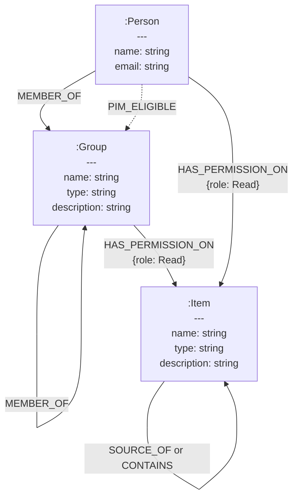

Following on from my previous post about Fabric Graph. I thought of a interesting concept. If a job fails can we determine all the downstream items and user that will affected, and notify owners of the issue. This means mixing a graph model and realtime data, which is a perfect use case from Fabric Eventhouse's and Graph Semantics.

## EventHouse Graph Semantic


## The idea

Firstly we can build a core graph of items and users that can be generated by batch. We can then enrich the graph will realtime event (i.e. job failure) to trigger a workflow to notify owners of downstream items.



## Batch Data

I've already released a [blog post](https://evaluationcontext.github.io/posts/graphframes/) about how to get [Scanner API](https://learn.microsoft.com/en-us/fabric/governance/metadata-scanning-overview) and [Graph API](https://learn.microsoft.com/en-us/graph/overview?context=graph%2Fapi%2F1.0&view=graph-rest-1.0) data before, but briefly.

### Scanner API

We can grab metadata about the Fabric Items using the [Scanner APIs](https://learn.microsoft.com/en-us/fabric/governance/metadata-scanning-overview). This will resulting in a one or more json files that will provide definitions of all our items and their properties. Each item can have different properties, which is a problem when try to store this data in a relational database, but graphs are schema-less and each node, even of the same label can have different properties.

!!! info "Permissions"

    Permission: The user must be a Fabric administrator or authenticate using a service principal
    **Required Scopes***: `Tenant.Read.All` or `Tenant.ReadWrite.All`

    \* *Relevant only when authenticating via a standard delegated admin access token. Must not be present when authentication via a service principal is used*

=== "GetModifiedWorkspaces"

    Get list of workspaces[^1]

    [^1]: [GetModifiedWorkspaces](https://learn.microsoft.com/en-us/rest/api/power-bi/admin/workspace-info-get-modified-workspace)

    ```http
    GET https://api.powerbi.com/v1.0/myorg/admin/workspaces/modified
    ```

    ```json title="response"
    [
        {
            "id": "436d9305-6eda-46c4-b395-8a9096bfacd4"
        },
        {
            "id": "6189277a-edd6-4c50-b898-0937ac050d3f"
        },
        {
            "id": "0191d5d7-172e-4169-a2f1-dc734bd7037a"
        },
        {
            "id": "b46a8df5-ec11-41cc-b2ae-1dd3155d8230"
        },
        {
            "id": "b532d5ad-7b0b-4aa4-8182-dc0f8e506ce0"
        }
    ]
    ```

=== "PostWorkspaceInfo"

    Initiates a call to receive metadata for the requested list of workspaces [^2]

    !!!info "Limitations"
    - 0-100 workspaceId per request
    - Maximum 500 requests per hour
    - Maximum 16 simultaneous requests
    

    [^2]: [PostWorkspaceInfo](https://learn.microsoft.com/en-us/rest/api/power-bi/admin/workspace-info-post-workspace-info)

    ```http
    POST https://api.powerbi.com/v1.0/myorg/admin/workspaces/getInfo?getArtifactUsers=true&datasourceDetails=true&lineage=true
    ```

    Body:
    ```json title="body"
    {
    "workspaces": [
        "436d9305-6eda-46c4-b395-8a9096bfacd4",
        "6189277a-edd6-4c50-b898-0937ac050d3f",
        "0191d5d7-172e-4169-a2f1-dc734bd7037a",
        "b46a8df5-ec11-41cc-b2ae-1dd3155d8230",
        "b532d5ad-7b0b-4aa4-8182-dc0f8e506ce0"
    ]
    }
    ```

    ```json title="response"
    {
        "id": "b977bc31-d14f-464e-ba3e-70d3625a6e61",
        "createdDateTime": "2025-11-26T22:00:16.3486823Z",
        "status": "NotStarted"
    }
    ```

=== "GetScanStatus"

    Gets the scan status for the specified scan [^3]

    [^3]: [GetScanStatus](https://learn.microsoft.com/en-us/rest/api/power-bi/admin/workspace-info-get-scan-status)

    ```http
    GET https://api.powerbi.com/v1.0/myorg/admin/workspaces/scanStatus/{scanId}
    ```

    ```json title="response"
    {
        "id": "b977bc31-d14f-464e-ba3e-70d3625a6e61",
        "createdDateTime": "2025-11-26T22:00:16.35",
        "status": "Succeeded"
    }
    ```
=== "GetScanResult"

    Gets the scan result for the specified scan, once GetScanStatus returns scan is successful

    ```http
    GET https://api.powerbi.com/v1.0/myorg/admin/workspaces/scanResult/{scanId}
    ```

    ```json "response"
    {
        "workspaces": [
            {
            "id": "436d9305-6eda-46c4-b395-8a9096bfacd4",
            "name": "PersonalWorkspace Jake",
            "type": "Personal",
            "state": "Active",
            "isOnDedicatedCapacity": true,
            "capacityId": "9A0CD8B1-FE52-40C6-B0FB-A0308E53AFDC",
            "defaultDatasetStorageFormat": "Small",
            "reports": [],
            "dashboards": [],
            "datasets": [],
            "dataflows": [],
            "datamarts": [],
            "users": [
                {
                "groupUserAccessRight": "Admin",
                "emailAddress": "JakeDuddy@EvaluationContext.onmicrosoft.com",
                "displayName": "Jake Duddy",
                "identifier": "JakeDuddy@EvaluationContext.onmicrosoft.com",
                "graphId": "3ce73e5e-8d75-4883-82bc-f62968d94875",
                "principalType": "User",
                "userType": "Member"
                }
            ]
            },
            {
            "id": "6189277a-edd6-4c50-b898-0937ac050d3f",
            "name": "Admin monitoring",
            "description": "Admin monitoring",
            "type": "AdminWorkspace",
            "state": "Active",
            "isOnDedicatedCapacity": false,
            "reports": [
                {
                "reportType": "PowerBIReport",
                "id": "7f19100c-1a84-4c87-94e7-bd0674c7ceca",
                "name": "Feature Usage and Adoption",
                "datasetId": "d212b89e-042b-4951-be4b-e2001f76c715",
                "createdDateTime": "2024-07-02T16:45:40.65",
                "modifiedDateTime": "2025-03-24T20:14:42.197",
                "modifiedBy": "AdminInsights-8cdad73e-14a5-46a7-b92b-2c9d2227abf0",
                "createdBy": "AdminInsights-8cdad73e-14a5-46a7-b92b-2c9d2227abf0",
                "modifiedById": "8cdad73e-14a5-46a7-b92b-2c9d2227abf0",
                "createdById": "8cdad73e-14a5-46a7-b92b-2c9d2227abf0",
                "users": [
                    {
                    "reportUserAccessRight": "Owner",
                    "emailAddress": "AdminInsights-8cdad73e-14a5-46a7-b92b-2c9d2227abf0",
                    "displayName": "Admin Monitoring",
                    "identifier": "AdminInsights-8cdad73e-14a5-46a7-b92b-2c9d2227abf0",
                    "graphId": "8cdad73e-14a5-46a7-b92b-2c9d2227abf0",
                    "principalType": "User",
                    "userType": null
                    },
                    {
                    "reportUserAccessRight": "ReadReshareExplore",
                    "emailAddress": null,
                    "displayName": "Tenant Administrators",
                    "identifier": "2a1d3328-87c0-4f85-90c6-0bb69b1c4978",
                    "graphId": "2a1d3328-87c0-4f85-90c6-0bb69b1c4978",
                    "principalType": "Group",
                    "userType": null
                    }
                ],
                "tags": []
                },
                {
                "reportType": "PowerBIReport",
                "id": "19212a76-4bf2-472e-a216-9074637795a2",
                "name": "Purview Hub",
                "datasetId": "642048d7-c2d7-4de8-9c65-5ac8b22b337d",
                "createdDateTime": "2024-07-02T16:45:47.52",
                "modifiedDateTime": "2024-07-02T16:45:47.52",
                "modifiedBy": "AdminInsights-8cdad73e-14a5-46a7-b92b-2c9d2227abf0",
                "createdBy": "AdminInsights-8cdad73e-14a5-46a7-b92b-2c9d2227abf0",
                "modifiedById": "8cdad73e-14a5-46a7-b92b-2c9d2227abf0",
                "createdById": "8cdad73e-14a5-46a7-b92b-2c9d2227abf0",
                "users": [
                    {
                    "reportUserAccessRight": "Owner",
                    "emailAddress": "AdminInsights-8cdad73e-14a5-46a7-b92b-2c9d2227abf0",
                    "displayName": "Admin Monitoring",
                    "identifier": "AdminInsights-8cdad73e-14a5-46a7-b92b-2c9d2227abf0",
                    "graphId": "8cdad73e-14a5-46a7-b92b-2c9d2227abf0",
                    "principalType": "User",
                    "userType": null
                    },
                    {
                    "reportUserAccessRight": "ReadReshareExplore",
                    "emailAddress": null,
                    "displayName": "Tenant Administrators",
                    "identifier": "2a1d3328-87c0-4f85-90c6-0bb69b1c4978",
                    "graphId": "2a1d3328-87c0-4f85-90c6-0bb69b1c4978",
                    "principalType": "Group",
                    "userType": null
                    }
                ],
                "tags": []
                }
            ],
            "dashboards": [],
            "datasets": [
                {
                "id": "d212b89e-042b-4951-be4b-e2001f76c715",
                "name": "Feature Usage and Adoption",
                "tables": [],
                "configuredBy": "AdminInsights-8cdad73e-14a5-46a7-b92b-2c9d2227abf0",
                "configuredById": "8cdad73e-14a5-46a7-b92b-2c9d2227abf0",
                "isEffectiveIdentityRequired": false,
                "isEffectiveIdentityRolesRequired": false,
                "refreshSchedule": {
                    "days": [
                    "Sunday",
                    "Monday",
                    "Tuesday",
                    "Wednesday",
                    "Thursday",
                    "Friday",
                    "Saturday"
                    ],
                    "times": [
                    "20:19"
                    ],
                    "enabled": true,
                    "localTimeZoneId": "UTC",
                    "notifyOption": "NoNotification"
                },
                "targetStorageMode": "Abf",
                "createdDate": "2024-07-02T16:45:38.69",
                "contentProviderType": "PbixInImportMode",
                "datasourceUsages": [
                    {
                    "datasourceInstanceId": "c5b802bf-14e3-48aa-bb63-2685f772831e"
                    }
                ],
                "users": [
                    {
                    "datasetUserAccessRight": "ReadWriteReshareExplore",
                    "emailAddress": "AdminInsights-8cdad73e-14a5-46a7-b92b-2c9d2227abf0",
                    "displayName": "Admin Monitoring",
                    "identifier": "AdminInsights-8cdad73e-14a5-46a7-b92b-2c9d2227abf0",
                    "graphId": "8cdad73e-14a5-46a7-b92b-2c9d2227abf0",
                    "principalType": "User",
                    "userType": null
                    },
                    {
                    "datasetUserAccessRight": "ReadReshareExplore",
                    "emailAddress": null,
                    "displayName": "Tenant Administrators",
                    "identifier": "2a1d3328-87c0-4f85-90c6-0bb69b1c4978",
                    "graphId": "2a1d3328-87c0-4f85-90c6-0bb69b1c4978",
                    "principalType": "Group",
                    "userType": null
                    }
                ],
                "tags": []
                },
                {
                "id": "642048d7-c2d7-4de8-9c65-5ac8b22b337d",
                "name": "Purview Hub",
                "tables": [],
                "configuredBy": "AdminInsights-8cdad73e-14a5-46a7-b92b-2c9d2227abf0",
                "configuredById": "8cdad73e-14a5-46a7-b92b-2c9d2227abf0",
                "isEffectiveIdentityRequired": false,
                "isEffectiveIdentityRolesRequired": false,
                "refreshSchedule": {
                    "days": [
                    "Sunday",
                    "Monday",
                    "Tuesday",
                    "Wednesday",
                    "Thursday",
                    "Friday",
                    "Saturday"
                    ],
                    "times": [
                    "16:50"
                    ],
                    "enabled": true,
                    "localTimeZoneId": "UTC",
                    "notifyOption": "NoNotification"
                },
                "targetStorageMode": "Abf",
                "createdDate": "2024-07-02T16:45:45.237",
                "contentProviderType": "PbixInImportMode",
                "datasourceUsages": [
                    {
                    "datasourceInstanceId": "c5b802bf-14e3-48aa-bb63-2685f772831e"
                    }
                ],
                "users": [
                    {
                    "datasetUserAccessRight": "ReadWriteReshareExplore",
                    "emailAddress": "AdminInsights-8cdad73e-14a5-46a7-b92b-2c9d2227abf0",
                    "displayName": "Admin Monitoring",
                    "identifier": "AdminInsights-8cdad73e-14a5-46a7-b92b-2c9d2227abf0",
                    "graphId": "8cdad73e-14a5-46a7-b92b-2c9d2227abf0",
                    "principalType": "User",
                    "userType": null
                    },
                    {
                    "datasetUserAccessRight": "ReadReshareExplore",
                    "emailAddress": null,
                    "displayName": "Tenant Administrators",
                    "identifier": "2a1d3328-87c0-4f85-90c6-0bb69b1c4978",
                    "graphId": "2a1d3328-87c0-4f85-90c6-0bb69b1c4978",
                    "principalType": "Group",
                    "userType": null
                    }
                ],
                "tags": []
                }
            ],
            "dataflows": [],
            "datamarts": [],
            "users": [
                {
                "groupUserAccessRight": "Admin",
                "emailAddress": "AdminInsights-8cdad73e-14a5-46a7-b92b-2c9d2227abf0",
                "displayName": "Admin Monitoring",
                "identifier": "AdminInsights-8cdad73e-14a5-46a7-b92b-2c9d2227abf0",
                "graphId": "8cdad73e-14a5-46a7-b92b-2c9d2227abf0",
                "principalType": "User",
                "userType": null
                },
                {
                "groupUserAccessRight": "None",
                "emailAddress": null,
                "displayName": "Tenant Administrators",
                "identifier": "2a1d3328-87c0-4f85-90c6-0bb69b1c4978",
                "graphId": "2a1d3328-87c0-4f85-90c6-0bb69b1c4978",
                "principalType": "Group",
                "userType": null
                }
            ]
            },
            {
            "id": "0191d5d7-172e-4169-a2f1-dc734bd7037a",
            "name": "Sudoku",
            "type": "Workspace",
            "state": "Active",
            "isOnDedicatedCapacity": true,
            "capacityId": "9A0CD8B1-FE52-40C6-B0FB-A0308E53AFDC",
            "defaultDatasetStorageFormat": "Small",
            "UserDataFunction": [
                {
                "id": "67d90437-e316-4abd-8c1d-1b7b17bba1af",
                "name": "Sudoku",
                "description": null,
                "state": "Active",
                "lastUpdatedDate": "2025-07-12T21:01:31.9309234",
                "createdDate": "2025-07-07T21:12:19.9119723",
                "modifiedBy": "JakeDuddy@EvaluationContext.onmicrosoft.com",
                "createdBy": "JakeDuddy@EvaluationContext.onmicrosoft.com",
                "modifiedById": "3ce73e5e-8d75-4883-82bc-f62968d94875",
                "createdById": "3ce73e5e-8d75-4883-82bc-f62968d94875",
                "users": [
                    {
                    "artifactUserAccessRight": "ReadWriteReshareExecute",
                    "emailAddress": "JakeDuddy@EvaluationContext.onmicrosoft.com",
                    "displayName": "Jake Duddy",
                    "identifier": "JakeDuddy@EvaluationContext.onmicrosoft.com",
                    "graphId": "3ce73e5e-8d75-4883-82bc-f62968d94875",
                    "principalType": "User",
                    "userType": "Member"
                    }
                ],
                "relations": [
                    {
                    "dependentOnArtifactId": "d7858c46-52ff-4c1b-96e6-17cb95d718d2",
                    "workspaceId": "0191d5d7-172e-4169-a2f1-dc734bd7037a",
                    "relationType": "WeakAssociation",
                    "settingsList": "WeakAssociation",
                    "usage": "None"
                    }
                ],
                "extendedProperties": {},
                "tags": []
                },
                {
                "id": "5102fee1-08c6-46a9-bfa7-61ffa11377a1",
                "name": "UserDataFunction",
                "description": null,
                "state": "Active",
                "lastUpdatedDate": "2025-09-23T17:14:51.6199887",
                "createdDate": "2025-09-22T19:57:26.4943619",
                "modifiedBy": "JakeDuddy@EvaluationContext.onmicrosoft.com",
                "createdBy": "JakeDuddy@EvaluationContext.onmicrosoft.com",
                "modifiedById": "3ce73e5e-8d75-4883-82bc-f62968d94875",
                "createdById": "3ce73e5e-8d75-4883-82bc-f62968d94875",
                "users": [
                    {
                    "artifactUserAccessRight": "ReadWriteReshareExecute",
                    "emailAddress": "JakeDuddy@EvaluationContext.onmicrosoft.com",
                    "displayName": "Jake Duddy",
                    "identifier": "JakeDuddy@EvaluationContext.onmicrosoft.com",
                    "graphId": "3ce73e5e-8d75-4883-82bc-f62968d94875",
                    "principalType": "User",
                    "userType": "Member"
                    }
                ],
                "relations": [
                    {
                    "dependentOnArtifactId": "d7858c46-52ff-4c1b-96e6-17cb95d718d2",
                    "workspaceId": "0191d5d7-172e-4169-a2f1-dc734bd7037a",
                    "relationType": "WeakAssociation",
                    "settingsList": "WeakAssociation",
                    "usage": "None"
                    }
                ],
                "extendedProperties": {},
                "tags": []
                }
            ],
            "SQLDatabase": [
                {
                "id": "d7858c46-52ff-4c1b-96e6-17cb95d718d2",
                "name": "Game",
                "description": null,
                "state": "Active",
                "lastUpdatedDate": "2025-09-30T20:43:38.157248",
                "createdDate": "2025-05-20T20:34:26.1716062",
                "modifiedBy": "JakeDuddy@EvaluationContext.onmicrosoft.com",
                "createdBy": "JakeDuddy@EvaluationContext.onmicrosoft.com",
                "modifiedById": "3ce73e5e-8d75-4883-82bc-f62968d94875",
                "createdById": "3ce73e5e-8d75-4883-82bc-f62968d94875",
                "users": [
                    {
                    "artifactUserAccessRight": "ReadWriteReshare",
                    "emailAddress": "JakeDuddy@EvaluationContext.onmicrosoft.com",
                    "displayName": "Jake Duddy",
                    "identifier": "JakeDuddy@EvaluationContext.onmicrosoft.com",
                    "graphId": "3ce73e5e-8d75-4883-82bc-f62968d94875",
                    "principalType": "User",
                    "userType": "Member"
                    }
                ],
                "extendedProperties": {
                    "SourceServerDnsName": "fleet-srv-0b311645-33be-4d53-8dd9-0a616b6e4bce-248b47a48b22",
                    "SourceDatabaseName": "Game-d7858c46-52ff-4c1b-96e6-17cb95d718d2",
                    "DnsConnectionString": "Data Source=fazr2kwaq6cu7eggbo3jwhcjpa-27kzcajoc5uudixr3rzuxvydpi.database.fabric.microsoft.com,1433;Initial Catalog=Game-d7858c46-52ff-4c1b-96e6-17cb95d718d2;Multiple Active Result Sets=False;Connect Timeout=30;Encrypt=True;Trust Server Certificate=False",
                    "ElasticPoolId": "/subscriptions/d37001d2-5801-42ea-b1f2-7f843210f51f/resourceGroups/fleet-rg-c62eb3e2-99b0-48cd-a882-60a7f72f0704-59/providers/Microsoft.Sql/servers/fleet-srv-0b311645-33be-4d53-8dd9-0a616b6e4bce-248b47a48b22/elasticPools/fleet-stdpool-dad1e9cc-7c6c-4adc-9d90-e7d9b1d09300",
                    "ReplicatorProperties": "{\r\n  \"root\": \"https://onelake.dfs.fabric.microsoft.com/0191d5d7-172e-4169-a2f1-dc734bd7037a/d7858c46-52ff-4c1b-96e6-17cb95d718d2\",\r\n  \"payloadFilePath\": \"SQLDbNativeSystem/ReplicatorPayload.json\",\r\n  \"systemFolder\": \"SQLDbNativeSystem\",\r\n  \"artifactMultiRegionProperties\": null,\r\n  \"regionName\": null\r\n}",
                    "TargetStatus": "Running",
                    "WarehouseProperties": "{\r\n  \"tdsEndpoint\": \"fazr2kwaq6cu7eggbo3jwhcjpa-27kzcajoc5uudixr3rzuxvydpi.datawarehouse.fabric.microsoft.com\",\r\n  \"id\": \"8cc76634-ed35-4383-afe9-f0f38bec0fe2\",\r\n  \"provisioningStatus\": \"success\",\r\n  \"provisioningBatchId\": \"8cc76634-ed35-4383-afe9-f0f38bec0fe2@0191d5d7-172e-4169-a2f1-dc734bd7037a$2025-05-20T20:35:37.3104876Z@fff2f164-ae7e-4799-98a5-fdf0ecee73aa\"\r\n}",
                    "DefaultSchema": "dbo"
                },
                "tags": []
                }
            ],
            "reports": [
                {
                "reportType": "PowerBIReport",
                "id": "e48907c4-608c-43f3-bc1e-a8d631df06c4",
                "name": "Sudoku",
                "datasetId": "1b41ba0a-d940-4a8c-869f-bf49c21ad443",
                "createdDateTime": "2025-07-09T22:24:50.697",
                "modifiedDateTime": "2025-07-13T13:39:31.053",
                "modifiedBy": "JakeDuddy@EvaluationContext.onmicrosoft.com",
                "createdBy": "JakeDuddy@EvaluationContext.onmicrosoft.com",
                "modifiedById": "3ce73e5e-8d75-4883-82bc-f62968d94875",
                "createdById": "3ce73e5e-8d75-4883-82bc-f62968d94875",
                "users": [
                    {
                    "reportUserAccessRight": "Owner",
                    "emailAddress": "JakeDuddy@EvaluationContext.onmicrosoft.com",
                    "displayName": "Jake Duddy",
                    "identifier": "JakeDuddy@EvaluationContext.onmicrosoft.com",
                    "graphId": "3ce73e5e-8d75-4883-82bc-f62968d94875",
                    "principalType": "User",
                    "userType": "Member"
                    }
                ],
                "tags": []
                }
            ],
            "dashboards": [],
            "datasets": [
                {
                "id": "d9f25fa3-8f31-4120-bf2e-f815a678dbce",
                "name": "Game",
                "tables": [],
                "configuredBy": "JakeDuddy@EvaluationContext.onmicrosoft.com",
                "configuredById": "3ce73e5e-8d75-4883-82bc-f62968d94875",
                "isEffectiveIdentityRequired": false,
                "isEffectiveIdentityRolesRequired": false,
                "targetStorageMode": "Abf",
                "createdDate": "2025-05-20T20:35:43.96",
                "contentProviderType": "InImportMode",
                "users": [
                    {
                    "datasetUserAccessRight": "ReadWriteReshareExplore",
                    "emailAddress": "JakeDuddy@EvaluationContext.onmicrosoft.com",
                    "displayName": "Jake Duddy",
                    "identifier": "JakeDuddy@EvaluationContext.onmicrosoft.com",
                    "graphId": "3ce73e5e-8d75-4883-82bc-f62968d94875",
                    "principalType": "User",
                    "userType": "Member"
                    }
                ],
                "tags": []
                },
                {
                "id": "1b41ba0a-d940-4a8c-869f-bf49c21ad443",
                "name": "Sudoku",
                "tables": [],
                "configuredBy": "JakeDuddy@EvaluationContext.onmicrosoft.com",
                "configuredById": "3ce73e5e-8d75-4883-82bc-f62968d94875",
                "isEffectiveIdentityRequired": true,
                "isEffectiveIdentityRolesRequired": true,
                "targetStorageMode": "Abf",
                "createdDate": "2025-07-09T22:24:49.567",
                "contentProviderType": "PbixInCompositeMode",
                "datasourceUsages": [
                    {
                    "datasourceInstanceId": "3365264e-b655-45e0-9ab8-56edab75c585"
                    }
                ],
                "users": [
                    {
                    "datasetUserAccessRight": "ReadWriteReshareExplore",
                    "emailAddress": "JakeDuddy@EvaluationContext.onmicrosoft.com",
                    "displayName": "Jake Duddy",
                    "identifier": "JakeDuddy@EvaluationContext.onmicrosoft.com",
                    "graphId": "3ce73e5e-8d75-4883-82bc-f62968d94875",
                    "principalType": "User",
                    "userType": "Member"
                    }
                ],
                "tags": []
                }
            ],
            "dataflows": [],
            "datamarts": [],
            "SQLAnalyticsEndpoint": [
                {
                "id": "8cc76634-ed35-4383-afe9-f0f38bec0fe2",
                "name": "Game",
                "configuredBy": "JakeDuddy@EvaluationContext.onmicrosoft.com",
                "configuredById": "3ce73e5e-8d75-4883-82bc-f62968d94875",
                "modifiedBy": "JakeDuddy@EvaluationContext.onmicrosoft.com",
                "modifiedById": "3ce73e5e-8d75-4883-82bc-f62968d94875",
                "modifiedDateTime": "2025-05-20T20:36:00.4387665",
                "users": [
                    {
                    "datamartUserAccessRight": "ReadWriteReshare",
                    "emailAddress": "JakeDuddy@EvaluationContext.onmicrosoft.com",
                    "displayName": "Jake Duddy",
                    "identifier": "JakeDuddy@EvaluationContext.onmicrosoft.com",
                    "graphId": "3ce73e5e-8d75-4883-82bc-f62968d94875",
                    "principalType": "User",
                    "userType": "Member"
                    }
                ],
                "tags": [],
                "relations": [
                    {
                    "dependentOnArtifactId": "d7858c46-52ff-4c1b-96e6-17cb95d718d2",
                    "workspaceId": "0191d5d7-172e-4169-a2f1-dc734bd7037a",
                    "relationType": "CascadeDelete",
                    "settingsList": "CascadeDelete",
                    "usage": "None"
                    }
                ]
                }
            ],
            "users": [
                {
                "groupUserAccessRight": "Admin",
                "emailAddress": "JakeDuddy@EvaluationContext.onmicrosoft.com",
                "displayName": "Jake Duddy",
                "identifier": "JakeDuddy@EvaluationContext.onmicrosoft.com",
                "graphId": "3ce73e5e-8d75-4883-82bc-f62968d94875",
                "principalType": "User",
                "userType": "Member"
                }
            ]
            },
            {
            "id": "b46a8df5-ec11-41cc-b2ae-1dd3155d8230",
            "name": "Power Hour",
            "type": "Workspace",
            "state": "Active",
            "isOnDedicatedCapacity": true,
            "capacityId": "9A0CD8B1-FE52-40C6-B0FB-A0308E53AFDC",
            "defaultDatasetStorageFormat": "Small",
            "Eventstream": [
                {
                "id": "17e41b1e-e53a-427f-becd-ea311c80577e",
                "name": "ES-Audio",
                "description": null,
                "state": "Active",
                "lastUpdatedDate": "2025-06-08T11:23:04.5686898",
                "createdDate": "2025-06-08T11:15:06.2163565",
                "modifiedBy": "JakeDuddy@EvaluationContext.onmicrosoft.com",
                "createdBy": "JakeDuddy@EvaluationContext.onmicrosoft.com",
                "modifiedById": "3ce73e5e-8d75-4883-82bc-f62968d94875",
                "createdById": "3ce73e5e-8d75-4883-82bc-f62968d94875",
                "users": [
                    {
                    "artifactUserAccessRight": "ReadWriteReshare",
                    "emailAddress": "JakeDuddy@EvaluationContext.onmicrosoft.com",
                    "displayName": "Jake Duddy",
                    "identifier": "JakeDuddy@EvaluationContext.onmicrosoft.com",
                    "graphId": "3ce73e5e-8d75-4883-82bc-f62968d94875",
                    "principalType": "User",
                    "userType": "Member"
                    }
                ],
                "relations": [
                    {
                    "dependentOnArtifactId": "b1862021-2e93-4848-8670-d045b168f51e",
                    "workspaceId": "b46a8df5-ec11-41cc-b2ae-1dd3155d8230",
                    "relationType": "PushData",
                    "settingsList": "None",
                    "usage": "PushData"
                    }
                ],
                "extendedProperties": {
                    "EventStreamVersion": "V2",
                    "EnableEventStreamApiV2": 1,
                    "EnableSchemaAssociation": 0
                },
                "datasourceUsages": [
                    {
                    "datasourceInstanceId": "1031afac-3ed2-476e-b71f-fbf0415120b2"
                    }
                ],
                "tags": []
                },
                {
                "id": "9faa1968-c068-428f-a489-6601d06be81d",
                "name": "ES-HeartRate",
                "description": null,
                "state": "Active",
                "lastUpdatedDate": "2025-06-08T11:22:35.7352764",
                "createdDate": "2025-06-08T11:21:24.7321358",
                "modifiedBy": "JakeDuddy@EvaluationContext.onmicrosoft.com",
                "createdBy": "JakeDuddy@EvaluationContext.onmicrosoft.com",
                "modifiedById": "3ce73e5e-8d75-4883-82bc-f62968d94875",
                "createdById": "3ce73e5e-8d75-4883-82bc-f62968d94875",
                "users": [
                    {
                    "artifactUserAccessRight": "ReadWriteReshare",
                    "emailAddress": "JakeDuddy@EvaluationContext.onmicrosoft.com",
                    "displayName": "Jake Duddy",
                    "identifier": "JakeDuddy@EvaluationContext.onmicrosoft.com",
                    "graphId": "3ce73e5e-8d75-4883-82bc-f62968d94875",
                    "principalType": "User",
                    "userType": "Member"
                    }
                ],
                "relations": [
                    {
                    "dependentOnArtifactId": "b1862021-2e93-4848-8670-d045b168f51e",
                    "workspaceId": "b46a8df5-ec11-41cc-b2ae-1dd3155d8230",
                    "relationType": "PushData",
                    "settingsList": "None",
                    "usage": "PushData"
                    }
                ],
                "extendedProperties": {
                    "EventStreamVersion": "V2",
                    "EnableEventStreamApiV2": 1,
                    "EnableSchemaAssociation": 0
                },
                "datasourceUsages": [
                    {
                    "datasourceInstanceId": "c0f7c351-412e-44ab-ac33-93e089d77b6b"
                    }
                ],
                "tags": []
                }
            ],
            "UserDataFunction": [
                {
                "id": "ea555307-5003-48b7-8b22-343cc8191b92",
                "name": "UDF-Vote",
                "description": null,
                "state": "Active",
                "lastUpdatedDate": "2025-06-19T15:46:16.5067357",
                "createdDate": "2025-06-08T12:21:26.0723234",
                "modifiedBy": "JakeDuddy@EvaluationContext.onmicrosoft.com",
                "createdBy": "JakeDuddy@EvaluationContext.onmicrosoft.com",
                "modifiedById": "3ce73e5e-8d75-4883-82bc-f62968d94875",
                "createdById": "3ce73e5e-8d75-4883-82bc-f62968d94875",
                "users": [
                    {
                    "artifactUserAccessRight": "ReadWriteReshareExecute",
                    "emailAddress": "JakeDuddy@EvaluationContext.onmicrosoft.com",
                    "displayName": "Jake Duddy",
                    "identifier": "JakeDuddy@EvaluationContext.onmicrosoft.com",
                    "graphId": "3ce73e5e-8d75-4883-82bc-f62968d94875",
                    "principalType": "User",
                    "userType": "Member"
                    }
                ],
                "relations": [
                    {
                    "dependentOnArtifactId": "03365616-e5cd-496d-adf8-18e60a7fbd56",
                    "workspaceId": "b46a8df5-ec11-41cc-b2ae-1dd3155d8230",
                    "relationType": "WeakAssociation",
                    "settingsList": "WeakAssociation",
                    "usage": "None"
                    }
                ],
                "extendedProperties": {},
                "tags": []
                }
            ],
            "KQLDashboard": [
                {
                "id": "e123d508-d54c-4da2-9ff0-91efb3e63044",
                "name": "RTD-PowerHour",
                "description": "RTD-PowerHour",
                "state": "Active",
                "lastUpdatedDate": "2025-06-08T11:45:28.6756037",
                "createdDate": "2025-06-08T11:34:18.1500792",
                "modifiedBy": "JakeDuddy@EvaluationContext.onmicrosoft.com",
                "createdBy": "JakeDuddy@EvaluationContext.onmicrosoft.com",
                "modifiedById": "3ce73e5e-8d75-4883-82bc-f62968d94875",
                "createdById": "3ce73e5e-8d75-4883-82bc-f62968d94875",
                "users": [
                    {
                    "artifactUserAccessRight": "ReadWriteReshare",
                    "emailAddress": "JakeDuddy@EvaluationContext.onmicrosoft.com",
                    "displayName": "Jake Duddy",
                    "identifier": "JakeDuddy@EvaluationContext.onmicrosoft.com",
                    "graphId": "3ce73e5e-8d75-4883-82bc-f62968d94875",
                    "principalType": "User",
                    "userType": "Member"
                    }
                ],
                "relations": [
                    {
                    "dependentOnArtifactId": "b1862021-2e93-4848-8670-d045b168f51e",
                    "workspaceId": "b46a8df5-ec11-41cc-b2ae-1dd3155d8230",
                    "relationType": "WeakAssociation",
                    "settingsList": "WeakAssociation",
                    "usage": "None"
                    }
                ],
                "extendedProperties": {},
                "tags": []
                }
            ],
            "KQLDatabase": [
                {
                "id": "b1862021-2e93-4848-8670-d045b168f51e",
                "name": "PowerHour",
                "description": "PowerHour",
                "state": "Active",
                "lastUpdatedDate": "2025-06-08T11:33:42.6236911",
                "createdDate": "2025-06-08T10:14:02.2485619",
                "modifiedBy": "JakeDuddy@EvaluationContext.onmicrosoft.com",
                "createdBy": "JakeDuddy@EvaluationContext.onmicrosoft.com",
                "modifiedById": "3ce73e5e-8d75-4883-82bc-f62968d94875",
                "createdById": "3ce73e5e-8d75-4883-82bc-f62968d94875",
                "users": [
                    {
                    "artifactUserAccessRight": "ReadWriteReshareExecute",
                    "emailAddress": "JakeDuddy@EvaluationContext.onmicrosoft.com",
                    "displayName": "Jake Duddy",
                    "identifier": "JakeDuddy@EvaluationContext.onmicrosoft.com",
                    "graphId": "3ce73e5e-8d75-4883-82bc-f62968d94875",
                    "principalType": "User",
                    "userType": "Member"
                    }
                ],
                "relations": [
                    {
                    "dependentOnArtifactId": "9faa1968-c068-428f-a489-6601d06be81d",
                    "workspaceId": "b46a8df5-ec11-41cc-b2ae-1dd3155d8230",
                    "relationType": "WeakAssociation",
                    "settingsList": "WeakAssociation",
                    "usage": "None"
                    },
                    {
                    "dependentOnArtifactId": "6cb165ef-60a6-41d7-a857-6bb9a46e5f7b",
                    "workspaceId": "b46a8df5-ec11-41cc-b2ae-1dd3155d8230",
                    "relationType": "CascadeDelete",
                    "settingsList": "CascadeDelete",
                    "usage": "None"
                    },
                    {
                    "dependentOnArtifactId": "17e41b1e-e53a-427f-becd-ea311c80577e",
                    "workspaceId": "b46a8df5-ec11-41cc-b2ae-1dd3155d8230",
                    "relationType": "WeakAssociation",
                    "settingsList": "WeakAssociation",
                    "usage": "None"
                    }
                ],
                "extendedProperties": {
                    "QueryServiceUri": "https://trd-tx333fxbjw5r2jqsc8.z3.kusto.fabric.microsoft.com",
                    "IngestionServiceUri": "https://ingest-trd-tx333fxbjw5r2jqsc8.z3.kusto.fabric.microsoft.com",
                    "Region": "uksouth",
                    "KustoDatabaseType": "Database"
                },
                "tags": []
                }
            ],
            "Eventhouse": [
                {
                "id": "6cb165ef-60a6-41d7-a857-6bb9a46e5f7b",
                "name": "PowerHour",
                "description": "PowerHour",
                "state": "Active",
                "lastUpdatedDate": "2025-06-08T10:14:04.3218",
                "createdDate": "2025-06-08T10:14:01.1479358",
                "modifiedBy": "JakeDuddy@EvaluationContext.onmicrosoft.com",
                "createdBy": "JakeDuddy@EvaluationContext.onmicrosoft.com",
                "modifiedById": "3ce73e5e-8d75-4883-82bc-f62968d94875",
                "createdById": "3ce73e5e-8d75-4883-82bc-f62968d94875",
                "users": [
                    {
                    "artifactUserAccessRight": "ReadWriteReshare",
                    "emailAddress": "JakeDuddy@EvaluationContext.onmicrosoft.com",
                    "displayName": "Jake Duddy",
                    "identifier": "JakeDuddy@EvaluationContext.onmicrosoft.com",
                    "graphId": "3ce73e5e-8d75-4883-82bc-f62968d94875",
                    "principalType": "User",
                    "userType": "Member"
                    }
                ],
                "extendedProperties": {},
                "tags": []
                }
            ],
            "KQLQueryset": [
                {
                "id": "e2413efa-a0bf-454a-a0b8-5eca544d7eb2",
                "name": "PowerHour_queryset",
                "description": "PowerHour_queryset",
                "state": "Active",
                "lastUpdatedDate": "2025-06-08T11:24:41.6712359",
                "createdDate": "2025-06-08T10:14:05.9185037",
                "modifiedBy": "JakeDuddy@EvaluationContext.onmicrosoft.com",
                "createdBy": "JakeDuddy@EvaluationContext.onmicrosoft.com",
                "modifiedById": "3ce73e5e-8d75-4883-82bc-f62968d94875",
                "createdById": "3ce73e5e-8d75-4883-82bc-f62968d94875",
                "users": [
                    {
                    "artifactUserAccessRight": "ReadWriteReshare",
                    "emailAddress": "JakeDuddy@EvaluationContext.onmicrosoft.com",
                    "displayName": "Jake Duddy",
                    "identifier": "JakeDuddy@EvaluationContext.onmicrosoft.com",
                    "graphId": "3ce73e5e-8d75-4883-82bc-f62968d94875",
                    "principalType": "User",
                    "userType": "Member"
                    }
                ],
                "relations": [
                    {
                    "dependentOnArtifactId": "b1862021-2e93-4848-8670-d045b168f51e",
                    "workspaceId": "b46a8df5-ec11-41cc-b2ae-1dd3155d8230",
                    "relationType": "CascadeDelete",
                    "settingsList": "CascadeDelete",
                    "usage": "None"
                    },
                    {
                    "dependentOnArtifactId": "b1862021-2e93-4848-8670-d045b168f51e",
                    "workspaceId": "b46a8df5-ec11-41cc-b2ae-1dd3155d8230",
                    "relationType": "WeakAssociation",
                    "settingsList": "WeakAssociation",
                    "usage": "None"
                    }
                ],
                "extendedProperties": {},
                "tags": []
                }
            ],
            "SQLDatabase": [
                {
                "id": "03365616-e5cd-496d-adf8-18e60a7fbd56",
                "name": "DB-Exercise",
                "description": null,
                "state": "Active",
                "lastUpdatedDate": "2025-09-30T20:47:18.7340745",
                "createdDate": "2025-06-08T12:23:13.340336",
                "modifiedBy": "JakeDuddy@EvaluationContext.onmicrosoft.com",
                "createdBy": "JakeDuddy@EvaluationContext.onmicrosoft.com",
                "modifiedById": "3ce73e5e-8d75-4883-82bc-f62968d94875",
                "createdById": "3ce73e5e-8d75-4883-82bc-f62968d94875",
                "users": [
                    {
                    "artifactUserAccessRight": "ReadWriteReshare",
                    "emailAddress": "JakeDuddy@EvaluationContext.onmicrosoft.com",
                    "displayName": "Jake Duddy",
                    "identifier": "JakeDuddy@EvaluationContext.onmicrosoft.com",
                    "graphId": "3ce73e5e-8d75-4883-82bc-f62968d94875",
                    "principalType": "User",
                    "userType": "Member"
                    }
                ],
                "extendedProperties": {
                    "SourceServerDnsName": "fleet-srv-fcd36ae7-72e9-40fe-b5e6-affb7211dfc1-0ca2d00a46d3",
                    "SourceDatabaseName": "DB-Exercise-03365616-e5cd-496d-adf8-18e60a7fbd56",
                    "DnsConnectionString": "Data Source=fazr2kwaq6cu7eggbo3jwhcjpa-6wgwvnar5tgedmvodxjrkxmcga.database.fabric.microsoft.com,1433;Initial Catalog=DB-Exercise-03365616-e5cd-496d-adf8-18e60a7fbd56;Multiple Active Result Sets=False;Connect Timeout=30;Encrypt=True;Trust Server Certificate=False",
                    "ElasticPoolId": "/subscriptions/a93cdfd5-9ed3-4e3d-9e00-aeb58da79ba6/resourceGroups/fleet-rg-c62eb3e2-99b0-48cd-a882-60a7f72f0704-60/providers/Microsoft.Sql/servers/fleet-srv-fcd36ae7-72e9-40fe-b5e6-affb7211dfc1-0ca2d00a46d3/elasticPools/fleet-stdpool-9a3783af-db7e-4933-aaad-d1b32e58ac1e",
                    "ReplicatorProperties": "{\r\n  \"root\": \"https://onelake.dfs.fabric.microsoft.com/b46a8df5-ec11-41cc-b2ae-1dd3155d8230/03365616-e5cd-496d-adf8-18e60a7fbd56\",\r\n  \"payloadFilePath\": \"SQLDbNativeSystem/ReplicatorPayload.json\",\r\n  \"systemFolder\": \"SQLDbNativeSystem\",\r\n  \"artifactMultiRegionProperties\": null,\r\n  \"regionName\": null\r\n}",
                    "TargetStatus": "Running",
                    "WarehouseProperties": "{\r\n  \"tdsEndpoint\": \"fazr2kwaq6cu7eggbo3jwhcjpa-6wgwvnar5tgedmvodxjrkxmcga.datawarehouse.fabric.microsoft.com\",\r\n  \"id\": \"1cd89a22-42a8-4d21-a0ee-a1322f2c0c61\",\r\n  \"provisioningStatus\": \"success\",\r\n  \"provisioningBatchId\": \"1cd89a22-42a8-4d21-a0ee-a1322f2c0c61@b46a8df5-ec11-41cc-b2ae-1dd3155d8230$2025-06-08T12:23:50.0869894Z@07aea8cf-5a8e-4096-a4bf-1c394f5ad97a\"\r\n}",
                    "DefaultSchema": "dbo"
                },
                "tags": []
                }
            ],
            "reports": [
                {
                "reportType": "PowerBIReport",
                "format": "PBIR",
                "id": "03b3bb6c-d969-4dd8-b49a-2a6a481d7dd7",
                "name": "PowerHour",
                "datasetId": "f8a0591a-424b-448a-9b61-145754023966",
                "createdDateTime": "2025-06-16T19:56:12.627",
                "modifiedDateTime": "2025-06-19T16:07:18.297",
                "modifiedBy": "JakeDuddy@EvaluationContext.onmicrosoft.com",
                "createdBy": "JakeDuddy@EvaluationContext.onmicrosoft.com",
                "modifiedById": "3ce73e5e-8d75-4883-82bc-f62968d94875",
                "createdById": "3ce73e5e-8d75-4883-82bc-f62968d94875",
                "users": [
                    {
                    "reportUserAccessRight": "Owner",
                    "emailAddress": "JakeDuddy@EvaluationContext.onmicrosoft.com",
                    "displayName": "Jake Duddy",
                    "identifier": "JakeDuddy@EvaluationContext.onmicrosoft.com",
                    "graphId": "3ce73e5e-8d75-4883-82bc-f62968d94875",
                    "principalType": "User",
                    "userType": "Member"
                    }
                ],
                "tags": []
                }
            ],
            "dashboards": [],
            "datasets": [
                {
                "id": "a0a3ea86-28d9-4f77-8a08-f2d14574feab",
                "name": "DB-Exercise",
                "tables": [],
                "configuredBy": "JakeDuddy@EvaluationContext.onmicrosoft.com",
                "configuredById": "3ce73e5e-8d75-4883-82bc-f62968d94875",
                "isEffectiveIdentityRequired": false,
                "isEffectiveIdentityRolesRequired": false,
                "targetStorageMode": "Abf",
                "createdDate": "2025-06-08T12:23:51.67",
                "contentProviderType": "InImportMode",
                "users": [
                    {
                    "datasetUserAccessRight": "ReadWriteReshareExplore",
                    "emailAddress": "JakeDuddy@EvaluationContext.onmicrosoft.com",
                    "displayName": "Jake Duddy",
                    "identifier": "JakeDuddy@EvaluationContext.onmicrosoft.com",
                    "graphId": "3ce73e5e-8d75-4883-82bc-f62968d94875",
                    "principalType": "User",
                    "userType": "Member"
                    }
                ],
                "tags": []
                },
                {
                "id": "f8a0591a-424b-448a-9b61-145754023966",
                "name": "PowerHour",
                "tables": [],
                "configuredBy": "JakeDuddy@EvaluationContext.onmicrosoft.com",
                "configuredById": "3ce73e5e-8d75-4883-82bc-f62968d94875",
                "isEffectiveIdentityRequired": false,
                "isEffectiveIdentityRolesRequired": false,
                "targetStorageMode": "Abf",
                "createdDate": "2025-06-16T19:56:11.66",
                "contentProviderType": "PbixInCompositeMode",
                "relations": [
                    {
                    "dependentOnArtifactId": "b1862021-2e93-4848-8670-d045b168f51e",
                    "workspaceId": "b46a8df5-ec11-41cc-b2ae-1dd3155d8230",
                    "relationType": "Association",
                    "settingsList": "Association",
                    "usage": "None"
                    }
                ],
                "datasourceUsages": [
                    {
                    "datasourceInstanceId": "ac472bec-8816-484b-bff8-ef5598c53437"
                    },
                    {
                    "datasourceInstanceId": "e88d9441-bc1f-4c74-a3f0-94dad59af052"
                    }
                ],
                "users": [
                    {
                    "datasetUserAccessRight": "ReadWriteReshareExplore",
                    "emailAddress": "JakeDuddy@EvaluationContext.onmicrosoft.com",
                    "displayName": "Jake Duddy",
                    "identifier": "JakeDuddy@EvaluationContext.onmicrosoft.com",
                    "graphId": "3ce73e5e-8d75-4883-82bc-f62968d94875",
                    "principalType": "User",
                    "userType": "Member"
                    }
                ],
                "tags": []
                }
            ],
            "dataflows": [],
            "datamarts": [],
            "SQLAnalyticsEndpoint": [
                {
                "id": "1cd89a22-42a8-4d21-a0ee-a1322f2c0c61",
                "name": "DB-Exercise",
                "configuredBy": "JakeDuddy@EvaluationContext.onmicrosoft.com",
                "configuredById": "3ce73e5e-8d75-4883-82bc-f62968d94875",
                "modifiedBy": "JakeDuddy@EvaluationContext.onmicrosoft.com",
                "modifiedById": "3ce73e5e-8d75-4883-82bc-f62968d94875",
                "modifiedDateTime": "2025-06-09T16:58:46.323832",
                "users": [
                    {
                    "datamartUserAccessRight": "ReadWriteReshare",
                    "emailAddress": "JakeDuddy@EvaluationContext.onmicrosoft.com",
                    "displayName": "Jake Duddy",
                    "identifier": "JakeDuddy@EvaluationContext.onmicrosoft.com",
                    "graphId": "3ce73e5e-8d75-4883-82bc-f62968d94875",
                    "principalType": "User",
                    "userType": "Member"
                    }
                ],
                "tags": [],
                "relations": [
                    {
                    "dependentOnArtifactId": "03365616-e5cd-496d-adf8-18e60a7fbd56",
                    "workspaceId": "b46a8df5-ec11-41cc-b2ae-1dd3155d8230",
                    "relationType": "CascadeDelete",
                    "settingsList": "CascadeDelete",
                    "usage": "None"
                    }
                ]
                }
            ],
            "users": [
                {
                "groupUserAccessRight": "Admin",
                "emailAddress": "JakeDuddy@EvaluationContext.onmicrosoft.com",
                "displayName": "Jake Duddy",
                "identifier": "JakeDuddy@EvaluationContext.onmicrosoft.com",
                "graphId": "3ce73e5e-8d75-4883-82bc-f62968d94875",
                "principalType": "User",
                "userType": "Member"
                }
            ]
            },
            {
            "id": "b532d5ad-7b0b-4aa4-8182-dc0f8e506ce0",
            "name": "Graphs",
            "type": "Workspace",
            "state": "Active",
            "isOnDedicatedCapacity": true,
            "capacityId": "9A0CD8B1-FE52-40C6-B0FB-A0308E53AFDC",
            "defaultDatasetStorageFormat": "Small",
            "GraphModel": [
                {
                "id": "67461a30-c229-4165-8571-08966177a4ee",
                "name": "Fabric",
                "description": null,
                "state": "Active",
                "lastUpdatedDate": "2025-11-24T22:45:34.6218969",
                "createdDate": "2025-11-24T19:27:08.4751866",
                "modifiedBy": "JakeDuddy@EvaluationContext.onmicrosoft.com",
                "createdBy": "JakeDuddy@EvaluationContext.onmicrosoft.com",
                "modifiedById": "3ce73e5e-8d75-4883-82bc-f62968d94875",
                "createdById": "3ce73e5e-8d75-4883-82bc-f62968d94875",
                "users": [
                    {
                    "artifactUserAccessRight": "ReadWriteReshareExecute",
                    "emailAddress": "JakeDuddy@EvaluationContext.onmicrosoft.com",
                    "displayName": "Jake Duddy",
                    "identifier": "JakeDuddy@EvaluationContext.onmicrosoft.com",
                    "graphId": "3ce73e5e-8d75-4883-82bc-f62968d94875",
                    "principalType": "User",
                    "userType": "Member"
                    }
                ],
                "extendedProperties": {
                    "Status": "Full"
                },
                "tags": []
                }
            ],
            "KQLDatabase": [
                {
                "id": "25625ac9-d510-4801-8257-baffe1f71e4c",
                "name": "Graph",
                "description": "Graph",
                "state": "Active",
                "lastUpdatedDate": "2025-06-14T19:36:24.749094",
                "createdDate": "2025-06-14T19:36:19.5498847",
                "modifiedBy": "JakeDuddy@EvaluationContext.onmicrosoft.com",
                "createdBy": "JakeDuddy@EvaluationContext.onmicrosoft.com",
                "modifiedById": "3ce73e5e-8d75-4883-82bc-f62968d94875",
                "createdById": "3ce73e5e-8d75-4883-82bc-f62968d94875",
                "users": [
                    {
                    "artifactUserAccessRight": "ReadWriteReshareExecute",
                    "emailAddress": "JakeDuddy@EvaluationContext.onmicrosoft.com",
                    "displayName": "Jake Duddy",
                    "identifier": "JakeDuddy@EvaluationContext.onmicrosoft.com",
                    "graphId": "3ce73e5e-8d75-4883-82bc-f62968d94875",
                    "principalType": "User",
                    "userType": "Member"
                    }
                ],
                "relations": [
                    {
                    "dependentOnArtifactId": "e1dfc613-4779-438a-8ce7-1609d3d4fd79",
                    "workspaceId": "b532d5ad-7b0b-4aa4-8182-dc0f8e506ce0",
                    "relationType": "CascadeDelete",
                    "settingsList": "CascadeDelete",
                    "usage": "None"
                    }
                ],
                "extendedProperties": {
                    "QueryServiceUri": "https://trd-y4vwg29chydm6jmuga.z0.kusto.fabric.microsoft.com",
                    "IngestionServiceUri": "https://ingest-trd-y4vwg29chydm6jmuga.z0.kusto.fabric.microsoft.com",
                    "Region": "uksouth",
                    "KustoDatabaseType": "Database"
                },
                "tags": []
                }
            ],
            "Eventhouse": [
                {
                "id": "e1dfc613-4779-438a-8ce7-1609d3d4fd79",
                "name": "Graph",
                "description": "Graph",
                "state": "Active",
                "lastUpdatedDate": "2025-06-14T19:36:21.5968991",
                "createdDate": "2025-06-14T19:36:18.5522206",
                "modifiedBy": "JakeDuddy@EvaluationContext.onmicrosoft.com",
                "createdBy": "JakeDuddy@EvaluationContext.onmicrosoft.com",
                "modifiedById": "3ce73e5e-8d75-4883-82bc-f62968d94875",
                "createdById": "3ce73e5e-8d75-4883-82bc-f62968d94875",
                "users": [
                    {
                    "artifactUserAccessRight": "ReadWriteReshare",
                    "emailAddress": "JakeDuddy@EvaluationContext.onmicrosoft.com",
                    "displayName": "Jake Duddy",
                    "identifier": "JakeDuddy@EvaluationContext.onmicrosoft.com",
                    "graphId": "3ce73e5e-8d75-4883-82bc-f62968d94875",
                    "principalType": "User",
                    "userType": "Member"
                    }
                ],
                "extendedProperties": {},
                "tags": []
                }
            ],
            "KQLQueryset": [
                {
                "id": "a3bf0053-d36e-42af-b3db-3a254c07eaae",
                "name": "Graph_queryset",
                "description": "Graph_queryset",
                "state": "Active",
                "lastUpdatedDate": "2025-07-17T05:54:13.9156192",
                "createdDate": "2025-06-14T19:36:23.4508998",
                "modifiedBy": "JakeDuddy@EvaluationContext.onmicrosoft.com",
                "createdBy": "JakeDuddy@EvaluationContext.onmicrosoft.com",
                "modifiedById": "3ce73e5e-8d75-4883-82bc-f62968d94875",
                "createdById": "3ce73e5e-8d75-4883-82bc-f62968d94875",
                "users": [
                    {
                    "artifactUserAccessRight": "ReadWriteReshare",
                    "emailAddress": "JakeDuddy@EvaluationContext.onmicrosoft.com",
                    "displayName": "Jake Duddy",
                    "identifier": "JakeDuddy@EvaluationContext.onmicrosoft.com",
                    "graphId": "3ce73e5e-8d75-4883-82bc-f62968d94875",
                    "principalType": "User",
                    "userType": "Member"
                    }
                ],
                "relations": [
                    {
                    "dependentOnArtifactId": "25625ac9-d510-4801-8257-baffe1f71e4c",
                    "workspaceId": "b532d5ad-7b0b-4aa4-8182-dc0f8e506ce0",
                    "relationType": "WeakAssociation",
                    "settingsList": "WeakAssociation",
                    "usage": "None"
                    },
                    {
                    "dependentOnArtifactId": "25625ac9-d510-4801-8257-baffe1f71e4c",
                    "workspaceId": "b532d5ad-7b0b-4aa4-8182-dc0f8e506ce0",
                    "relationType": "CascadeDelete",
                    "settingsList": "CascadeDelete",
                    "usage": "None"
                    }
                ],
                "extendedProperties": {},
                "tags": []
                }
            ],
            "Lakehouse": [
                {
                "id": "160926a8-541e-4d9a-8a94-dc444ea4e566",
                "name": "LK_fabricGraph",
                "description": null,
                "state": "Active",
                "lastUpdatedDate": "2025-11-24T19:34:21.4700154",
                "createdDate": "2025-11-24T19:34:04.9987745",
                "modifiedBy": "JakeDuddy@EvaluationContext.onmicrosoft.com",
                "createdBy": "JakeDuddy@EvaluationContext.onmicrosoft.com",
                "modifiedById": "3ce73e5e-8d75-4883-82bc-f62968d94875",
                "createdById": "3ce73e5e-8d75-4883-82bc-f62968d94875",
                "users": [
                    {
                    "artifactUserAccessRight": "ReadWriteReshareExecute",
                    "emailAddress": "JakeDuddy@EvaluationContext.onmicrosoft.com",
                    "displayName": "Jake Duddy",
                    "identifier": "JakeDuddy@EvaluationContext.onmicrosoft.com",
                    "graphId": "3ce73e5e-8d75-4883-82bc-f62968d94875",
                    "principalType": "User",
                    "userType": "Member"
                    }
                ],
                "extendedProperties": {
                    "OneLakeTablesPath": "https://onelake.dfs.fabric.microsoft.com/b532d5ad-7b0b-4aa4-8182-dc0f8e506ce0/160926a8-541e-4d9a-8a94-dc444ea4e566/Tables",
                    "OneLakeFilesPath": "https://onelake.dfs.fabric.microsoft.com/b532d5ad-7b0b-4aa4-8182-dc0f8e506ce0/160926a8-541e-4d9a-8a94-dc444ea4e566/Files",
                    "DwProperties": "{\"tdsEndpoint\":\"fazr2kwaq6cu7eggbo3jwhcjpa-vxktfnilposevamc3qhy4udm4a.datawarehouse.fabric.microsoft.com\",\"id\":\"599d0c55-3b7d-4661-8c62-22b03a795ed4\",\"provisioningStatus\":\"Success\"}"
                },
                "tags": []
                }
            ],
            "Notebook": [
                {
                "id": "fcb3e22b-dc9d-4903-a1cd-ef5776ddac32",
                "name": "Notebook 1",
                "description": "New notebook",
                "state": "Active",
                "lastUpdatedDate": "2025-11-24T21:35:40.1968197",
                "createdDate": "2025-11-24T21:25:16.9398343",
                "modifiedBy": "JakeDuddy@EvaluationContext.onmicrosoft.com",
                "createdBy": "JakeDuddy@EvaluationContext.onmicrosoft.com",
                "modifiedById": "3ce73e5e-8d75-4883-82bc-f62968d94875",
                "createdById": "3ce73e5e-8d75-4883-82bc-f62968d94875",
                "users": [
                    {
                    "artifactUserAccessRight": "ReadWriteReshareExecute",
                    "emailAddress": "JakeDuddy@EvaluationContext.onmicrosoft.com",
                    "displayName": "Jake Duddy",
                    "identifier": "JakeDuddy@EvaluationContext.onmicrosoft.com",
                    "graphId": "3ce73e5e-8d75-4883-82bc-f62968d94875",
                    "principalType": "User",
                    "userType": "Member"
                    }
                ],
                "relations": [
                    {
                    "dependentOnArtifactId": "160926a8-541e-4d9a-8a94-dc444ea4e566",
                    "workspaceId": "b532d5ad-7b0b-4aa4-8182-dc0f8e506ce0",
                    "relationType": "Datasource",
                    "settingsList": "None",
                    "usage": "Datasource"
                    }
                ],
                "extendedProperties": {},
                "tags": []
                }
            ],
            "reports": [],
            "dashboards": [],
            "datasets": [],
            "dataflows": [],
            "datamarts": [],
            "SQLAnalyticsEndpoint": [
                {
                "id": "599d0c55-3b7d-4661-8c62-22b03a795ed4",
                "name": "LK_fabricGraph",
                "configuredBy": "JakeDuddy@EvaluationContext.onmicrosoft.com",
                "configuredById": "3ce73e5e-8d75-4883-82bc-f62968d94875",
                "modifiedBy": "JakeDuddy@EvaluationContext.onmicrosoft.com",
                "modifiedById": "3ce73e5e-8d75-4883-82bc-f62968d94875",
                "modifiedDateTime": "2025-11-25T20:48:42.6219911",
                "users": [
                    {
                    "datamartUserAccessRight": "ReadWriteReshare",
                    "emailAddress": "JakeDuddy@EvaluationContext.onmicrosoft.com",
                    "displayName": "Jake Duddy",
                    "identifier": "JakeDuddy@EvaluationContext.onmicrosoft.com",
                    "graphId": "3ce73e5e-8d75-4883-82bc-f62968d94875",
                    "principalType": "User",
                    "userType": "Member"
                    }
                ],
                "tags": [],
                "relations": [
                    {
                    "dependentOnArtifactId": "160926a8-541e-4d9a-8a94-dc444ea4e566",
                    "workspaceId": "b532d5ad-7b0b-4aa4-8182-dc0f8e506ce0",
                    "relationType": "CascadeDelete",
                    "settingsList": "CascadeDelete",
                    "usage": "None"
                    }
                ]
                }
            ],
            "users": [
                {
                "groupUserAccessRight": "Admin",
                "emailAddress": "JakeDuddy@EvaluationContext.onmicrosoft.com",
                "displayName": "Jake Duddy",
                "identifier": "JakeDuddy@EvaluationContext.onmicrosoft.com",
                "graphId": "3ce73e5e-8d75-4883-82bc-f62968d94875",
                "principalType": "User",
                "userType": "Member"
                }
            ]
            }
        ],
        "datasourceInstances": [
            {
            "datasourceType": "Extension",
            "connectionDetails": {
                "extensionDataSourceKind": "AdminInsights",
                "extensionDataSourcePath": "AdminInsights"
            },
            "datasourceId": "c5b802bf-14e3-48aa-bb63-2685f772831e",
            "gatewayId": "9a5c6040-ad5c-4f5f-a368-27745e37da5c"
            },
            {
            "datasourceType": "Sql",
            "connectionDetails": {
                "server": "fazr2kwaq6cu7eggbo3jwhcjpa-27kzcajoc5uudixr3rzuxvydpi.database.fabric.microsoft.com",
                "database": "Game-d7858c46-52ff-4c1b-96e6-17cb95d718d2"
            },
            "datasourceId": "3365264e-b655-45e0-9ab8-56edab75c585",
            "gatewayId": "dc02c607-24d7-47c5-b723-65b865454edc"
            },
            {
            "datasourceType": "Sql",
            "connectionDetails": {
                "server": "fazr2kwaq6cu7eggbo3jwhcjpa-6wgwvnar5tgedmvodxjrkxmcga.database.fabric.microsoft.com",
                "database": "DB-Exercise-03365616-e5cd-496d-adf8-18e60a7fbd56"
            },
            "datasourceId": "e88d9441-bc1f-4c74-a3f0-94dad59af052",
            "gatewayId": "dc02c607-24d7-47c5-b723-65b865454edc"
            },
            {
            "datasourceType": "Extension",
            "connectionDetails": {
                "extensionDataSourceKind": "AzureDataExplorer",
                "extensionDataSourcePath": "https://trd-tx333fxbjw5r2jqsc8.z3.kusto.fabric.microsoft.com"
            },
            "datasourceId": "ac472bec-8816-484b-bff8-ef5598c53437",
            "gatewayId": "dc02c607-24d7-47c5-b723-65b865454edc"
            },
            {
            "datasourceType": "Extension",
            "connectionDetails": {
                "extensionDataSourceKind": "EventHub",
                "extensionDataSourcePath": "{\"endpoint\":\"PowerHour\",\"entityPath\":\"audio\",\"consumerGroup\":\"$Default\"}"
            },
            "datasourceId": "1031afac-3ed2-476e-b71f-fbf0415120b2",
            "gatewayId": "dbdfea4d-e443-4d21-b36c-09f14c6cfe63"
            },
            {
            "datasourceType": "Extension",
            "connectionDetails": {
                "extensionDataSourceKind": "EventHub",
                "extensionDataSourcePath": "{\"endpoint\":\"PowerHour\",\"entityPath\":\"heartrate\",\"consumerGroup\":\"$Default\"}"
            },
            "datasourceId": "c0f7c351-412e-44ab-ac33-93e089d77b6b",
            "gatewayId": "dbdfea4d-e443-4d21-b36c-09f14c6cfe63"
            }
        ]
    }
    ```

### Graph API

If we look at different items we can see a users key, which will list all User, User Groups and Service Principals that have direct permissions on at a items.

```json
"SQLDatabase": [
{
    "id": "d7858c46-52ff-4c1b-96e6-17cb95d718d2",
    "name": "Game",
    "description": null,
    "state": "Active",
    "lastUpdatedDate": "2025-09-30T20:43:38.157248",
    "createdDate": "2025-05-20T20:34:26.1716062",
    "modifiedBy": "JakeDuddy@EvaluationContext.onmicrosoft.com",
    "createdBy": "JakeDuddy@EvaluationContext.onmicrosoft.com",
    "modifiedById": "3ce73e5e-8d75-4883-82bc-f62968d94875",
    "createdById": "3ce73e5e-8d75-4883-82bc-f62968d94875",
    "users": [
    {
        "artifactUserAccessRight": "ReadWriteReshare",
        "emailAddress": "JakeDuddy@EvaluationContext.onmicrosoft.com",
        "displayName": "Jake Duddy",
        "identifier": "JakeDuddy@EvaluationContext.onmicrosoft.com",
        "graphId": "3ce73e5e-8d75-4883-82bc-f62968d94875",
        "principalType": "User",
        "userType": "Member"
    }
    ],
    "extendedProperties": {
    ...
    },
    "tags": []
}
],
```

If we want to map through User Groups back to Users we will also need to call Graph API.

=== "List groups"

    List all the groups available in an organization [^5]

    [^5]: https://learn.microsoft.com/en-us/graph/api/group-list?view=graph-rest-1.0&tabs=http

    !!! info "Permission"

        `Directory.Read.All`

    ```http
    GET https://graph.microsoft.com/v1.0/groups?$expand=members($select=id,displayName,mail,userType)
    ```

### Now what

We can drop the json files into a lakehouse, register the data as deltatables with a notebook. We can then shortcut the tables into a lakehouse for us to use later.

## Event House

### Building the Persistent Graph

Fabric EventHouse allows two types of graphs, x and persitant. Add some info on both types

Since we will only run scan the tenant in batch (maybe daily) we can use a persitant graph

[Query acceleration over OneLake shortcuts](https://learn.microsoft.com/en-us/fabric/real-time-intelligence/query-acceleration)


### RealTime Events

For realtime event we can wait for a trigger then use the fabricItemId to query the graph.

```kql
// Persistent graph of dependencies and permissions
let ItemGraph = Items
| make-graph source --> target with Edges on ItemId;

// Real-time failure events (transient)
FailureEvents
| where Timestamp > ago(5m)
| graph-match (failedItem)-[depends*1..10]->(affectedItem) in ItemGraph
| join kind=inner Permissions on $right.ItemId == affectedItem.ItemId
| join kind=inner Users on $right.UserId == Users.UserId
| project FailureTime, FailedItemId, AffectedItemName, UserEmail
```


##

[Thanks to [Henning Rauch](https://www.linkedin.com/in/henning-rauch-adx/) for pointing me towards docs for this post]