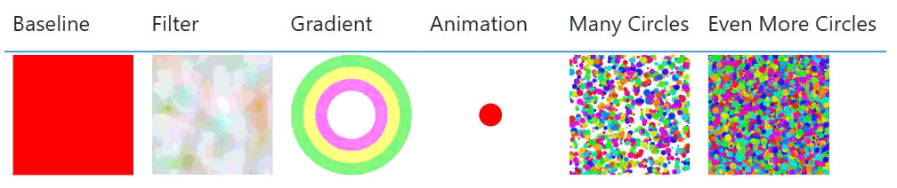
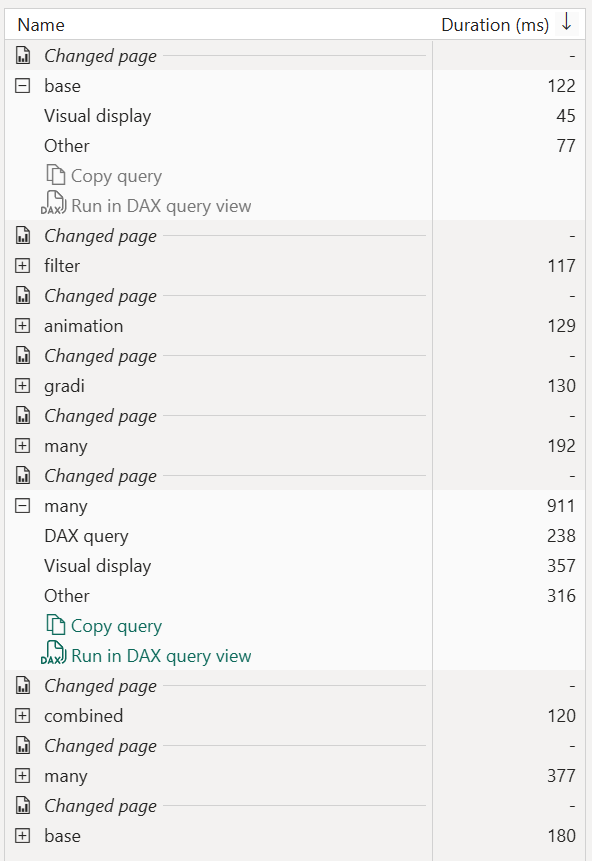
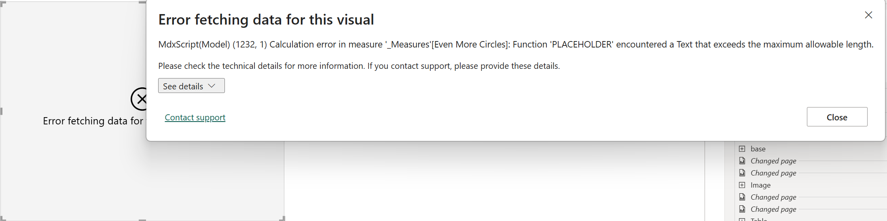
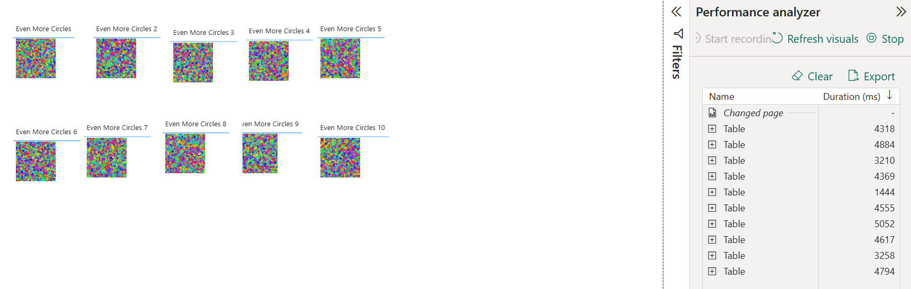
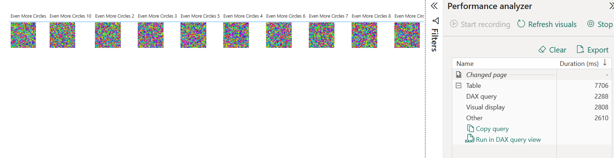

I recently attended [Chris Webb's](https://www.linkedin.com/in/chriswebb6/) SQLBits session, `Secrets of Power BI Performance Analyzer`. The talk focused on report page processing, from query generation to the final rendering of visuals. Depending on the visual, the process can also include extras like [geocoding](https://blog.crossjoin.co.uk/2026/01/11/measuring-geocoding-performance-in-power-bi-map-visuals-using-performance-analyzer/) and [image loading](https://blog.crossjoin.co.uk/2026/01/18/measuring-time-to-display-for-image-visuals-in-power-bi-with-performance-analyzer/).

After my DAXLib session, we briefly chatted about the render performance for SVGs and I realized for my [DaxLib.SVG](https://daxlib.org/package/DaxLib.SVG/) library, my primary focus has been on optimizing the [DAX performance](https://evaluationcontext.github.io/posts/daxlibCompoundPerformance/) but I've not thought about cost of actually rendering the images. So to beat Chris to the punch with his unstoppable weekly blogging cadence I raced to see what I could discover.

## Test Subjects

I consulted AI on which elements might be expensive to render, and it suggested animations `#!html <animate>`, complex filters `#!html <filter>`, and gradients `#!html <radialGradient>`. This is related to any math the render engine will have to perform to output the visual. I also assumed that rending a large number of cheap elements might also be expensive. In addition I also added a simple humble `#!html <rect>` as a baseline. 

To understand the rendering cost, I added each measures to a table, each on a separate page and used Performance Analyzer to record the events. To avoid any caching I navigated to a blank page, saved, re-opened the report, started Performance Analyzer then navigated between each page.

=== "Test Subjects"

    

=== "Baseline"

    A humble `#! <Rect>`.

    ```dax
    baseline = 
    "data:image/svg+xml;utf8,
    <svg xmlns='http://www.w3.org/2000/svg' viewBox='0 0 500 500'>
      <rect x='0' y='0' width='500' height='500' fill='red'>" "</rect>
    </svg>"
    ```

=== "Filters"

    SVG filters allow for applying effects like blurs, turbulence, and color transformations. These operations can be computationally intensive.

    ```dax
    Filter = 
    "data:image/svg+xml;utf8,
    <svg xmlns='http://www.w3.org/2000/svg' viewBox='0 0 200 200'>
      <filter id='heavyNoise'>
        <feTurbulence type='fractalNoise' baseFrequency='0.02' numOctaves='8' result='noise' />
        <feColorMatrix type='hueRotate' values='90' />
      </filter>
      <rect width='200' height='200' filter='url(#heavyNoise)' />
    </svg>"
    ```

=== "Gradients"

    Gradients, especially complex radial gradients applied to multiple objects, could also impact rendering time.

    ```dax
    Gradient = 
    "data:image/svg+xml;utf8,
    <svg xmlns='http://www.w3.org/2000/svg' viewBox='0 0 200 200'>
      <defs>
        <radialGradient id='grad1' cx='50%' cy='50%' r='50%'>
          <stop offset='0%' stop-color='rgba(255,0,0,0.5)' />
          <stop offset='100%' stop-color='rgba(0,0,255,0.5)' />
        </radialGradient>
      </defs>
      <circle cx='100' cy='100' r='90' fill='url(#grad1)' stroke='rgba(0,255,0,0.5)' stroke-width='20' />
      <circle cx='100' cy='100' r='70' fill='url(#grad1)' stroke='rgba(255,255,0,0.5)' stroke-width='20' />
      <circle cx='100' cy='100' r='50' fill='url(#grad1)' stroke='rgba(255,0,255,0.5)' stroke-width='20' />
    </svg>"
    ```

=== "Animation"

    ```dax
    Animation = 
    "data:image/svg+xml;utf8,
    <svg xmlns='http://www.w3.org/2000/svg' viewBox='0 0 200 200'>
      <circle cx='100' cy='100' r='10' fill='red'>
        <animate attributeName='r' values='10;150;10' dur='0.05s' repeatCount='indefinite' />
      </circle>
    </svg>"
    ```

=== "Many Circles"

    What is the cost of rendering many simple shapes versus one complex shape? Lets look at a bunch of circles.

    ```dax
    Many Circles = 
    VAR NumItems = 1000
    VAR Circles = 
      ADDCOLUMNS(
        GENERATESERIES(1, NumItems),
        "cx", RAND() * 200,
        "cy", RAND() * 200,
        "r", RAND() * 5 + 1,
        "fill", "hsl(" & RAND() * 360 & ", 80%, 50%)"
      )
    VAR SvgItems = 
      CONCATENATEX(
        Circles,
        "<circle cx='" & [cx] & "' cy='" & [cy] & "' r='" & [r] & "' fill='" & [fill] & "' />",
        UNICHAR(10)
      )
    RETURN
    "data:image/svg+xml;utf8,
    <svg xmlns='http://www.w3.org/2000/svg' viewBox='0 0 200 200'>" & UNICHAR(10) &
    SvgItems & UNICHAR(10) &
    "</svg>"
    ```

=== "Even More Circles"

    And a few more.

    ```dax
    Even More Circles = 
    VAR NumItems = 10000
    VAR Circles = 
      ADDCOLUMNS(
        GENERATESERIES(1, NumItems),
        "cx", RAND() * 200,
        "cy", RAND() * 200,
        "r", RAND() * 5 + 1,
        "fill", "hsl(" & RAND() * 360 & ", 80%, 50%)"
      )
    VAR SvgItems = 
      CONCATENATEX(
        Circles,
        "<circle cx='" & [cx] & "' cy='" & [cy] & "' r='" & [r] & "' fill='" & [fill] & "' />",
        UNICHAR(10)
      )
    RETURN
    "data:image/svg+xml;utf8,
    <svg xmlns='http://www.w3.org/2000/svg' viewBox='0 0 200 200'>" & UNICHAR(10) &
    SvgItems & UNICHAR(10) &
    "</svg>"
    ```

=== "Combined"

    Finally, let's combine a bit of everything into one SVG to see how they compound.

    ```dax
    Combined = 
    "data:image/svg+xml;utf8,
    <svg xmlns='http://www.w3.org/2000/svg' viewBox='0 0 500 500'>
      <defs> 
        <filter id='lag' x='-20%' y='-20%' width='140%' height='140%'>
          <feTurbulence type='fractalNoise' baseFrequency='0.05' numOctaves='4' result='noise' />
          <feDisplacementMap in='SourceGraphic' in2='noise' scale='40' xChannelSelector='R' yChannelSelector='G' />
        </filter>
        <radialGradient id='grad' cx='50%' cy='50%' r='50%'>
          <stop offset='0%' stop-color='red'>
            <animate attributeName='stop-color' values='red;blue;magenta;red' dur='0.5s' repeatCount='indefinite' />
          </stop>
          <stop offset='100%' stop-color='yellow' />
        </radialGradient>
      </defs>
      <g filter='url(#lag)'>
        <rect x='0' y='0' width='500' height='500' fill='url(#grad)'>
            <animateTransform attributeName='transform' type='rotate' from='0 250 250' to='360 250 250' dur='1.5s' repeatCount='indefinite' />
        </rect>
        <circle cx='250' cy='250' r='100' fill='rgba(255,255,255,0.6)'>
            <animate attributeName='r' values='10;250;10' dur='0.3s' repeatCount='indefinite' />
        </circle>
      </g>
    </svg>"
    ```

## Results

After recording all the pages we can look at the results. *I did look at the json export but it didn't provide any extra insights.* We can see all tests performed similarly except for `#!dax [Even More Circles]` which did have a some dax duration, but we also get a longer `Visual Display` and `Other`.



I did try to increase the number of circles in `#!dax [Even More Circles]` from 10,000 to 100,000 but I hit the max string length.



Just to see if I could really torture Power BI, I copied the `#!dax [Even More Circles]` measure into 10 separate measure (to avoid any caching) and added them to 10 separate tables on the same page.



That seemed to have the required effect taking 5 seconds to render the page, although the DAX took around 400ms per table, so some level of queuing would of inflated the overall numbers. Just to cover all bases I tested the 10 measures in a single table to see what would happen, which ended up taking 7 seconds.



So the real take away is:

- Optimize your DAX
  
    - Round decimals
    - Sample data if possible
    - Limit iteration loops
  
- Be sensible

    - Use `#!html <defs>` and `#!html <use>` to reuse elements
    - Don't render 1000s of objects
    - Avoid animations — they re-render continuously, not just once
    - Avoid complex filters like `#!html <feTurbulence>` and `#!html <feDisplacementMap>`
    - Limit the number of SVG visuals on a page — costs compound across visuals
    - Use SVGs sparingly to prompt an action, not just for visual flourish