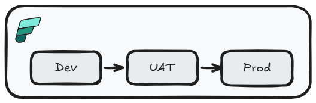
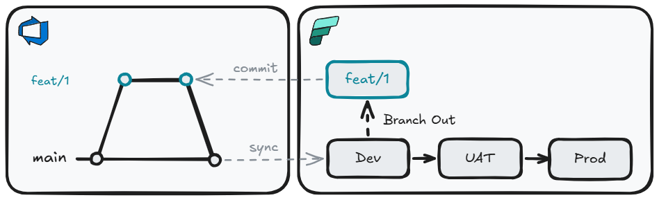
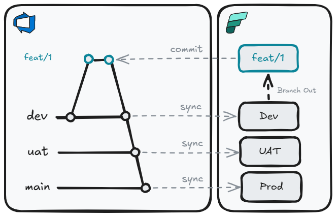
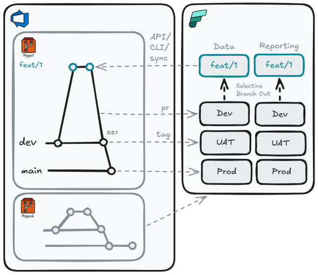

Data teams have historically operated differently from software engineering teams — relying on point-and-click tooling, sharing environments, and deploying by hand. As Fabric brings more of the data platform under one roof, it also raises expectations: data pipelines, semantic models, notebooks, and lakehouses should be treated with the same rigour as application code.

Without proper CI/CD practice you might struggle with:

- :material-source-branch: **Version control** — no history of what changed, when, why or by whom
- :material-account-group: **Collaboration** — shared environments cause conflicts between in-progress work
- :material-magnify: **Oversight** — no review process before changes reach higher environments
- :material-check-circle-outline: **Quality** — no automated gates to validate changes before promotion
- :material-cursor-default-click: **Click-ops tax** — manual, error-prone promotion steps that rely on humans remembering the right sequence
- :material-restore: **Recovery** — no straightforward way to roll back a bad deployment

## Low-Code Options

Fabric provides some built-in low-code options to help deal with these issues.

### Deployment Pipelines

Most Power BI teams are familiar with [Deployment Pipelines](https://learn.microsoft.com/en-us/fabric/cicd/deployment-pipelines/intro-to-deployment-pipelines?tabs=new-ui). They are a low-code option to move items between workspaces (i.e. `Dev` -> `Prod`).



This option has some significant limitations:

- :material-content-copy: **Overwrites paired items**: deployment overwrites paired target items, making reverts harder than a source-controlled rollback
- :material-source-branch-remove: **No branching or isolation**: developers share the same `Dev` workspace, so in-progress work can collide
- :material-source-pull: **No pull request workflow**: changes can reach higher environments without formal review
- :material-tune-variant: **Limited parameterization**: rules cover specific item types and properties, not every Fabric item
- :material-account-lock: **Permission requirements**: deployments require `pipeline admin` plus source and target `workspace Contributor` access, which can create production access friction

### Deployment Pipelines + Git Integration

We can improve this situation with [git integration](https://learn.microsoft.com/en-us/fabric/cicd/git-integration/intro-to-git-integration) and simple trunk-based development. To develop new features, we can branch out from the `Dev` workspace and perform development work. Once complete, this can be committed to the `feature` branch, and changes can be applied to the `Dev` workspace by merging into our long-lived branch (`main`) and syncing. Movement of items to other environments is still performed by deployment pipelines.



This gives us a meaningful step forward:

- :material-source-branch: **Version control**: all item definitions are committed to git — you have a full history of every change, who made it, and why
- :material-account-switch: **Branching and isolation**: developers work on feature branches, keeping in-progress work separate from the shared Dev workspace
- :material-source-pull: **Pull request workflow**: changes are reviewed and approved before being merged and synced to the Dev workspace

### Git Integration

But we can take this one step further by throwing away Deployment Pipelines. This does mean we need a long-lived branch per environment. Rather than use deployment pipelines to move changes through environments, we can do this by merging into the appropriate branch.



Replacing Deployment Pipelines with branch-based promotion gives us additional benefits:

- :material-source-merge: **Consistent promotion mechanism**: The same git merge process that moves code from `feat` to `dev` also moves it to `uat` and `prod`
- :material-swap-horizontal: **Environment parity**: Each environment tracks a specific branch, so you always know exactly what is deployed where
- :material-clipboard-text-clock: **Auditability**: Every promotion is a merge commit with an author, timestamp, and message — a complete audit trail with no extra tooling required
- :material-backup-restore: **Rollback by revert**: Undoing a bad deployment is a standard `git revert`, not a manual re-promotion through deployment pipeline stages

For many teams, especially those early in their CI/CD journey or working with simpler solutions, this may be enough. But as solutions grow in complexity, some gaps start to emerge:

- :material-folder-multiple: **Monolith**: Multi-repo deployments into a single workspace are not supported, which can push teams toward large repos
- :material-variable: **Variable libraries**: Not all Fabric items and parameters are supported
- :material-timeline-clock: **Orchestration**: No native pre/post deployment scripting, rollback automation, or dependency ordering

## API Options

For teams that need more control — over repo structure, deployment orchestration, quality gates, or environment parameterization — the [Fabric REST APIs](https://learn.microsoft.com/en-us/rest/api/fabric/articles/) open up a fully code-driven approach. Rather than being constrained by what the UI supports, you can compose exactly the deployment process your solution needs, using the APIs directly or through one of the available wrappers. Each wrapper sits on top of the Fabric REST APIs and provides higher-level abstractions, reducing the amount of boilerplate code needed to interact with Fabric:

- **[Terraform](https://registry.terraform.io/providers/microsoft/fabric/latest/docs):** Infrastructure-as-code tooling best suited for provisioning and managing infrastructure-level resources such as capacities, workspaces, and access control. Declarative and idempotent by design
- **[fabric-cicd](https://microsoft.github.io/fabric-cicd/latest/):** A Microsoft-maintained Python library purpose-built for deploying Fabric item definitions from a git repository. Handles parameterization, item ordering, and orphan cleanup
- **[Fabric CLI](https://github.com/microsoft/fabric-cli):** A command-line interface that models Fabric as a filesystem — allowing you to script interactions with workspaces and items. Can invoke `fabric-cicd` for configuration deployment as part of a broader orchestration script

### Why not a monolith?

A monolithic approach means either one repo per workspace, or one repo for the entire tenant. As team size and solution complexity grow, this becomes increasingly difficult to understand, own, and manage.

A solution-per-repo model offers a number of advantages:

- :material-target: **Scope**: A focused repo is easier for any developer to reason about in its entirety — reducing onboarding time and cognitive load
- :material-robot-outline: **Agentic workflows**: A concise repo gives AI agents a well-bounded context. You can define the solution's intent in `copilot-instructions.md` / `AGENTS.md` / `CLAUDE.md`, and bring in purpose-built agents and skills for that domain (e.g. a data engineer agent with Lakehouse and Semantic Model skills)
- :material-account-key: **Ownership**: Clear team or domain ownership per repo, with explicit accountability for changes
- :material-shield-account: **RBAC**: Least-privilege access can be enforced at the repo level — developers only have visibility and write access to the solutions they own
- :material-radius-outline: **Blast radius**: A misconfigured deployment or bad merge only affects one solution, not the entire tenant
- :material-calendar-sync: **Independent cadence**: Teams can deploy on their own schedule without coordinating with unrelated solutions
- :material-source-pull: **Focused PRs**: Pull requests are small, scoped, and easy to review. This makes approvals faster and rollbacks trivial
- :material-view-grid-plus: **Multi-workspace support**: Workspace sub-folders within a single repo allow related Fabric items spread across multiple workspaces to be deployed together as one coherent solution

Allowing us to have a repo structure like this:

``` { .json .annotate .no-copy title="Solution-per-repo" }
├── 📁 .github
│    ├── 📄 copilot-instructions.md // (1)!
│    ├── 📁 agents
│    │    └── 📄 data-engineer.agent.md // (2)!
│    └── 📁 skills
│         ├── 📁 lakehouse
│         │    └── 📄 SKILL.md // (3)!
│         └── 📁 semantic-model
│              └── 📄 SKILL.md
├── 📁 pipelines
│    └── 📄 cd.yml // (4)!
├── 📁 WorkspaceFoo // (5)!
│    ├── 📁 Foo.SemanticModel
│    └── 📁 Foo.Report
├── 📁 WorkspaceBar
│    ├── 📁 Bar.UDF
│    ├── 📁 Bar.Lakehouse
│    └── 📁 Bar.VariableLibrary
├── 📄 parameters.yml // (6)!
├── 📄 config.yml // (7)!
├── 📄 readme.md
└── 📄 .gitignore
```

1. **Always-on custom instructions** - project-wide coding standards and conventions applied to every Copilot request
2. **Agents** - AI personas with their own behavior, tools, and model preferences
3. **Skills** - reusable, packaged capabilities (scripts/tools) agents can invoke to expand knowledge and refine behavior
4. **CI/CD pipeline definition** - runs fabric-cicd to deploy Fabric workspace items on merge
5. **fabric-cicd repository_directory per workspace**
6. **fabric-cicd parameters.yml** - environment-specific value replacement (GUIDs, connection IDs, spark pools) applied at deploy time
7. **fabric-cicd config.yml** - deployment configuration (workspace IDs, environments, item type scope)

### Deployment

With `fabric-cicd` as the deployment framework, we can build a structured, multi-stage pipeline framework:



- :material-source-branch: **Branch-out workspaces**: Branch-out workspaces linked to feature branches, with Fabric CLI used to export items back into the repo layout
- :material-check-decagram: **PR validation**: Pre-merge dry-runs or transient deployments catch broken definitions before they reach shared environments
- :material-tag-arrow-up: **Tag-based promotion**: Release tested batches to `UAT` and `PROD` instead of deploying every commit
- :material-account-key: **Environment-specific SPNs**: Pipelines deploy with least-privilege service principals, removing standing production access for humans
- :material-view-grid-plus: **Multi-repo, multi-workspace**: Deploy one repo to multiple workspaces, or multiple repos into the same workspace

!!! warning "Current limitations"

    `fabric-cicd` is powerful but not yet a complete deployment DAG. Some scenarios that currently require custom scripting:

    - **Ordered dependencies**: fabric-cicd does order item deployment, but the order is not configurable
    - **Post-deployment checks**: running smoke tests or pipeline executions after deployment and rolling back automatically on failure
    - **Unsupported items**: a small number of item types (e.g. Org Apps) cannot be deployed programmatically yet

### Additional Capabilities Worth Considering

Once the core deployment pattern is in place, there are a number of supplementary API calls worth incorporating into your pipeline:

- :material-calendar-clock: **Schedule management**: Set or update item schedules as part of deployment rather than relying on manual configuration in the UI post-deploy
- :material-connection: **Connection binding**: Bind Fabric items to the correct gateway connections for the target environment automatically, removing a common post-deployment manual step
- :material-refresh: **Semantic model refresh**: Trigger a full refresh after deploying a new Semantic Model version to validate the model against the target data source before signaling success
- :material-call-split: **Scale-out configuration**: Configure Import-mode Semantic Model read-only replicas for production environments as part of the deployment process
- :simple-inductiveautomation: **Workspace lifecycle automation**: Use pipeline triggers (branch created / PR merged) to provision and deprovision branch-out workspaces on demand, eliminating the need for developers to manage workspace cleanup manually

The Fabric CI/CD story is still in its infancy and in active development. Avoid over-engineering bespoke solutions on top of the existing frameworks at this time; custom code may become obsolete as new features are added, and excessive customization risks accumulating tech debt.

## Summary

There is no single right answer — the best approach depends on the maturity of the team and the complexity of the solution:

| Approach | Best for |
|---|---|
| **Deployment Pipelines** | Self-serve users and analysts who need a simple, UI-driven promotion path with no git involvement |
| **Git Integration + Deployment Pipelines** | Small teams wanting version control and PR reviews, while keeping the familiar deployment pipeline for environment promotion |
| **Git Integration (branch-per-env)** | Teams ready to drop deployment pipelines entirely and use branch merges as the sole promotion mechanism |
| **API / fabric-cicd** | Complex, enterprise data engineering solutions requiring multi-repo deployments, parameterization, quality gates, and deployment orchestration |

I think it is important for all teams to start implementing at least a simple git integration approach to get some cheap wins, then increase the sophistication as the need arises.