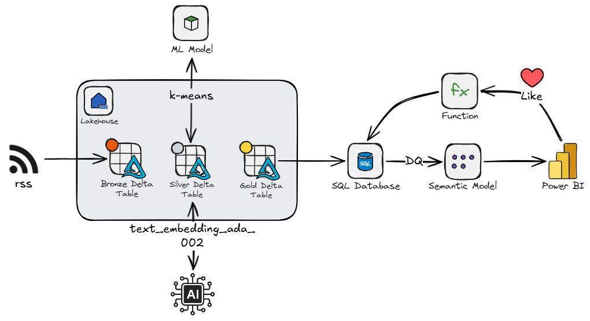

I recently tried to agentically build a fairly complicated end-to-end Microsoft Fabric project. I had planned this post to be on how to use [Spec Kit](https://github.com/github/spec-kit), but the experience instead sent me down a rabbit hole of agents, skills, and tools. I came away with some clearer thoughts around agentic development, so I wanted to share a few musings.

## Anatomy of a Coding Agent

First of all, let's get everyone up to speed.

We have the Large Language Model (LLM) (`Opus 4.6`, `GPT-5.4`, `Grok`, etc.). It receives text, predicts the next tokens based on the context it is given, and returns some text. The model itself is stateless: it does not remember previous requests. In practice, the harness appends each new prompt to the existing chat history, and that history, sometimes truncated or summarized, is sent back to the LLM so it can generate the next response.

To give the LLM agentic behavior, you have the harness (GitHub Copilot, Cursor, Claude Code, etc.). The harness is the middle layer between you and the LLM and largely influences how intelligent the LLM appears to be. It injects system prompts, manages chat history, describes available tools and their schemas (i.e. grep, bash, web search, etc.), and handles the actual interaction with the model. 

!!! info "Harness"

    [Theo](https://t3.gg) recently did a great video covering harnesses: [How does Claude Code *actually* work?](https://www.youtube.com/watch?v=I82j7AzMU80&t=770s)

## Context and Context Rot

Every LLM has a **context window**, which is a fixed-size buffer of tokens that represents everything it can "see" at once: the system prompt, chat history, tool call results, file contents, and your latest message. Current context windows range from ~128k to over 1M tokens depending on the model. But, larger context windows are not always better. As the context becomes larger, important details are progressively drowned out by a deluge of context: a phenomenon known as **context rot**. This results in the agent appearing to become dumber: repeating mistakes, ignoring earlier instructions, contradicting its own plan, or hallucinating details it already resolved.

Several strategies help mitigate context rot:

- **Summarization**: The harness can periodically condense the chat history into a compact summary, preserving only key decisions and context.
- **New threads**: Starting a fresh chat session resets the context window entirely.
- **Tools**: Instead of loading entire files, logs, or repositories up front, the agent can query for the specific information it needs through search, file reads, CLI commands, or APIs.
- **Sub-agents**: For isolated tasks, a harness can delegate work to a fresh agent with a smaller, targeted context, then return only the useful result to the main thread.
- **Skills**: Skills use progressive disclosure: the agent only reads a short description in the YAML frontmatter of the skill file, then only reads full content if it deems the skill is relevant to the current task.

## Extending the Context

So we have an model, a harness, and a set of tools. But the model only knows what it was trained on. To make the agent useful for *your* project, you may need to extend its knowledge. In VS Code, this is done through [Copilot customizations](https://code.visualstudio.com/docs/copilot/customization/overview).

| Mechanism | When it's used | What it does |
|---|---|---|
| **Instructions** | Always-on or pattern-matched | Defines coding standards and project conventions |
| **Prompt files** | Manually invoked via `/` | Reusable task templates for common workflows |
| **Skills** | On-demand, loaded when relevant | Teaches specialized capabilities, often with scripts and resources |
| **Agents** | Selected per task or chat | Defines the persona, available tools, preferred model, and autonomy level |
| **Tools / MCP** | Available to the agent | Extends what the agent can actually *do* |

These mechanisms allow you to extend the agent's knowledge and behavior *without* cramming everything into the context window. The agent discovers what it needs, when it needs it.

!!! info "Folder Structure"

    ```txt
    ├── 📁 .github
    │    ├── 📄 copilot-instructions.md           Always-on instructions (project-wide)
    │    ├── 📁 instructions
    │    │    ├── 📄 python.instructions.md       File-based instructions (e.g. applyTo: **/*.py)
    │    │    └── 📄 frontend.instructions.md
    │    ├── 📁 prompts
    │    │    ├── 📄 review.prompt.md             Reusable prompt files (slash commands)
    │    │    └── 📄 scaffold.prompt.md
    │    ├── 📁 agents
    │    │    ├── 📄 planner.agent.md             Custom agents (personas)
    │    │    └── 📄 reviewer.agent.md
    │    └── 📁 skills
    │         └── 📁 semantic-models              Agent skills (folder per skill)
    │              ├── 📄 SKILL.md                Required - skill instructions & metadata
    │              ├── 📄 test-template.py        Optional - scripts & resources
    │              └── 📁 examples
    ├── 📁 .vscode
    │    └── 📄 mcp.json                          MCP server configuration
    ├── 📄 AGENTS.md                              Always-on instructions (multi-agent compat)
    └── 📄 CLAUDE.md                              Always-on instructions (Claude compat)
    ```

!!! warning "Standards"

    At the moment, different harnesses expect different folder structures and files. Some of these choices can feel like vendor lock-in, because moving between tools often means refactoring or duplicating configuration which creates inertia, making swapping harnesses a unappealing prospect (looking at you, Claude Code). Hopefully, more generic standards will continue to develop and be adopted over time.

### Custom Instructions

[Custom instructions](https://code.visualstudio.com/docs/copilot/customization/custom-instructions) (`.github/copilot-instructions.md`, `AGENTS.md`, `CLAUDE.md`, `*.instructions.md`) are injected at the start of each new chat. They are a good place to document project-wide coding standards, architectural patterns, security requirements, and naming conventions that the agent should always respect.

### Prompt Files

[Prompt files](https://code.visualstudio.com/docs/copilot/customization/prompt-files) (`*.prompt.md`) are reusable markdown files for common tasks, invoked manually as slash commands. Type `/` in the chat input to see a list of available prompts, e.g. `/create-react-form`, `/security-review`. They have optional YAML frontmatter to define which tools should be used, which agent should run it, which model to use etc.

### Skills

[Agent skills](https://code.visualstudio.com/docs/copilot/customization/agent-skills) are folders containing a `SKILL.md` file alongside scripts, examples, templates, and resources that teach the agent specialized capabilities.

The agent uses skills in a three-level progressive loading system to avoid context bloat:

1. **Discovery**: The agent reads the skill's `name` and `description` from the YAML frontmatter. When your prompt matches, the agent selects it.
2. **Instructions loading**: The agent loads the `SKILL.md` body into its context, including the detailed procedures, guidelines, and step-by-step workflows.
3. **Resource access**: As the agent works through the instructions, it accesses additional files (scripts, templates, examples) in the skill directory; **if when referenced**.

### Custom Agents

[Custom agents](https://code.visualstudio.com/docs/copilot/customization/custom-agents) are defined in `.agent.md` files and configure its behavior, available tools, model preferences, and detailed instructions.

VS Code ships with some built-in agents: `Agent`, `Plan`, and `Ask`.

For more specialized workflows, you create custom agents. For example, a *semantic model author* with access to skills related to semantic models.

Custom agents also support **handoffs**, guided sequential workflows that transition between agents with suggested next steps. After a chat response completes, handoff buttons appear letting you move to the next agent with relevant context and a pre-filled prompt. For example: Planning → Implementation → Review. Each step can even use a different model.

## Project

Now we are up to speed we can move on the project I was working on. It was an RSS feed aggregator that ingests articles from curated Fabric community blogs and videos into a Lakehouse via Spark notebooks. The articles are classified using an LLM to assign a category, an embedding vector is generated, and k-means clustering is applied. This is all loaded into a SQL Database.

When users LIKE articles through a Power BI report (via translytical task flow), the engine provides personalized recommendations in real-time. 

- Recommendations are calculated via vector similarity between content embeddings and the user's preference centroids (mean vector of liked articles), boosted by category affinity, author affinity, and recency. 
- Centroids are calculated per user, per cluster, rather than an overall centroid since the average between a DAX article and a PowerQuery article might land in a middle-land of content the user doesn't care about.  
- There are three sort modes: Recent, Trending (exponential decay), and Recommended (personalized), with cold-start users falling back to trending until they have liked enough articles. 



I decided to try out [spec-kit](https://github.com/github/spec-kit), and deploy via [fabric-cicd](https://github.com/microsoft/fabric-cicd).

## Musings

Let's start with [spec-kit](https://github.com/github/spec-kit). Spec-kit is a toolkit for spec-driven development. In a nutshell, you define principles for the project, create a spec for a feature, plan it, break it into tasks, then implement it. Effectively the spec for a feature is main artefact, and the code implementation is the expression of the intent. This framework produces alot of artefacts and feels like it reimplements features you can apply with Copilot and Copilot instructions.

For example, I liked the idea of a project-level set of principles that define coding standards and constraints around things like networking, security, and testing. In spec-kit you define this in `constitution.md`. However, it feels like this that can easily fit into `.github/copilot-instructions.md`. Also, you create a `plan.md` for every spec, which duplicates the planning features already in VS Code. 

I could maybe see the appeal to use spec-kit for brownfield feature work, especially when you want explicit traceability between requirements, plans, and tasks. But for a greenfield data project, I am not convinced the framework fits. You often need to consider the back-end and front-end of a solution at the same time, and they need to evolve together and meet in the middle, because you need to know roughly where you will end up to know where you are going.

Moving on from spec-kit, and on to the creation of Fabric items. LLMs only have knowledge of what they have been trained on, so they are great at generating Python, writing SQL, or making websites, but creating Fabric items - now that is a different story. The models have little idea of the exact structure of Fabric items, or how they interface. Skills are essential to fill the gap.

Now, you *can* generate skills by throwing an LLM at documentation, like the [Fabric item definition documentation](https://learn.microsoft.com/en-us/rest/api/fabric/articles/item-management/definitions/item-definition-overview), but you'll likely have a poor outcome. Creating skills is an art that requires input and thought from a knowledgeable practitioner. The content should be concise, unambiguous, and focused on filling in LLM knowledge gaps, and is a iterative process requiring evolution as you catch more edge cases, or as things change. This is not to say LLMs can't help develop these, but oversight is essential.

I ended up iteratively building my own skills. But it is worth noting there is now a Microsoft-owned repo of Fabric skills and agents: [skills-for-fabric](https://github.com/microsoft/skills-for-fabric)

I had decided to use fabric-cicd so that I could have a fully deployable package, but in hindsight this was a blunder. To be clear, fabric-cicd is great when you already have source-controlled Fabric item definitions and want repeatable deployment. The issue is that deployment errors can be a bit vague and not fully actionable by the model. This means you miss out on one of the more powerful concepts in agentic development: agentic loops. An agentic loop is where the model can gain insight from signals (CLI/API responses, validation errors, linting, test failures) and iteratively iron out any issues. This is where I believe the [Fabric CLI](https://microsoft.github.io/fabric-cli/) would have allowed the agent to work on one item at a time, get the required signals, and get to the end result with less steering. Once the solution is built, you can then extract the definitions via Git integration, CLI, or API, and set up the repo for fabric-cicd.

## What I Would Do Next Time

If I were starting again, I would keep the process simpler:

0. Write a lightweight project constitution in `.github/copilot-instructions.md` covering architecture, security, naming, and deployment preferences.
0. Use Fabric-specific skills for item authoring, workspace operations, semantic models, notebooks, and SQL Database patterns.
0. Use the Fabric CLI during early development so the agent can create, inspect, run, and fix one item at a time.
0. Move to fabric-cicd once the solution shape is stable and the item definitions are ready to be treated as deployment artefacts.

## Conclusion

Skills and agents seem to be the most important pieces for successfully creating Fabric items with coding agents. I am not sold on spec-kit, it has some good ideas, but I'd prefer to stick the existing VS Code customization paradigm.