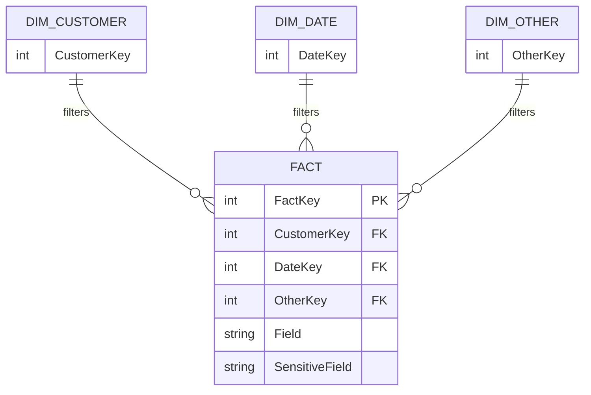
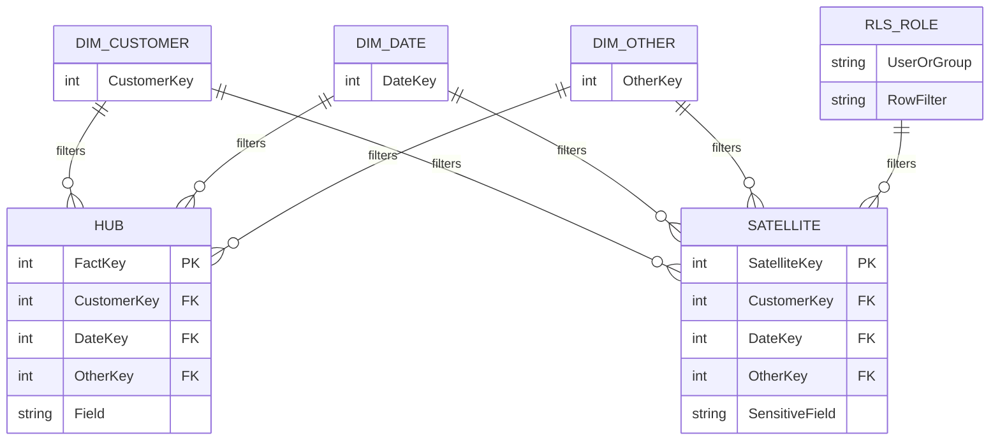
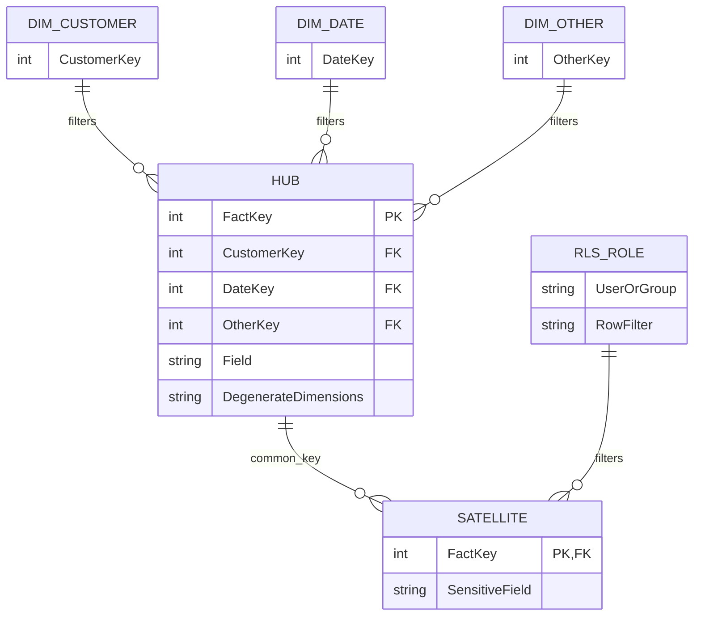

I was recently involved in a project that needed dynamic data masking in Power BI. This reminded me of a technique I used years ago: making [Row Level Security (RLS)](https://learn.microsoft.com/en-us/fabric/security/service-admin-row-level-security) act like [Object Level Security (OLS)](https://learn.microsoft.com/en-us/fabric/security/service-admin-object-level-security?tabs=table).

I decided to write this post because there are a number of articles that suggest using DAX for dynamic data masking. **There is a big issue with this approach!** The masking is only applied in the reporting layer. The source data is still in the semantic model and is still queryable. It can't be said enough: **obscurity is not security**.

This post focuses on Import models. I am not covering DirectQuery here, because in DirectQuery scenarios you can often apply masking in the source system, such as a Lakehouse or Warehouse. That introduces different considerations around SSO passthrough and gateways, which is a separate topic.

## Why Not Use DAX for Data Masking?

The common DAX masking pattern looks something like this:

```dax
Customer Email Masked =
IF(
  [Can View PII],
  SELECTEDVALUE('Customer'[Email]),
  "********"
)
```

There are many variations, but they all share the same issue: the original field still exists in the semantic model.

That can be fine for is the masking is purely for user experience. But it does not address security. A user with Build permission, Analyze in Excel, XMLA endpoint access, a copied report, or any other route that can query the model can still query the unmasked column unless the model prevents access. The report visual might show `********`, but the model still contains the email address, national insurance number, salary, or any other sensitive value you are trying to protect.

You also can't simply put OLS on the source column and keep a DAX measure on top of it. If a measure references a secured column, that measure is restricted as well.

## RLS and OLS in Power BI

Before moving onto my approach, a primer.

RLS filters rows. OLS restricts access to tables and columns.

In both cases, users are assigned to security roles. Those roles can contain RLS rules, OLS rules, or both.

!!! warning "RLS & OLS"

    Row-level security and object-level security cannot be combined from different roles because it could introduce unintended access to secured data. An error is generated at query time for users who are members of such a combination of roles.

    -- <cite> [Analysis Services Doc](https://learn.microsoft.com/en-us/analysis-services/tabular-models/object-level-security?view=sql-analysis-services-2025#restrictions)

RLS can be static or dynamic. A role contains one or more DAX filter expressions applied to one or more tables. Those filters are applied whenever the user queries the model. Static RLS is the classic "one role per region" pattern. A user in the `North` role can use the same report as everyone else, but the model only returns rows for the North region. Dynamic RLS uses a security table and DAX functions such as `#!dax USERPRINCIPALNAME()` to resolve the user's permissions at query time.

OLS allows you to specify whether users within a security role are able to read specific tables or columns. It also hides the secured metadata, so for a user without access it is as if the table or column doesn't exist. Dynamic OLS is not possible. The main problem with OLS is report visuals. If a visual contains a secured field, users without access see an error. There is a [technique](https://blog.crossjoin.co.uk/2022/05/22/stopping-some-users-seeing-certain-columns-or-measures-in-your-power-bi-report-with-object-level-security-and-field-parameters/) covered by [Chris Webb](https://www.linkedin.com/in/chriswebb6/) to work around this using field parameters, but it is still something you need to design around.

OLS is also binary. A user can read the column, or they can't. It does not return an alternative value for the same column. That makes it good for hiding sensitive objects, but less convenient when the requirement is "show the same report, but show masked values for some users".

## RLS as OLS

If we remodel the data we are able to make RLS act like OLS. [Marco Russo](https://www.linkedin.com/in/sqlbi/) recently pointed out that a similar pattern is documented as `Converting OLS into RLS` in the SQLBI+ [White paper: Security in Tabular Semantic Models](https://www.sqlbi.com/whitepapers/security-in-tabular-semantic-models/).

The general idea is you start with a table that contains a mix of fields: some you don't want to secure, and some you do want to secure.



You can split that table into two:

- A **hub** with the unsecured fields
- A **satellite** with the secured fields

Then you have a couple of options.

The first option is to treat the satellite as a secondary fact table. Both the hub and the satellite connect to the existing dimensions, and RLS is applied to the satellite.



The second option is useful when the original table contains degenerate dimensions that you still want to apply to the secured values. In that case, keep the degenerate dimensions on the hub and relate the hub to the satellite using a common key and a one-to-many relationship.



With either setup, the sensitive fields move into a table where RLS controls row access. The user can still query the unsecured hub, but access to the sensitive satellite rows is governed by the security role.

## Extending The Idea To Data Masking

We can extend the pattern for data masking. Instead of using RLS only to remove rows, we use it to choose between masked and unmasked versions of the same row.

To do this, prior to importing the data, we duplicate the rows in the satellite table, apply masking to the duplicates, and add an `isMasked` column.

For example, the satellite table might look like this:

| SatelliteKey | FactKey | isMasked | CustomerEmail | NationalInsuranceNumber |
|---:|---:|:---:|---|---|
| 1 | 1001 | false | alex.wilson@example.com | QQ123456C |
| 2 | 1001 | true | a**********@example.com | QQ******C |
| 3 | 1002 | false | priya.shah@example.com | AB987654D |
| 4 | 1002 | true | p*********@example.com | AB******D |
| 5 | 1003 | false | sam.green@example.com | ZZ112233A |
| 6 | 1003 | true | s********@example.com | ZZ******A |

To simplify the RLS, the security table can store a composite key such as `FactKey:IsMasked`. The RLS rule can then filter the security table by the current user and let relationships do the heavy lifting. You could also implement the logic directly in DAX, but the best option for your use case is going to depend on model size, relationship complexity, and performance. Test both patterns before committing to one.

With this all setup we are able to support three cases:

1. A user sees all sensitive data unmasked
2. A user sees all sensitive data masked
3. A user sees unmasked data for some entities and masked data for others

For example, a sales manager might have privileged access for only some customers. In a table visual, they might see this:

| Region | Customer | Order Number | Order Type | Sales Amount | CustomerEmail | NationalInsuranceNumber |
|---|---|---|---|---:|---|---|
| North | Alex Wilson Ltd | SO-1001 | Renewal | 12,500 | alex.wilson@example.com | QQ123456C |
| North | Priya Shah Ltd | SO-1002 | New Business | 8,750 | priya.shah@example.com | AB987654D |
| South | Sam Green Ltd | SO-1003 | Renewal | 9,200 | s********@example.com | ZZ******A |
| East | Morgan Lee Ltd | SO-1004 | Upsell | 15,300 | m*********@example.com | CD******B |
| North | Taylor Brown Ltd | SO-1005 | New Business | 6,400 | t***********@example.com | EF******E |

In this example, `Region` and `Customer` are dimension fields, `Order Number` and `Order Type` are degenerate fields from the hub, and `CustomerEmail` and `NationalInsuranceNumber` are sensitive fields from the satellite. The sales manager can see the unmasked satellite rows for the customers they manage, but only the masked satellite rows for customers outside their privileged scope.


## Limitations

This pattern is not free. There are some important trade-offs:

- The satellite table is larger because each sensitive row has masked and unmasked versions
- Grouping and sorting can change because masked values are real values in the result set
- Totals and distinct counts need careful testing if the sensitive satellite is not at the same grain as the hub
- The security table and relationships need to be designed carefully to avoid users seeing both masked and unmasked versions of the same sensitive value

The benefit is that the masking decision is enforced by model security, not by a visual-level DAX expression.