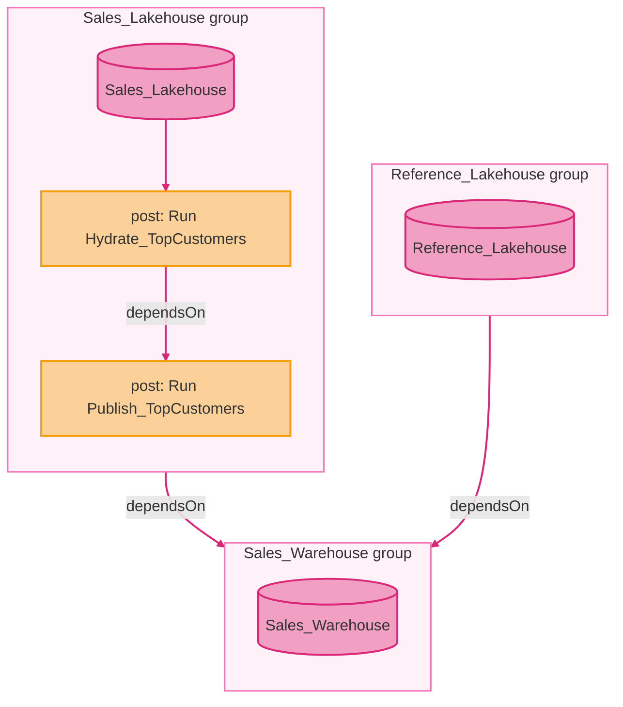

FabCon announcements are coming in thick and fast, including the [Deployment Plan](https://learn.microsoft.com/en-us/fabric/cicd/deployment-plan/deployment-plan-overview) item, which I have been eyeing up on the Fabric Roadmap for a while. It lets you say what order items deploy in, within a workspace, and run a notebook or pipeline before or after each one. But would I reach for it on my next deployment?

The [documentation](https://learn.microsoft.com/en-us/fabric/cicd/deployment-plan/deployment-plan-overview) is reasonably good, so I'm not going to rewrite it. This post hits the key points of how a plan behaves, then gives my two cents on where it fits.

!!! warning "Preview"

    Deployment plans are in preview. To turn them on you need to toggle a new [tenant setting](https://learn.microsoft.com/en-us/fabric/cicd/deployment-plan/how-to-create-deployment-plan#enable-deployment-plan-creation-for-your-tenant) **Users can create deployment plan (preview) items** for the organisation or a security group before you can use them.

## Deployment Plans

First of all a deployment plan is a new Fabric Item. It holds a *Directed Acyclic Graph (DAG)* of deployment groups. A **deployment group** is a **single** Fabric item, with optional pre-deploy and post-deploy actions (a notebook run, a pipeline run, and so on) around it. Deployment groups are the nodes of the DAG, and the edges are defined by the `dependsOn` relationships between them.

You build the plan on a [canvas](https://learn.microsoft.com/en-us/fabric/cicd/deployment-plan/how-to-create-deployment-plan) in the source workspace, and when the workspace is git-connected it is committed like any other item, as a [`plan.yml`](https://learn.microsoft.com/en-us/fabric/cicd/deployment-plan/deployment-plan-sample-plans#understand-the-planyml-structure). Items are referenced by [logical id](https://learn.microsoft.com/en-us/fabric/cicd/git-integration/source-code-format#platform-file), the same id that sits in each item's `.platform` file, so the plan stays valid as the items move between workspaces. Saving the plan [assigns a logical id](https://learn.microsoft.com/en-us/fabric/cicd/cross-workspace-dependency-binding#deployment-plans-and-logical-ids) to any referenced item that doesn't have one yet.

So a plan might look like this:



Represented by the `plan.yml` below. Groups are a list under `groups:`, each with a `name`, a `logicalId`, optional `preActions` and `postActions`, and `dependsOn` for the edges.

```yaml title="plan.yml"
$schema: https://developer.microsoft.com/json-schemas/fabric/item/deploymentPlan/definition/plan/1.0.0/schema.json
version: 1.0.0
groups:
  - name: Sales_Lakehouse
    logicalId: 11111111-1111-1111-1111-111111111111
    postActions:
      - name: Run Hydrate_TopCustomers
        job:
          type: Execute
          logicalId: 22222222-2222-2222-2222-222222222222
      - name: Run Publish_TopCustomers
        dependsOn:
          - actionName: Run Hydrate_TopCustomers
        job:
          type: Execute
          logicalId: 33333333-3333-3333-3333-333333333333
  - name: Reference_Lakehouse
    logicalId: 55555555-5555-5555-5555-555555555555
  - name: Sales_Warehouse
    logicalId: 44444444-4444-4444-4444-444444444444
    dependsOn:
      - groupName: Sales_Lakehouse
      - groupName: Reference_Lakehouse
```

### Why Does It Exist?

!!! quote "Microsoft Docs: What is a deployment plan in Microsoft Fabric?"

    A Microsoft Fabric deployment plan is a workspace item that adds explicit item order and automated actions to a deployment operation. Use a plan to deploy items in a specific sequence. You can also use it to run a notebook, data pipeline, or another supported item before or after an item deploys.
    -- <cite>[Microsoft Docs: What is a deployment plan in Microsoft Fabric?](https://learn.microsoft.com/en-us/fabric/cicd/deployment-plan/deployment-plan-overview)</cite>

Every deployment tool in Fabric ([Git integration](https://learn.microsoft.com/en-us/fabric/cicd/git-integration/intro-to-git-integration), [deployment pipelines](https://learn.microsoft.com/en-us/fabric/cicd/deployment-pipelines/intro-to-deployment-pipelines) and the [bulk import API](https://learn.microsoft.com/en-us/fabric/cicd/tutorial-bulkapi-cicd)) already orders items by lineage. A plan adds the dependencies and actions lineage can't represent: if the lineage order is enough and nothing has to run, you don't need one, and you only add the items that need explicit ordering or an action. The rest deploy as they always did.

!!! quote "Microsoft Docs: What is a deployment plan in Microsoft Fabric?"

    Fabric combines explicit dependencies between deployment groups with dependencies detected from lineage. A plan can add an order that lineage doesn't represent, but it doesn't remove dependencies that Fabric detects.
    -- <cite>[Microsoft Docs: What is a deployment plan in Microsoft Fabric?](https://learn.microsoft.com/en-us/fabric/cicd/deployment-plan/deployment-plan-overview#resolve-the-deployment-order)</cite>

"Combines" means the deployment tool's existing lineage DAG is enriched with the plan's DAG, and the order is resolved over the lot. A plan edge can only add a constraint; one that contradicts lineage is a [cycle](https://learn.microsoft.com/en-us/fabric/cicd/deployment-plan/deployment-plan-troubleshoot#the-plan-cant-be-saved) and the plan won't save. So the edges worth drawing are the ones lineage can't see: a [dependency through a connection](https://learn.microsoft.com/en-us/fabric/cicd/deployment-plan/deployment-plan-sample-plans#order-work-that-lineage-cant-see), a [table that has to be populated](https://learn.microsoft.com/en-us/fabric/cicd/deployment-plan/deployment-plan-sample-plans#deploy-an-item-that-depends-on-data-another-item-produces) before a view can be created.

Item selection is the deployment tool's job, not the plan's. An item in the deployment operation but not in the deployment plan deploys as it always did, and attaching a plan doesn't select the items it names, so on a [selective branch-out](https://learn.microsoft.com/en-us/fabric/cicd/git-integration/branched-workspace#branch-out-with-a-deployment-plan) you need to manually select items yourself, including items that will be run in an action.

### Actions

An [action](https://learn.microsoft.com/en-us/fabric/cicd/deployment-plan/deployment-plan-actions) is a run of another item in the workspace, and nothing more. The plan starts the job, the item decides what happens. Five item types are supported, and every one of them runs as an `Execute` job, so a Dataflow Gen2 action is a refresh and nothing else:

- Notebook
- Data pipeline
- Dataflow Gen2
- Copy job
- User data function

Actions in a group are [chained](https://learn.microsoft.com/en-us/fabric/cicd/deployment-plan/deployment-plan-actions#order-actions-within-a-deployment-group) with `dependsOn` and are only ever run one at a time. The deploying identity needs [`Item.Execute.All`](https://learn.microsoft.com/en-us/fabric/cicd/deployment-plan/deployment-plan-automation#prerequisites) on top of the operation's own scope.

An action can carry up to twenty [parameters](https://learn.microsoft.com/en-us/fabric/cicd/deployment-plan/deployment-plan-actions#pass-parameters-to-an-action), passed straight through to the item, so the names have to be the ones the item declares. A value is either a literal (the same in every workspace), or a reference to a [Variable Library](https://learn.microsoft.com/en-us/fabric/cicd/variable-library/variable-library-overview) variable, which is the only way to vary a value per environment. A reference resolves against whichever [value set is active](https://learn.microsoft.com/en-us/fabric/cicd/variable-library/variable-library-cicd#use-variable-library-values-in-a-deployment-plan) in the target workspace, which is where greenfield deployments fall over:

!!! quote "Microsoft Docs: Deployment plan considerations and limitations"

    You can't use a deployment plan to change the active value set of a Variable Library during deployment. Variable references resolve against the value set that's already active in the target workspace. In a newly created target workspace, **Default** is active until you select and save another value set.
    -- <cite>[Microsoft Docs: What is a deployment plan in Microsoft Fabric?](https://learn.microsoft.com/en-us/fabric/cicd/deployment-plan/deployment-plan-overview#limitations-for-plan-actions)</cite>

### Failure

The deployment [stops at the first item or action that fails](https://learn.microsoft.com/en-us/fabric/cicd/deployment-plan/deployment-plan-troubleshoot#problems-during-a-deployment) and doesn't roll back. What was deployed stays, and later items are left undeployed. A failed action's detail is logged in that item's run history rather than on the plan.

## When Does It Apply

Never on its own. A plan is a passive item until it is attached to one operation, and the attachment lasts for that operation only.

!!! quote "Microsoft Docs: What is a deployment plan in Microsoft Fabric?"

    A plan attachment applies only to the current operation. You can't configure a plan as the default for future deployments or schedule the plan itself. If a deployment tool schedules an operation, the operation must attach the plan each time it runs.
    -- <cite>[Microsoft Docs: What is a deployment plan in Microsoft Fabric?](https://learn.microsoft.com/en-us/fabric/cicd/deployment-plan/deployment-plan-overview#considerations-and-limitations)</cite>

The operations that a plan can be attached to include:

- :material-source-branch: [Git integration](https://learn.microsoft.com/en-us/fabric/cicd/deployment-plan/deployment-plan-attach#where-you-can-attach-a-plan), in the git to workspace direction only: the initial sync after connecting, Update from Git, switch branch, and [branch out](https://learn.microsoft.com/en-us/fabric/cicd/git-integration/branched-workspace#branch-out-with-a-deployment-plan). A commit from the workspace never runs a plan.
- :material-pipe: [Deployment pipelines](https://learn.microsoft.com/en-us/fabric/cicd/deployment-pipelines/deploy-content#deploy-with-a-deployment-plan-preview), deploying between stages. You choose the target stage's existing plan or the incoming one from the source stage.
- :material-api: [REST](https://learn.microsoft.com/en-us/fabric/cicd/deployment-plan/deployment-plan-automation): [Update From Git](https://learn.microsoft.com/en-us/rest/api/fabric/core/git/update-from-git), [Deploy Stage Content](https://learn.microsoft.com/en-us/rest/api/fabric/core/deployment-pipelines/deploy-stage-content) and [Bulk Import Item Definitions](https://learn.microsoft.com/en-us/rest/api/fabric/core/items/bulk-import-item-definitions), each with `beta=true` on the URL and a `deploymentPlan` object inside `options`

For a branch-out the plan has to be committed to the branch you are branching from; only plans in git show up in the picker. Where the plan comes from otherwise depends on the operation: git integration takes one from the workspace or the incoming git content, a deployment pipeline offers the target stage's plan or the source stage's, and the APIs take a logical id (git and bulk import) or an item id (pipelines).

Deployment plans are not supported by fabric-cicd.

## :material-heart-off: Swipe Left or :material-cards-heart: Swipe Right

| Consideration | :material-heart-off: Swipe Left | :material-cards-heart: Swipe Right |
| --- | :-: | :-: |
| Source control | | Order and post-deploy runs live in git as `plan.yml`, keyed by logical id, reviewed in a pull request |
| No build agent | | Runs inside Fabric, so a branch-out from the portal and a deployment pipeline get the same order and actions |
| Native release process | | Fits deployment pipelines plus variable libraries |
| Auto-binding | Unchanged. A plan orders and runs, it doesn't rebind, and carries no connections or workspace settings. Existing auto-binding gaps are not addressed | |
| fabric-cicd | Can't use with the one tool that does resolve auto-binding gaps | |
| Greenfield | A variable library lands on **Default** active set in a new workspace and the plan can't change it, so a cold deploy reads the wrong values | |
| Multi-workspace | One plan, one workspace. Nothing crosses workspaces | |
| Control | No environment filter on a step, no continue on error, and the first failure stops the operation | |

It feels like there are two parallel worlds in Fabric CI/CD: one low-code with git integration, branch-out, deployment pipelines and variable libraries, and one higher-code with a repo, pipelines and fabric-cicd. There doesn't seem to be a solid bridge between these two worlds. I believe Deployment Plans are built for the former Fabric-native world, and if you live in that world Deployment Plans are a welcome addition.

The problem is that there are still large gaps in the native CICD story: auto-binding gaps, deployment into an empty workspace, and cross-workspace dependencies, which can only be fully addressed by fabric-cicd, which does not support deployment plans.

## Conclusion

But if they were supported by fabric-cicd, would I use them? I think the answer would be yes, it does fill a gap in both worlds. Every current mechanism deploy to a workspace is treated as an atomic unit, with no influence of what happens in that unit. Plans grants more influence over that deployment order of that unit, plus it adds built-in pre- or post-deployment mechanism. That being said, would I like some more control over failure handling and rollback mechanisms? Yes. Today a failed pre- or post-deploy action stops the whole operation, with no way to say carry on failure and no rollback of what already landed, so a flaky refresh leaves a half-deployed workspace. Plan already have taken responsibility as a job orchestrator, so it should handle failure more gracefully. So with all that being said, I'll have to :material-heart-off: swipe left.