??? note "Edited 30 September 2026"

    The **Clicks** bullet under [Why fabric-cicd](#why-fabric-cicd) listed active value sets as a UI step. The active value set has an [API](https://learn.microsoft.com/en-us/rest/api/fabric/variablelibrary/items/update-variable-library), and fabric-cicd calls it after publishing a library, activating the value set named after the target environment ([docs](https://microsoft.github.io/fabric-cicd/1.3.0/reference/item_types/#variable-library)). The bullet now says so. Deployment rules and branch-out remain UI steps, and nothing native sets the value set for you.

As a first for me I am going to try writing a series. Starting from an empty workspace, over three posts, we will build up to a multi-workspace solution that deploys into empty environments with nobody clicking anything. It will be opinionated, and the first opinion is that [fabric-cicd](https://microsoft.github.io/fabric-cicd/1.3.0/) is the only sensible basis for a complete CI/CD solution in Fabric. This first post is the groundwork the series will build on: the branching strategy and what each workspace is for, the sample repo, the service principals, the pipelines that promote code to higher environments, and the approval gate that protects prod, ending with a deployment into empty test and prod workspaces.

I've written about fabric-cicd a few times already; the series links those posts and doesn't re-explain them.

??? info "Previous Posts"

    - [Fabric-cicd, Kicking the tyres](https://evaluationcontext.com/posts/fabric-cicd/) (May 2025)
    - [One Pipeline to Rule Them All](https://evaluationcontext.com/posts/one-pipeline/) (June 2025)
    - [Fabric-CICD Updates - Semantic Models, Parameters and Config](https://evaluationcontext.com/posts/Fabric-cicd-0-1-33/) (February 2026)
    - [Fabric-CICD - It's Official](https://evaluationcontext.com/posts/Fabric-cicd-0-2-0/) (February 2026)
    - [CICD for Fabric Data Teams](https://evaluationcontext.com/posts/CICD-Fabric-Data-Teams/) (May 2026)
    - [Lost Connections](https://evaluationcontext.com/posts/cicd-connections/) (August 2026)

!!! tip "Series - Fabric-CICD in Practice"

    1. **Groundwork**
    2. Feature to Prod
    3. Two Workspaces, One Deploy

!!! info "fabric-cicd v1.3.0"

    This series is pinned to [fabric-cicd `1.3.0`](https://microsoft.github.io/fabric-cicd/1.3.0/) and [Fabric CLI `v1.7.0`](https://microsoft.github.io/fabric-cli/).

??? info "Terminology"

    The series will use **Azure DevOps** as the CI/CD platform. A few terms come up in every post, so here they are once.

    | Term | What it means here |
    | ---- | ------------------ |
    | :material-folder-outline: Workspace | A Fabric workspace. One per environment per solution, named `<solution>-<env>`, so `foo-dev` |
    | :material-git: Repo | The Azure Repos git repository holding the solution: one folder per workspace under `fabric/`, plus the pipelines |
    | :material-source-branch: Branch | `main`, `release/*` or `feature/*`. Each maps to a workspace; the [Branching Strategy](#branching-strategy) table says how |
    | :material-lan-connect: Connection | A Fabric connection to a data source, with its own owner and credential. Not part of any item definition |
    | :material-pipe: [Azure Pipelines](https://learn.microsoft.com/en-us/azure/devops/pipelines/get-started/what-is-azure-pipelines?view=azure-devops) | The CI/CD runner in Azure DevOps. A pipeline is a YAML file in the repo made of stages, jobs and steps, triggered by a branch. Each job runs on an agent; this series uses Microsoft-hosted agents, a fresh Azure VM per job, discarded when it ends |
    | :material-shield-check-outline: [Environment](https://learn.microsoft.com/en-us/azure/devops/pipelines/process/environments?view=azure-devops) | An Azure DevOps object that a deployment job targets. Approvals and locks are attached to the environment, to guard deployment into it |
    | :material-connection: [Service connection](https://learn.microsoft.com/en-us/azure/devops/pipelines/library/service-endpoints?view=azure-devops) | The Azure DevOps object that points at the identity a pipeline authenticates as (a service principal or managed identity) and says how. We will use workload identity federation, so there is no secret to store or rotate |
    | :material-robot-outline: [Service principal (SPN)](https://learn.microsoft.com/en-us/entra/identity-platform/app-objects-and-service-principals?tabs=browser) | The Entra identity the pipeline runs as. It needs a role on every workspace it deploys to and access to every connection the items use |
    | :material-key-chain-variant: [Workload identity federation (WIF)](https://learn.microsoft.com/en-us/entra/workload-id/workload-identity-federation) | Azure DevOps issues a short-lived token for the service connection, the pipeline presents it to Entra, and Entra checks it against a federated credential on the app registration (issuer plus subject identifier, both generated by Azure DevOps) before issuing an access token for the SPN |
    | :material-console: [Fabric CLI (`fab`)](https://microsoft.github.io/fabric-cli/) | Microsoft's command line for Fabric. `fab deploy` is a fabric-cicd config deployment, `fab api` is a raw REST call, `fab import` pushes one item definition, `fab auth login` is how the SPN signs in |
    | :material-language-python: [fabric-cicd](https://microsoft.github.io/fabric-cicd/1.3.0/) | Microsoft's Python library that publishes item definitions from a repo into a workspace |
    | :material-file-cog-outline: [`config.yml`](https://microsoft.github.io/fabric-cicd/1.3.0/how_to/config_deployment/) | fabric-cicd's deployment config: which folder to deploy, which workspace to deploy to per environment, which item types to deploy, and publish and unpublish rules |
    | :material-file-replace-outline: [`parameter.yml`](https://microsoft.github.io/fabric-cicd/1.3.0/how_to/parameterization/) | fabric-cicd's rewrite rules, applied to definitions on the way into the workspace |
    | :material-file-tree-outline: [Item definition](https://learn.microsoft.com/en-us/rest/api/fabric/articles/item-management/definitions/item-definition-overview) | The files under an item's folder in git: the `.platform` file plus the item's own parts. What fabric-cicd publishes |
    | :material-tag-outline: Logical ID and object ID | The two kinds of identifier of a Fabric item. Logical IDs rebind across workspaces, object IDs don't. See [Lost Connections](https://evaluationcontext.com/posts/cicd-connections/#the-mechanic-underneath) |

!!! example "Sample Repo"

    The code for this post is the :material-tag: [`post-1`](https://github.com/EvaluationContext/fabric-cicd-example/releases/tag/post-1) tag of :material-git: [EvaluationContext/fabric-cicd-example](https://github.com/EvaluationContext/fabric-cicd-example). Each post in the series ends on a tag you can clone and run.

## Setting the Stage

### Who Is Using Fabric-CICD?

I don't believe that many people are using fabric-cicd. Now, I can't directly prove this statement, but I can get a proxy for it. Every pipeline run that installs fabric-cicd counts as a download, so downloads measure how often the tooling runs, not how many people run it. The number of distinct people who have ever opened an issue on the repo is closer to a headcount, because it needs a human who hit a problem and cared enough to write it up. Figures are from late September 2026.

| Repo | Issues | Distinct authors | Excluding maintainers | Raised one issue only | Stars |
| ---- | ------ | ---------------- | --------------------- | --------------------- | ----- |
| [fabric-cicd](https://github.com/microsoft/fabric-cicd) | 625 | 265 | 261 | 169 | 331 |
| [terraform-provider-fabric](https://github.com/microsoft/terraform-provider-fabric) | 301 | 131 | 127 | 97 | 128 |
| [fabric-cli](https://github.com/microsoft/fabric-cli) | 90 | 55 | 55 | 39 | 172 |

fabric-cicd was downloaded from PyPI about **264,000** times in the last month, and the Terraform provider shows **2.7 million** registry downloads in total.

With **261** people who have raised an issue, most of whom raised exactly one, and **331** stars over nearly two years, it feels fair to say only a few hundred teams are actively using fabric-cicd. 

The point of this series is to try and make fabric-cicd more accessible and easier to adopt for everyone.

### Setting The Bar

This solution will have to pass the following bar:

- :material-package-variant-closed: **Cold start**: the solution must be able to deploy Fabric Items into completely empty workspaces from the repository alone
- :material-cursor-default-click-outline: **No clicks**: the solution must not require any manual intervention outside of the repository, beyond the initial setup
- :material-repeat: **Idempotent**: the solution must produce the same result regardless of how many times it is applied

To limit the scope of this series, we will not tackle:

- :material-cog-off-outline: **Environment setup**: automated creation and configuration of workspaces, permissions, connections etc
- :material-database-off-outline: **Bootstrapping**: running notebooks or pipelines to populate a lakehouse, a dacpac to set up the initial database schema, semantic model refreshes etc
- :material-database-sync-outline: **Data ops**: what data non-production environments hold, and how it gets there
- :material-swap-horizontal: **Connection switching**: pointing each environment at a different source system. One connection serves every environment in this series

### Why fabric-cicd

Microsoft's [recommended path](https://community.fabric.microsoft.com/blog/fbc_fabricupdatesblogs/new-cicd-resources-for-microsoft-fabric-from-concepts-to-end-to-end-automation/5358502) is git integration for source control, deployment pipelines for promotion and variable libraries for the per-environment values. I don't like it, for two reasons, and [Lost Connections](https://evaluationcontext.com/posts/cicd-connections/) has the detail on both. 

- **Greenfield**: none of the three can stand an environment up from the repo alone, because each needs the target item to exist before it can be pointed at. 

- **Clicks**: deployment rules, active value sets and branch-out are all UI steps someone has to remember, and I believe if you do something more than once you should automate it. The active value set is the exception: it has an [API](https://learn.microsoft.com/en-us/rest/api/fabric/variablelibrary/items/update-variable-library), and fabric-cicd [sets it](https://microsoft.github.io/fabric-cicd/1.3.0/reference/item_types/#variable-library) after publishing a library, but only fabric-cicd does; git sync, deployment pipelines and plans leave a new workspace on **Default**.

fabric-cicd rewrites item definitions during deployment and resolves ids against the workspace being deployed to, at publish time, so a first deploy into an empty workspace works. It isn't the whole answer, as [Jacob Knightley](https://www.linkedin.com/in/jacobknightley/) described in a [post](https://community.fabric.microsoft.com/blog/fbc_fabricupdatesblogs/optimizing-for-cicd-in-microsoft-fabric/5172830) last year; there are some limitations around multi-workspace deployments. But it is still the best deployment solution available.

Two native features survive. Auto-binding, where the [binding matrix](https://learn.microsoft.com/en-us/fabric/cicd/cross-workspace-dependency-binding) says it applies, because there's no reason to write a `parameter.yml` rule for something Fabric already does. And git integration, but only for feature workspaces and only in one direction: changes made in the workspace are committed to git, never the other way around.

That git connection is also why the series uses Azure DevOps rather than GitHub. Connecting a workspace to GitHub needs a [Personal Access Token (PAT)](https://learn.microsoft.com/en-us/fabric/cicd/git-integration/git-get-started?tabs=github#git-prerequisites), which belongs to a person, expires, and takes the connection with it when they leave. That might be tolerable for short-lived feature workspaces, but connecting to Azure DevOps can authenticate as a [service principal (SPN)](https://learn.microsoft.com/en-us/fabric/cicd/git-integration/git-integration-with-service-principal), so nothing in the chain depends on a personal account, and I'd rather not build on an exception.

### Deploying With the Fabric CLI

fabric-cicd is a Python library, and most write-ups, including [my earlier ones](https://evaluationcontext.com/posts/fabric-cicd/), call it from a Python script: build a `#!py FabricWorkspace`, call `#!py publish_all_items()`, pass a parameter file. In this series I'm not doing that. Since `v0.1.26` fabric-cicd has had [configuration-based deployment](https://microsoft.github.io/fabric-cicd/1.3.0/how_to/config_deployment/), which I covered in [Fabric-CICD Updates](https://evaluationcontext.com/posts/Fabric-cicd-0-1-33/), and the [Fabric CLI](https://microsoft.github.io/fabric-cli/) ships it as `fab deploy`. The whole deployment is a login and one line:

```bash title="Auth and Deploy"
fab auth login -u "$servicePrincipalId" --federated-token "$idToken" --tenant "$tenantId"
fab deploy --config fabric/foo/config.yml --target_env dev
```

I like this for two reasons. Everything about the deployment, which workspace each environment is, which item types are in scope, what gets unpublished, lives in `config.yml` next to the items it deploys and is reviewed in the same pull request. Nobody has to read a script or open a variable group to find out which workspace prod is. And `fab` is one tool for the whole job: `fab deploy` publishes, and `fab api` calls any [Fabric REST endpoint](https://learn.microsoft.com/en-us/rest/api/fabric/articles/) when something has to happen after the publish, like a semantic model refresh, without a hand-rolled HTTP call.

!!! warning "Hosted agents"

    `fab` encrypts its token cache with the operating system keyring, and a hosted build agent has none, so a login in one step is gone by the next. Run `fab config set encryption_fallback_enabled true` before `fab auth login`, on every agent, every run.

### Branching Strategy

In this series I'm adopting Microsoft's [Release Flow](https://learn.microsoft.com/en-us/devops/develop/how-microsoft-develops-devops) as is, because it's a simple, modified trunk-based strategy, and Azure DevOps is built around it. :material-source-branch: `main` is the trunk and is always deployable. Work happens on short-lived :material-source-branch: `feature/*` branches that merge to :material-source-branch: `main` by pull request. When a release is ready, a :material-source-branch: `release/*` branch is cut from :material-source-branch: `main` and never merges back. A hotfix lands on :material-source-branch: `main` first and is cherry-picked into the release branch.

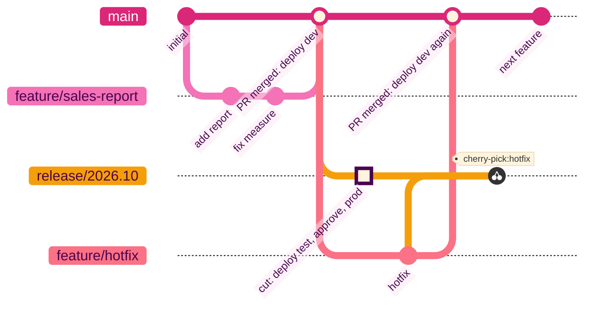

Each branch maps to a workspace, and each workspace is there for a reason. The reason is what decides what gets deployed to it, by whom, and when; without it we'd just be following a paradigm.

| :material-folder-outline: Workspace | :material-source-branch: Branch | Why it exists | Deployed by | Git connected |
| --------- | ------ | ------------- | ----------- | ------------- |
| :material-folder-outline: `feature` | :material-source-branch: `feature/*` | A branch's sandbox, so a developer can change anything without touching anyone else's work. Disposable; torn down when the branch merges | Git sync | To the feature branch, commits out only |
| :material-folder-outline: `dev` | :material-source-branch: `main` | Proves that what has merged to `main` works together. Nothing lands here except by pipeline, so if dev is broken, `main` is broken | fabric-cicd, on every merge | No |
| :material-folder-outline: `test` | :material-source-branch: `release/*` | Proves the prod deployment will land. It gets the exact commit prod gets, and it's where user acceptance happens, which may mean prod-shaped data | fabric-cicd, on every push to the release branch | No |
| :material-folder-outline: `prod` | :material-source-branch: `release/*` | The users' workspace. Nobody deploys here except the release pipeline, after an approval | fabric-cicd, after the approval | No |

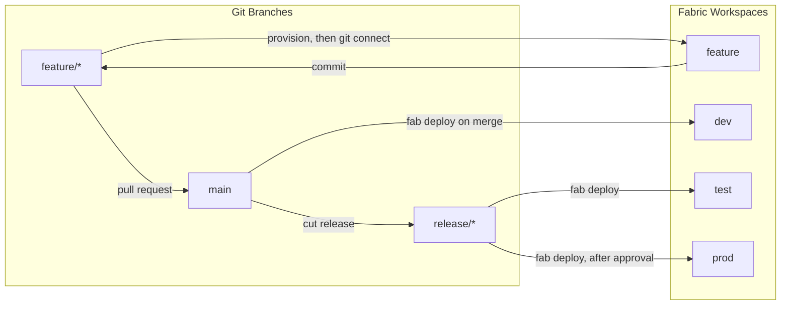

I want a :material-folder-outline: feature workspace to be provisioned by a pipeline when the branch is created, filled by a deployment to resolve item dependencies, then attach git integration, with a git sync from workspace :material-arrow-right: branch, and torn down when the branch merges. The git integration sync is only applied one way, workspace :material-arrow-right: branch: a developer commits from the workspace to the repo, and nothing is pulled from git into the workspace. Definitions edited in VS Code or by an agent go the other way, one item at a time, with `fab import` followed by a read-back, the pattern Microsoft's [skills-for-fabric](https://github.com/microsoft/skills-for-fabric) uses. One item, one call, one error that names the item, and no "try again" commits on the branch, just to facilitate the use of git sync.

:material-folder-outline: Dev, :material-folder-outline: test and :material-folder-outline: prod are never git-connected. The pipeline is the only thing that publishes them, and there is nothing a git connection would add except a source control panel showing drift after every deploy, because `parameter.yml` rewrote ids on the way in.

### Repo Structure

The repo will be structured as follows. A single workspace `foo` with five items: a lakehouse, a pipeline that copies a file into it from an external source and then runs a notebook, the notebook that writes the table, a Direct Lake semantic model on the lakehouse's SQL analytics endpoint, and a report. Azure pipelines are defined in `.azure-pipelines/`.

``` { .json .annotate .no-copy title="Repo Structure" }
├── 📁 .azure-pipelines
│    ├── 📄 variables.yml // (1)!
│    ├── 📄 deploy-main.yml // (2)!
│    ├── 📄 deploy-release.yml // (3)!
│    └── 📁 templates
│         ├── 📄 fab-setup-steps.yml // (4)!
│         └── 📄 fab-deploy-steps.yml // (5)!
├── 📁 fabric
│    └── 📁 foo // (6)!
│         ├── 📁 Sales.Lakehouse
│         ├── 📁 Load Sales.DataPipeline // (7)!
│         ├── 📁 Load Sales.Notebook // (8)!
│         ├── 📁 Sales.SemanticModel // (9)!
│         ├── 📁 Sales.Report // (10)!
│         ├── 📄 config.yml // (11)!
│         └── 📄 parameter.yml // (12)!
├── 📄 .gitignore
└── 📄 README.md
```

1. :material-connection: **Service connection names** - the only values to edit to run the pipelines
2. :material-pipe: **main to dev** - every merge to :material-source-branch: `main` publishes the dev workspace
3. :material-pipe: **release/\* to test to prod** - test on every push, a manual approval, then prod
4. :material-pipe: **Setup steps** - install the Fabric CLI and log in as the SPN with workload identity federation
5. :material-pipe: **Deploy steps** - `fab deploy` one environment and publish the log as a build artifact
6. :material-folder-outline: **fabric-cicd `repository_directory`** - one folder per workspace
7. **Data pipeline** - copies `sales.csv` from an external source over a connection, then runs the notebook. Holds the notebook's logical id, a zero workspace id and a connection id
8. **Notebook** - writes the `sales` table. Holds the default lakehouse's logical id and a zero workspace id
9. **Semantic model** - Direct Lake on the lakehouse's SQL analytics endpoint. Holds the endpoint host and id as literals
10. **Report** - bound to the model by path. Holds nothing that needs rewriting
11. **fabric-cicd `config.yml`** - environment to workspace name, item types in scope, publish and unpublish rules
12. **fabric-cicd `parameter.yml`** - rewrites applied on the way in. Holds only the two semantic model rules at the end of this post

!!! warning "No warehouse"

    I've left it out on purpose. A warehouse deploys as an empty shell, because its REST API has no definition operations, so the schema has to be built and published separately with SqlPackage. That's a post of its own, not this series.

## Lets Get Started

I won't cover creating the Azure DevOps organisation and project; the [free tier](https://azure.microsoft.com/en-us/pricing/details/devops/azure-devops-services/) gives five users, unlimited private repos and one hosted parallel job (new organisations have to [request it](https://learn.microsoft.com/en-us/azure/devops/pipelines/licensing/concurrent-jobs)), which is enough to follow along.

Most of what follows is done once for the tenant and the Azure DevOps project, and then never again. Only the last few steps repeat for each solution. It's worth knowing which is which before starting, because the one-time work needs an admin and the per-solution work shouldn't.

| Setup | Once per tenant or project | Once per solution (repo) |
| ----- | :------------------------: | :----------------------: |
| :material-robot-outline: [Service principals](#service-principals) `sp-fabric-deploy-*` and their :material-connection: [service connections](#workload-identity-federation) `sc-fabric-deploy-*` | :material-check: | |
| :material-account-group-outline: [Security groups](#security-groups) `sg-fabric-deploy-*` | :material-check: | |
| :material-shield-lock-outline: [Tenant settings](#tenant-settings) scoped to those groups | :material-check: | |
| :material-shield-check-outline: [Azure DevOps environments](#environments-and-approvals) `fabric-dev`, `fabric-test`, `fabric-prod` and the approval on prod | :material-check: | |
| :material-git: [The repo](#repo-init), [`config.yml`](#configyml), [`parameter.yml`](#parameteryml) and the :material-pipe: [two pipeline files](#two-pipelines) | | :material-check: |
| :material-folder-outline: [Workspaces](#workspaces) `foo-dev`, `foo-test`, `foo-prod` on a capacity, with the SPNs as [Contributor](#permissions) | | :material-check: |
| :material-lan-connect: [Connections](#connections) the items use, shared with both SPNs | | :material-check: |
| :material-pipe: [Registering the two pipelines](#two-pipelines) and authorising them on the service connections | | :material-check: |

## Service Principals

Lets start with the service principals: the Entra identities that run the pipelines and deploy the Fabric items.

To help protect against an accidental deploy to production, we will use two identities, one for non-prod and one for prod environments.

| :material-robot-outline: SPN | :material-account-group-outline: Security group | :material-connection: Service connection | :material-pipe: Used by | :material-folder-outline: `dev` | :material-folder-outline: `test` | :material-folder-outline: `prod` |
| --- | -------------- | ------------------ | ------- | ----- | ------ | ------ |
| :material-robot-outline: `sp-fabric-deploy-nonprod` | :material-account-group-outline: `sg-fabric-deploy-nonprod` | :material-connection: `sc-fabric-deploy-nonprod` | `deploy-main.yml`, and the Test stage of `deploy-release.yml` | Contributor | Contributor | |
| :material-robot-outline: `sp-fabric-deploy-prod` | :material-account-group-outline: `sg-fabric-deploy-prod` | :material-connection: `sc-fabric-deploy-prod` | The Prod stage of `deploy-release.yml` only | | | Contributor |

??? info "Naming Convention"

    Names follow `<type>-fabric-deploy-<env>`, so the app registration :material-robot-outline: `sp-fabric-deploy-prod` and its service connection :material-connection: `sc-fabric-deploy-prod` are visibly the same thing in two places, and the environment is always the last token. Each SPN sits in its own security group, :material-account-group-outline: `sg-fabric-deploy-nonprod` and :material-account-group-outline: `sg-fabric-deploy-prod`, because they each need different tenant settings ([below](#tenant-settings)).

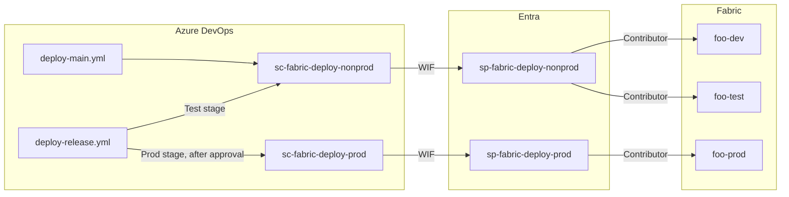

### Workload Identity Federation

The quickest way to get an SPN with a federated credential is to let Azure DevOps create it. One dialog makes the app registration, adds the federated credential with the right issuer and subject, and saves the connection already verified. Do it for non-prod, then repeat for prod.

In Azure DevOps, **Project settings** :material-arrow-right: **Pipelines** :material-arrow-right: **Service connections** :material-arrow-right: **Create service connection** :material-arrow-right: **Azure Resource Manager** :material-arrow-right: **Next**.

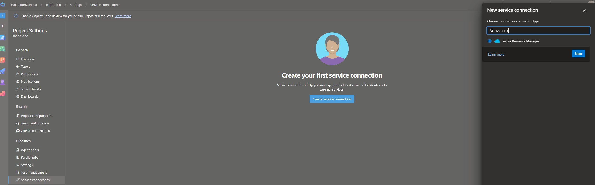

Identity type **App registration (automatic)**, credential **Workload identity federation**. Scope level **Subscription**, and pick one. Service connection name :material-connection: `sc-fabric-deploy-nonprod`. Leave **Grant access permission to all pipelines** unticked. **Save**.

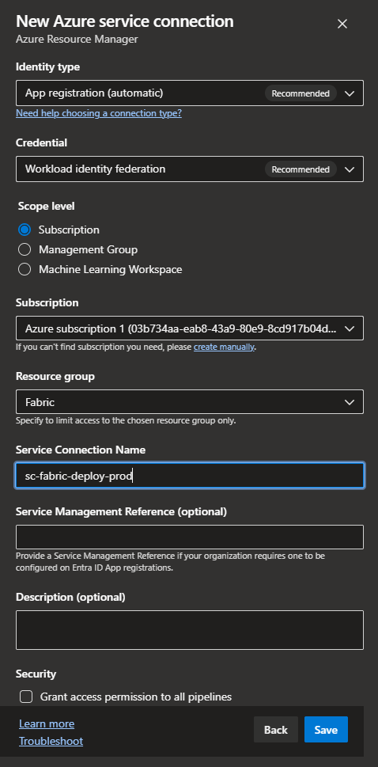

In Entra ID :material-arrow-right: **App registrations**, find the app Azure DevOps just made. It's named after the organisation and project with a guid on the end (`EvaluationContext-fabric-cicd-17d44053-c029-4b2b-9c34-595693fd79f5` in my case). Rename it :material-robot-outline: `sp-fabric-deploy-nonprod`. The display name is cosmetic: the federated credential's subject identifier is built from the service connection name, so nothing breaks. Open **Certificates & secrets** :material-arrow-right: **Federated credentials** and you'll see the trust Azure DevOps wrote. There is no client secret, and there never will be.

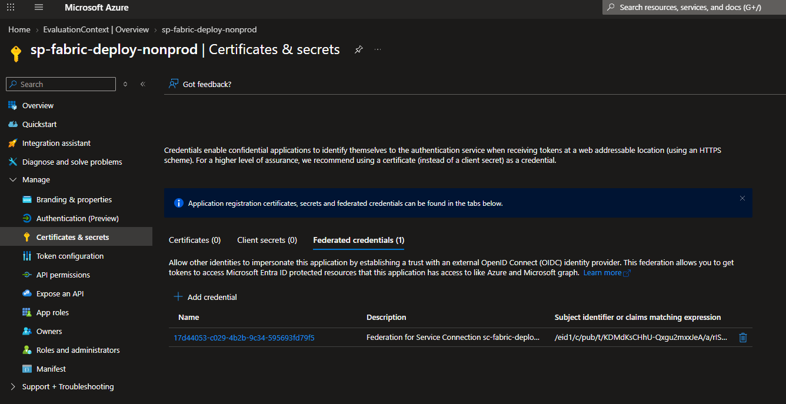

??? tip "Service connection Contributor role"

    Azure DevOps also gave the new SPN **Contributor on the scope**, because that's what an Azure Resource Manager connection is for. Fabric doesn't need it. Remove the role assignment, or pick an empty resource group rather than the subscription as the scope when creating the connection.

With that in place a pipeline can authenticate without a secret: `AzureCLI@2` with the service connection and `addSpnToEnvironment: true`, which puts the SPN's client id, the federated token and the tenant id into the step's environment, and `fab auth login` consumes them. No secret is read from anywhere, because there isn't one.

```yaml title="fab-setup-steps.yml (login step)"
- task: AzureCLI@2
  displayName: fab auth login (workload identity)
  inputs:
    azureSubscription: ${{ parameters.serviceConnection }}
    scriptType: bash
    scriptLocation: inlineScript
    addSpnToEnvironment: true   # exposes servicePrincipalId, idToken, tenantId
    inlineScript: |
      set -euo pipefail
      fab auth login \
        -u "$servicePrincipalId" \
        --federated-token "$idToken" \
        --tenant "$tenantId"
      fab auth status
```

### Security Groups

While we're in Entra, create the three security groups. Two hold an SPN each and scope its tenant settings; the third holds people, and is the approval gate on prod.

| :material-account-group-outline: Group | Members | Used for |
| ----- | ------- | -------- |
| :material-account-group-outline: `sg-fabric-deploy-nonprod` | :material-robot-outline: `sp-fabric-deploy-nonprod` | Tenant settings for the non-prod SPN |
| :material-account-group-outline: `sg-fabric-deploy-prod` | :material-robot-outline: `sp-fabric-deploy-prod` | Tenant settings for the prod SPN |
| :material-account-group-outline: `sg-fabric-approve-prod` | :material-account-multiple-outline: The people allowed to put a release into production | The approval check on the :material-shield-check-outline: `fabric-prod` environment |

In Entra ID :material-arrow-right: **Add** :material-arrow-right: **Group**.

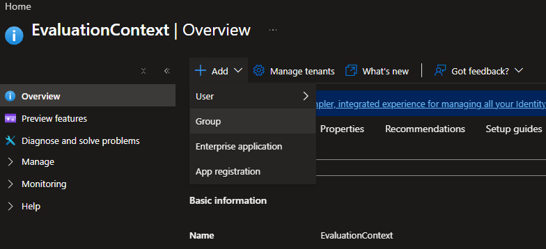

Group type **Security**, the group name, an owner, and the members: the matching SPN for the two deploy groups, the release approvers for the third. **Create**.

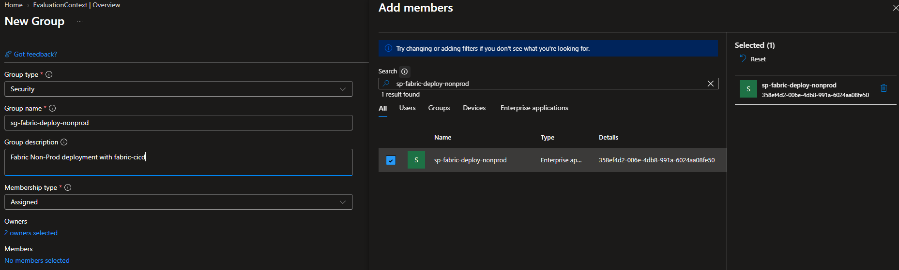

### Tenant Settings

Following least privilege, tenant settings should be scoped to security groups, never the whole tenant. The two SPNs need different sets. Prod only ever publishes into a workspace that already exists, so it gets the API setting and nothing else. Non-prod also creates feature workspaces and connects them to git, so it gets the other two.

| :material-shield-lock-outline: Tenant setting | :material-account-group-outline: `sg-fabric-deploy-nonprod` | :material-account-group-outline: `sg-fabric-deploy-prod` |
| -------------- | :------------------------: | :---------------------: |
| Service principals can use Fabric APIs | :material-check: | :material-check: |
| Service principals can create workspaces, connections, and deployment pipelines | :material-check: | |
| Users can synchronize workspace items with their Git repositories | :material-check: | |

Apply them from **Tenant settings** in the Fabric admin portal.

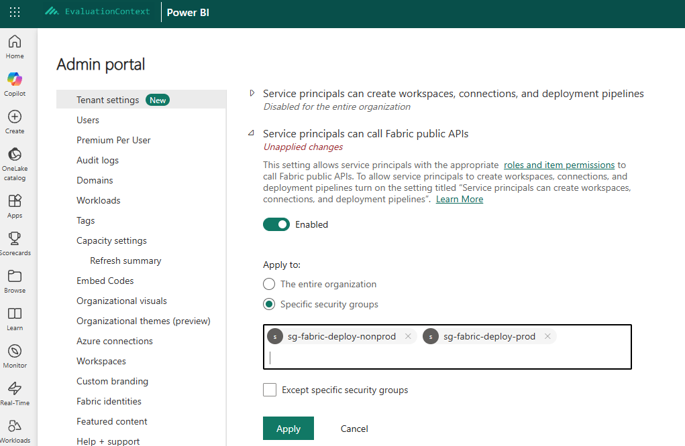

## Fabric

### Workspaces

Now we can create the workspaces for the three environments, on a capacity, under exactly the names `config.yml` will use.

| Environment | :material-folder-outline: Workspace | Contents |
| ----------- | --------- | -------- |
| Dev | :material-folder-outline: `foo-dev` | The five items, because that's where they were committed from |
| Test | :material-folder-outline: `foo-test` | Empty |
| Prod | :material-folder-outline: `foo-prod` | Empty |

!!! note "Git Integration"

    None of them are connected via git integration. The pipeline is the only thing that publishes them.

### Permissions

The SPNs need the **Contributor** role on the workspaces to deploy into them.

| :material-folder-outline: Workspace | :material-robot-outline: `sp-fabric-deploy-nonprod` | :material-robot-outline: `sp-fabric-deploy-prod` |
| --------- | ------------ | -------- |
| :material-folder-outline: `foo-dev` | Contributor | |
| :material-folder-outline: `foo-test` | Contributor | |
| :material-folder-outline: `foo-prod` | | Contributor |

### Connections

Connections are not in any item definition and never travel with a deploy. A connection has two identities attached: the one that owns it and the one it authenticates with. For authentication my order of preference is:

1. :material-account-badge: A **workspace identity**, where the item type supports it. It's owned by the workspace, not by a person. Give **user** access as needed.
2. :material-robot-outline: An **SPN-owned connection**, created by an SPN so it isn't tied to anyone's account. Give **user** access as needed.
3. :material-account-key: A **service account**, only where neither of the above is possible.
4. :material-account-alert: A **personal account**, only where none of the above is possible. It ties the connection to a person, and when they leave the organisation the connection goes with them.

Whichever you choose, the deploying SPN needs at least **User** access to the connection: either it created the connection, or the connection was shared with it before the deploy. Otherwise the pipeline item that references it fails to publish.

## Deployment Configuration

With a lot of the plumbing set up we can finally look at the contents of the repo.

### Repo Init

Create an empty repo in the Azure DevOps project. The first commit is the five items under `fabric/foo/`, and there are two ways to get them there. Connect an existing workspace to :material-source-branch: `main` with **Git folder** `fabric/foo`, commit, and disconnect again; dev is never git-connected once the pipeline owns it. Or call [Bulk Export](https://learn.microsoft.com/en-us/rest/api/fabric/core/items/bulk-export-item-definitions?tabs=HTTP) on the workspace, unzip into `fabric/foo/`, `git init`, commit and push, and nothing ever gets connected. Either way the folder is named after the workspace, and that pairing is deliberate. A repo can hold several workspace folders, each with its own items and config.

```text title="Repository Structure"
├── 📁 fabric
│    └── 📁 foo
│         ├── 📁 Sales.Lakehouse
│         ├── 📁 Load Sales.DataPipeline
│         ├── 📁 Load Sales.Notebook
│         ├── 📁 Sales.SemanticModel
│         └── 📁 Sales.Report
└── 📄 .gitignore
```

### [`config.yml`](https://microsoft.github.io/fabric-cicd/1.3.0/how_to/config_deployment/)

We can start by adding the `config.yml` file to the workspace folder. This file defines the deployment configuration like what workspace maps to which environment (i.e. **dev** :material-arrow-right: **foo-dev**) (by name or id), the relative path to the directory of items to deploy, item types in scope, publish rules per environment and the location of an optional `parameter.yml` file.

```diff
 ├── 📁 fabric
 │    └── 📁 foo
 │         ├── 📁 Sales.Lakehouse
 │         ├── 📁 Load Sales.DataPipeline
 │         ├── 📁 Load Sales.Notebook
 │         ├── 📁 Sales.SemanticModel
 │         ├── 📁 Sales.Report
+│         └── 📄 config.yml
 └── 📄 .gitignore
```

```yaml title="fabric/foo/config.yml"
core:
  workspace:
    dev: foo-dev
    test: foo-test
    prod: foo-prod

  repository_directory: "."

  item_types_in_scope:
    - Lakehouse
    - Notebook
    - DataPipeline
    - SemanticModel
    - Report

  parameter: "parameter.yml"

publish:
  skip:
    dev: false     # merge to main deploys dev
    test: false    # release/* deploys test before prod
    prod: false

unpublish:
  skip:
    dev: false     # dev mirrors main: orphaned items are removed
    test: false
    prod: false    # prod deletes on rollback too
```

### [`parameter.yml`](https://microsoft.github.io/fabric-cicd/1.3.0/how_to/parameterization/)

Now we can add the `parameter.yml` file to the workspace folder. This file will hold any environment-specific parameterization rules that will update item definitions during deployment.

```diff
 ├── 📁 fabric
 │    └── 📁 foo
 │         ├── 📁 Sales.Lakehouse
 │         ├── 📁 Load Sales.DataPipeline
 │         ├── 📁 Load Sales.Notebook
 │         ├── 📁 Sales.SemanticModel
 │         ├── 📁 Sales.Report
 │         ├── 📄 config.yml
+│         └── 📄 parameter.yml
 └── 📄 .gitignore
```

We've already hit our first auto-binding gap. The semantic model links to the Lakehouse's SQL endpoint, which doesn't support auto-binding. With these two rules a deploy binds the semantic model to the target environment's lakehouse.

```yaml title="fabric/foo/parameter.yml"
find_replace:

  - find_value: 'Sql\.Database\("([^"]+)",'
    is_regex: "true"
    replace_value:
      _ALL_: "$items.Lakehouse.Sales.$sqlendpoint"
    item_type: "SemanticModel"
    item_name: "Sales"
    file_path: "/Sales.SemanticModel/definition/expressions.tmdl"

  - find_value: 'Sql\.Database\("[^"]+",\s*"([0-9a-fA-F-]{36})"\)'
    is_regex: "true"
    replace_value:
      _ALL_: "$items.Lakehouse.Sales.$sqlendpointid"
    item_type: "SemanticModel"
    item_name: "Sales"
    file_path: "/Sales.SemanticModel/definition/expressions.tmdl"
```

## Pipelines

### Environments and Approvals

Now we can set up our Azure DevOps [environments](https://learn.microsoft.com/en-us/azure/devops/pipelines/process/environments?view=azure-devops). We navigate to **Pipelines** :material-arrow-right: **Environments** to begin.

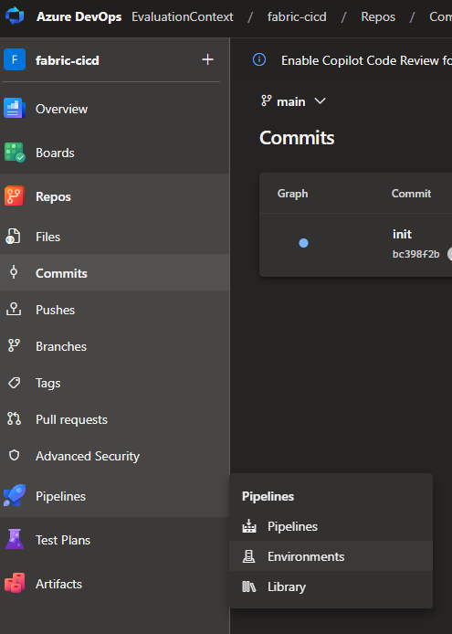

Select **Create environment**, name it, and repeat until there are three: :material-shield-check-outline: `fabric-dev`, :material-shield-check-outline: `fabric-test` and :material-shield-check-outline: `fabric-prod`, with no resources. On :material-shield-check-outline: `fabric-prod`, **Approvals and checks** :material-arrow-right: **Approvals**, add :material-account-group-outline: `sg-fabric-approve-prod` as the approver, and add an **Exclusive lock** so two releases can't deploy to prod at once. Dev and test get nothing.

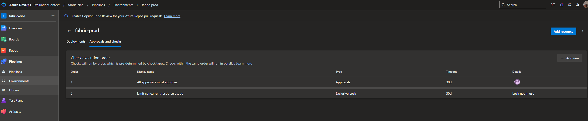

That approval is the only human step in the flow. This means after creating a :material-source-branch: `release/*` branch, the :material-pipe: `deploy-release.yml` pipeline will run, deploying to Test, but it will pause for the manual approval from :material-account-group-outline: `sg-fabric-approve-prod` before deploying to the :material-shield-check-outline: `fabric-prod` environment.

### Two Pipelines

We will have two pipelines: `deploy-main.yml` for deploying changes to the main branch (dev) and :material-pipe: `deploy-release.yml` for deploying release branches (test and prod). :material-pipe: `deploy-main.yml` triggers when changes in `fabric/` are detected on :material-source-branch: `main`. :material-pipe: `deploy-release.yml` triggers on any branch matching :material-source-branch: `release/*`.

Each of these pipelines references the two shared templates: `fab-setup-steps.yml` (install `fab`, the encryption fallback, the federated login) and `fab-deploy-steps.yml` (`fab deploy`). `variables.yml` holds the two service connection names and nothing else.

```diff
+├── 📁 .azure-pipelines
+│    ├── 📁 templates
+│    │    ├── 📄 fab-setup-steps.yml
+│    │    └── 📄 fab-deploy-steps.yml
+│    ├── 📄 variables.yml
+│    ├── 📄 deploy-main.yml
+│    └── 📄 deploy-release.yml
 ├── 📁 fabric
 │    └── 📁 foo
 │         ├── 📁 Sales.Lakehouse
 │         ├── 📁 Load Sales.DataPipeline
 │         ├── 📁 Load Sales.Notebook
 │         ├── 📁 Sales.SemanticModel
 │         ├── 📁 Sales.Report
 │         ├── 📄 config.yml
 │         └── 📄 parameter.yml
 └── 📄 .gitignore
```

=== "variables.yml"

    ```yaml
    variables:
      # deploy-main, and the Test stage of deploy-release
      serviceConnectionDev: sc-fabric-deploy-nonprod 
       # the Prod stage of deploy-release only 
      serviceConnectionProd: sc-fabric-deploy-prod        
    ```

=== "deploy-main.yml"

    ```yaml
    trigger:
      # Two merges a minute apart must not publish dev concurrently. The second
      # waits and runs once for everything queued behind the first.
      batch: true
      branches:
        include:
          - main
      paths:
        include:
          - fabric/foo/

    pr: none

    variables:
      - template: variables.yml

    stages:
      - stage: Dev
        displayName: Deploy to Dev
        jobs:
          - deployment: DeployDev
            displayName: fab deploy (dev)
            pool:
              vmImage: ubuntu-latest
            environment: fabric-dev
            strategy:
              runOnce:
                deploy:
                  steps:
                    - checkout: self

                    - template: templates/fab-setup-steps.yml
                      parameters:
                        serviceConnection: ${{ variables.serviceConnectionDev }}

                    - template: templates/fab-deploy-steps.yml
                      parameters:
                        targetEnv: dev
    ```

=== "deploy-release.yml"

    ```yaml
    trigger:
      branches:
        include:
          - release/*

    pr: none

    variables:
      - template: variables.yml

    stages:
      # ---------------------------------------------------------------------------
      # TEST: every push to a release branch
      # ---------------------------------------------------------------------------
      - stage: Test
        displayName: Deploy to Test
        jobs:
          - deployment: DeployTest
            displayName: fab deploy (test)
            pool:
              vmImage: ubuntu-latest
            environment: fabric-test
            strategy:
              runOnce:
                deploy:
                  steps:
                    - checkout: self

                    - template: templates/fab-setup-steps.yml
                      parameters:
                        serviceConnection: ${{ variables.serviceConnectionDev }}

                    - template: templates/fab-deploy-steps.yml
                      parameters:
                        targetEnv: test

      # ---------------------------------------------------------------------------
      # PROD: approve, deploy
      # ---------------------------------------------------------------------------
      - stage: Prod
        displayName: Deploy to Prod
        dependsOn: Test
        jobs:
          - deployment: DeployProd
            displayName: fab deploy (prod)
            pool:
              vmImage: ubuntu-latest
            environment: fabric-prod   # the manual-approval check lives here
            strategy:
              runOnce:
                deploy:
                  steps:
                    - checkout: self

                    - template: templates/fab-setup-steps.yml
                      parameters:
                        serviceConnection: ${{ variables.serviceConnectionProd }}

                    - template: templates/fab-deploy-steps.yml
                      parameters:
                        targetEnv: prod
    ```

=== "templates/fab-deploy-steps.yml"

    ```yaml
    parameters:
      - name: targetEnv
        displayName: Target environment key in config.yml (dev / test / prod)
        type: string

      - name: configFile
        displayName: Path to the fabric-cicd config.yml
        type: string
        default: fabric/foo/config.yml

    steps:
      - script: |
          set -euo pipefail
          config="${{ parameters.configFile }}"
          env="${{ parameters.targetEnv }}"
          if [ ! -f "$config" ]; then
            echo "##vso[task.logissue type=error]Config file '$config' does not exist."
            exit 1
          fi

          mkdir -p "$(Build.ArtifactStagingDirectory)/deploy-log"
          log="$(Build.ArtifactStagingDirectory)/deploy-log/${env}-$(Build.BuildId).log"
          echo "##vso[task.setvariable variable=fabDeployLogWritten]true"

          {
            echo "fab deploy --config $config --target_env $env --force"
            echo "commit:  $(Build.SourceVersion)"
            echo "branch:  $(Build.SourceBranch)"
            echo "run:     $(Build.BuildNumber)"
            echo "=================================================================="
          } | tee "$log"

          # pipefail is on, so a failing deploy still fails the step despite tee.
          # --force: no interactive confirmation on an agent.
          fab deploy --config "$config" --target_env "$env" --force 2>&1 | tee -a "$log"
        displayName: fab deploy (${{ parameters.targetEnv }})

      # Published whenever the deploy step wrote a log, on failure too, which is
      # when it matters.
      - publish: $(Build.ArtifactStagingDirectory)/deploy-log
        artifact: deploy-log-${{ parameters.targetEnv }}
        displayName: Publish deployment log (${{ parameters.targetEnv }})
        condition: eq(variables['fabDeployLogWritten'], 'true')
    ```

=== "templates/fab-setup-steps.yml"

    ```yaml
    # Install the Fabric CLI and log in as the SPN. Every job runs these first.
    parameters:
      - name: serviceConnection
        displayName: WIF service connection name
        type: string

      - name: pythonVersion
        displayName: Python version for the agent
        type: string
        default: '3.12'

    steps:
      - task: UsePythonVersion@0
        displayName: Use Python ${{ parameters.pythonVersion }}
        inputs:
          versionSpec: ${{ parameters.pythonVersion }}

      # Nothing is pinned: every run installs the current ms-fabric-cli, which
      # brings the current fabric-cicd with it. A deploy can therefore change
      # behaviour with no commit behind it, so the versions are echoed into the
      # log and a breakage can be tied to a release. A pin is one line here if
      # that trade-off flips. The series is written against fabric-cicd 1.3.0.
      - script: |
          set -euo pipefail
          python -m pip install --upgrade pip
          python -m pip install ms-fabric-cli
          echo "== versions =="
          python -m pip show ms-fabric-cli fabric-cicd | grep -E '^(Name|Version):'
        displayName: Install Fabric CLI (current)

      # Hosted agents have no keyring, so fab can't encrypt its token cache and
      # will otherwise fail to persist the login between steps.
      - script: |
          set -euo pipefail
          fab config set encryption_fallback_enabled true
        displayName: fab config (hosted-agent token cache)

      - task: AzureCLI@2
        displayName: fab auth login (workload identity)
        inputs:
          azureSubscription: ${{ parameters.serviceConnection }}
          scriptType: bash
          scriptLocation: inlineScript
          addSpnToEnvironment: true   # exposes servicePrincipalId / idToken / tenantId
          inlineScript: |
            set -euo pipefail
            fab auth login \
              -u "$servicePrincipalId" \
              --federated-token "$idToken" \
              --tenant "$tenantId"
            fab auth status
    ```

??? tip "Template Repo"

    In a real scenario, you would have a repo for the templates (`fab-deploy-steps.yml` and `fab-setup-steps.yml`), where you would pin a version of Fabric-CLI, and tag the template repository. This allows you to set up thin pipeline definitions in your Fabric Items repos that would reference the tagged version of the templates rather than the latest commit. This allows you to centralize reused code and control when updates to the templates are adopted, rather than automatically getting the latest changes.

Once the pipelines are committed to Azure DevOps, they will not run until they are registered. Go to **Pipelines** :material-arrow-right: **Create pipeline** :material-arrow-right: **Azure Repos Git** :material-arrow-right: select the repo :material-arrow-right: **Existing Azure Pipelines YAML file**, once each for :material-pipe: `deploy-main.yml` and :material-pipe: `deploy-release.yml`, **Save** and name them :material-pipe: `deploy-main` and :material-pipe: `deploy-release`.

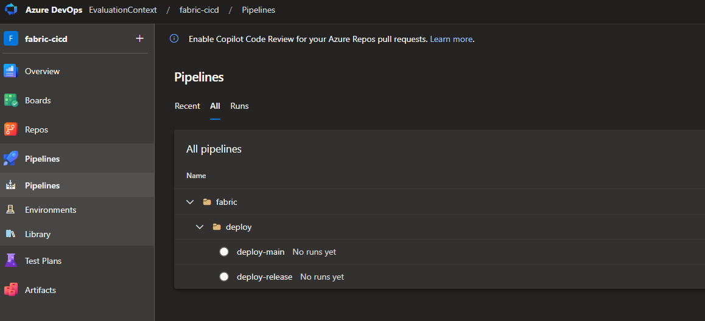

Now that the pipelines exist, go back to each service connection and select **Security**.

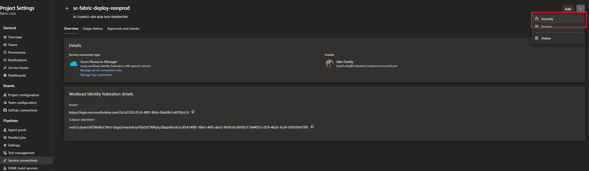

Select **Pipeline permissions**, and authorise them: `deploy-main` and :material-pipe: `deploy-release` on :material-connection: `sc-fabric-deploy-nonprod`, :material-pipe: `deploy-release` alone on :material-connection: `sc-fabric-deploy-prod`. Nothing else can use them, and the first run of each pipeline will prompt for exactly this if you forget.

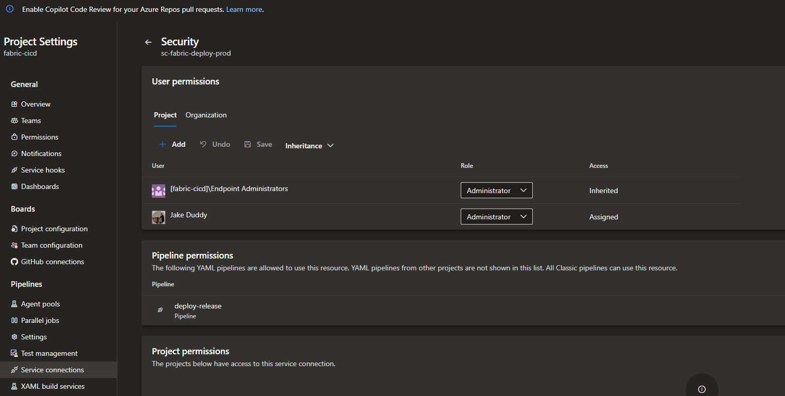

## Testing the Deployment

:material-folder-outline: `foo-dev` already holds the five items, because that's where they were committed from, so a merge to :material-source-branch: `main` proves the pipeline rather than the deploy: `deploy-main` runs, logs in as :material-robot-outline: `sp-fabric-deploy-nonprod`, and republishes five items over themselves. Green, and nothing visibly changes.

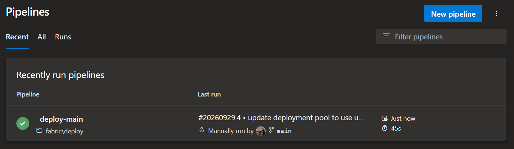

The real test is the release pipeline, into an empty workspace. Cut :material-source-branch: `release/2026.10` from :material-source-branch: `main`. :material-pipe: `deploy-release` is triggered and deploys test, and five items appear in an empty :material-folder-outline: `foo-test`. 

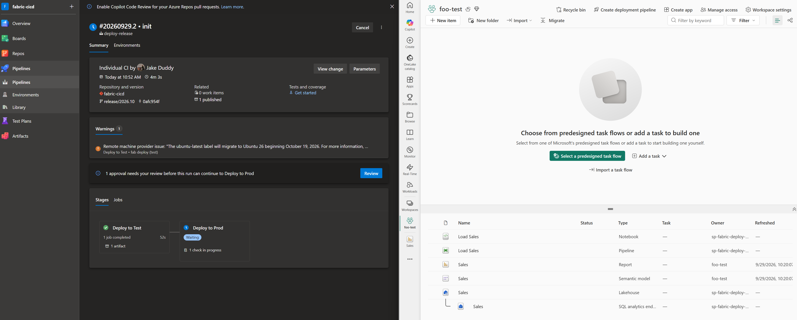

The run stops at the approval on :material-shield-check-outline: `fabric-prod`; only a member of :material-account-group-outline: `sg-fabric-approve-prod` can let it through. Approve, and :material-folder-outline: `foo-prod` fills the same way.

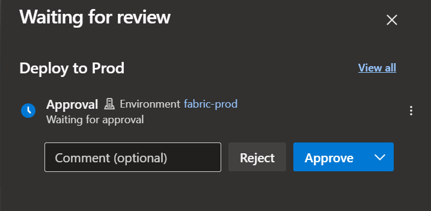

The workspace lineage view confirms that the items in :material-folder-outline: `foo-prod` are bound to each other, not to dev.

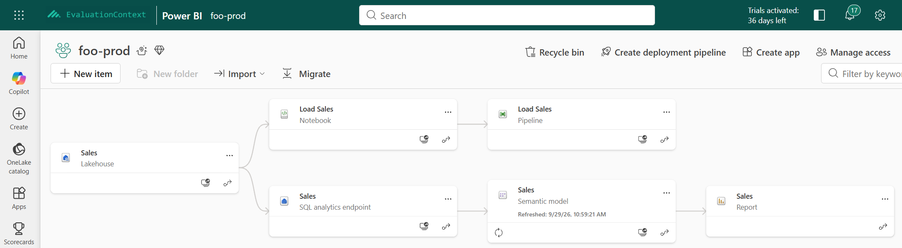

## Conclusion

Two service principals with no secrets, three workspaces, a repo, two pipelines and one approval, and nobody clicked anything to get code into production. Up to the point where the report opens, the overview's promise holds. What it doesn't say is that "deployed" and "works" are different questions. The next post follows a feature from a branch to prod.
