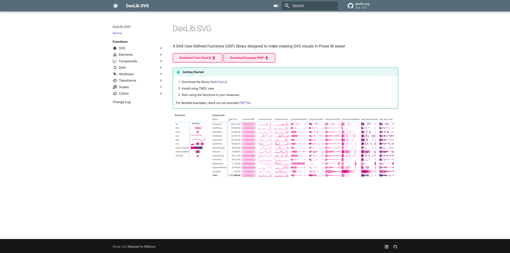

# Projects { .ec-profile__name }

Open-source tools for the **Fabric** community.
{ .ec-profile__tagline }

{ loading=lazy }

### Power BI Nexus { .ec-project__title }

Stop searching in silos. Contribute, learn, and stay current with Power BI — a community-curated knowledge hub that brings together the best resources in one place.
{ .ec-project__desc }

Power BI
Community

[:material-web: Site](https://evaluationcontext.github.io/Power-BI-Nexus/){ .ec-badge .ec-badge--site }
[:fontawesome-brands-github: Repo](https://github.com/EvaluationContext/Power-BI-Nexus){ .ec-badge .ec-badge--repo }

{ loading=lazy }

### EvaluationContext.Colour { .ec-project__title }

A [DAX Lib](https://daxlib.org/) UDF library for manipulation of hex colours in Power BI. Blend, lighten, darken, and transform colours directly in your DAX measures.
{ .ec-project__desc }

DAX Lib
Colour

[:material-book-open-variant: Docs](https://evaluationcontext.github.io/evaluationcontext.colour/){ .ec-badge .ec-badge--docs }
[:material-package-variant: Package](https://daxlib.org/package/EvaluationContext.Colour/){ .ec-badge .ec-badge--package }

{ loading=lazy }

### DaxLib.SVG { .ec-project__title }

A [DAX Lib](https://daxlib.org/) library designed to make creating SVG visuals in Power BI easier. Build sparklines, heatmaps, and custom visualizations with pure DAX.
{ .ec-project__desc }

DAX Lib
SVG

[:material-book-open-variant: Docs](https://evaluationcontext.github.io/daxlib.svg/){ .ec-badge .ec-badge--docs }
[:material-package-variant: Package](https://daxlib.org/package/daxlib.svg/){ .ec-badge .ec-badge--package }

