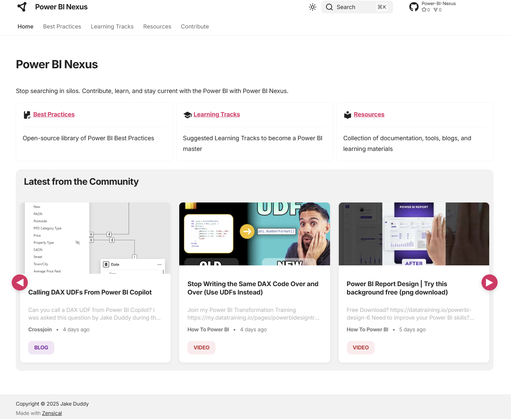
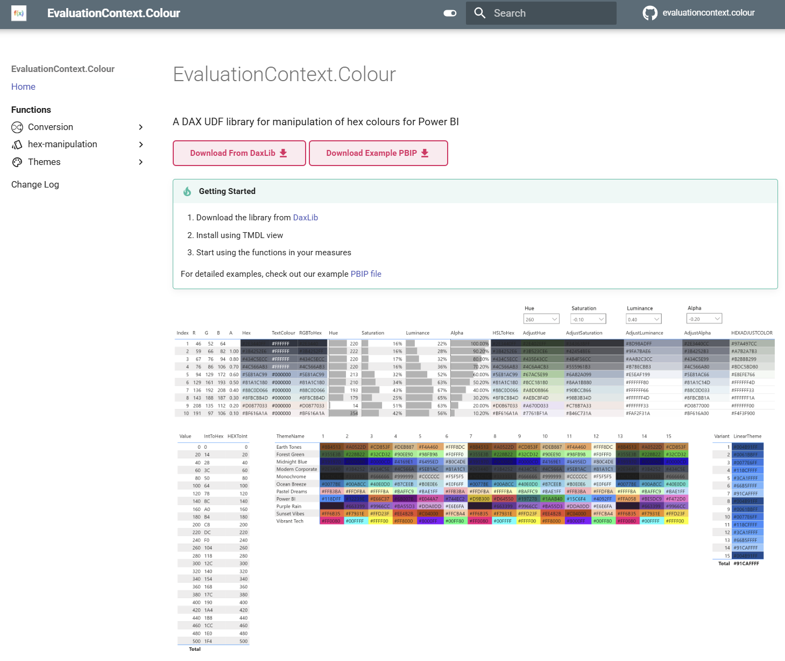
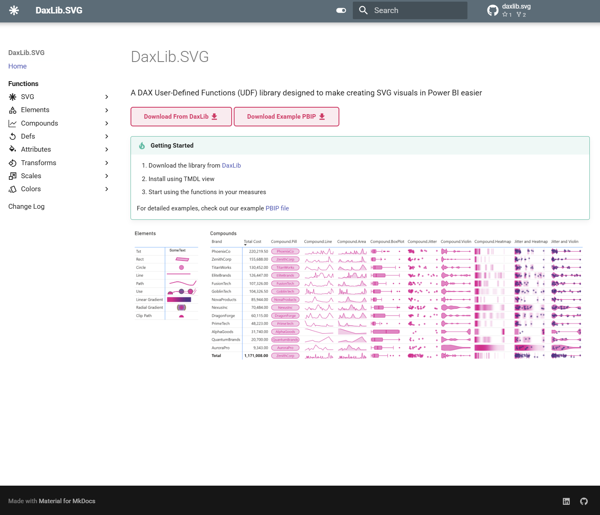

<h1 class="ec-profile__name">Projects</h1>

  Open-source tools for the <strong>Power BI</strong> and <strong>DAX</strong> community — from curated resources to reusable libraries.

  

    

      
    

    

      

        <h3 class="ec-project__title">Power BI Nexus</h3>
      

      
Stop searching in silos. Contribute, learn, and stay current with Power BI — a community-curated knowledge hub that brings together the best resources in one place.

      

        Power BI
        Community
      

      

        <a href="https://evaluationcontext.github.io/Power-BI-Nexus/" class="md-button">
          <svg xmlns="http://www.w3.org/2000/svg" width="16" height="16" viewBox="0 0 24 24" fill="currentColor" style="vertical-align: -0.15em; margin-right: 0.3em;"><path d="M16.36,14C16.44,13.34 16.5,12.68 16.5,12C16.5,11.32 16.44,10.66 16.36,10H19.74C19.9,10.64 20,11.31 20,12C20,12.69 19.9,13.36 19.74,14M14.59,19.56C15.19,18.45 15.65,17.25 15.97,16H18.92C17.96,17.65 16.43,18.93 14.59,19.56M14.34,14H9.66C9.56,13.34 9.5,12.68 9.5,12C9.5,11.32 9.56,10.65 9.66,10H14.34C14.43,10.65 14.5,11.32 14.5,12C14.5,12.68 14.43,13.34 14.34,14M12,19.96C11.17,18.76 10.5,17.43 10.09,16H13.91C13.5,17.43 12.83,18.76 12,19.96M8,8H5.08C6.03,6.34 7.57,5.06 9.4,4.44C8.8,5.55 8.35,6.75 8,8M5.08,16H8C8.35,17.25 8.8,18.45 9.4,19.56C7.57,18.93 6.03,17.65 5.08,16M4.26,14C4.1,13.36 4,12.69 4,12C4,11.31 4.1,10.64 4.26,10H7.64C7.56,10.66 7.5,11.32 7.5,12C7.5,12.68 7.56,13.34 7.64,14M12,4.03C12.83,5.23 13.5,6.57 13.91,8H10.09C10.5,6.57 11.17,5.23 12,4.03M18.92,8H15.97C15.65,6.75 15.19,5.55 14.59,4.44C16.43,5.07 17.96,6.34 18.92,8M12,2C6.47,2 2,6.5 2,12A10,10 0 0,0 12,22A10,10 0 0,0 22,12A10,10 0 0,0 12,2Z"/></svg>
          Site
        </a>
        <a href="https://github.com/EvaluationContext/Power-BI-Nexus" class="md-button">
          <svg xmlns="http://www.w3.org/2000/svg" width="16" height="16" viewBox="0 0 24 24" fill="currentColor" style="vertical-align: -0.15em; margin-right: 0.3em;"><path d="M12,2A10,10 0 0,0 2,12C2,16.42 4.87,20.17 8.84,21.5C9.34,21.58 9.5,21.27 9.5,21V19.31C6.73,19.91 6.14,17.97 6.14,17.97C5.68,16.81 5.03,16.5 5.03,16.5C4.12,15.88 5.1,15.9 5.1,15.9C6.1,15.97 6.63,16.93 6.63,16.93C7.5,18.45 8.97,18 9.54,17.76C9.63,17.11 9.89,16.67 10.17,16.42C7.95,16.17 5.62,15.31 5.62,11.5C5.62,10.39 6,9.5 6.65,8.79C6.55,8.54 6.2,7.5 6.75,6.15C6.75,6.15 7.59,5.88 9.5,7.17C10.29,6.95 11.15,6.84 12,6.84C12.85,6.84 13.71,6.95 14.5,7.17C16.41,5.88 17.25,6.15 17.25,6.15C17.8,7.5 17.45,8.54 17.35,8.79C18,9.5 18.38,10.39 18.38,11.5C18.38,15.32 16.04,16.16 13.81,16.41C14.17,16.72 14.5,17.33 14.5,18.26V21C14.5,21.27 14.66,21.59 15.17,21.5C19.14,20.16 22,16.42 22,12A10,10 0 0,0 12,2Z"/></svg>
          Repo
        </a>
      

    

  

  

    

      
    

    

      

        <h3 class="ec-project__title">EvaluationContext.Colour</h3>
      

      
A <a href="https://daxlib.org/">DAX Lib</a> UDF library for manipulation of hex colours in Power BI. Blend, lighten, darken, and transform colours directly in your DAX measures.

      

        DAX Lib
        Colour
      

      

        <a href="https://evaluationcontext.github.io/evaluationcontext.colour/" class="md-button">
          <svg xmlns="http://www.w3.org/2000/svg" width="16" height="16" viewBox="0 0 24 24" fill="currentColor" style="vertical-align: -0.15em; margin-right: 0.3em;"><path d="M19 2L14 6.5V17.5L19 13V2M6.5 5C4.55 5 2.45 5.4 1 6.5V21.16C1 21.41 1.25 21.66 1.5 21.66C1.6 21.66 1.65 21.59 1.75 21.59C3.1 20.94 5.05 20.5 6.5 20.5C8.45 20.5 10.55 20.9 12 22C13.35 21.15 15.8 20.5 17.5 20.5C19.15 20.5 20.85 20.81 22 21.56C22.1 21.61 22.15 21.66 22.25 21.66C22.5 21.66 22.75 21.41 22.75 21.16V6.5C22.37 6.24 21.69 5.89 21 5.56V18.5C19.9 18.15 18.7 18 17.5 18C15.8 18 13.35 18.65 12 19.5V6.5C10.55 5.4 8.45 5 6.5 5Z"/></svg>
          Docs
        </a>
        <a href="https://daxlib.org/package/EvaluationContext.Colour/" class="md-button">
          <svg xmlns="http://www.w3.org/2000/svg" width="16" height="16" viewBox="0 0 24 24" fill="currentColor" style="vertical-align: -0.15em; margin-right: 0.3em;"><path d="M5.12,5H18.87L17.93,4H5.93L5.12,5M20.54,5.23C20.83,5.57 21,6 21,6.5V19A2,2 0 0,1 19,21H5A2,2 0 0,1 3,19V6.5C3,6 3.17,5.57 3.46,5.23L4.84,3.55C5.12,3.21 5.53,3 6,3H18C18.47,3 18.88,3.21 19.15,3.55L20.54,5.23M6,18H12V15H6V18Z"/></svg>
          Package
        </a>
      

    

  

  

    

      
    

    

      

        <h3 class="ec-project__title">DaxLib.SVG</h3>
      

      
A <a href="https://daxlib.org/">DAX Lib</a> library designed to make creating SVG visuals in Power BI easier. Build sparklines, heatmaps, and custom visualizations with pure DAX.

      

        DAX Lib
        SVG
      

      

        <a href="https://evaluationcontext.github.io/daxlib.svg/" class="md-button">
          <svg xmlns="http://www.w3.org/2000/svg" width="16" height="16" viewBox="0 0 24 24" fill="currentColor" style="vertical-align: -0.15em; margin-right: 0.3em;"><path d="M19 2L14 6.5V17.5L19 13V2M6.5 5C4.55 5 2.45 5.4 1 6.5V21.16C1 21.41 1.25 21.66 1.5 21.66C1.6 21.66 1.65 21.59 1.75 21.59C3.1 20.94 5.05 20.5 6.5 20.5C8.45 20.5 10.55 20.9 12 22C13.35 21.15 15.8 20.5 17.5 20.5C19.15 20.5 20.85 20.81 22 21.56C22.1 21.61 22.15 21.66 22.25 21.66C22.5 21.66 22.75 21.41 22.75 21.16V6.5C22.37 6.24 21.69 5.89 21 5.56V18.5C19.9 18.15 18.7 18 17.5 18C15.8 18 13.35 18.65 12 19.5V6.5C10.55 5.4 8.45 5 6.5 5Z"/></svg>
          Docs
        </a>
        <a href="https://daxlib.org/package/daxlib.svg/" class="md-button">
          <svg xmlns="http://www.w3.org/2000/svg" width="16" height="16" viewBox="0 0 24 24" fill="currentColor" style="vertical-align: -0.15em; margin-right: 0.3em;"><path d="M5.12,5H18.87L17.93,4H5.93L5.12,5M20.54,5.23C20.83,5.57 21,6 21,6.5V19A2,2 0 0,1 19,21H5A2,2 0 0,1 3,19V6.5C3,6 3.17,5.57 3.46,5.23L4.84,3.55C5.12,3.21 5.53,3 6,3H18C18.47,3 18.88,3.21 19.15,3.55L20.54,5.23M6,18H12V15H6V18Z"/></svg>
          Package
        </a>
      

    

  

